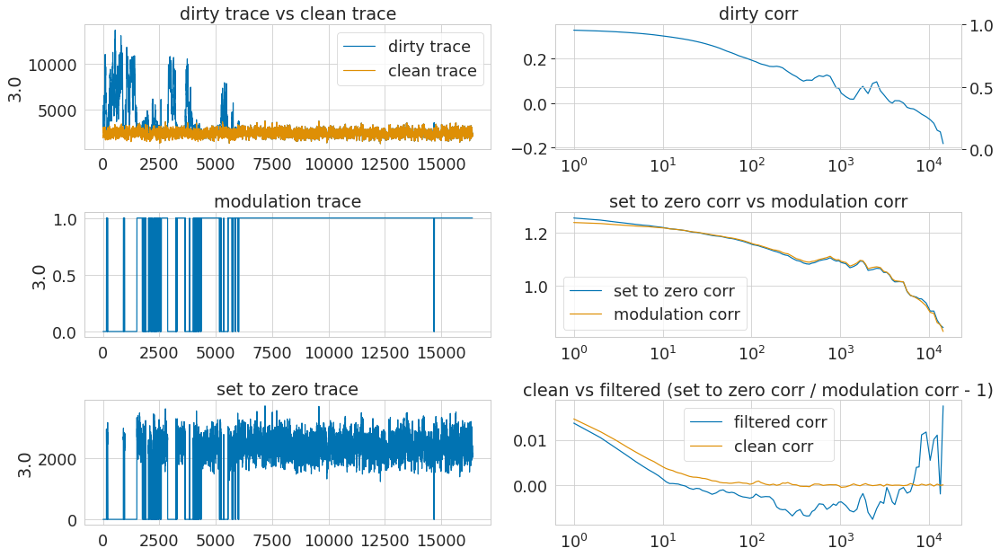
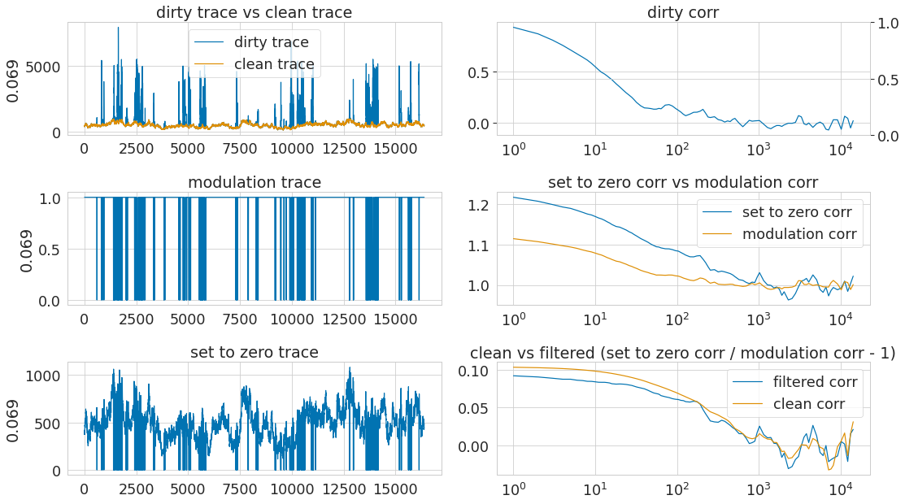
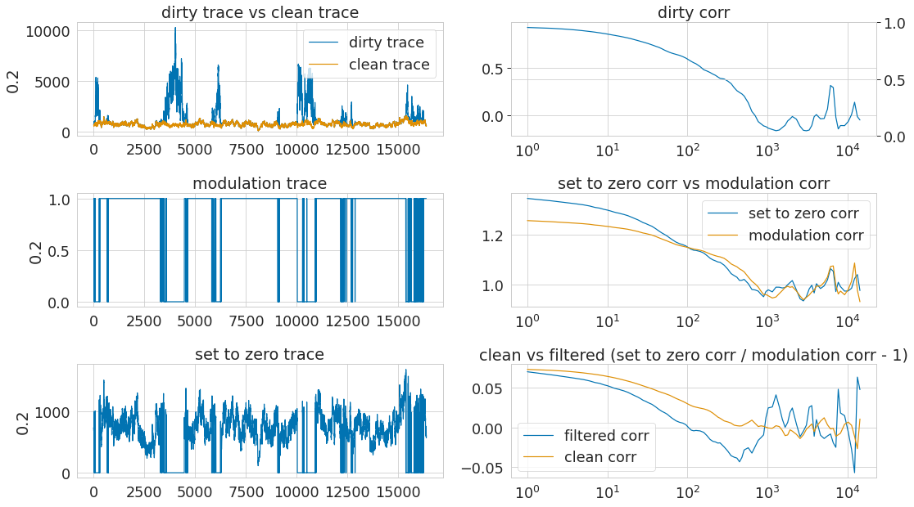
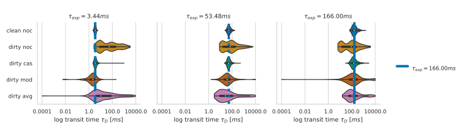
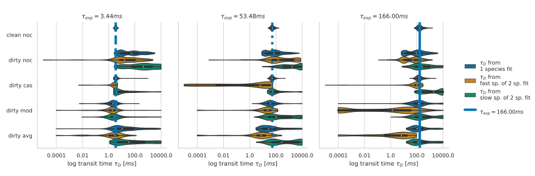

#+TITLE: Lab book Fluotracify
#+AUTHOR: Alex Seltmann
#+LANGUAGE: en
#+PROPERTY: header-args:sh :results verbatim
#+PROPERTY: header-args:jupyter-python :session /jpy:localhost#8888:a37e524a-8134-4d8f-b24a-367acaf1bdd3 :pandoc t :async yes :kernel python3
#+PROPERTY: header-args :eval never-export :exports both :results org replace value
#+OPTIONS: toc:4
#+OPTIONS: H:4
#+HTML_HEAD_EXTRA: 
#+HTML_HEAD_EXTRA: 
#+HTML_HEAD_EXTRA: 
#+HTML_HEAD_EXTRA: 
#+HTML_HEAD_EXTRA: 
#+HTML_HEAD_EXTRA: 
#+HTML_HEAD_EXTRA: 
#+HTML_HEAD_EXTRA: 
#+HTML_HEAD_EXTRA: 

* Technical Notes
** README
*** General:
- This file corresponds to my lab book for my doctoral thesis tackling
  artifact correction in Fluorescence Correlation Spectroscopy (FCS)
  measurements using Deep Neural Networks. It also contains notes taken
  during the process of setting up this workflow for reproducible research.
- This file contains explanations of how things are organized, of the
  workflow for doing experiments, changes made to the code, and the observed
  behavior in the "* Data" section.
- The branching model used is described in [[http://starpu-simgrid.gforge.inria.fr/misc/SIGOPS_paper.pdf][this paper]]. Therefore: if you
  are interested in the "* Data" section, you have to =git clone= the /data/
  branch of the repository. The /main/ branch is clean from any results, it
  contains only source code and the analysis.
- This project is my take on [[https://en.wikipedia.org/wiki/Open-notebook_science][Open-notebook science]]. The idea was postulated in
  a blog post in 2006:
  #+BEGIN_QUOTE
  ... there is a URL to a laboratory notebook that is freely available and
  indexed on common search engines. It does not necessarily have to look like
  a paper notebook but it is essential that all of the information available
  to the researchers to make their conclusions is equally available to the
  rest of the world ---Jean-Claude Bradley
  #+END_QUOTE
- Proposal on how to deal with truly private data (e.g. notes from a
  confidential meeting with a colleague), which might otherwise be noted in a
  normal Lab notebook: do not include them here. Only notes relevant to the
  current project should be taken
*** Code block languages used in this document

#+BEGIN_SRC sh
# This is a sh block for shell / bash scripting. In the context of this file,
# these blocks are mainly used for operations on my local computer.
# In the LabBook.html rendering of this document, these blocks will have a
# light green colour (#F0FBE9)
#+END_SRC

#+BEGIN_SRC tmux
# This block can open and access tmux sessions, used for shell scripting on
# remote computing clusters.
# In the LabBook.html rendering of this document, these blocks will have a
# distinct light green colour (#E1EED8)
#+END_SRC

#+BEGIN_SRC python
# This is a python block. In the context of this file, it is seldomly used
# (only for examplary scripts.)
# In the LabBook.html rendering of this document, these blocks will have a
# light blue colour (#E6EDF4)
#+END_SRC

#+BEGIN_SRC jupyter-python :session /jpy:localhost#8889:704d35be-572a-4268-a70b-565164b8620f
# This is a jupyter-python block. The code is sent to a jupyter kernel running
# on a remote high performance computing cluster. Most of my jupyter code is
# executed this way.
# In the LabBook.html rendering of this document, these blocks will have a
# light orange colour (#FAEAE1)
#+END_SRC

#+BEGIN_SRC emacs-lisp
;; This is a emacs-lisp block, the language used to customize Emacs, which is
;; sometimes necessary, since the reproducible workflow of this LabBook is
;; tightly integrated with Emacs and org-mode.
;; In the LabBook.html rendering of this document, these blocks will have a
;; light violet colour (#F7ECFB)
#+END_SRC

#+begin_example
This is a literal example block. It can be used very flexibly - in the context
of this document the output of most code blocks is displayed this way.
In the LabBook.html rendering of this document, these blocks will have a light
yellow colour (#FBFBBF)
#+end_example

#+begin_details
#+begin_example
This is a literal example block enclosed in a details block. This is useful to
make the page more readable by collapsing large amounts of output.
In the Labbook.html rendering of this document, the details block will have a
light grey colour (#f0f0f0) and a pink color when hovering above it.
#+end_example
#+end_details

*** Experiments workflow:
1) Create a new branch from =main=
2) Print out the git log from the latest commit and the metadata
3) Call the analysis scripts, follow the principles outlined in
   [[* Organization of code]]
4) All machine learning runs are saved in =data/mlruns=, all other data in
   =data/#experiment-name=
5) Add a ~** exp-<date>-<name>~" section to this file under [[* Data]]
6) Commit/push the results of this separate branch
7) Merge this new branch with the remote =data= branch
*** Example for experimental setup procedure

**** Setting starting a jupyter kernel from a remote jupyter session using =emacs-jupyter= in =org babel=
:PROPERTIES:
:CUSTOM_ID: sec-jupyter-setup
:END:

*** tools used (notes)
**** Emacs =magit=
- =gitflow-avh= (=magit-flow=) to follow the flow
- possibly https://github.com/magit/magit-annex for large files. Follow this:
  https://git-annex.branchable.com/walkthrough/
- maybe check out git-toolbelt at some point
  https://github.com/nvie/git-toolbelt#readme with
  https://nvie.com/posts/git-power-tools/
**** jupyter
- emacs jupyter for running and connecting to kernel on server:
  https://github.com/dzop/emacs-jupyter
- if I actually still would use .ipynb files, these might come handy:
  + jupytext: https://github.com/mwouts/jupytext
  + nbstripout: https://github.com/kynan/nbstripout
**** mlflow
- https://docs.faculty.ai/user-guide/experiments/index.html and
  https://docs.microsoft.com/en-us/azure/databricks/_static/notebooks/hls-image-processing/02-image-segmentation-dl.html
**** tensorflow
- https://www.tensorflow.org/tensorboard/image_summaries

** Template for data entry and setup notes:
*** exp-#date-#title
**** git:

#+begin_src sh
git log -1
#+end_src

#+RESULTS:
: commit b2b405322cfc435078f3dd2c9ca509a9bb39a5a5
: Author: Alex Seltmann <48986196+aseltmann@users.noreply.github.com>
: Date:   Mon Nov 13 19:46:59 2023 +0100
:
:     Add Colab link

**** System Metadata:

#+NAME: jp-metadata
#+BEGIN_SRC jupyter-python :var _long="true"
import os
import pprint

ramlist = os.popen('free -th').readlines()[-1].split()[1:]

print('No of CPUs in system:', os.cpu_count())
print('No of CPUs the current process can use:',
      len(os.sched_getaffinity(0)))
print('load average:', os.getloadavg())
print('os.uname(): ', os.uname())
print('PID of process:', os.getpid())
print('RAM total: {}, RAM used: {}, RAM free: {}'.format(
    ramlist[0], ramlist[1], ramlist[2]))

!echo the current directory: $PWD
!echo My disk usage:
!df -h
if _long:
    %conda list
    pprint.pprint(dict(os.environ), sort_dicts=False)

#+END_SRC

**** Tmux setup and scripts
:PROPERTIES:
:CUSTOM_ID: scripts-tmux
:END:

#+NAME: setup-tmux
#+BEGIN_SRC sh :session local
rm ~/.tmux-local-socket-remote-machine
REMOTE_SOCKET=$(ssh ara 'tmux ls -F "#{socket_path}"' | head -1)
echo $REMOTE_SOCKET
ssh ara -tfN \
    -L ~/.tmux-local-socket-remote-machine:$REMOTE_SOCKET
#+END_SRC

#+RESULTS: setup-tmux
| rm:                                  | cannot                               | remove    | '/home/lex/.tmux-local-socket-remote-machine': | No | such | file | or | directory |
| ye53nis@ara-login01.rz.uni-jena.de's | password:                            |           |                                                |    |      |      |    |           |
| /tmp/tmux-67339/default              |                                      |           |                                                |    |      |      |    |           |
| >                                    | ye53nis@ara-login01.rz.uni-jena.de's | password: |                                                |    |      |      |    |           |

**** SSH tunneling
:PROPERTIES:
:CUSTOM_ID: ssh-tunneling
:END:

Different applications can be run on the remote compute node. If I want to
access them at the local machine, and open them with the browser, I use this
tunneling script.

#+NAME: ssh-tunnel
#+BEGIN_SRC sh :session org-tunnel :var port="8889" :var node="node001"
ssh -t -t ara -L $port:localhost:$port ssh $node -L $port:Localhost:$port
#+END_SRC

Apps I use that way:
- Jupyter lab for running Python 3-Kernels
- TensorBoard
- Mlflow ui

**** jupyter scripts
:PROPERTIES:
:CUSTOM_ID: scripts-jp
:END:

Starting a jupyter instance on a server where the necessary libraries are
installed is easy using this script:

#+NAME: jpt-tmux
#+BEGIN_SRC tmux :socket ~/.tmux-local-socket-remote-machine
conda activate tf
export PORT=8889
export XDG_RUNTIME_DIR=''
export XDG_RUNTIME_DIR=""
jupyter lab --no-browser --port=$PORT
#+END_SRC

On the compute node of the HPC, the users' environment is managed through
module files using the system [[https://lmod.readthedocs.io][Lmod]]. The =export XDG_RUNTIME_DIR= statements
are needed because of a jupyter bug which did not let it start. Right now,
=ob-tmux= does not support a =:var= header like normal =org-babel= does. So
the =$port= variable has to be set here in the template.

Now this port has to be tunnelled on our local computer (See
#ssh-tunneling]]). While the tmux session above keeps running, no matter if
Emacs is running or not, this following ssh tunnel needs to be active
locally to connect to the notebook. If you close Emacs, it would need to be
reestablished

*** Setup notes
**** Setting up a tmux connection from using =ob-tmux= in =org-babel=
:PROPERTIES:
:CUSTOM_ID: sec-tmux-setup
:END:
- prerequisite: tmux versions need to be the same locally and on the server.
  Let's verify that now.
  - the local tmux version:

    #+BEGIN_SRC sh
    tmux -V
    #+END_SRC

    #+RESULTS:
    : tmux 3.0a

  - the remote tmux version:

    #+BEGIN_SRC sh :session local
    ssh ara tmux -V
    #+END_SRC

    #+RESULTS:
    | ye53nis@ara-login01.rz.uni-jena.de's | password: |
    | tmux                                 | 3.0a      |

- as is described in [[https://github.com/ahendriksen/ob-tmux][the ob-tmux readme]], the following code snippet creates
  a socket on the remote machine and forwards this socket to the local
  machine (note that =socket_path= was introduced in tmux version 2.2)

  #+BEGIN_SRC sh :session local
  REMOTE_SOCKET=$(ssh ara 'tmux ls -F "#{socket_path}"' | head -1)
  echo $REMOTE_SOCKET
  ssh ara -tfN \
      -L ~/.tmux-local-socket-remote-machine:$REMOTE_SOCKET
  #+END_SRC

  #+RESULTS:
  | ye53nis@ara-login01.rz.uni-jena.de's | password:                            |           |
  | /tmp/tmux-67339/default              |                                      |           |
  | >                                    | ye53nis@ara-login01.rz.uni-jena.de's | password: |

- now a new tmux session with name =ob-NAME= is created when using a code
  block which looks like this: =#+BEGIN_SRC tmux :socket
  ~/.tmux-local-socket-remote-machine :session NAME=
- Commands can be sent now to the remote tmux session, BUT note that the
  output is not printed yet
- there is a workaround for getting output back to our LabBook.org: A [[#scripts-tmux][script]]
  which allows to print the output from the tmux session in an
  =#+begin_example=-Block below the tmux block by pressing =C-c C-o= or =C-c
  C-v C-o= when the pointer is inside the tmux block.

**** =emacs-jupyter= Setup

=Emacs-jupyter= aims to be an API for a lot of functionalities of the
=jupyter= project. The documentation can be found on [[https://github.com/dzop/emacs-jupyter][GitHub]].

1. For the *whole document*: connect to a running jupyter instance
   1. =M-x jupyter-server-list-kernels=
      1. set server URL, e.g. =http://localhost:8889=
      2. set websocket URL, e.g. =http://localhost:8889=
   2. two possibilities
      1. kernel already exists $\to$ list of kernels and =kernel-ID= is displayed
      2. kernel does not exist $\to$ prompt asks if you want to start one $\to$
         *yes* $\to$ type kernel you want to start, e.g. =Python 3=
2. In the *subtree* where you want to use =jupyter-python= blocks with =org
   babel=
   1. set the =:header-args:jupyter-python :session
      /jpy:localhost#kernel:8889-ID=
   2. customize the output folder using the following org-mode variable:
      #+BEGIN_SRC  emacs-lisp
      (setq org-babel-jupyter-resource-directory "./data/exp-test/plots")
      #+END_SRC

      #+RESULTS:
      : ./data/exp-test/plots
3. For each *individual block*, the following customizations might be useful
   1. jupyter kernels can return multiple kinds of rich output (images,
      html, ...) or scalar data (plain text, numbers, lists, ...). To force
      a plain output, use =:results scalar=. To show the output in the
      minibuffer only, use =:results silent=
   2. to change the priority of different rich outputs, use =:display=
      header argument, e.g. =:display text/plain text/html= prioritizes
      plain text over html. All supported mimetypes in default order:
      1. text/org
      2. image/svg+xml, image/jpeg, image/png
      3. text/html
      4. text/markdown
      5. text/latex
      6. text/plain
   3. We can set jupyter to output pandas DataFrames as org tables
      automatically using the source block header argument =:pandoc t=
   4. useful keybindings
      - =M-i= to open the documentation for wherever your pointer is (like
        pressing =Shift-TAB= in Jupyter notebooks)
      - =C-c C-i= to interrupt the kernel, =C-c C-r= to restart the kernel

*** Notes on archiving
**** Exporting the LabBook.org to html in a twbs style
- I am partial to the twitter bootstrap theme of html, since I like it's
  simple design, but clear structure with a nice table of contents at the
  side → the following org mode extension supports a seemless export to
  twitter bootstrap html: https://github.com/marsmining/ox-twbs
- when installed, the export can be triggered via the command
  =(org-twbs-export-as-html)= or via the keyboard shortcut for export =C-c
  C-e= followed by =w= for Twitter bootstrap and =h= for saving the .html
- _Things to configure:_
  - in general, there are multiple export options:
    https://orgmode.org/manual/Export-Settings.html
  - E.g. I set 2 =#+OPTIONS= keywords at the begin of the file: =toc:4= and
    =H:4= which make sure that in my export my sidebar table of contents
    will show numbered headings till a depth of 4.
  - I configured my code blocks so that they will not be evaluated when
    exporting (I would recommend this especially if you only export for
    archiving) and that both the code block and the output will be exported
    with the keyword: =#+PROPERTY: header-args :eval never-export :exports
    both=
  - To discriminate between code blocks for different languages I gave each
    of them a distinct colour using =#+HTML_HEAD_EXTRA: <style...= (see
    above)
  - I had to configure a style for =table=, so that the
    - =display: block; overflow-x: auto;= gets the table to be restricted
      to the width of the text and if it is larger, activates scrolling
    - =white-space: nowrap;= makes it that there is no wrap in a column, so
      it might be broader, but better readable if you have scrolling anyway
- _Things to do before exporting / Troubleshooting while exporting:_
  - when using a dark theme for you emacs, the export of the code blocks
    might show some ugly dark backgrounds from the theme. If this becomes
    an issue, change to a light theme for the export with =M-x
    (load-theme)= and choose =solarized-light=
  - only in the =data= branch you set the git tags after merging. If you
    want to show them here, execute the corresponding function in [[Git TAGs]]
  - make sure your file links work properly! I recommend referencing your
    files relatively (e.g. [ [ f ile:./data/exp-XXXXXX-test/test.png]]
    without spaces). Otherwise there will be errors in your /*Messages*/
    buffer
  - There might be errors with your code blocks
    - e.g. the export function expects you to assign a default variable to
      your functions
    - if you call a function via the =#+CALL= mechanism, it wants you to
      include two parentheses for the function, e.g. =#+CALL: test()=
  - check indentation of code blocks inside lists
  - add a =details= block around large output cells. This makes them
    expandable. I added some =#+HTML_HEAD_EXTRA: <style...= inspired by
    [[https://alhassy.github.io/org-special-block-extras/#Folded-Details][alhassy]]. That's how the =details= block looks like:
    #+begin_example
    #+begin_details

    #+end_details
    #+end_example
  - If you reference a parameter with an underscore in the name, use the
    org markdown tricks to style them like code (~==~ or =~~=), otherwise
    the part after the underscore will be rendered like a subscript:
    =under_score= vs under_score
- _Things to do after exporting:_
  - In my workflow, the exported =LabBook.html= with the overview of all
    experiments is in the =data= folder. If you move the file, you will
    have to fix the file links for the new location, e.g. via "Find and
    replace" =M-%=:
    - if you move the org file → in the org file find =[[file:./data/= and
      replace with =[[file:./= → then export with =C-c C-e w h=
    - if you export first with =C-c C-e w h= and move the html file to
      =data= → in the html file find =./data= and replace with =.=
** Organization of git

*** remote/origin/main branch:
- contains all the source code in folder **src/** which is used for experiments.
- contains the **LabBook.org** template
- contains setup- and metadata files such as **MLproject** or **conda.yaml**
- the log contains only lasting alterations on the folders and files mentioned
  above, which are e.g. used for conducting experiments or which introduce new
  features. Day-to-day changes in code
*** remote/origin/exp### branches:
- if an experiment is done, the code and templates will be branched out from
  *main* in an *#experiment-name* branch, ### meaning some meaningful
  descriptor.
- all data generated during the experiment (e.g. .csv files, plots, images,
  etc), is stored in a folder with the name **data/#experiment-name**, except
  machine learning-specific data and metadata from `mlflow` runs, which are
  saved under **data/mlruns** (this allows easily comparing machine learning
  runs with different experimental settings)
- The **LabBook.org** file is essential
  - If possible, all code is executed from inside this file (meaning analysis
    scripts or calling the code from the **scr/** directory).
  - All other steps taken during an experiment are noted down, as well as
    conclusions or my thought process while conducting the experiment
  - Provenance data, such as Metadata about the environment the code was
    executed in, the command line output of the code, and some
*** remote/origin/develop branch:
- this is the branch I use for day to day work on features and exploration.
  All of my current activity can be followed here.
*** remote/origin/data branch:
- contains a full cronicle of the whole research process
- all *#experiment-name* branches are merged here. Afterwards the original
  branch is deleted and on the data branch there is a *Git tag* which shows
  the merge commit to make accessing single experiments easy.
- the *develop* branch is merged here as well.

*** Git TAGs
**** Stable versions:
**** All tags from git:
#+begin_src sh :results verbatim
git push origin --tags
git tag -n1
#+end_src

#+RESULTS:
#+begin_example
1.0.0           Update Readme and add CC-BY for non-software
2.0.0           Add mlflow Zenodo + missing exp-220227-unet html
exp-200402-test Merge branch 'exp-200402-test' into data
exp-200520-unet Merge branch 'exp-310520-unet' into data
exp-200531-unet Merge branch 'heads/exp-310520-unet' into data
exp-201231-clustsim exp-201231-clustsim
exp-210204-unet Add exp-210204-unet LabBook part 3
exp-210807-hparams Add tag for exp-210807-hparams
exp-220120-correlate-ptu Full experiment exp-220120-correlate-ptu
exp-220120-correlate-ptu#analysis5 add analysis 5
exp-220227-unet exp-220227-unet
exp-220316-publication1 exp-220316-publication1
exp-310520-unet move exp-310520-unet to data branch manually
#+end_example
** Organization of code
*** scripts:
*** src/
**** fluotracify/
***** imports/
***** simulations/
***** training/
***** applications/
***** doc/
- use Sphinx
  - follow this: https://daler.github.io/sphinxdoc-test/includeme.html
  - evtl export org-mode Readme to rst via https://github.com/msnoigrs/ox-rst
  - possibly heavily use
    http://www.sphinx-doc.org/en/master/usage/extensions/autodoc.html
- for examples sphinx-galleries could be useful
  https://sphinx-gallery.github.io/stable/getting_started.html

**** nanosimpy/
- cloned from dwaithe with refactoring for Python 3-compatibility

** Changes in this repository (without "* Data" in this file)
*** Changes in LabBook.org (without "* Data")
**** 2024-01-03
- remove indentation in front of texts, lists, and inside blocks
  (=org-indent-mode= does this automatically in emacs)
- add =#+PROPERTY: header-args:sh :results verbatim= (the default is =:results
  table=, which creates org tables - not needed for most command line output
  here)
**** 2022-02-19
- Add =#+HTML_HEAD_EXTRA: <style...= for =table= to enable scrolling if the
  table overflows
**** 2021-12-16
- Add =details= blocks, corresponding =#+HTML_HEAD_EXTRA: <style...= and
  documentation in  [[Notes on archiving]]
**** 2021-08-05
- Rename =master= branch to =main= branch
**** 2021-04-04
- Add =#+OPTIONS: H:4= and =#+OPTIONS: toc:4= to show up to 4 levels of
  depth in the html (twbs) export of this LabBook in the table of contents
  at the side
- I added [[Notes on archiving]]
**** 2020-11-04
- update "jupyter scripts" in [[Template for data entry and setup notes:]]
  for new conda environment on server (now =conda activate tf-nightly=)
**** 2020-05-31
- extend general documentation in README
- Add code block examples
- extend documentation on experiment workflow
- move setup notes from README to "Template for data entry and setup notes"
- remove emacs-lisp code for custom tmux block functions (not relevant
  enough)
- change named "jpt-tmux" from starting a jupyter notebook to starting
  jupyter lab. Load a conda environment instead of using Lmod's =module
  load=
**** 2020-05-07
- extend documentation on git model
- extend documentation on jupyter setup
**** 2020-04-22
- added parts of README which describe the experimental process
- added templates for system metadata, tmux, jupyter setup
- added organization of code
**** 2020-03-30
- set up lab book and form git repo accoring to setup by Luka Stanisic et al
*** Changes in src/fluotracify

* Data
** exp-240103-revision
*** Setup: Jupyter on local computer
1. let's start a conda environment in the sh session local and start
   jupterlab there.
   #+begin_src sh :session local
   conda activate tf
   jupyter lab --no-browser --port=8888
   #+end_src

   #+RESULTS:
   #+begin_example
   To access the server, open this file in a browser:
       file:///home/lex/.local/share/jupyter/runtime/jpserver-7380-open.html
   Or copy and paste one of these URLs:
       http://localhost:8888/lab?token=de231e87f165b2175e3ad9aa7d60491f774b020fd5257fc9
       http://127.0.0.1:8888/lab?token=de231e87f165b2175e3ad9aa7d60491f774b020fd5257fc9
   #+end_example

2. I started a Python3 kernel using =jupyter-server-list-kernels=. Then I
   added the kernel ID to the =:PROPERTIES:= drawer of this (and following)
   subtrees.

   #+begin_example
   python3           03038b73-b2b5-49ce-a1dc-21afb6247d0f   a few seconds ago    starting   0
   #+end_example

3. Test: (~#+CALL: jp-metadata(_long='True)~)
   #+CALL: jp-metadata(_long='True)

   #+RESULTS:
   #+begin_example
   No of CPUs in system: 4
   No of CPUs the current process can use: 4
   load average: (2.2353515625, 2.34716796875, 1.828125)
   os.uname():  posix.uname_result(sysname='Linux', nodename='Topialex', release='6.1.69-1-MANJARO', version='#1 SMP PREEMPT_DYNAMIC Thu Dec 21 12:29:38 UTC 2023', machine='x86_64')
   PID of process: 7773
   RAM total: 16Gi, RAM used: 4,2Gi, RAM free: 9,8Gi
   the current directory: /home/lex/Programme/drmed-git
   My disk usage:
   Filesystem      Size  Used Avail Use% Mounted on
   dev             3,9G     0  3,9G   0% /dev
   run             3,9G  1,5M  3,9G   1% /run
   /dev/sda2       167G  148G   11G  94% /
   tmpfs           3,9G   65M  3,8G   2% /dev/shm
   tmpfs           3,9G  3,6M  3,9G   1% /tmp
   /dev/sda1       300M  264K  300M   1% /boot/efi
   tmpfs           783M  100K  783M   1% /run/user/1000# packages in environment at /home/lex/Programme/miniconda3:
   #
   # Name                    Version                   Build  Channel
   _libgcc_mutex             0.1                        main
   _openmp_mutex             5.1                       1_gnu
   anyio                     3.5.0           py311h06a4308_0
   archspec                  0.2.1              pyhd3eb1b0_0
   argcomplete               1.12.0                     py_0
   argon2-cffi               21.3.0             pyhd3eb1b0_0
   argon2-cffi-bindings      21.2.0          py311h5eee18b_0
   asttokens                 2.0.5              pyhd3eb1b0_0
   async-lru                 2.0.4           py311h06a4308_0
   attrs                     23.1.0          py311h06a4308_0
   babel                     2.11.0          py311h06a4308_0
   backcall                  0.2.0              pyhd3eb1b0_0
   beautifulsoup4            4.12.2          py311h06a4308_0
   black                     23.11.0         py311h06a4308_0
   bleach                    4.1.0              pyhd3eb1b0_0
   boltons                   23.0.0          py311h06a4308_0
   brotli-python             1.0.9           py311h6a678d5_7
   brotlipy                  0.7.0           py311h5eee18b_1002
   bzip2                     1.0.8                h7b6447c_0
   c-ares                    1.19.1               h5eee18b_0
   ca-certificates           2023.12.12           h06a4308_0
   certifi                   2023.11.17      py311h06a4308_0
   cffi                      1.16.0          py311h5eee18b_0
   charset-normalizer        2.0.4              pyhd3eb1b0_0
   click                     8.1.7           py311h06a4308_0
   comm                      0.1.2           py311h06a4308_0
   conda                     23.11.0         py311h06a4308_0
   conda-libmamba-solver     23.12.0            pyhd3eb1b0_1
   conda-package-handling    2.2.0           py311h06a4308_0
   conda-package-streaming   0.9.0           py311h06a4308_0
   cryptography              41.0.7          py311hdda0065_0
   cyrus-sasl                2.1.28               h52b45da_1
   dbus                      1.13.18              hb2f20db_0
   debugpy                   1.6.7           py311h6a678d5_0
   decorator                 5.1.1              pyhd3eb1b0_0
   defusedxml                0.7.1              pyhd3eb1b0_0
   distro                    1.8.0           py311h06a4308_0
   entrypoints               0.4             py311h06a4308_0
   executing                 0.8.3              pyhd3eb1b0_0
   expat                     2.5.0                h6a678d5_0
   fmt                       9.1.0                hdb19cb5_0
   fontconfig                2.14.1               h4c34cd2_2
   freetype                  2.12.1               h4a9f257_0
   glib                      2.69.1               he621ea3_2
   gst-plugins-base          1.14.1               h6a678d5_1
   gstreamer                 1.14.1               h5eee18b_1
   icu                       73.1                 h6a678d5_0
   idna                      3.4             py311h06a4308_0
   importlib-metadata        6.0.0           py311h06a4308_0
   importlib_metadata        6.0.0                hd3eb1b0_0
   importlib_resources       6.1.1           py311h06a4308_0
   ipykernel                 6.25.0          py311h92b7b1e_0
   ipython                   8.15.0          py311h06a4308_0
   ipython_genutils          0.2.0              pyhd3eb1b0_1
   ipywidgets                8.0.4           py311h06a4308_0
   jedi                      0.18.1          py311h06a4308_1
   jinja2                    3.1.2           py311h06a4308_0
   jpeg                      9e                   h5eee18b_1
   json5                     0.9.6              pyhd3eb1b0_0
   jsonpatch                 1.32               pyhd3eb1b0_0
   jsonpointer               2.1                pyhd3eb1b0_0
   jsonschema                4.19.2          py311h06a4308_0
   jsonschema-specifications 2023.7.1        py311h06a4308_0
   jupyter                   1.0.0           py311h06a4308_8
   jupyter-lsp               2.2.0           py311h06a4308_0
   jupyter_client            8.6.0           py311h06a4308_0
   jupyter_console           6.6.3           py311h06a4308_0
   jupyter_core              5.5.0           py311h06a4308_0
   jupyter_events            0.8.0           py311h06a4308_0
   jupyter_server            2.10.0          py311h06a4308_0
   jupyter_server_terminals  0.4.4           py311h06a4308_1
   jupyterlab                4.0.8           py311h06a4308_0
   jupyterlab_pygments       0.1.2                      py_0
   jupyterlab_server         2.25.1          py311h06a4308_0
   jupyterlab_widgets        3.0.9           py311h06a4308_0
   krb5                      1.20.1               h143b758_1
   ld_impl_linux-64          2.38                 h1181459_1
   libarchive                3.6.2                h6ac8c49_2
   libclang                  14.0.6          default_hc6dbbc7_1
   libclang13                14.0.6          default_he11475f_1
   libcups                   2.4.2                h2d74bed_1
   libcurl                   8.4.0                h251f7ec_1
   libedit                   3.1.20230828         h5eee18b_0
   libev                     4.33                 h7f8727e_1
   libffi                    3.4.4                h6a678d5_0
   libgcc-ng                 11.2.0               h1234567_1
   libgomp                   11.2.0               h1234567_1
   libllvm14                 14.0.6               hdb19cb5_3
   libmamba                  1.5.3                haf1ee3a_0
   libmambapy                1.5.3           py311h2dafd23_0
   libnghttp2                1.57.0               h2d74bed_0
   libpng                    1.6.39               h5eee18b_0
   libpq                     12.15                hdbd6064_1
   libsodium                 1.0.18               h7b6447c_0
   libsolv                   0.7.24               he621ea3_0
   libssh2                   1.10.0               hdbd6064_2
   libstdcxx-ng              11.2.0               h1234567_1
   libuuid                   1.41.5               h5eee18b_0
   libxcb                    1.15                 h7f8727e_0
   libxkbcommon              1.0.1                h5eee18b_1
   libxml2                   2.10.4               hf1b16e4_1
   libxslt                   1.1.37               h5eee18b_1
   lxml                      4.9.3           py311hdbbb534_0
   lz4-c                     1.9.4                h6a678d5_0
   markupsafe                2.1.1           py311h5eee18b_0
   matplotlib-inline         0.1.6           py311h06a4308_0
   menuinst                  2.0.1           py311h06a4308_1
   mistune                   2.0.4           py311h06a4308_0
   mypy_extensions           1.0.0           py311h06a4308_0
   mysql                     5.7.24               h721c034_2
   nbclassic                 1.0.0           py311h06a4308_0
   nbclient                  0.8.0           py311h06a4308_0
   nbconvert                 7.10.0          py311h06a4308_0
   nbformat                  5.9.2           py311h06a4308_0
   ncurses                   6.4                  h6a678d5_0
   nest-asyncio              1.5.6           py311h06a4308_0
   notebook                  7.0.6           py311h06a4308_0
   notebook-shim             0.2.3           py311h06a4308_0
   openssl                   3.0.12               h7f8727e_0
   overrides                 7.4.0           py311h06a4308_0
   packaging                 23.1            py311h06a4308_0
   pandoc                    2.12                 h06a4308_3
   pandocfilters             1.5.0              pyhd3eb1b0_0
   parso                     0.8.3              pyhd3eb1b0_0
   pathspec                  0.10.3          py311h06a4308_0
   pcre                      8.45                 h295c915_0
   pcre2                     10.42                hebb0a14_0
   pexpect                   4.8.0              pyhd3eb1b0_3
   pickleshare               0.7.5           pyhd3eb1b0_1003
   pip                       23.3.1          py311h06a4308_0
   pipenv                    2022.7.4        py311h06a4308_0
   platformdirs              3.10.0          py311h06a4308_0
   pluggy                    1.0.0           py311h06a4308_1
   ply                       3.11            py311h06a4308_0
   prometheus_client         0.14.1          py311h06a4308_0
   prompt-toolkit            3.0.36          py311h06a4308_0
   prompt_toolkit            3.0.36               hd3eb1b0_0
   psutil                    5.9.0           py311h5eee18b_0
   ptyprocess                0.7.0              pyhd3eb1b0_2
   pure_eval                 0.2.2              pyhd3eb1b0_0
   pybind11-abi              4                    hd3eb1b0_1
   pycosat                   0.6.6           py311h5eee18b_0
   pycparser                 2.21               pyhd3eb1b0_0
   pyflakes                  3.1.0           py311h06a4308_0
   pygments                  2.15.1          py311h06a4308_1
   pyopenssl                 23.2.0          py311h06a4308_0
   pyqt                      5.15.10         py311h6a678d5_0
   pyqt5-sip                 12.13.0         py311h5eee18b_0
   pysocks                   1.7.1           py311h06a4308_0
   python                    3.11.5               h955ad1f_0
   python-dateutil           2.8.2              pyhd3eb1b0_0
   python-fastjsonschema     2.16.2          py311h06a4308_0
   python-json-logger        2.0.7           py311h06a4308_0
   pytz                      2023.3.post1    py311h06a4308_0
   pyyaml                    6.0.1           py311h5eee18b_0
   pyzmq                     25.1.0          py311h6a678d5_0
   qt-main                   5.15.2              h53bd1ea_10
   qtconsole                 5.5.0           py311h06a4308_0
   qtpy                      2.4.1           py311h06a4308_0
   readline                  8.2                  h5eee18b_0
   referencing               0.30.2          py311h06a4308_0
   reproc                    14.2.4               h295c915_1
   reproc-cpp                14.2.4               h295c915_1
   requests                  2.31.0          py311h06a4308_0
   rfc3339-validator         0.1.4           py311h06a4308_0
   rfc3986-validator         0.1.1           py311h06a4308_0
   rpds-py                   0.10.6          py311hb02cf49_0
   ruamel.yaml               0.17.21         py311h5eee18b_0
   send2trash                1.8.2           py311h06a4308_0
   setuptools                68.2.2          py311h06a4308_0
   sip                       6.7.12          py311h6a678d5_0
   six                       1.16.0             pyhd3eb1b0_1
   sniffio                   1.2.0           py311h06a4308_1
   soupsieve                 2.5             py311h06a4308_0
   sqlite                    3.41.2               h5eee18b_0
   stack_data                0.2.0              pyhd3eb1b0_0
   terminado                 0.17.1          py311h06a4308_0
   tinycss2                  1.2.1           py311h06a4308_0
   tk                        8.6.12               h1ccaba5_0
   tornado                   6.3.3           py311h5eee18b_0
   tqdm                      4.65.0          py311h92b7b1e_0
   traitlets                 5.7.1           py311h06a4308_0
   truststore                0.8.0           py311h06a4308_0
   typing-extensions         4.7.1           py311h06a4308_0
   typing_extensions         4.7.1           py311h06a4308_0
   tzdata                    2023c                h04d1e81_0
   urllib3                   1.26.18         py311h06a4308_0
   virtualenv                16.7.5                     py_0
   virtualenv-clone          0.5.7           py311h06a4308_0
   wcwidth                   0.2.5              pyhd3eb1b0_0
   webencodings              0.5.1           py311h06a4308_1
   websocket-client          0.58.0          py311h06a4308_4
   wheel                     0.41.2          py311h06a4308_0
   widgetsnbextension        4.0.5           py311h06a4308_0
   xz                        5.4.5                h5eee18b_0
   yaml                      0.2.5                h7b6447c_0
   yaml-cpp                  0.8.0                h6a678d5_0
   zeromq                    4.3.4                h2531618_0
   zipp                      3.11.0          py311h06a4308_0
   zlib                      1.2.13               h5eee18b_0
   zstandard                 0.19.0          py311h5eee18b_0
   zstd                      1.5.5                hc292b87_0

   Note: you may need to restart the kernel to use updated packages.
   {'SHELL': '/bin/bash',
    'SESSION_MANAGER': 'local/Topialex:@/tmp/.ICE-unix/981,unix/Topialex:/tmp/.ICE-unix/981',
    'WINDOWID': '0',
    'QT_SCREEN_SCALE_FACTORS': 'eDP-1=1;DP-1=1;HDMI-1=1;DP-2=1;HDMI-2=1;',
    'COLORTERM': 'truecolor',
    'XDG_CONFIG_DIRS': '/home/lex/.config/kdedefaults:/etc/xdg:/usr/share/manjaro-kde-settings/xdg',
    'XDG_SESSION_PATH': '/org/freedesktop/DisplayManager/Session1',
    'CONDA_EXE': '/home/lex/Programme/miniconda3/bin/conda',
    '_CE_M': '',
    'LANGUAGE': 'en_GB',
    'TERMCAP': '',
    'LC_ADDRESS': 'de_DE.UTF-8',
    'LC_NAME': 'de_DE.UTF-8',
    'INSIDE_EMACS': '29.1,comint',
    'SHELL_SESSION_ID': '3abe828d5aec497fbb789fdfc2cdae11',
    'MEMORY_PRESSURE_WRITE': 'c29tZSAyMDAwMDAgMjAwMDAwMAA=',
    'DESKTOP_SESSION': 'plasma',
    'LC_MONETARY': 'de_DE.UTF-8',
    'GTK_RC_FILES': '/etc/gtk/gtkrc:/home/lex/.gtkrc:/home/lex/.config/gtkrc',
    'XCURSOR_SIZE': '24',
    'GTK_MODULES': 'canberra-gtk-module',
    'XDG_SEAT': 'seat0',
    'PWD': '/home/lex/Programme/drmed-git',
    'LOGNAME': 'lex',
    'XDG_SESSION_DESKTOP': 'KDE',
    'XDG_SESSION_TYPE': 'x11',
    'CONDA_PREFIX': '/home/lex/Programme/miniconda3',
    'DSSI_PATH': '/home/lex/.dssi:/usr/lib/dssi:/usr/local/lib/dssi',
    'TEXINPUTS': '.:/home/lex/Programme/doom-emacs/.local/straight/build-29.1/auctex/latex:',
    'SYSTEMD_EXEC_PID': '1225',
    'XAUTHORITY': '/tmp/xauth_hAhQvI',
    'MOTD_SHOWN': 'pam',
    'GTK2_RC_FILES': '/etc/gtk-2.0/gtkrc:/home/lex/.gtkrc-2.0:/home/lex/.config/gtkrc-2.0',
    'HOME': '/home/lex',
    'LANG': 'de_DE.UTF-8',
    'LC_PAPER': 'de_DE.UTF-8',
    'VST_PATH': '/home/lex/.vst:/usr/lib/vst:/usr/local/lib/vst',
    'XDG_CURRENT_DESKTOP': 'KDE',
    'KONSOLE_DBUS_SERVICE': ':1.39',
    'COLUMNS': '238',
    'MEMORY_PRESSURE_WATCH': '/sys/fs/cgroup/user.slice/user-1000.slice/user@1000.service/app.slice/app-org.kde.yakuake@autostart.service/memory.pressure',
    'KONSOLE_DBUS_SESSION': '/Sessions/3',
    'PROFILEHOME': '',
    'CONDA_PROMPT_MODIFIER': '(base) ',
    'XDG_SEAT_PATH': '/org/freedesktop/DisplayManager/Seat0',
    'INVOCATION_ID': 'b21420fcae8045119b1bb636933dd19c',
    'KONSOLE_VERSION': '230804',
    'MANAGERPID': '882',
    'KDE_SESSION_UID': '1000',
    'XDG_SESSION_CLASS': 'user',
    'LC_IDENTIFICATION': 'de_DE.UTF-8',
    'TERM': 'xterm-color',
    '_CE_CONDA': '',
    'USER': 'lex',
    'COLORFGBG': '15;0',
    'CONDA_SHLVL': '1',
    'KDE_SESSION_VERSION': '5',
    'PAM_KWALLET5_LOGIN': '/run/user/1000/kwallet5.socket',
    'DISPLAY': ':0',
    'SHLVL': '2',
    'LC_TELEPHONE': 'de_DE.UTF-8',
    'LC_MEASUREMENT': 'de_DE.UTF-8',
    'XDG_VTNR': '2',
    'XDG_SESSION_ID': '2',
    'QT_LINUX_ACCESSIBILITY_ALWAYS_ON': '1',
    'CONDA_PYTHON_EXE': '/home/lex/Programme/miniconda3/bin/python',
    'MOZ_PLUGIN_PATH': '/usr/lib/mozilla/plugins',
    'XDG_RUNTIME_DIR': '/run/user/1000',
    'CONDA_DEFAULT_ENV': 'base',
    'DEBUGINFOD_URLS': 'https://debuginfod.archlinux.org',
    'LC_TIME': 'de_DE.UTF-8',
    'QT_AUTO_SCREEN_SCALE_FACTOR': '0',
    'JOURNAL_STREAM': '8:21421',
    'XCURSOR_THEME': 'breeze_cursors',
    'XDG_DATA_DIRS': '/home/lex/.local/share/flatpak/exports/share:/var/lib/flatpak/exports/share:/usr/local/share:/usr/share:/var/lib/snapd/desktop',
    'KDE_FULL_SESSION': 'true',
    'PATH': '/home/lex/Programme/doom-emacs/bin:/home/lex/.emacs.d/bin:/home/lex/Programme/miniconda3/bin:/home/lex/Programme/miniconda3/condabin:”/home/lex/.emacs.d/bin:/home/lex/.local/bin:/bin:/usr/bin:/usr/local/bin:/usr/local/sbin:/var/lib/flatpak/exports/bin:/usr/lib/jvm/default/bin:/usr/bin/site_perl:/usr/bin/vendor_perl:/usr/bin/core_perl:/var/lib/snapd/snap/bin”:/home/lex/Programme/miniconda3/bin',
    'DBUS_SESSION_BUS_ADDRESS': 'unix:path=/run/user/1000/bus',
    'LV2_PATH': '/home/lex/.lv2:/usr/lib/lv2:/usr/local/lib/lv2',
    'KDE_APPLICATIONS_AS_SCOPE': '1',
    'MAIL': '/var/spool/mail/lex',
    'CONDA_PREFIX_1': '/home/lex/Programme/miniconda3',
    'LC_NUMERIC': 'de_DE.UTF-8',
    'LADSPA_PATH': '/home/lex/.ladspa:/usr/lib/ladspa:/usr/local/lib/ladspa',
    'CADENCE_AUTO_STARTED': 'true',
    '_': '/home/lex/Programme/miniconda3/bin/jupyter',
    'PYDEVD_USE_FRAME_EVAL': 'NO',
    'JPY_PARENT_PID': '7380',
    'CLICOLOR': '1',
    'FORCE_COLOR': '1',
    'CLICOLOR_FORCE': '1',
    'PAGER': 'cat',
    'GIT_PAGER': 'cat',
    'MPLBACKEND': 'module://matplotlib_inline.backend_inline'}
   #+end_example

4. Branch out git branch =exp-240103-revision= from =main= (done via
   magit) and make sure you are on the correct branch

   #+begin_src sh :session local2
   cd /home/lex/Programme/drmed-git
   git status
   #+end_src

   #+RESULTS:
   #+begin_example
   On branch exp-240103-revision
   Changes not staged for commit:
     (use "git add <file>..." to update what will be committed)
     (use "git restore <file>..." to discard changes in working directory)
     (commit or discard the untracked or modified content in submodules)
       modified:   LabBook.org
       modified:   src/nanosimpy (modified content, untracked content)

   Untracked files:
   ...
   #+end_example

5. Create experiment folder including the plot folder for jupyter plots
   #+begin_src sh :session local2
   mkdir -p ./data/exp-240103-revision/jupyter
   #+end_src

   #+RESULTS:

6. set output directory for matplotlib plots in jupyter
   #+NAME: jupyter-set-output-directory
   #+begin_src emacs-lisp
   (setq org-babel-jupyter-resource-directory "./data/exp-240103-revision/jupyter")
   #+end_src

   #+RESULTS: jupyter-set-output-directory
   #+begin_src org
   ./data/exp-240103-revision/jupyter
   #+end_src

*** Setup: Jupyter node on HPC
:PROPERTIES:
:header-args:jupyter-python: :session /jpy:localhost#8889:a37e524a-8134-4d8f-b24a-367acaf1bdd3
:END:
1. Set up tmux (if we haven't done that before)
   #+BEGIN_SRC sh :session local2
   rm ~/.tmux-local-socket-remote-machine
   REMOTE_SOCKET=$(ssh ara 'tmux ls -F "#{socket_path}"' | head -1)
   echo $REMOTE_SOCKET
   ssh ara -tfN -L ~/.tmux-local-socket-remote-machine:$REMOTE_SOCKET
   #+END_SRC

2. Request compute node
   #+BEGIN_SRC tmux :socket ~/.tmux-local-socket-remote-machine :session jpmux
   cd /
   srun -p b_standard --time=7-10:00:00 --ntasks-per-node=24 --mem-per-cpu=7000 --pty bash
   #+END_SRC

   #+RESULTS:
   #+begin_example
   (tf) [ye53nis@node196 /]$    jupyter lab --no-browser --port=$PORT
   [I 2024-01-28 12:35:29.393 ServerApp] jupyterlab | extension was successfully linked.
   [I 2024-01-28 12:35:37.051 ServerApp] nbclassic | extension was successfully linked.
   [I 2024-01-28 12:35:37.668 ServerApp] nbclassic | extension was successfully loaded.
   [I 2024-01-28 12:35:37.670 LabApp] JupyterLab extension loaded from /home/ye53nis/.conda/envs/tf/lib/python3.9/site-packages/jupyterlab
   [I 2024-01-28 12:35:37.671 LabApp] JupyterLab application directory is /home/ye53nis/.conda/envs/tf/share/jupyter/lab
   [I 2024-01-28 12:35:37.679 ServerApp] jupyterlab | extension was successfully loaded.
   [I 2024-01-28 12:35:37.681 ServerApp] Serving notebooks from local directory: /
   [I 2024-01-28 12:35:37.681 ServerApp] Jupyter Server 1.13.5 is running at:
   [I 2024-01-28 12:35:37.681 ServerApp] http://localhost:8889/lab?token=628454802626d089ad801caa7d6751eedc8946c6131ba771
   [I 2024-01-28 12:35:37.681 ServerApp]  or http://127.0.0.1:8889/lab?token=628454802626d089ad801caa7d6751eedc8946c6131ba771
   [I 2024-01-28 12:35:37.681 ServerApp] Use Control-C to stop this server and shut down all kernels (twice to skip confirmation).
   [C 2024-01-28 12:35:37.718 ServerApp]

       To access the server, open this file in a browser:
           file:///home/ye53nis/.local/share/jupyter/runtime/jpserver-204131-open.html
       Or copy and paste one of these URLs:
           http://localhost:8889/lab?token=628454802626d089ad801caa7d6751eedc8946c6131ba771
        or http://127.0.0.1:8889/lab?token=628454802626d089ad801caa7d6751eedc8946c6131ba771
   #+end_example

   #+BEGIN_SRC tmux :socket ~/.tmux-local-socket-remote-machine :session jpmux2
   cd /
   srun -p b_standard --time=7-10:00:00 --ntasks-per-node=24 --mem-per-cpu=2000 --pty bash
   #+END_SRC

3. Start Jupyter Lab (~#+CALL: jpt-tmux[:session jpmux]~)
   #+BEGIN_SRC tmux :socket ~/.tmux-local-socket-remote-machine :session jpmux
   conda activate tf
   export PORT=8889
   export XDG_RUNTIME_DIR=''
   export XDG_RUNTIME_DIR=""
   jupyter lab --no-browser --port=$PORT
   #+END_SRC

   #+RESULTS:
   #+begin_src org
   #+end_src

4. Create SSH Tunnel for jupyter lab to the local computer (e.g. ~#+CALL:
   ssh-tunnel(port="8889", node="node160")~)
   #+BEGIN_SRC sh :session org-tunnel :var port="8889" :var node="node196" :async nil
   ssh -t -t ara -L $port:localhost:$port ssh $node -L $port:Localhost:$port
   #+END_SRC

   #+RESULTS:
   #+begin_src org
   5162ff53-afd1-4150-9bfa-d3c1071ed123
   #+end_src

5. I started a Python3 kernel using =jupyter-server-list-kernels=. Then I
   added the kernel ID to the =:PROPERTIES:= drawer of this (and following)
   subtrees.
   #+begin_example
   python3           c4f3acce-60c4-489d-922c-407da110fd6a   a few seconds ago    idle       1
   #+end_example

6. Test (~#+CALL: jp-metadata(_long='True)~) and record metadata:
   #+BEGIN_SRC jupyter-python :var _long="true"
import os
import pprint

ramlist = os.popen('free -th').readlines()[-1].split()[1:]

print('No of CPUs in system:', os.cpu_count())
print('No of CPUs the current process can use:',
      len(os.sched_getaffinity(0)))
print('load average:', os.getloadavg())
print('os.uname(): ', os.uname())
print('PID of process:', os.getpid())
print('RAM total: {}, RAM used: {}, RAM free: {}'.format(
    ramlist[0], ramlist[1], ramlist[2]))

!echo the current directory: $PWD
!echo My disk usage:
!df -h
if _long:
    %conda list
    pprint.pprint(dict(os.environ), sort_dicts=False)

   #+END_SRC

   #+RESULTS:
   :RESULTS:
   #+begin_src org
   #+end_src
   #+begin_example
   No of CPUs in system: 72
   No of CPUs the current process can use: 24
   load average: (0.18, 0.11, 0.08)
   os.uname():  posix.uname_result(sysname='Linux', nodename='node196', release='3.10.0-957.1.3.el7.x86_64', version='#1 SMP Thu Nov 29 14:49:43 UTC 2018', machine='x86_64')
   PID of process: 206836
   RAM total: 199G, RAM used: 3.0G, RAM free: 155G
   the current directory: /
   My disk usage:
   Filesystem                            Size  Used Avail Use% Mounted on
   /dev/sda1                              50G  3.9G   47G   8% /
   devtmpfs                               94G     0   94G   0% /dev
   tmpfs                                  94G  2.7G   92G   3% /dev/shm
   tmpfs                                  94G  531M   94G   1% /run
   tmpfs                                  94G     0   94G   0% /sys/fs/cgroup
   nfs02-ib:/data01                       88T  9.1T   79T  11% /data01
   nfs01-ib:/cluster                     2.0T  519G  1.5T  26% /cluster
   nfs03-ib:/pool/work                   100T   73T   27T  74% /nfsdata
   nfs01-ib:/home                         80T   67T   14T  84% /home
   /dev/sda6                             169G   40M  169G   1% /local
   /dev/sda5                             2.0G   34M  2.0G   2% /tmp
   /dev/sda3                             6.0G  526M  5.5G   9% /var
   192.168.192.21:/nix/store             1.3T   78G  1.2T   7% /nix/store
   192.168.192.21:/nix/var/nix/profiles  1.3T   78G  1.2T   7% /nix/var/nix/profiles
   192.168.192.21:/nix/var/nix/gcroots   1.3T   78G  1.2T   7% /nix/var/nix/gcroots
   beegfs_nodev                          524T  477T   47T  92% /beegfs
   tmpfs                                  19G     0   19G   0% /run/user/67339# packages in environment at /home/ye53nis/.conda/envs/tf:
   #
   # Name                    Version                   Build  Channel
   _libgcc_mutex             0.1                        main
   _openmp_mutex             5.1                       1_gnu
   absl-py                   1.0.0                    pypi_0    pypi
   alembic                   1.7.7                    pypi_0    pypi
   anyio                     3.5.0            py39h06a4308_0
   argon2-cffi               21.3.0             pyhd3eb1b0_0
   argon2-cffi-bindings      21.2.0           py39h7f8727e_0
   asteval                   0.9.26                   pypi_0    pypi
   asttokens                 2.0.5              pyhd3eb1b0_0
   astunparse                1.6.3                    pypi_0    pypi
   attrs                     21.4.0             pyhd3eb1b0_0
   babel                     2.9.1              pyhd3eb1b0_0
   backcall                  0.2.0              pyhd3eb1b0_0
   beautifulsoup4            4.11.1           py39h06a4308_0
   bleach                    4.1.0              pyhd3eb1b0_0
   brotlipy                  0.7.0           py39h27cfd23_1003
   ca-certificates           2022.4.26            h06a4308_0
   cachetools                5.1.0                    pypi_0    pypi
   certifi                   2021.10.8        py39h06a4308_2
   cffi                      1.15.0           py39hd667e15_1
   charset-normalizer        2.0.4              pyhd3eb1b0_0
   click                     8.1.3                    pypi_0    pypi
   cloudpickle               2.0.0                    pypi_0    pypi
   cryptography              37.0.1           py39h9ce1e76_0
   cycler                    0.11.0                   pypi_0    pypi
   cython                    0.29.30                  pypi_0    pypi
   databricks-cli            0.16.6                   pypi_0    pypi
   debugpy                   1.5.1            py39h295c915_0
   decorator                 5.1.1              pyhd3eb1b0_0
   defusedxml                0.7.1              pyhd3eb1b0_0
   docker                    5.0.3                    pypi_0    pypi
   entrypoints               0.4              py39h06a4308_0
   executing                 0.8.3              pyhd3eb1b0_0
   fcsfiles                  2022.2.2                 pypi_0    pypi
   flask                     2.1.2                    pypi_0    pypi
   flatbuffers               1.12                     pypi_0    pypi
   fonttools                 4.33.3                   pypi_0    pypi
   future                    0.18.2                   pypi_0    pypi
   gast                      0.4.0                    pypi_0    pypi
   gitdb                     4.0.9                    pypi_0    pypi
   gitpython                 3.1.27                   pypi_0    pypi
   google-auth               2.6.6                    pypi_0    pypi
   google-auth-oauthlib      0.4.6                    pypi_0    pypi
   google-pasta              0.2.0                    pypi_0    pypi
   greenlet                  1.1.2                    pypi_0    pypi
   grpcio                    1.46.1                   pypi_0    pypi
   gunicorn                  20.1.0                   pypi_0    pypi
   h5py                      3.6.0                    pypi_0    pypi
   idna                      3.3                pyhd3eb1b0_0
   importlib-metadata        4.11.3                   pypi_0    pypi
   ipykernel                 6.9.1            py39h06a4308_0
   ipython                   8.3.0            py39h06a4308_0
   ipython_genutils          0.2.0              pyhd3eb1b0_1
   itsdangerous              2.1.2                    pypi_0    pypi
   jedi                      0.18.1           py39h06a4308_1
   jinja2                    3.0.3              pyhd3eb1b0_0
   joblib                    1.1.0                    pypi_0    pypi
   json5                     0.9.6              pyhd3eb1b0_0
   jsonschema                4.4.0            py39h06a4308_0
   jupyter_client            7.2.2            py39h06a4308_0
   jupyter_core              4.10.0           py39h06a4308_0
   jupyter_server            1.13.5             pyhd3eb1b0_0
   jupyterlab                3.3.2              pyhd3eb1b0_0
   jupyterlab_pygments       0.1.2                      py_0
   jupyterlab_server         2.12.0           py39h06a4308_0
   keras                     2.9.0                    pypi_0    pypi
   keras-preprocessing       1.1.2                    pypi_0    pypi
   kiwisolver                1.4.2                    pypi_0    pypi
   ld_impl_linux-64          2.38                 h1181459_0
   libclang                  14.0.1                   pypi_0    pypi
   libffi                    3.3                  he6710b0_2
   libgcc-ng                 11.2.0               h1234567_0
   libgomp                   11.2.0               h1234567_0
   libsodium                 1.0.18               h7b6447c_0
   libstdcxx-ng              11.2.0               h1234567_0
   lmfit                     1.0.3                    pypi_0    pypi
   mako                      1.2.0                    pypi_0    pypi
   markdown                  3.3.7                    pypi_0    pypi
   markupsafe                2.0.1            py39h27cfd23_0
   matplotlib                3.5.2                    pypi_0    pypi
   matplotlib-inline         0.1.2              pyhd3eb1b0_2
   mistune                   0.8.4           py39h27cfd23_1000
   mlflow                    1.26.0                   pypi_0    pypi
   multipletau               0.3.3                    pypi_0    pypi
   nbclassic                 0.3.5              pyhd3eb1b0_0
   nbclient                  0.5.13           py39h06a4308_0
   nbconvert                 6.4.4            py39h06a4308_0
   nbformat                  5.3.0            py39h06a4308_0
   ncurses                   6.3                  h7f8727e_2
   nest-asyncio              1.5.5            py39h06a4308_0
   notebook                  6.4.11           py39h06a4308_0
   numpy                     1.22.3                   pypi_0    pypi
   oauthlib                  3.2.0                    pypi_0    pypi
   openssl                   1.1.1o               h7f8727e_0
   opt-einsum                3.3.0                    pypi_0    pypi
   packaging                 21.3               pyhd3eb1b0_0
   pandas                    1.4.2                    pypi_0    pypi
   pandocfilters             1.5.0              pyhd3eb1b0_0
   parso                     0.8.3              pyhd3eb1b0_0
   pexpect                   4.8.0              pyhd3eb1b0_3
   pickleshare               0.7.5           pyhd3eb1b0_1003
   pillow                    9.1.1                    pypi_0    pypi
   pip                       21.2.4           py39h06a4308_0
   prometheus-flask-exporter 0.20.1                   pypi_0    pypi
   prometheus_client         0.13.1             pyhd3eb1b0_0
   prompt-toolkit            3.0.20             pyhd3eb1b0_0
   protobuf                  3.20.1                   pypi_0    pypi
   ptyprocess                0.7.0              pyhd3eb1b0_2
   pure_eval                 0.2.2              pyhd3eb1b0_0
   pyasn1                    0.4.8                    pypi_0    pypi
   pyasn1-modules            0.2.8                    pypi_0    pypi
   pycparser                 2.21               pyhd3eb1b0_0
   pygments                  2.11.2             pyhd3eb1b0_0
   pyjwt                     2.4.0                    pypi_0    pypi
   pyopenssl                 22.0.0             pyhd3eb1b0_0
   pyparsing                 3.0.4              pyhd3eb1b0_0
   pyrsistent                0.18.0           py39heee7806_0
   pysocks                   1.7.1            py39h06a4308_0
   python                    3.9.12               h12debd9_0
   python-dateutil           2.8.2              pyhd3eb1b0_0
   python-fastjsonschema     2.15.1             pyhd3eb1b0_0
   pytz                      2021.3             pyhd3eb1b0_0
   pyyaml                    6.0                      pypi_0    pypi
   pyzmq                     22.3.0           py39h295c915_2
   querystring-parser        1.2.4                    pypi_0    pypi
   readline                  8.1.2                h7f8727e_1
   requests                  2.27.1             pyhd3eb1b0_0
   requests-oauthlib         1.3.1                    pypi_0    pypi
   rsa                       4.8                      pypi_0    pypi
   scikit-learn              1.1.0                    pypi_0    pypi
   scipy                     1.8.1                    pypi_0    pypi
   seaborn                   0.11.2                   pypi_0    pypi
   send2trash                1.8.0              pyhd3eb1b0_1
   setuptools                61.2.0           py39h06a4308_0
   six                       1.16.0             pyhd3eb1b0_1
   smmap                     5.0.0                    pypi_0    pypi
   sniffio                   1.2.0            py39h06a4308_1
   soupsieve                 2.3.1              pyhd3eb1b0_0
   sqlalchemy                1.4.36                   pypi_0    pypi
   sqlite                    3.38.3               hc218d9a_0
   sqlparse                  0.4.2                    pypi_0    pypi
   stack_data                0.2.0              pyhd3eb1b0_0
   tabulate                  0.8.9                    pypi_0    pypi
   tensorboard               2.9.0                    pypi_0    pypi
   tensorboard-data-server   0.6.1                    pypi_0    pypi
   tensorboard-plugin-wit    1.8.1                    pypi_0    pypi
   tensorflow                2.9.0                    pypi_0    pypi
   tensorflow-estimator      2.9.0                    pypi_0    pypi
   tensorflow-io-gcs-filesystem 0.26.0                   pypi_0    pypi
   termcolor                 1.1.0                    pypi_0    pypi
   terminado                 0.13.1           py39h06a4308_0
   testpath                  0.5.0              pyhd3eb1b0_0
   threadpoolctl             3.1.0                    pypi_0    pypi
   tk                        8.6.11               h1ccaba5_1
   tornado                   6.1              py39h27cfd23_0
   traitlets                 5.1.1              pyhd3eb1b0_0
   typing-extensions         4.1.1                hd3eb1b0_0
   typing_extensions         4.1.1              pyh06a4308_0
   tzdata                    2022a                hda174b7_0
   uncertainties             3.1.6                    pypi_0    pypi
   urllib3                   1.26.9           py39h06a4308_0
   wcwidth                   0.2.5              pyhd3eb1b0_0
   webencodings              0.5.1            py39h06a4308_1
   websocket-client          0.58.0           py39h06a4308_4
   werkzeug                  2.1.2                    pypi_0    pypi
   wheel                     0.37.1             pyhd3eb1b0_0
   wrapt                     1.14.1                   pypi_0    pypi
   xz                        5.2.5                h7f8727e_1
   zeromq                    4.3.4                h2531618_0
   zipp                      3.8.0                    pypi_0    pypi
   zlib                      1.2.12               h7f8727e_2

   Note: you may need to restart the kernel to use updated packages.
   {'SLURM_CHECKPOINT_IMAGE_DIR': '/var/slurm/checkpoint',
    'SLURM_NODELIST': 'node196',
    'SLURM_JOB_NAME': 'bash',
    'XDG_SESSION_ID': '10139',
    'SLURMD_NODENAME': 'node196',
    'SLURM_TOPOLOGY_ADDR': 'node196',
    'SLURM_NTASKS_PER_NODE': '24',
    'HOSTNAME': 'login01',
    'SLURM_PRIO_PROCESS': '0',
    'SLURM_SRUN_COMM_PORT': '33676',
    'SHELL': '/bin/bash',
    'TERM': 'xterm-color',
    'SLURM_JOB_QOS': 'qstand',
    'SLURM_PTY_WIN_ROW': '39',
    'HISTSIZE': '1000',
    'TMPDIR': '/tmp',
    'SLURM_TOPOLOGY_ADDR_PATTERN': 'node',
    'SSH_CLIENT': '10.231.177.234 41746 22',
    'CONDA_SHLVL': '2',
    'CONDA_PROMPT_MODIFIER': '(tf) ',
    'WINDOWID': '0',
    'QTDIR': '/usr/lib64/qt-3.3',
    'QTINC': '/usr/lib64/qt-3.3/include',
    'SSH_TTY': '/dev/pts/14',
    'NO_PROXY': 'localhost,vmaster,127.0.0.1,172.16.0.1,.uni-jena.de',
    'QT_GRAPHICSSYSTEM_CHECKED': '1',
    'SLURM_NNODES': '1',
    'USER': 'ye53nis',
    'http_proxy': 'http://internet4nzm.rz.uni-jena.de:3128',
    'LS_COLORS': 'rs=0:di=01;34:ln=01;36:mh=00:pi=40;33:so=01;35:do=01;35:bd=40;33;01:cd=40;33;01:or=40;31;01:mi=01;05;37;41:su=37;41:sg=30;43:ca=30;41:tw=30;42:ow=34;42:st=37;44:ex=01;32:*.tar=01;31:*.tgz=01;31:*.arc=01;31:*.arj=01;31:*.taz=01;31:*.lha=01;31:*.lz4=01;31:*.lzh=01;31:*.lzma=01;31:*.tlz=01;31:*.txz=01;31:*.tzo=01;31:*.t7z=01;31:*.zip=01;31:*.z=01;31:*.Z=01;31:*.dz=01;31:*.gz=01;31:*.lrz=01;31:*.lz=01;31:*.lzo=01;31:*.xz=01;31:*.bz2=01;31:*.bz=01;31:*.tbz=01;31:*.tbz2=01;31:*.tz=01;31:*.deb=01;31:*.rpm=01;31:*.jar=01;31:*.war=01;31:*.ear=01;31:*.sar=01;31:*.rar=01;31:*.alz=01;31:*.ace=01;31:*.zoo=01;31:*.cpio=01;31:*.7z=01;31:*.rz=01;31:*.cab=01;31:*.jpg=01;35:*.jpeg=01;35:*.gif=01;35:*.bmp=01;35:*.pbm=01;35:*.pgm=01;35:*.ppm=01;35:*.tga=01;35:*.xbm=01;35:*.xpm=01;35:*.tif=01;35:*.tiff=01;35:*.png=01;35:*.svg=01;35:*.svgz=01;35:*.mng=01;35:*.pcx=01;35:*.mov=01;35:*.mpg=01;35:*.mpeg=01;35:*.m2v=01;35:*.mkv=01;35:*.webm=01;35:*.ogm=01;35:*.mp4=01;35:*.m4v=01;35:*.mp4v=01;35:*.vob=01;35:*.qt=01;35:*.nuv=01;35:*.wmv=01;35:*.asf=01;35:*.rm=01;35:*.rmvb=01;35:*.flc=01;35:*.avi=01;35:*.fli=01;35:*.flv=01;35:*.gl=01;35:*.dl=01;35:*.xcf=01;35:*.xwd=01;35:*.yuv=01;35:*.cgm=01;35:*.emf=01;35:*.axv=01;35:*.anx=01;35:*.ogv=01;35:*.ogx=01;35:*.aac=01;36:*.au=01;36:*.flac=01;36:*.mid=01;36:*.midi=01;36:*.mka=01;36:*.mp3=01;36:*.mpc=01;36:*.ogg=01;36:*.ra=01;36:*.wav=01;36:*.axa=01;36:*.oga=01;36:*.spx=01;36:*.xspf=01;36:',
    'CONDA_EXE': '/cluster/miniconda3/bin/conda',
    'SLURM_STEP_NUM_NODES': '1',
    'SLURM_JOBID': '2043558',
    'SRUN_DEBUG': '3',
    'FTP_PROXY': 'http://internet4nzm.rz.uni-jena.de:3128',
    'ftp_proxy': 'http://internet4nzm.rz.uni-jena.de:3128',
    'SLURM_NTASKS': '24',
    'SLURM_LAUNCH_NODE_IPADDR': '192.168.192.5',
    'SLURM_STEP_ID': '0',
    'TMUX': '/tmp//tmux-67339/default,47933,1',
    '_CE_CONDA': '',
    'CONDA_PREFIX_1': '/cluster/miniconda3',
    'SLURM_STEP_LAUNCHER_PORT': '33676',
    'SLURM_TASKS_PER_NODE': '24',
    'MAIL': '/var/spool/mail/ye53nis',
    'PATH': '/home/ye53nis/.conda/envs/tf/bin:/home/lex/Programme/miniconda3/envs/tf/bin:/home/lex/Programme/doom-emacs/bin:/home/lex/.emacs.d/bin:/home/lex/Programme/miniconda3/condabin:”/home/lex/.emacs.d/bin:/home/lex/.local/bin:/bin:/usr/bin:/usr/local/bin:/usr/local/sbin:/var/lib/flatpak/exports/bin:/usr/lib/jvm/default/bin:/usr/bin/site_perl:/usr/bin/vendor_perl:/usr/bin/core_perl:/var/lib/snapd/snap/bin”:/home/lex/Programme/miniconda3/bin:/usr/sbin:/home/ye53nis/.local/bin:/home/ye53nis/bin',
    'SLURM_WORKING_CLUSTER': 'hpc:192.168.192.1:6817:8448',
    'SLURM_JOB_ID': '2043558',
    'CONDA_PREFIX': '/home/ye53nis/.conda/envs/tf',
    'SLURM_JOB_USER': 'ye53nis',
    'SLURM_STEPID': '0',
    'PWD': '/',
    'SLURM_SRUN_COMM_HOST': '192.168.192.5',
    'LANG': 'en_US.UTF-8',
    'SLURM_PTY_WIN_COL': '188',
    'SLURM_UMASK': '0022',
    'MODULEPATH': '/usr/share/Modules/modulefiles:/etc/modulefiles:/cluster/modulefiles',
    'SLURM_JOB_UID': '67339',
    'LOADEDMODULES': '',
    'SLURM_NODEID': '0',
    'TMUX_PANE': '%1',
    'SLURM_SUBMIT_DIR': '/',
    'SLURM_TASK_PID': '203305',
    'SLURM_NPROCS': '24',
    'SLURM_CPUS_ON_NODE': '24',
    'SLURM_DISTRIBUTION': 'block',
    'HTTPS_PROXY': 'http://internet4nzm.rz.uni-jena.de:3128',
    'https_proxy': 'http://internet4nzm.rz.uni-jena.de:3128',
    'SLURM_PROCID': '0',
    'HISTCONTROL': 'ignoredups',
    '_CE_M': '',
    'SLURM_JOB_NODELIST': 'node196',
    'SLURM_PTY_PORT': '36548',
    'HOME': '/home/ye53nis',
    'SHLVL': '3',
    'SLURM_LOCALID': '0',
    'SLURM_JOB_GID': '2000',
    'SLURM_JOB_CPUS_PER_NODE': '24',
    'SLURM_CLUSTER_NAME': 'hpc',
    'no_proxy': 'localhost,vmaster,127.0.0.1,172.16.0.1,.uni-jena.de',
    'SLURM_GTIDS': '0,1,2,3,4,5,6,7,8,9,10,11,12,13,14,15,16,17,18,19,20,21,22,23',
    'SLURM_SUBMIT_HOST': 'login01',
    'HTTP_PROXY': 'http://internet4nzm.rz.uni-jena.de:3128',
    'SLURM_JOB_PARTITION': 's_standard',
    'MATHEMATICA_HOME': '/cluster/apps/mathematica/12.3',
    'CONDA_PYTHON_EXE': '/cluster/miniconda3/bin/python',
    'LOGNAME': 'ye53nis',
    'SLURM_STEP_NUM_TASKS': '24',
    'QTLIB': '/usr/lib64/qt-3.3/lib',
    'SLURM_JOB_ACCOUNT': 'iaob',
    'SLURM_JOB_NUM_NODES': '1',
    'MODULESHOME': '/usr/share/Modules',
    'CONDA_DEFAULT_ENV': 'tf',
    'LESSOPEN': '||/usr/bin/lesspipe.sh %s',
    'SLURM_STEP_TASKS_PER_NODE': '24',
    'PORT': '8889',
    'SLURM_STEP_NODELIST': 'node196',
    'DISPLAY': ':0',
    'XDG_RUNTIME_DIR': '',
    'XAUTHORITY': '/tmp/xauth_QzQvRe',
    'BASH_FUNC_module()': '() {  eval `/usr/bin/modulecmd bash $*`\n}',
    '_': '/home/ye53nis/.conda/envs/tf/bin/jupyter',
    'PYDEVD_USE_FRAME_EVAL': 'NO',
    'JPY_PARENT_PID': '204131',
    'CLICOLOR': '1',
    'PAGER': 'cat',
    'GIT_PAGER': 'cat',
    'MPLBACKEND': 'module://matplotlib_inline.backend_inline'}
   #+end_example
   :END:
*** Setup: current git log
#+BEGIN_SRC sh :session local2 :results org
pwd
git --no-pager log -5
#+END_SRC

#+RESULTS:
#+begin_src org
/home/lex/Programme/drmed-git
commit 747940b679ebb6d18d0cab3c6904af385a5b9bec (HEAD -> exp-240103-revision)
Author: Alex Seltmann <48986196+aseltmann@users.noreply.github.com>
Date:   Wed Jan 3 16:06:14 2024 +0100

    remove indentation in front of text, add headerarg

commit b2b405322cfc435078f3dd2c9ca509a9bb39a5a5 (origin/main, origin/HEAD, main)
Author: Alex Seltmann <48986196+aseltmann@users.noreply.github.com>
Date:   Mon Nov 13 19:46:59 2023 +0100

    Add Colab link

commit 1044a9c96c5f20b19cceec493eb444cd813eb730
Author: Alex Seltmann <48986196+aseltmann@users.noreply.github.com>
Date:   Wed Jul 12 03:55:23 2023 +0200

    Update readme to include data repositories+citing

commit b2a57253cc3e221982e65a3b61b33e40d36a28cd (tag: 1.0.0)
Author: Alex Seltmann <48986196+aseltmann@users.noreply.github.com>
Date:   Wed Jul 12 00:52:50 2023 +0200

    Update Readme and add CC-BY for non-software

commit 5ff3bc10f06b7a694729a3e92b14c3782b5b255d
Author: Alex Seltmann <48986196+aseltmann@users.noreply.github.com>
Date:   Thu Jun 8 15:11:06 2023 +0200

    add tramp files to gitignore
#+end_src

*** Revision
:PROPERTIES:
:header-args:jupyter-python: :session /jpy:localhost#8888:a37e524a-8134-4d8f-b24a-367acaf1bdd3 :pandoc t
:END:
**** [0/4] Letter from the editor
#+begin_quote
Dear Dr. Seltmann,

We have now received the reviews of your manuscript and as you can see they are
all very positive but identify some minor issues to be addressed. Besides
smaller edits and clarification two of the reviewers would like to see
clarifications about the "set to zero" methods, which I think can be easily
provided. This is a minor revision and I think this can be addressed in a
relatively short time. Should you need en extension of the resubmission date,
please let me know.

The changes that you make in the revision must be clearly and explicitly
explained. When submitting your revision, please prepare a response to reviewer
and editor comments and provide this upon uploading your submission. If the
changes are reasonably localized, your changes in the manuscript should be
specifically marked (i.e., using colored font, underlined text, highlighted
background, or italicized font).

Although Biophysical Journal accepts format-neutral manuscripts on first
submission, note that you must follow formatting guidelines for your revised
manuscript. You may visit the Author Guidelines at
https://www.cell.com/pb-assets/journals/society/biophysj/PDFs/author-guidelines.pdf.

If we do not receive a revised manuscript by Jan 18, 2024, this paper will be
removed from our files. Any revision received after this date will be treated as
a new submission. Please take care to ensure that your revised manuscript is in
final form (double-check figures and references, spelling, grammar, etc.).

Thank you for your submission to Biophysical Journal.

Regards,
[editor name]
Editor, Biophysical Journal
#+end_quote

Note: after request, the journal extended the deadline to [2024-01-31 Mi]
***** TODO clarification of "set to zero" method
***** TODO properly localize changes
***** TODO proper formatting
***** TODO submit revision
DEADLINE: <2024-01-31 Mi>
**** [3/9] Reviewers' Comments to the Author
***** Reviewers introductions and summaries
- Reviewer 1:
  #+begin_quote
  The manuscript entitled « Neural network informed photon filtering reduces
  fluorescence correlation spectroscopy artifacts » and written by Seltmann et
  al. proposes an analytical pipeline for analyzing fluorescence correlation
  spectroscopy (FCS) experiments based on two main steps: 1) identification of
  peak artifacts with either convolution neural network (1-dimensional U-Net) or
  manual segmentation (scaling and threshold) and 2) FCS photon filtering
  methods (cut and stitch, set to zero and averaging). The authors compare these
  different strategies and conclude that the best pipeline is obtained with
  convolution neural network combined with the "cut and stitch" filtering
  method. This approach was applied to simulated data and experimental ones:
  mixture of fluorophore and large labeled unilamellar vesicles and two
  homologues of the peroxisomal import receptor protein PEX5 fused with eGFP.
  The manuscript is clearly written and the experimental results are convincing
  and satisfactorily detailed. I appreciate that the codes and data are all
  accessible. However, I have few comments that should be addressed:
  #+end_quote
- Reviewer 2:
  #+begin_quote
  FCS is a powerful technique for measuring concentrations, mobilities, and more
  of fluorescent species, but one persistent and common problem in applying it
  to biological samples arises from the bright impurities that contribute spikes
  to the fluorescence intensity time trace. These spikes have an outsize
  influence on the ACF even if they are rare, so it is imperative to address
  their presence in order to retrieve correct information about the species of
  interest in an experiment.

  In this manuscript, the authors introduce a two-step method to address this
  problem. First, they design a neural network to identify bins in the
  fluorescence data record that are affected by bright impurities. Next, they
  test several methods of fitting ACFs with the offending data removed. They
  show that their neural network combined with a "cut and stitch" approach to
  eliminating the spikes provides good performance under the conditions tested
  with both simulated and experimental data.

  This method is valuable and will be of interest to FCS users. However, I have a
  few comments and questions that should be considered for the revision:
  #+end_quote

- Reviewer 3:
  #+begin_quote
  Reviewer 3: The manuscript provides an original and potentially very useful
  set of tools to remove artifacts in FCS experiments. The work is thorough and
  excellent and can be very useful for FCS practitioners, both experienced and
  potentially novices. Excellent work. It is well-written with clear figures.
  #+end_quote
***** TODO r1: clarify (in text) and test (experimentally) method accuracy for a range of diffusion parameters
#+begin_quote
1. My major comment concerns the range of applicability of the method. I think
   it is crucial for the readers to clearly explicit the accuracy that could be
   obtain for a given range of diffusion parameters (diffusion coefficients of
   the molecule and diffusion coefficient of the cluster, number of particles).
   I then recommend to test the accuracy of the method for different ranges of
   parameters in order to have a better idea about the generalisation of the
   method for other FCS experiments. For instance, for simulated data, the best
   pipeline is obtained with convolution neural network combined with the "cut
   and stitch" filtering method. This is also the best pipeline for a mixture of
   fluorophore and large labeled unilamellar vesicles. However, this is not true
   for the other experiment on two homologues of the peroxisomal import receptor
   protein PEX5 fused with eGFP. In this last experiment, the manual filtering
   is better. I suspect that it is related to the learning ranges of the
   diffusion parameters used in this work.
#+end_quote

- See below.
***** TODO r1: clarify how diffusion coefficients and molecule numbers for simulations have been chosen
#+begin_quote
2. My second remark is related to the first one. The authors have chosen
   discretized values of diffusion coefficients for the molecules and the
   cluster. I am wondering why the authors have made these choices? is it
   possible to explain the reasons of using these values? Do they have been
   deduced from previous experiments? I am wondering also how the choice of
   these values influence the accuracy of the obtained results?
#+end_quote

Thank you for your comment regarding the range of applicability of the method.
We share the view that the reader needs to know the limits of accuracy of the
correction pipeline presented as well as the limits of accuracy of the two
pipeline parts (prediction methods and correction methods).

First some clarifications on the choice of simulation parameters:
1. Regarding simulated diffusion coefficients. When we planned the simulations,
   we initially focused on creating a diverse training dataset for the U-Net
   neural network. Diffusion coefficients additionally were planned to be the
   main restoration target of the whole pipeline, thus we made sure to simulate
   discrete values with 300 traces per value. This enabled the comparison of
   correction methods in Figure 2B. Our rule of thumb was that most diffusion
   coefficients in lab measurements lay between 0.01 and 50 um2/s. The U-Net
   training needed a fixed input length, which we decided to be 2^14=16,384ms. A
   second rule of thumb was that this trace length limited the maximum transit
   time still analyzable by FCS to ~164ms (around two orders of magnitude
   difference). Accordingly, we adjusted the lowest simulated diffusion
   coefficients to 0.069 um2/s (163ms transit time). On the other hand, a time
   step of 1ms limited the minimum transit time analyzable by FCS to around 3
   ms. To make the model generalize to free diffusing dyes with much higher
   diffusion times, e.g. AF488 with around 300 um2/s (0.04ms transit time), we
   kept the higher simulation boundary of 50 um2/s, although we knew that we
   could test the FCS correction pipeline only up to a diffusion coefficient of
   around 3 um2/s (3.76ms transit time).
2. Regarding simulated particle numbers. This parameter mainly was used to
   create a diverse training dataset for the U-Net neural network. It was not
   planned to recover this parameter from simulations, which is why each trace
   got assigned a random particle number between 500-3500 particles.
3. Regarding simulated clusters for peak artifacts. We chose three different
   cluster speeds: 1 um2/s (11ms transit time) was chosen to create narrow peak
   artifacts without a large baseline shift, while 0.01 um2/s (1127ms transit
   time) created broad peak artifacts with considerable baseline shifts. 0.1
   um2/s was chosen as a third in-between option. The amount of clusters was
   chosen by trial and error to give an average of ~15% artifactual time steps.
   This ensured enough exposure to artifacts needed for the U-Net training,
   while keeping enough non-artifactual time steps for FCS analysis to test the
   correction success.

Furthermore, we want to shortly elaborate our approach to accuracy testing for
the different methods. We believe that it is not trivial to compute a general
accuracy or applicability score for the whole automated pipeline. For the U-Net
segmentation method

1. U-Net prediction method.

For only evaluating the
     *prediction performance* of the U-Net, previously unseen traces with
     diffusion coefficients of 0.069 um2/s up to 50 um2/s have been used, which
     yielded a
- Thank you for your comment. The choices of diffusion coefficients
- should be easy → chose Diffusion coeffs after rule of thumb from falk
- how values influence accuracy → see sim tests?

***** DONE r1: number of particles not shown for all cases (Fig 2, 5) → Supp Fig S3 and S4 hard to read, missing for simulated data
CLOSED: [2024-01-28 So 22:59]
#+begin_quote
3. The authors satisfactorily displayed the results of the molecular diffusion
   coefficients that they obtain for all simulations and experiments but they do
   not show the number of particles for all cases. For instance, the obtained
   number of particles is not displayed in figure 2 and figure 5. Is it possible
   that the authors add these results? it would be interesting to discuss about
   that. I have seen that some results are displayed in the supplementary
   figures S3 and S4 for PEX5 data but it is not easy to read and the
   information is still missing for simulated data.
#+end_quote

- Thank you for your comment. When designing the simulations we focused on
  recovering diffusion coefficients. Determining absolute particle numbers with
  FCS is less established and often poses various challeneges in practice [1].
  Consequently, we did not simulate particle numbers in batches to facilitate
  fit distribution analyses, but rather assigned the particle numbers randomly
  to each trace with the aim to create more diverse training data for the U-Net
  model. Thus it was not possible to include fit distribution curves of particle
  numbers for Figures 2 and S3 A.

- Thank you for bringing attention to the PEX5 measurements as well. Our
  original plan was to include particle number distributions as a fit oucome
  from the experimental validation of the pipeline. For PEX5, sample quality
  unfortunately was a problem. Even though both Hs-PEX5 and Tb-PEX5 are
  homologues and both were fused to eGFP, Tb-PEX5-eGFP was dimmer and a higher
  concentration had to be used to observe the same count rate. Thus we deemed
  the particle number distributions not comparable and did not include the
  corresponding plots in the main figures. We added an explanatory sentence in
  the methods section.

[1] Sasaki, A., Halter, M., and Elliott, J.T. (2019). Fluorescence Correlation
Methods for Determining Absolute Numbers of Molecules from Microscopy Images.
bioimages 27, 13–22. 10.11169/bioimages.27.13.

***** DONE r1: term "prediction methods" vs term "peak filtering methods"
CLOSED: [2024-01-28 So 19:27]
#+begin_quote
Finally, I have also some minor issues that may be addressed:
1. I am not sure to understand why the authors use the term "Prediction methods"
   when they apply two different peaks filtering methods (manual or deep
   learning) because the algorithm does not predict results for future
   acquisitions. I would recommend to use the term "Peak filtering methods"
   which would be more appropriate in this work.
#+end_quote

- Dom: term "prediction methods" quite overloaded
  - maybe call it "artifact filtering"
- Thank you for your comment and for pointing out this imprecision when
  referring to the first step of the pipeline. We propose the term "segmentation
  methods" instead, since the actual photon filtering is done in the correction
  step afterwards. Additionally, this highlights the technical aspect that the
  automated U-Net is not limited to peak filtering, but rather can be trained to
  segment time series artifacts in general. To adhere to standard terminology in
  machine learning research, we kept the term "prediction" when referring to the
  probability output of the U-Net model in the methods section, although we
  agree that this terminology is debatable.
***** WAIT r1: display of alpha parameter in Table S3 + FCS equations

#+begin_quote
2. In the table S3, I do not understand why the authors have displayed the
   anomalous parameter (alpha) because it is always fixed to 1 in this work.
   Furthermore, there is some typos in some formulas. In 3D equations, the alpha
   parameter should be also in the power of the second term. I am not sure to
   understand the term alpha^k . Is it a power or an indice? Finally, for the
   PEX5 data, the term G3D should be multiplied by GT.
#+end_quote

# - Discuss with Dominic / Christian:
#   - keep alpha in, since the information that it was kept fixed is good to know
#     for FCS researchers and alpha is a standard parameter in fitting programs
#   - simplify table by kicking the references to alpha out and state that alpha
#     was kept fixed at 1 in the text?
# - It is a common parameter. Leave alpha there because for future readers it is
#   easy to adapt for e.g. STED measurements.
Thank you for this valuable suggestion to increase clarity for the reader. We
removed the alpha parameter from the equations in Table S3 and added an
explanatory sentence in the upper table section. The full model equation
including G3D multiplied by GT is given in the very first row of Table S3. We
included an explanatory sentences that GT equals one if not indicated otherwise
and hope that this clarifies that the equations given in the table should be
viewed together with the full model equation in the first row.
****** TODO annotate equations yellow manually
***** TODO r2: assess segmentation performance of neural network
#+begin_quote
Why is the segmentation vector output from the neural network not directly
compared to the ground truth (for the simulations), but only indirectly
evaluated by comparing ACF fit parameters after a correction has been applied to
the fluorescence trace? Then the results could be evaluated independently of the
correction method chosen.
#+end_quote

- I could actually append the quality control for the networks from the colab
  project

***** TODO r2: detail for "averaging" method
#+begin_quote
More detail should be provided about the calculation of the correlation
function, in particular for the "averaging" correction. Is a threshold applied
for the minimum length of a segment extracted from the full trace to be included
in the final average? ACFs from very short segments can have strong distortion
because of the bias. In that case, fitting the ACF to a model that accounts for
the length of the data segment would improve the result.
#+end_quote

- is a threshold applied → yes, but only what is needed for correlation
  algorithm. If there is a parameter to adjust by the user, the method is not
  "automated" any more

***** TODO r2&r3: "set to zero" → modulation filtering
:PROPERTIES:
:ID:       82463a47-1a77-46b3-bd77-3bd982e684ee
:END:
- Reviewer 2
  #+begin_quote
  The "set to zero" correction introduces unwanted and potentially strong
  correlations in the time trace, and poor performance was observed. However, the
  approach is reminiscent of the modulation filtering referred to in the text.
  Have the authors considered fitting the "set to zero" data using modulation
  filtering?
  #+end_quote
- Reviewer 3
  #+begin_quote
  I have only one comment. The authors claim that "set to zero" produces
  problems with the mean and long time scale artifacts. I suggest they produce a
  second "correction" time trace that contains a 1 or 0 in a time interval based
  on whether that time period has been excluded or not. They could then
  calculate the correlation of that correction time trace. By dividing the
  normal intensity correlation by the correlation of the correction time trace I
  believe the problems with that method will go away. A similar method was used
  to correct for laser fluctuations in FCS measurements with high concentrations
  of fluorescence dyes:

  Laurence, Ted A., Sonny Ly, Feliza Bourguet, Nicholas O. Fischer, and
  Matthew A. Coleman. "Fluorescence Correlation Spectroscopy at Micromolar
  Concentrations without Optical Nanoconfinement." The Journal of Physical
  Chemistry B 118, no. 32 (August 14, 2014): 9662-67.
  https://doi.org/10.1021/jp505881z.
  #+end_quote

- I tried to implement modulation filtering before but failed:
  https://aseltmann.github.io/fluotracify/data/LabBook-all.html#sec-2-7-7

  - before, I tried to divide the correlation of the artifactual trace by a
    modulation of where the artifacts are located

  - this did not yield any useful results

- The comment from reviewer 3 actually pointed me into a direction I had not
  explored. Modulation filtering may actually be much more useful when applied
  to the trace *corrected by set to zero*. Let's test this:

- call =jupyter-set-output-directory= and prepare modules and data
  #+CALL: jupyter-set-output-directory()

  #+RESULTS:
  : ./data/exp-240103-revision/jupyter

  #+BEGIN_SRC jupyter-python
  %cd ~/Programme/drmed-git
  #+END_SRC

  #+RESULTS:
  : /home/lex/Programme/drmed-git

- load modules
  # #+begin_details
  #+BEGIN_SRC jupyter-python

  import sys

  import matplotlib.pyplot as plt
  import numpy as np
  import pandas as pd
  import seaborn as sns

  from multipletau import autocorrelate
  from pathlib import Path
  from pprint import pprint

  FLUOTRACIFY_PATH = '/home/lex/Programme/drmed-git/src/'
  sys.path.append(FLUOTRACIFY_PATH)
  from fluotracify.applications import (corr_fit_object as cfo,
                                        correlate)
  from fluotracify.imports import ptu_utils as ptu
  from fluotracify.simulations import (
     import_simulation_from_csv as isfc,
     analyze_simulations as ans,
  )

  logging.basicConfig(filename="/home/lex/Programme/drmed-git/data/exp-240103-revision/jupyter.log",
                      filemode='w', format='%(asctime)s - %(message)s',
                      force=True,
                      level=logging.DEBUG)
  log = logging.getLogger(__name__)

  sns.set_theme(style="whitegrid", font_scale=2, palette='colorblind',
                context='paper')

  def modulation_filtering(sig_corr, mod_corr):
      """perform modulation filtering by dividing a correlation of a signal
      by a correlation of a modulation

      Parameters
      ----------
      sig_corr, mod_corr : np.array with shape=(None, 2)
          [:, 0] contains the autotimes
          [:, 1] contains the correlations

      Returns
      -------
      filt_corr : np.array with shape=(None, 2)
          [:, 0] contains the autotimes
          [:, 1] contains the correlations corrected by modulation filtering
      """
      filt_corr = np.zeros(shape=(sig_corr.shape[0] - 1, 2))
      filt_corr[:, 0] = sig_corr[1:, 0]
      mod_corr[:, 1] += 1
      sig_corr[:, 1] += 1
      filt_corr[:, 1] = sig_corr[1:, 1] / mod_corr[1:, 1]
      filt_corr[:, 1] -= 1

      return filt_corr

  def plot_label_modulation_filtering_example(
          dirty_trace: pd.DataFrame, clean_trace: pd.DataFrame,
          settozero_trace: pd.DataFrame, mod_trace: pd.DataFrame,
          label_bool: pd.DataFrame):

      mod_corr = autocorrelate(a=mod_trace, normalize=True)
      dirty_corr = autocorrelate(a=dirty_trace, normalize=True)
      clean_corr = autocorrelate(a=clean_trace, normalize=True)
      settozero_corr = autocorrelate(a=settozero_trace, normalize=True)
      filt_corr = modulation_filtering(settozero_corr, mod_corr)

      fig, ax = plt.subplots(3, 2, figsize=(16, 9))
      ax2 = plt.twinx(ax=ax[0, 1])
      # ax2.set_prop_cycle(color=[sns.color_palette()[2]])
      # row 1
      sns.lineplot(x=dirty_trace.index, y=dirty_trace, ax=ax[0, 0],
                   label='dirty trace')
      sns.lineplot(x=clean_trace.index, y=clean_trace, ax=ax[0, 0],
                   label='clean trace').set(
                       title='dirty trace vs clean trace')
      sns.lineplot(x=dirty_corr[1:, 0],
                   y=dirty_corr[1:, 1], ax=ax[0, 1]).set(
                       title='dirty corr')
      # row 2
      sns.lineplot(x=mod_trace.index,
                   y=mod_trace, ax=ax[1, 0]).set(
                   title='modulation trace')
      sns.lineplot(x=settozero_corr[1:, 0],
                   y=settozero_corr[1:, 1], ax=ax[1, 1],
                   label='set to zero corr')
      sns.lineplot(x=mod_corr[1:, 0],
                   y=mod_corr[1:, 1], ax=ax[1, 1],
                   label='modulation corr').set(
                       title='set to zero corr vs modulation corr')
      # row 3
      sns.lineplot(x=settozero_trace.index,
                   y=settozero_trace, ax=ax[2, 0]).set(
          title='set to zero trace')
      sns.lineplot(x=mod_corr[1:, 0],
                   y=filt_corr[:, 1], ax=ax[2, 1],
                   label='filtered corr').set(
                       title='clean vs filtered (set to zero corr / modulation corr - 1)')
      sns.lineplot(x=mod_corr[1:, 0],
                   y=clean_corr[1:, 1], ax=ax[2, 1],
                   label='clean corr')
      plt.setp(ax[:, 1], xscale='log')
      plt.tight_layout()
      plt.show()
  #+END_SRC

  #+RESULTS:

  #+BEGIN_SRC jupyter-python
  import importlib
  importlib.reload(correlate)
  importlib.reload(ans)
  #+END_SRC

  #+RESULTS:
  : <module 'fluotracify.simulations.analyze_simulations' from '/home/lex/Programme/drmed-git/src/fluotracify/simulations/analyze_simulations.py'>
  #+end_details

- load simulated data
  # #+begin_details
  #+BEGIN_SRC jupyter-python
  col_per_example = 3
  lab_thresh = 0.04
  artifact = 0
  model_type = 1
  fwhm = 250
  sim_path = Path('/home/lex/Programme/drmed-collections/'
                  '2020-11-FCS-peak-artifacts-dataset-test-split')

  sim, _, nsamples, sim_params = isfc.import_from_csv(
      folder=sim_path,
      header=12,
      frac_train=1,
      col_per_example=col_per_example,
      dropindex=None,
      dropcolumns=None)

  diffrates = sim_params.loc[
      'diffusion rate of molecules in micrometer^2 / s'].astype(np.float32)
  nmols = sim_params.loc['number of fast molecules'].astype(np.float32)
  clusters = sim_params.loc[
      'diffusion rate of clusters in micrometer^2 / s'].astype(np.float32)
  sim_columns = [f'{d:.4}' for d, c in zip(
      np.repeat(diffrates, nsamples[0]),
      np.repeat(clusters, nsamples[0]))]

  sim_sep = isfc.separate_data_and_labels(array=sim,
                                          nsamples=nsamples,
                                          col_per_example=col_per_example)
  sim_dirty = sim_sep['0']
  sim_dirty.columns = sim_columns

  sim_labels = sim_sep['1']
  sim_labels.columns = sim_columns
  sim_labbool = sim_labels > lab_thresh
  sim_labbool.columns = sim_columns
  sim_clean = sim_sep['2']
  sim_clean.columns = sim_columns

  sim_dirty
  #+END_SRC

  #+RESULTS:
  #+begin_example
                0.2          0.2          0.2          0.2         0.2  \
  0      713.265991   744.802124   826.520020  1026.031250  722.783569
  1      722.252319   683.359253   880.494141  1007.574158  799.677307
  2      733.600647   649.684509   877.483398   998.538635  831.312439
  3      691.043701   639.145508   873.966919   968.573364  884.279236
  4      682.564026   655.725647   840.207397   963.088501  838.273865
  ...           ...          ...          ...          ...         ...
  16379  600.689514  7167.673828  1000.159180  3518.484131  834.950256
  16380  611.448669  7144.153320   943.029175  3300.464111  833.614929
  16381  573.900452  7138.144531   866.439880  3580.420654  848.203918
  16382  568.064331  7123.159668   816.428101  3322.972656  770.866638
  16383  606.832397  7652.136230   809.240173  3446.315674  716.062012

                0.2         0.2          0.2          0.2         0.2  ...  \
  0      535.900879  451.262878  1367.333374   681.179382  535.767944  ...
  1      482.778961  454.336945  1940.016602   651.036133  499.024017  ...
  2      512.006714  363.979126  2271.991943   625.854797  566.044983  ...
  3      549.445007  343.515106  2651.022705   695.761230  530.203247  ...
  4      633.566284  340.292023  2005.732788   694.750122  555.557312  ...
  ...           ...         ...          ...          ...         ...  ...
  16379  742.670410  701.583862   839.283447  1272.512939  656.729065  ...
  16380  758.665100  654.534546   828.262878  1227.944214  680.955994  ...
  16381  710.973389  658.252441   787.160461  1316.438721  658.184998  ...
  16382  732.948914  722.686584   744.262878  1739.399414  630.757263  ...
  16383  663.057251  692.925720   734.263550  1758.154663  659.775452  ...

                 3.0          3.0          3.0          3.0          3.0  \
  0      2261.223389  2543.748047  2256.473389  2542.755127  2330.921387
  1      2266.271240  2587.961914  2031.263794  2432.657959  2406.232910
  2      2044.131836  2745.176025  2255.511475  2752.760010  2274.791504
  3      2230.916992  2731.761719  2393.619141  2296.860352  2555.209473
  4      2264.185547  2576.068848  1982.958008  2461.842285  2413.839844
  ...            ...          ...          ...          ...          ...
  16379  2214.889160  2510.637939  1935.603516  2684.689453  2603.836182
  16380  2341.741699  2702.447998  2133.985596  2922.751465  2096.801514
  16381  2368.291748  2579.004639  2052.473633  2915.779785  2403.829346
  16382  2236.975586  2199.813232  1976.238037  2792.360107  2691.937500
  16383  2856.197021  2314.668213  1927.936157  2672.146729  2615.285156

                 3.0          3.0          3.0          3.0          3.0
  0      2305.083252  2173.232666  2062.797119  2289.139648  2152.042480
  1      2352.105469  2160.110596  2065.708252  2417.550293  2122.049072
  2      2367.735107  2438.015625  2010.474243  2499.894287  2342.889404
  3      2386.559570  2486.250488  2485.065430  2527.566162  2480.090576
  4      2401.447754  1931.255737  2544.301514  2350.519531  2328.060303
  ...            ...          ...          ...          ...          ...
  16379  2310.200928  1734.098999  2858.153320  1930.742920  1907.025391
  16380  2249.673340  1593.777466  3053.259277  1608.163696  2044.107910
  16381  2225.661377  1544.997437  3116.909912  1916.492798  2009.656250
  16382  2318.651123  1828.193726  2749.119629  2232.070312  2055.447266
  16383  2549.162109  1872.694458  2377.272217  2335.970215  2172.795898

  [16384 rows x 900 columns]
  #+end_example

  #+BEGIN_SRC jupyter-python
  print(set(sim_labbool.columns))
  #+END_SRC

  #+RESULTS:
  : {'0.069', '0.2', '3.0'}

  #+BEGIN_SRC jupyter-python

  idx = 0
  for col in set(sim_labbool.columns):
      print(col)
      labbool = ~sim_labbool.loc[:, col].iloc[:, idx]
      dirty_trace = sim_dirty.loc[:, col].iloc[:, idx].astype(np.float64)
      clean_trace = sim_clean.loc[:, col].iloc[:, idx].astype(np.float64)
      settozero_trace = sim_dirty.loc[:, col].iloc[:, idx].where(
          labbool, 0).astype(np.float64)
      mod_trace = labbool.astype(np.float64)
      plot_label_modulation_filtering_example(
          dirty_trace, clean_trace, settozero_trace, mod_trace, labbool)
  #+END_SRC

  #+RESULTS:
  :RESULTS:
  : 3.0
  [[file:./.ob-jupyter/9df9feb68d3d2777b8013f6bd8841020390e8156.png]]
  : 0.069
  [[file:./.ob-jupyter/e69154d7d71d08c0f4bbdbf549df3aa3973db2e4.png]]
  : 0.2
  [[file:./.ob-jupyter/c303a8a8aad7489097c76ccfe4fb450f93b55c95.png]]
  :END:

  #+end_details

- here the plots:
  #+begin_details
  - diffusion coefficient D=3.0
    
  - D=0.069
    
  - D=0.2
    
  #+end_details

- this looks promising, although a noisy tail can introduce instabilities
- I will adjust the analyses in [[Exp: =modulation filtering=]]

***** DONE r2: typos
CLOSED: [2024-01-12 Fr 22:34]
#+begin_quote
Minor issues:
- Page 2 under "Simulation experiments": "3.000 nm x 3.000 nm"
#+end_quote
- I checked that all digit group delimiters are commas and all decimal
  delimiters are points, so that this now correctly reads: "3,000 nm x 3,000 nm"

#+begin_quote
- Figure 2B under "peak artifacts"group: "no correctionr"
#+end_quote
- This now reads: "no correction"

#+begin_quote
- Page 7. Please check "averaging yielded 349 μs (349-349)"
#+end_quote
- Median and interquartile range are correctly displayed.
  - See the statistical evaluation here (the query is ~'sim == 31.0 and
    processing == "dirty avg"'~)
    https://aseltmann.github.io/fluotracify/data/LabBook-all.html#sec-2-7-11-3-2
  - See the correlation files here:
    https://github.com/aseltmann/fluotracify/tree/data/data/exp-220227-unet/2023-01-10_experimental-averaging-delete/tbpex5_averaging_0cd20
  - See the fit results here:
    https://github.com/aseltmann/fluotracify/blob/data/data/exp-220227-unet/2023-01-10_experimental-averaging-delete/all-results/tbpex5_0cd20_averaging_2comp_outputParam.csv
    and here:
    https://github.com/aseltmann/fluotracify/blob/data/data/exp-220227-unet/2023-01-10_experimental-averaging-delete/all-results/tbpex5_0cd20_averaging_2comp.png

#+begin_quote
- Table S3 top row "triple state"
#+end_quote
- This now reads: "triplet state"

***** Reviewers' Responses to Questions~

- Research transparency: Does this paper meet the standards of research
  transparency? If no, please explain why.
  - Reviewer #1: Yes
  - Reviewer #2: Yes
  - Reviewer #3: Yes
- Importance of research/value to the field
  - Reviewer #1: 2 - Average
  - Reviewer #2: 3 - Strong
  - Reviewer #3: 4 - Excellent
- Originality
  - Reviewer #1: 2 - Average
  - Reviewer #2: 3 - Strong
  - Reviewer #3: 4 - Excellent
- Technical Rigor
  - Reviewer #1: 3 - Strong
  - Reviewer #2: 3 - Strong
  - Reviewer #3: 4 - Excellent
- Proper citation of previous work
  - Reviewer #1: 3 - Strong
  - Reviewer #2: 3 - Strong
  - Reviewer #3: 4 - Excellent
- Clarity of writing/English usage
  - Reviewer #1: 4 - Excellent
  - Reviewer #2: 4 - Excellent
  - Reviewer #3: 4 - Excellent
- Quality of figures
  - Reviewer #1: 3 - Strong
  - Reviewer #2: 4 - Excellent
  - Reviewer #3: 4 - Excellent

*** Exp: =modulation filtering=
- first, we define some functions which we will use more often
 #+begin_src jupyter-python
   %pwd
 #+end_src

 #+RESULTS:
 : /home/lex/Programme/drmed-git

- call =jupyter-set-output-directory= and prepare modules and data
  #+CALL: jupyter-set-output-directory()

  #+RESULTS:
  : ./data/exp-240103-revision/jupyter

  #+BEGIN_SRC jupyter-python
  %cd ~/Programme/drmed-git
  #+END_SRC

  #+RESULTS:
  : /home/lex/Programme/drmed-git

- load modules
  # #+begin_details
  #+NAME: load-modules
  #+BEGIN_SRC jupyter-python
  import os
  import logging
  import sys

  import matplotlib.pyplot as plt
  import numpy as np
  import pandas as pd
  import seaborn as sns

  from multipletau import autocorrelate
  from pathlib import Path
  from pprint import pprint
  from sklearn.preprocessing import MaxAbsScaler

  FLUOTRACIFY_PATH = '/home/lex/Programme/drmed-git/src/'
  sys.path.append(FLUOTRACIFY_PATH)
  from fluotracify.applications import (corr_fit_object as cfo,
                                        correlate)
  from fluotracify.imports import ptu_utils as ptu
  from fluotracify.simulations import (
     import_simulation_from_csv as isfc,
     analyze_simulations as ans,
  )

  logging.basicConfig(filename="/home/lex/Programme/drmed-git/data/exp-240103-revision/jupyter.log",
                      filemode='w', format='%(asctime)s - %(message)s',
                      force=True,
                      level=logging.DEBUG)
  log = logging.getLogger(__name__)

  sns.set_theme(style="whitegrid", font_scale=2, palette='colorblind',
                context='paper')

  def modulation_filtering(sig_corr, mod_corr):
      """perform modulation filtering by dividing a correlation of a signal
      by a correlation of a modulation

      Parameters
      ----------
      sig_corr, mod_corr : np.array with shape=(None, 2)
          [:, 0] contains the autotimes
          [:, 1] contains the correlations

      Returns
      -------
      filt_corr : np.array with shape=(None, 2)
          [:, 0] contains the autotimes
          [:, 1] contains the correlations corrected by modulation filtering
      """
      filt_corr = np.zeros(shape=(sig_corr.shape[0] - 1, 2))
      filt_corr[:, 0] = sig_corr[1:, 0]
      mod_corr[:, 1] += 1
      sig_corr[:, 1] += 1
      filt_corr[:, 1] = sig_corr[1:, 1] / mod_corr[1:, 1]
      filt_corr[:, 1] -= 1

      return filt_corr

  def label_modulation_filtering_correlate(
          sim_dirty, sim_labels, out_path):

      sim_filt = pd.DataFrame()

      # my_settozero = pd.DataFrame()
      # my_mod = pd.DataFrame()
      # corr_all = []

      corr_time = []
      for i in range(len(sim_dirty.columns)):
          # sim_labels gives False (or 0) for parts deemed non-artifactual
          # and True (or 1) for parts deemed artifactual. The inverse of
          # sim_labels is our modulated trace.
          labbool = ~sim_labels.iloc[:, i]
          # Every artifactual part is set to zero
          trace = sim_dirty.iloc[:, i].where(
              labbool, other=0).astype(np.float64)
          mod = labbool.astype(np.float64)
          # autocorrelate set-to-zero corrected trace as well as modulation
          trace_corr = autocorrelate(a=trace, normalize=True)
          mod_corr = autocorrelate(a=mod, normalize=True)
          # improve set-to-zero with modulation filtering
          filt_corr = modulation_filtering(trace_corr, mod_corr)

          corr_time.append(filt_corr[:, 0])
          # cast filtered correlation to DataFrame and replace nan values with 0
          corr_df = pd.DataFrame(filt_corr[:, 1])

          with pd.option_context('mode.use_inf_as_na', True):
              if corr_df.isna().any().iloc[0]:
                  # replace nan or inf values, as focuspoint can't handle
                  # them their ocurrence is logged though
                  log.debug('label_modulation_filtering_correlate: replaced '
                              f'nan or inf value with 0 in trace {i}.')
                  corr_df = corr_df.replace([np.nan, np.inf, -np.inf], 0)

          sim_filt = pd.concat([sim_filt, corr_df], axis='columns')

          # my_settozero = pd.concat([my_settozero, trace], axis='columns')
          # my_mod = pd.concat([my_mod, mod], axis='columns')
          # corr_all.append(filt_corr)

      max_corr_time = max([len(c) for c in corr_time])
      corr_time = [c for c in corr_time
                  if len(c) == max_corr_time][0]
      sim_filt.columns = sim_dirty.columns
      sim_filt.index = corr_time

      log.debug('label_modulation_filtering_correlate: Finished '
                '"modulation filtering" correction.')

      correlate.save_correlations(sim_filt, out_path,
                                  out_txt='mod-filtering')
      # return sim_filt

  def sort_fit(param_ls):
      sim = param_ls[-1]
      nfcs = param_ls[-2]

      tt, tt_low_high = ans.convert_diffcoeff_to_transittimes(sim, fwhm=250)

      array = np.array(list(param_ls)[:-2]).reshape((2, 2))
      # sort by transit times
      array = array[:, array[0, :].argsort()]
      A_fast = array[1, 0]
      A_slow = array[1, 1]
      N_fast = A_fast * nfcs
      N_slow = A_slow * nfcs
      t_fast = array[0, 0]
      t_slow = array[0, 1]
      if np.isnan(t_slow):
          # if tt_low_high[0] <= t_fast <= tt_low_high[1]:
          #     out =

          out = t_fast, nfcs, pd.NA, pd.NA, tt

      elif f'{A_fast:.0%}' == '100%':
          # if tt_low_high[0] <= t_fast <= tt_low_high[1]:
          #     out =

          out = t_fast, N_fast, pd.NA, pd.NA, tt
      elif f'{A_slow:.0%}' == '100%':
          # if tt_low_high[0] <= t_slow <= tt_low_high[1]:
          #     out =
          out = pd.NA, pd.NA, t_slow, N_slow, tt
      else:
          # if (tt_low_high[0] <= t_fast <= tt_low_high[1]) or (
          #     tt_low_high[0] <= t_slow <= tt_low_high[1]):
          #     out =
          out = t_fast, N_fast, t_slow, N_slow, tt

      return out

  def sort_fit_legend(param_ls):
      species = param_ls[0]
      component = param_ls[1]

      if species == 1:
          legend = '$\\tau_D$ from\n1 species fit'
      elif (species == 2) and (component == 'fast'):
          legend = '$\\tau_D$ from\nfast sp. of 2 sp. fit'
      elif (species == 2) and (component == 'slow'):
          legend = '$\\tau_D$ from\nslow sp. of 2 sp. fit'
      return legend

  def prepare_all_param(all_param):
      all_param[['t_fast', 'N_fast', 't_slow', 'N_slow', 'expected transit time']
                ] = all_param[['txy1', 'txy2', 'A1', 'A2', 'N (FCS)', 'sim']].apply(
                    lambda x: sort_fit(x), axis=1, result_type='expand')
      all_param = pd.wide_to_long(all_param, stubnames=['t', 'N'],
                                  i=['name_of_plot', 'Diff_species', 'processing'],
                                  j='fit component',
                                  sep='_', suffix=r'\w+')

      all_param = all_param.reset_index()
      # if Diff_species is 1, there is only 1 component
      all_param = all_param[~((all_param['fit component'] == 'slow') &
                              (all_param['Diff_species'] == 1))]
      all_param = all_param.reset_index()

      all_param['legend'] = all_param[['Diff_species', 'fit component']].apply(
          lambda x: sort_fit_legend(x), axis=1)
      print('before dropping NaNs')
      print('1 species fit: {}'.format(len(
          all_param[all_param["legend"] == "$\\tau_D$ from\n1 species fit"])))
      print('slow sp of 2 sp fit: {}'.format(len(
          all_param[all_param["legend"] == "$\\tau_D$ from\nslow sp. of 2 sp. fit"])))
      print('fast sp of 2 sp fit: {}'.format(len(
          all_param[all_param["legend"] == "$\\tau_D$ from\nfast sp. of 2 sp. fit"])))

      all_param = all_param[~pd.isna(all_param['t'])]
      print('after dropping NaNs')
      print('1 species fit: {}'.format(len(
          all_param[all_param["legend"] == "$\\tau_D$ from\n1 species fit"])))
      print('slow sp of 2 sp fit: {}'.format(len(
          all_param[all_param["legend"] == "$\\tau_D$ from\nslow sp. of 2 sp. fit"])))
      print('fast sp of 2 sp fit: {}'.format(len(
          all_param[all_param["legend"] == "$\\tau_D$ from\nfast sp. of 2 sp. fit"])))

      all_param = all_param[
          ['legend', 't', 'N', 'expected transit time', 'sim', 'processing']]
      all_param.loc[:, ['t', 'N']] = all_param.loc[:, ['t', 'N']].apply(pd.to_numeric)
      return all_param

  def simplot(data, x, order, height, aspect, hue, xlim, kind='boxen',
              add_text='other'):
      if kind == 'violin':
          kwargs = dict(showfliers=True, scale='width', cut=0)
      elif kind == 'boxen':
          kwargs = dict(showfliers=False, scale='exponential')
      g = sns.catplot(data=data,
                      x=x,
                      y='processing',
                      order=order,
                      col='expected transit time',
                      col_wrap=3,
                      hue=hue,
                      height=height,
                      aspect=aspect,
                      legend_out=True,
                      kind=kind,
                      sharex=True,
                      ,**kwargs)
      if hue is not None:
          g._legend.remove()
      styles = ['--', ':', '-', '-.', (0, (3, 1, 1, 1, 1, 1)),
                (0, (3, 1, 1, 1, 1, 1, 1, 1))]
      for i, ax in enumerate(g.axes):
          tt = str(ax.title).split('= ')
          tt = tt[1].strip("')")
          tt = float(tt)
          clean = data[(data['processing'] == 'clean noc') &
                       (data['expected transit time'] == tt)]
          median = clean[x].median()
          if x == 'N':
              line = ax.axvline(median, lw=4, label='', ls=styles[::-1][i])
              line_legend = {f'\n$N{{exp}}={median:.2f}$' : line}
          else:
              line = ax.axvline(median, lw=4, label='', ls=styles[i])
              median = np.round(10**clean[x].median(), decimals=2)
              line_legend = {f'\n$\\tau_{{exp}}={median:.2f}ms$' : line}
      g._legend_data.update(line_legend)
      g.add_legend(g._legend_data)
      if hue is None:
          dodge = False
      else:
          dodge = True
      if kind == 'boxen':
          g.map_dataframe(sns.stripplot,
                          x=x,
                          y='processing',
                          order=order,
                          hue=hue,
                          dodge=dodge,
                          palette=sns.color_palette(['0.3']),
                          size=2,
                          jitter=0.05,
                          hue_order=['$\\tau_D$ from\n1 species fit',
                                     '$\\tau_D$ from\nfast sp. of 2 sp. fit',
                                     '$\\tau_D$ from\nslow sp. of 2 sp. fit'])
      g.fig.suptitle('', size=25)
      for ax in g.axes:
          # ax[0].set_title('')
          tt = str(ax.title).split('= ')
          tt = tt[1].strip("')")
          tt = float(tt)
          clean = data[(data['processing'] == 'clean noc') &
                       (data['expected transit time'] == tt)]
          if x == 'N':
              median = clean[x].median()
              ax.set_title(f'$N_{{exp}}={median:.2f}$')
          else:
              median = np.round(10**clean[x].median(), decimals=2)
              ax.set_title(f'$\\tau_{{exp}}={median:.2f}ms$')

      if x == 't':
          plt.setp(g.axes, xlabel='log transit time $\\tau_{D}$ $[ms]$',
                   ylabel='', xlim=xlim)
      else:
          plt.setp(g.axes, xlabel='particle number $N$',
                   ylabel='', xlim=xlim)

      g.tight_layout()
      if x == 't':
          for i, ax in enumerate(g.axes):
              xlab = ax.get_xticklabels()
              # because seaborns violinplot does not support kde calculation
              # in log values, I have to do this manually, by first
              # log-transforming the data, now extracting the xticklabels
              # and manually transforming them
              xlab_power = [lab.get_position()[0] for lab in xlab]
              xlab_power = sorted(xlab_power)
              print(i, xlab_power)
              xlab_power = [10**lab for lab in xlab_power]
              xlab_power = [np.round(lab, decimals=4) for lab in xlab_power]
              print(xlab_power)
              ax.set_xticklabels(xlab_power)

      g.tight_layout()
      savefig = f'./data/exp-240103-revision/jupyter/{add_text}'
      plt.savefig(f'{savefig}.pdf', dpi=300)
      os.system(f'pdf2svg {savefig}.pdf {savefig}.svg')
      plt.close('all')
  #+END_SRC

  #+RESULTS: load-modules
  :RESULTS:
  #+begin_src org
  #+end_src
  :END:
  #+BEGIN_SRC jupyter-python
  import importlib
  importlib.reload(correlate)
  importlib.reload(ans)
  #+END_SRC

  #+RESULTS:
  : <module 'fluotracify.simulations.analyze_simulations' from '/home/lex/Programme/drmed-git/src/fluotracify/simulations/analyze_simulations.py'>
  #+end_details

- load simulated data
  # #+begin_details
  #+BEGIN_SRC jupyter-python
  col_per_example = 3
  lab_thresh = 0.04
  artifact = 0
  model_type = 1
  fwhm = 250
  sim_path = Path('/home/lex/Programme/drmed-collections/'
                  '2020-11-FCS-peak-artifacts-dataset-test-split')

  sim, _, nsamples, sim_params = isfc.import_from_csv(
      folder=sim_path,
      header=12,
      frac_train=1,
      col_per_example=col_per_example,
      dropindex=None,
      dropcolumns=None)

  diffrates = sim_params.loc[
      'diffusion rate of molecules in micrometer^2 / s'].astype(np.float32)
  nmols = sim_params.loc['number of fast molecules'].astype(np.float32)
  clusters = sim_params.loc[
      'diffusion rate of clusters in micrometer^2 / s'].astype(np.float32)
  sim_columns = [f'{d:.4}' for d, c in zip(
      np.repeat(diffrates, nsamples[0]),
      np.repeat(clusters, nsamples[0]))]

  sim_sep = isfc.separate_data_and_labels(array=sim,
                                          nsamples=nsamples,
                                          col_per_example=col_per_example)
  sim_dirty = sim_sep['0']
  sim_dirty.columns = sim_columns

  sim_labels = sim_sep['1']
  sim_labels.columns = sim_columns
  sim_labbool = sim_labels > lab_thresh
  sim_labbool.columns = sim_columns
  sim_clean = sim_sep['2']
  sim_clean.columns = sim_columns

  sim_dirty
  #+END_SRC

  #+RESULTS:
  #+begin_example
                0.2          0.2          0.2          0.2         0.2  \
  0      713.265991   744.802124   826.520020  1026.031250  722.783569
  1      722.252319   683.359253   880.494141  1007.574158  799.677307
  2      733.600647   649.684509   877.483398   998.538635  831.312439
  3      691.043701   639.145508   873.966919   968.573364  884.279236
  4      682.564026   655.725647   840.207397   963.088501  838.273865
  ...           ...          ...          ...          ...         ...
  16379  600.689514  7167.673828  1000.159180  3518.484131  834.950256
  16380  611.448669  7144.153320   943.029175  3300.464111  833.614929
  16381  573.900452  7138.144531   866.439880  3580.420654  848.203918
  16382  568.064331  7123.159668   816.428101  3322.972656  770.866638
  16383  606.832397  7652.136230   809.240173  3446.315674  716.062012

                0.2         0.2          0.2          0.2         0.2  ...  \
  0      535.900879  451.262878  1367.333374   681.179382  535.767944  ...
  1      482.778961  454.336945  1940.016602   651.036133  499.024017  ...
  2      512.006714  363.979126  2271.991943   625.854797  566.044983  ...
  3      549.445007  343.515106  2651.022705   695.761230  530.203247  ...
  4      633.566284  340.292023  2005.732788   694.750122  555.557312  ...
  ...           ...         ...          ...          ...         ...  ...
  16379  742.670410  701.583862   839.283447  1272.512939  656.729065  ...
  16380  758.665100  654.534546   828.262878  1227.944214  680.955994  ...
  16381  710.973389  658.252441   787.160461  1316.438721  658.184998  ...
  16382  732.948914  722.686584   744.262878  1739.399414  630.757263  ...
  16383  663.057251  692.925720   734.263550  1758.154663  659.775452  ...

                 3.0          3.0          3.0          3.0          3.0  \
  0      2261.223389  2543.748047  2256.473389  2542.755127  2330.921387
  1      2266.271240  2587.961914  2031.263794  2432.657959  2406.232910
  2      2044.131836  2745.176025  2255.511475  2752.760010  2274.791504
  3      2230.916992  2731.761719  2393.619141  2296.860352  2555.209473
  4      2264.185547  2576.068848  1982.958008  2461.842285  2413.839844
  ...            ...          ...          ...          ...          ...
  16379  2214.889160  2510.637939  1935.603516  2684.689453  2603.836182
  16380  2341.741699  2702.447998  2133.985596  2922.751465  2096.801514
  16381  2368.291748  2579.004639  2052.473633  2915.779785  2403.829346
  16382  2236.975586  2199.813232  1976.238037  2792.360107  2691.937500
  16383  2856.197021  2314.668213  1927.936157  2672.146729  2615.285156

                 3.0          3.0          3.0          3.0          3.0
  0      2305.083252  2173.232666  2062.797119  2289.139648  2152.042480
  1      2352.105469  2160.110596  2065.708252  2417.550293  2122.049072
  2      2367.735107  2438.015625  2010.474243  2499.894287  2342.889404
  3      2386.559570  2486.250488  2485.065430  2527.566162  2480.090576
  4      2401.447754  1931.255737  2544.301514  2350.519531  2328.060303
  ...            ...          ...          ...          ...          ...
  16379  2310.200928  1734.098999  2858.153320  1930.742920  1907.025391
  16380  2249.673340  1593.777466  3053.259277  1608.163696  2044.107910
  16381  2225.661377  1544.997437  3116.909912  1916.492798  2009.656250
  16382  2318.651123  1828.193726  2749.119629  2232.070312  2055.447266
  16383  2549.162109  1872.694458  2377.272217  2335.970215  2172.795898

  [16384 rows x 900 columns]
  #+end_example

  #+BEGIN_SRC jupyter-python
  print(set(sim_labbool.columns))
  #+END_SRC

  #+RESULTS:
  : {'0.069', '0.2', '3.0'}
**** Exp: simulation correlation
- let's save correlations and fit them with FOCUS point

#+begin_src sh
  mkdir /home/lex/Programme/drmed-git/data/exp-240103-revision/240116-modulation-filtering
#+end_src

#+RESULTS:

- now apply modulation filtering to all simulated  test data

#+begin_src jupyter-python
 out_path = Path('/home/lex/Programme/drmed-git/data/exp-240103-'
                 'revision/240116-modulation-filtering')

 for name in set(sim_dirty.columns):
     out_folder = out_path / f'{name}'
     %mkdir -p $out_folder
     label_modulation_filtering_correlate(
         sim_dirty=sim_dirty.loc[:, name],
         sim_labels=sim_labbool.loc[:, name],
         out_path=out_folder)
#+end_src

#+RESULTS:
#+begin_example
/home/lex/Programme/miniconda3/envs/tf/lib/python3.9/site-packages/multipletau/core.py:215: RuntimeWarning: divide by zero encountered in double_scalars
  if np.abs(traceavg) / np.median(np.abs(trace)) < ZERO_CUTOFF:
/home/lex/Programme/miniconda3/envs/tf/lib/python3.9/site-packages/multipletau/core.py:215: RuntimeWarning: divide by zero encountered in double_scalars
  if np.abs(traceavg) / np.median(np.abs(trace)) < ZERO_CUTOFF:
/home/lex/Programme/miniconda3/envs/tf/lib/python3.9/site-packages/multipletau/core.py:215: RuntimeWarning: divide by zero encountered in double_scalars
  if np.abs(traceavg) / np.median(np.abs(trace)) < ZERO_CUTOFF:
/home/lex/Programme/miniconda3/envs/tf/lib/python3.9/site-packages/multipletau/core.py:215: RuntimeWarning: divide by zero encountered in double_scalars
  if np.abs(traceavg) / np.median(np.abs(trace)) < ZERO_CUTOFF:
/home/lex/Programme/miniconda3/envs/tf/lib/python3.9/site-packages/multipletau/core.py:215: RuntimeWarning: divide by zero encountered in double_scalars
  if np.abs(traceavg) / np.median(np.abs(trace)) < ZERO_CUTOFF:
/home/lex/Programme/miniconda3/envs/tf/lib/python3.9/site-packages/multipletau/core.py:215: RuntimeWarning: divide by zero encountered in double_scalars
  if np.abs(traceavg) / np.median(np.abs(trace)) < ZERO_CUTOFF:
/home/lex/Programme/miniconda3/envs/tf/lib/python3.9/site-packages/multipletau/core.py:215: RuntimeWarning: divide by zero encountered in double_scalars
  if np.abs(traceavg) / np.median(np.abs(trace)) < ZERO_CUTOFF:
/home/lex/Programme/miniconda3/envs/tf/lib/python3.9/site-packages/multipletau/core.py:215: RuntimeWarning: divide by zero encountered in double_scalars
  if np.abs(traceavg) / np.median(np.abs(trace)) < ZERO_CUTOFF:
/home/lex/Programme/miniconda3/envs/tf/lib/python3.9/site-packages/multipletau/core.py:215: RuntimeWarning: divide by zero encountered in double_scalars
  if np.abs(traceavg) / np.median(np.abs(trace)) < ZERO_CUTOFF:
/tmp/ipykernel_26503/3275514276.py:51: RuntimeWarning: divide by zero encountered in true_divide
  filt_corr[:, 1] = sig_corr[1:, 1] / mod_corr[1:, 1]
/home/lex/Programme/miniconda3/envs/tf/lib/python3.9/site-packages/multipletau/core.py:215: RuntimeWarning: divide by zero encountered in double_scalars
  if np.abs(traceavg) / np.median(np.abs(trace)) < ZERO_CUTOFF:
/home/lex/Programme/miniconda3/envs/tf/lib/python3.9/site-packages/multipletau/core.py:215: RuntimeWarning: divide by zero encountered in double_scalars
  if np.abs(traceavg) / np.median(np.abs(trace)) < ZERO_CUTOFF:
/home/lex/Programme/miniconda3/envs/tf/lib/python3.9/site-packages/multipletau/core.py:215: RuntimeWarning: divide by zero encountered in double_scalars
  if np.abs(traceavg) / np.median(np.abs(trace)) < ZERO_CUTOFF:
/tmp/ipykernel_26503/3275514276.py:51: RuntimeWarning: invalid value encountered in true_divide
  filt_corr[:, 1] = sig_corr[1:, 1] / mod_corr[1:, 1]
/home/lex/Programme/miniconda3/envs/tf/lib/python3.9/site-packages/multipletau/core.py:215: RuntimeWarning: divide by zero encountered in double_scalars
  if np.abs(traceavg) / np.median(np.abs(trace)) < ZERO_CUTOFF:
/home/lex/Programme/miniconda3/envs/tf/lib/python3.9/site-packages/multipletau/core.py:215: RuntimeWarning: divide by zero encountered in double_scalars
  if np.abs(traceavg) / np.median(np.abs(trace)) < ZERO_CUTOFF:
/home/lex/Programme/miniconda3/envs/tf/lib/python3.9/site-packages/multipletau/core.py:215: RuntimeWarning: divide by zero encountered in double_scalars
  if np.abs(traceavg) / np.median(np.abs(trace)) < ZERO_CUTOFF:
/home/lex/Programme/miniconda3/envs/tf/lib/python3.9/site-packages/multipletau/core.py:215: RuntimeWarning: divide by zero encountered in double_scalars
  if np.abs(traceavg) / np.median(np.abs(trace)) < ZERO_CUTOFF:
/home/lex/Programme/miniconda3/envs/tf/lib/python3.9/site-packages/multipletau/core.py:215: RuntimeWarning: divide by zero encountered in double_scalars
  if np.abs(traceavg) / np.median(np.abs(trace)) < ZERO_CUTOFF:
/home/lex/Programme/miniconda3/envs/tf/lib/python3.9/site-packages/multipletau/core.py:215: RuntimeWarning: divide by zero encountered in double_scalars
  if np.abs(traceavg) / np.median(np.abs(trace)) < ZERO_CUTOFF:
/home/lex/Programme/miniconda3/envs/tf/lib/python3.9/site-packages/multipletau/core.py:215: RuntimeWarning: divide by zero encountered in double_scalars
  if np.abs(traceavg) / np.median(np.abs(trace)) < ZERO_CUTOFF:
/home/lex/Programme/miniconda3/envs/tf/lib/python3.9/site-packages/multipletau/core.py:215: RuntimeWarning: divide by zero encountered in double_scalars
  if np.abs(traceavg) / np.median(np.abs(trace)) < ZERO_CUTOFF:
/home/lex/Programme/miniconda3/envs/tf/lib/python3.9/site-packages/multipletau/core.py:215: RuntimeWarning: divide by zero encountered in double_scalars
  if np.abs(traceavg) / np.median(np.abs(trace)) < ZERO_CUTOFF:
/home/lex/Programme/miniconda3/envs/tf/lib/python3.9/site-packages/multipletau/core.py:215: RuntimeWarning: divide by zero encountered in double_scalars
  if np.abs(traceavg) / np.median(np.abs(trace)) < ZERO_CUTOFF:
/tmp/ipykernel_26503/3275514276.py:51: RuntimeWarning: invalid value encountered in true_divide
  filt_corr[:, 1] = sig_corr[1:, 1] / mod_corr[1:, 1]
/home/lex/Programme/miniconda3/envs/tf/lib/python3.9/site-packages/multipletau/core.py:215: RuntimeWarning: divide by zero encountered in double_scalars
  if np.abs(traceavg) / np.median(np.abs(trace)) < ZERO_CUTOFF:
/home/lex/Programme/miniconda3/envs/tf/lib/python3.9/site-packages/multipletau/core.py:215: RuntimeWarning: divide by zero encountered in double_scalars
  if np.abs(traceavg) / np.median(np.abs(trace)) < ZERO_CUTOFF:
/home/lex/Programme/miniconda3/envs/tf/lib/python3.9/site-packages/multipletau/core.py:215: RuntimeWarning: divide by zero encountered in double_scalars
  if np.abs(traceavg) / np.median(np.abs(trace)) < ZERO_CUTOFF:
/home/lex/Programme/miniconda3/envs/tf/lib/python3.9/site-packages/multipletau/core.py:215: RuntimeWarning: divide by zero encountered in double_scalars
  if np.abs(traceavg) / np.median(np.abs(trace)) < ZERO_CUTOFF:
/home/lex/Programme/miniconda3/envs/tf/lib/python3.9/site-packages/multipletau/core.py:215: RuntimeWarning: divide by zero encountered in double_scalars
  if np.abs(traceavg) / np.median(np.abs(trace)) < ZERO_CUTOFF:
/tmp/ipykernel_26503/3275514276.py:51: RuntimeWarning: divide by zero encountered in true_divide
  filt_corr[:, 1] = sig_corr[1:, 1] / mod_corr[1:, 1]
/home/lex/Programme/miniconda3/envs/tf/lib/python3.9/site-packages/multipletau/core.py:215: RuntimeWarning: divide by zero encountered in double_scalars
  if np.abs(traceavg) / np.median(np.abs(trace)) < ZERO_CUTOFF:
/home/lex/Programme/miniconda3/envs/tf/lib/python3.9/site-packages/multipletau/core.py:215: RuntimeWarning: divide by zero encountered in double_scalars
  if np.abs(traceavg) / np.median(np.abs(trace)) < ZERO_CUTOFF:
/tmp/ipykernel_26503/3275514276.py:51: RuntimeWarning: divide by zero encountered in true_divide
  filt_corr[:, 1] = sig_corr[1:, 1] / mod_corr[1:, 1]
/home/lex/Programme/miniconda3/envs/tf/lib/python3.9/site-packages/multipletau/core.py:215: RuntimeWarning: divide by zero encountered in double_scalars
  if np.abs(traceavg) / np.median(np.abs(trace)) < ZERO_CUTOFF:
/home/lex/Programme/miniconda3/envs/tf/lib/python3.9/site-packages/multipletau/core.py:215: RuntimeWarning: divide by zero encountered in double_scalars
  if np.abs(traceavg) / np.median(np.abs(trace)) < ZERO_CUTOFF:
/home/lex/Programme/miniconda3/envs/tf/lib/python3.9/site-packages/multipletau/core.py:215: RuntimeWarning: divide by zero encountered in double_scalars
  if np.abs(traceavg) / np.median(np.abs(trace)) < ZERO_CUTOFF:
/home/lex/Programme/miniconda3/envs/tf/lib/python3.9/site-packages/multipletau/core.py:215: RuntimeWarning: divide by zero encountered in double_scalars
  if np.abs(traceavg) / np.median(np.abs(trace)) < ZERO_CUTOFF:
/home/lex/Programme/miniconda3/envs/tf/lib/python3.9/site-packages/multipletau/core.py:215: RuntimeWarning: divide by zero encountered in double_scalars
  if np.abs(traceavg) / np.median(np.abs(trace)) < ZERO_CUTOFF:
/home/lex/Programme/miniconda3/envs/tf/lib/python3.9/site-packages/multipletau/core.py:215: RuntimeWarning: divide by zero encountered in double_scalars
  if np.abs(traceavg) / np.median(np.abs(trace)) < ZERO_CUTOFF:
/home/lex/Programme/miniconda3/envs/tf/lib/python3.9/site-packages/multipletau/core.py:215: RuntimeWarning: divide by zero encountered in double_scalars
  if np.abs(traceavg) / np.median(np.abs(trace)) < ZERO_CUTOFF:
/home/lex/Programme/miniconda3/envs/tf/lib/python3.9/site-packages/multipletau/core.py:215: RuntimeWarning: divide by zero encountered in double_scalars
  if np.abs(traceavg) / np.median(np.abs(trace)) < ZERO_CUTOFF:
/home/lex/Programme/miniconda3/envs/tf/lib/python3.9/site-packages/multipletau/core.py:215: RuntimeWarning: divide by zero encountered in double_scalars
  if np.abs(traceavg) / np.median(np.abs(trace)) < ZERO_CUTOFF:
/home/lex/Programme/miniconda3/envs/tf/lib/python3.9/site-packages/multipletau/core.py:215: RuntimeWarning: divide by zero encountered in double_scalars
  if np.abs(traceavg) / np.median(np.abs(trace)) < ZERO_CUTOFF:
/home/lex/Programme/miniconda3/envs/tf/lib/python3.9/site-packages/multipletau/core.py:215: RuntimeWarning: divide by zero encountered in double_scalars
  if np.abs(traceavg) / np.median(np.abs(trace)) < ZERO_CUTOFF:
/home/lex/Programme/miniconda3/envs/tf/lib/python3.9/site-packages/multipletau/core.py:215: RuntimeWarning: divide by zero encountered in double_scalars
  if np.abs(traceavg) / np.median(np.abs(trace)) < ZERO_CUTOFF:
/home/lex/Programme/miniconda3/envs/tf/lib/python3.9/site-packages/multipletau/core.py:215: RuntimeWarning: divide by zero encountered in double_scalars
  if np.abs(traceavg) / np.median(np.abs(trace)) < ZERO_CUTOFF:
#+end_example

- let's create the folder for saving fit results

#+begin_src sh
  mkdir /home/lex/Programme/drmed-git/data/exp-240103-revision/240116-modulation-filtering/all-results
#+end_src

#+RESULTS:

- these are the fit profiles created in focusPOINT (binary files which need to
  be opened in focusPOINT)
  - [[file:data/exp-240103-revision/240116-modulation-filtering/1comp.profile][1 component profile]]
  - [[file:data/exp-240103-revision/240116-modulation-filtering/2comp.profile][2 component profile]]
- furthermore, the following fit parameters were used: $x_{min} = 1, x_{max} =
  8192$
- looks like =modulation filtering= does not work well. Let's cross check the
  fit results

  #+BEGIN_SRC jupyter-python
  myname = '3.0'
  idx = 10
  for name in set(sim_dirty.columns):
      for i in range(300):
          if (i == idx) & (name == myname):
              clean_trace = sim_clean.loc[:, name].iloc[:, i].astype(np.float64)
              dirty_trace = sim_dirty.loc[:, name].iloc[:, i].astype(np.float64)
              labbool = ~sim_labbool.loc[:, name].iloc[:, i]
              # Every artifactual part is set to zero
              settozero_trace = sim_dirty.loc[:, name].iloc[:, i].where(
                  labbool, other=0).astype(np.float64)
              mod_trace = labbool.astype(np.float64)
              plot_label_modulation_filtering_example(
                  dirty_trace, clean_trace, settozero_trace, mod_trace, labbool)
  #+END_SRC

  #+RESULTS:
  [[file:./.ob-jupyter/c3366cf26601fb0052b3e132b9bff79a2b74bd49.png]]

#+begin_src jupyter-python

for name in set([myname, myname]):
    sim_filt = label_modulation_filtering_correlate(
        sim_dirty=sim_dirty.loc[:, name],
        sim_labels=sim_labbool.loc[:, name],
        out_path='')
    break
with pd.option_context('mode.use_inf_as_na', True):
    display(sim_filt.loc[:, sim_filt.isna().any()])
#+end_src

#+begin_src jupyter-python
filt_corr = sim_filt.iloc[:, idx]
dirty_trace = sim_dirty.loc[:, myname].iloc[:, idx]
clean_trace = sim_clean.loc[:, myname].iloc[:, idx]
settozero_trace = my_settozero.iloc[:, idx]
mod_trace = my_mod.iloc[:, idx]

fig, ax = plt.subplots(3, 2, figsize=(16, 9))
ax2 = plt.twinx(ax=ax[0, 1])
# ax2.set_prop_cycle(color=[sns.color_palette()[2]])
# row 1
sns.lineplot(x=dirty_trace.index, y=dirty_trace, ax=ax[0, 0],
            label='dirty trace')
sns.lineplot(x=clean_trace.index, y=clean_trace, ax=ax[0, 0],
            label='clean trace').set(
                title='dirty trace vs clean trace')
# sns.lineplot(x=dirty_corr[1:, 0],
#             y=dirty_corr[1:, 1], ax=ax[0, 1]).set(
#                 title='dirty corr')
# row 2
sns.lineplot(x=mod_trace.index,
            y=mod_trace, ax=ax[1, 0]).set(
            title='modulation trace')
# sns.lineplot(x=settozero_corr[1:, 0],
#             y=settozero_corr[1:, 1], ax=ax[1, 1],
#             label='set to zero corr')
# sns.lineplot(x=mod_corr[1:, 0],
#             y=mod_corr[1:, 1], ax=ax[1, 1],
#             label='modulation corr').set(
#                 title='set to zero corr vs modulation corr')
# row 3
sns.lineplot(x=settozero_trace.index,
            y=settozero_trace, ax=ax[2, 0]).set(
    title='set to zero trace')
sns.lineplot(x=filt_corr.index,
            y=filt_corr, ax=ax[2, 1],
            label='filtered corr').set(
                title='clean vs filtered (set to zero corr / modulation corr - 1)')
# sns.lineplot(x=mod_corr[1:, 0],
#             y=clean_corr[1:, 1], ax=ax[2, 1],
#             label='clean corr')
plt.setp(ax[:, 1], xscale='log')
plt.tight_layout()
plt.show()
#+end_src

#+RESULTS:
[[file:./.ob-jupyter/16f47bcdece02ffb3d74d434ae662b7489352dfc.png]]

**** Exp: bioexps - =modulation filtering=
:PROPERTIES:
:header-args:jupyter-python: :session /jpy:localhost#8889:a37e524a-8134-4d8f-b24a-367acaf1bde3 :pandoc t
:END:
- these calculations take some time, so I used the High Performance Cluster
  for computation.

- call =jupyter-set-output-directory= and prepare modules and data
  # #+begin_details
  #+CALL: jupyter-set-output-directory()

  #+RESULTS:

  #+BEGIN_SRC jupyter-python
    import importlib
    importlib.reload(cfo)
  #+END_SRC

  #+RESULTS:
  :RESULTS:
  #+begin_src org
  #+end_src
  : <module 'fluotracify.applications.corr_fit_object' from '/beegfs/ye53nis/drmed-git/src/fluotracify/applications/corr_fit_object.py'>
  :END:
#+NAME: prepare-jupyter
#+BEGIN_SRC jupyter-python :var data_path="/beegfs/ye53nis/data/191113_Pex5_2_structured/" :var output_path="/beegfs/ye53nis/drmed-git/data/exp-240103-revision/240127-modulation-filtering-bio/"
%cd /beegfs/ye53nis/drmed-git
import logging
import os
import sys

import matplotlib.pyplot as plt
import numpy as np
import pandas as pd
import seaborn as sns

from pathlib import Path
from pprint import pprint
from tensorflow.keras.optimizers import Adam
from mlflow.keras import load_model
from multipletau import autocorrelate

FLUOTRACIFY_PATH = '/beegfs/ye53nis/drmed-git/src/'
sys.path.append(FLUOTRACIFY_PATH)
from fluotracify.applications import corr_fit_object as cfo
from fluotracify.training import build_model as bm

data_path = Path(data_path)
output_path = Path(output_path)
output_path.mkdir(parents=True, exist_ok=True)

log_path = output_path.parent / f'{output_path.name}.log'

logging.basicConfig(filename=log_path,
                    filemode='w', format='%(asctime)s - %(message)s',
                    force=True)

log = logging.getLogger(__name__)
log.setLevel(logging.DEBUG)

sns.set_theme(style="whitegrid", font_scale=2, palette='colorblind',
            context='paper')

model_ls = ['ff67be0b68e540a9a29a36a2d0c7a5be', '347669d050f344ad9fb9e480c814f727',
            '714af8cd12c1441eac4ca980e8c20070', '34a6d207ac594035b1009c330fb67a65',
            '484af471c61943fa90e5f78e78a229f0', '0cd2023eeaf745aca0d3e8ad5e1fc653',
            'fe81d71c52404ed790b3a32051258da9', '19e3e786e1bc4e2b93856f5dc9de8216',
            'c1204e3a8a1e4c40a35b5b7b1922d1ce']

model_name_ls = [f'{s:.5}' for s in model_ls]

# scaler_ls = ['minmax', 'robust', 'maxabs', 'l2', 'standard', 'quant_g', 'standard',
#              'standard', 'robust']

class ParameterClass():
    """Stores parameters for correlation """
    def __init__(self):
        # Where the data is stored.
        self.data = []
        self.objectRef = []
        self.subObjectRef = []
        self.colors = ['blue', 'green', 'red', 'cyan', 'magenta',
                    'yellow', 'black']
        self.numOfLoaded = 0
        # very fast from Ncasc ~ 14 onwards
        self.NcascStart = 0
        self.NcascEnd = 30  # 25
        self.Nsub = 6  # 6
        self.photonLifetimeBin = 10  # used for photon decay
        self.photonCountBin = 1  # used for time series

par_obj = ParameterClass()

if data_path.name == "1911DD_atto+LUVs":
    ylim_clean = [-0.01, 0.08]
    ylim_dirty = [-0.01, 0.07]
    path_clean1 = data_path / 'clean_ptu_part1/'
    path_clean2 = data_path / 'clean_ptu_part2/'
    path_dirty1 = data_path / 'dirty_ptu_part1/'
    path_dirty2 = data_path / 'dirty_ptu_part2/'
    files_clean1 = [path_clean1 / f for f in os.listdir(path_clean1) if f.endswith('.ptu')]
    files_clean2 = [path_clean2 / f for f in os.listdir(path_clean2) if f.endswith('.ptu')]
    files_dirty1 = [path_dirty1 / f for f in os.listdir(path_dirty1) if f.endswith('.ptu')]
    files_dirty2 = [path_dirty2 / f for f in os.listdir(path_dirty2) if f.endswith('.ptu')]

if data_path.name == "191113_Pex5_2_structured":
    ylim_clean = [-0.1, 0.8]
    ylim_dirty = [-0.1, 1.2]
    path_clean3 = data_path / 'HsPEX5EGFP 1-100001'
    path_dirty3 = data_path / 'TbPEX5EGFP 1-10002'
    files_clean3 = [path_clean3 / f for f in os.listdir(path_clean3) if f.endswith('.ptu')]
    files_dirty3 = [path_dirty3 / f for f in os.listdir(path_dirty3) if f.endswith('.ptu')]

def threshold_predict_correct_correlate_ptu(
        files, pred_method, pred_threshold, correction_method, out_path):
    scaler = 'robust'
    if correction_method == 'delete_and_shift':
        method_str = 'DELSHIFT'
    elif correction_method == 'delete':
        method_str = 'DEL'
    for idx, myfile in enumerate(files):
        ptufile = cfo.PicoObject(myfile, par_obj)
        ptufile.predictTimeSeries(method=pred_method,
                                scaler=scaler,
                                threshold=pred_threshold)
        ptufile.correctTCSPC(method=correction_method)
        for key in list(ptufile.trueTimeArr.keys()):
            if method_str in key:
                ptufile.get_autocorrelation(method='tttr2xfcs', name=key)

        # for m in ['multipletau', 'tttr2xfcs', 'tttr2xfcs_with_weights']:
        #     if m in list(ptufile.autoNorm.keys()):
        #         for key, item in list(ptufile.autoNorm[m].items()):
        #             if method_str in key:
        #                 ptufile.save_autocorrelation(name=key, method=m,
        #                                              output_path=out_path)
        # only for plot_threshold_predict_correct_ptu()
        return ptufile

def predict_correct_correlate_ptu(files, model_id, method, out_path):
    logged_scaler = Path(f'/beegfs/ye53nis/drmed-git/data/mlruns/10/{model_ls[model_id]}/params/scaler')
    logged_scaler = !cat $logged_scaler
    logged_scaler = logged_scaler[0]

    logged_model = Path(f'/beegfs/ye53nis/drmed-git/data/mlruns/10/{model_ls[model_id]}/artifacts/model')
    logged_model = load_model(logged_model, compile=False)
    logged_model.compile(loss=bm.binary_ce_dice_loss(),
                         optimizer=Adam(),
                         metrics = bm.unet_metrics([0.1, 0.3, 0.5, 0.7, 0.9]))
    bin = None
    if method == 'delete_and_shift':
        method_corr = 'tttr2xfcs'
        method_str = 'DELSHIFT'
    elif method == 'delete':
        method_corr = 'tttr2xfcs'
        method_str = 'DEL'
    elif method == 'weights':
        method_corr = 'tttr2xfcs_with_weights'
        method_str = 'tttr2xfcs_with_weights'
    elif method == 'averaging':
        method_corr = 'tttr2xfcs_with_averaging'
        method_str = 'tttr2xfcs_with_averaging'
    elif method == 'modulation_filtering':
        method_corr = 'multipletau_with_modulation_filtering'
        method_str = 'MODBIN'
        bin = 0.001
    for idx, myfile in enumerate(files):
        ptufile = cfo.PicoObject(myfile, par_obj)
        ptufile.predictTimeSeries(method='unet',
                                  model=logged_model,
                                  scaler=logged_scaler)
        ptufile.correctTCSPC(method=method, bin_after_correction=bin)
        if method in ['delete', 'delete_and_shift', 'weights']:
            for key in ptufile.trueTimeArr.keys():
                ptufile.get_autocorrelation(method=method_corr, name=key)
        elif method == 'averaging':
            for key in ptufile.trueTimeParts.keys():
                ptufile.get_autocorrelation(method=method_corr, name=key)
        elif method == 'modulation_filtering':
            for key in ptufile.timeSeries.keys():
                if (method_str in key):
                    name1 = key
                    name0 = f'{name1.replace("MOD", "DEL")}'
                    for name2 in ptufile.timeSeries[name1]:
                        ptufile.get_autocorrelation(
                            method=method_corr,
                            name=(name0, name1, name2))

        if method_corr in list(ptufile.autoNorm.keys()):
            for key in list(ptufile.autoNorm[method_corr].keys()):
                if ((method_str in key) or
                    (method_str in ['tttr2xfcs_with_weights',
                                    'tttr2xfcs_with_averaging'])):
                    ptufile.save_autocorrelation(
                        name=key, method=method_corr,
                        output_path=out_path)
        # uncomment for plot_modulation_filtering_ptu()
        # return ptufile

def plot_modulation_filtering_ptu(files, out_dir, ylim):
    ptufile = predict_correct_correlate_ptu(files=files,
                                            model_id=5,
                                            method='modulation_filtering',
                                            out_path=out_dir)

    fig = plt.figure(figsize=(10, 15), constrained_layout=True,
                    facecolor='white')
    gs = fig.add_gridspec(6, 2)
    ax1 = fig.add_subplot(gs[0, :])
    ax1.plot(ptufile.timeSeries[f'{ptufile.name}']['CH2_BIN1.0'])
    ax1.set_title('original trace')
    ax2 = fig.add_subplot(gs[1, :], sharex=ax1)
    ax2.plot(ptufile.timeSeries[f'{ptufile.name}']['CH2_BIN1.0_PREPRO'])
    ax2.set_title('preprocessed trace after scaling')
    ax3 = fig.add_subplot(gs[2, :], sharex=ax1)
    ax3.plot(ptufile.predictions[f'{ptufile.name}']['CH2_BIN1.0'] > 0.5)
    ax3.set_title(f'predictions by unet')
    ax4 = fig.add_subplot(gs[3, :])
    ax4.plot(ptufile.timeSeries[f'{ptufile.name}_DELBIN']['CH2_BIN0.001'],
             label='set to zero')
    ax4.set_title('trace after "set to zero" correction')
    ax4.set_xlabel(r'timesteps in $[ms]$')
    ax6 = ax4.twinx()
    ax6.plot(ptufile.timeSeries[f'{ptufile.name}_MODBIN']['CH2_BIN0.001'],
             color='tab:orange',
             label='modulation')
    ax6.legend()
    ax5 = fig.add_subplot(gs[4:, 0])
    ax5.plot(ptufile.autotime['multipletau_with_modulation_filtering']
             [f'CH2_BIN0.001_{ptufile.name}_MODBIN'].flatten(),
             ptufile.autoNorm['multipletau_with_modulation_filtering']
             [f'CH2_BIN0.001_{ptufile.name}_MODBIN'].flatten(), ls=':', lw=3)
    ax5.set_xlim([0.001, 1000])
    ax5.set_ylim(ylim)
    plt.setp(ax5, xscale='log', title='correlation after correction',
            xlabel=r'$\tau [ms]$', ylabel=r'Correlation $G(\tau)$')
    plt.setp([ax1.get_xticklabels(), ax2.get_xticklabels(),
            ax3.get_xticklabels()], visible=False)
    plt.setp([ax1, ax2, ax3, ax4], ylabel=r'intensity $[a.u.]$')
    fig.align_labels()
    plt.show()
    return ptufile
#+END_SRC

#+RESULTS: prepare-jupyter
:RESULTS:
#+begin_src org
#+end_src
: /beegfs/ye53nis/drmed-git
: 2024-01-29 11:26:13.390991: W tensorflow/stream_executor/platform/default/dso_loader.cc:64] Could not load dynamic library 'libcudart.so.11.0'; dlerror: libcudart.so.11.0: cannot open shared object file: No such file or directory
: 2024-01-29 11:26:13.391073: I tensorflow/stream_executor/cuda/cudart_stub.cc:29] Ignore above cudart dlerror if you do not have a GPU set up on your machine.
:END:
  #+NAME: kill-jupyter
  #+BEGIN_SRC jupyter-python
    os._exit(00)
  #+END_SRC

  #+RESULTS: kill-jupyter
  :RESULTS:
  #+begin_src org
  #+end_src
  : f2e1eca3-d955-4b58-8acd-b46fe9382dc8
  :END:
  #+end_details

- first, plot an example of each experimental dataset (images not saved)

  #+begin_src jupyter-python
  ptufile = plot_modulation_filtering_ptu(
      files=files_dirty1, out_dir='', ylim=ylim_dirty)
  #+end_src

  #+RESULTS:
  :RESULTS:
  #+begin_src org
  #+end_src
  : WARNING:tensorflow:Unable to restore custom metric. Please ensure that the layer implements `get_config` and `from_config` when saving. In addition, please use the `custom_objects` arg when calling `load_model()`.
  : WARNING:tensorflow:5 out of the last 5 calls to <function Model.make_predict_function.<locals>.predict_function at 0x2b70446e0dc0> triggered tf.function retracing. Tracing is expensive and the excessive number of tracings could be due to (1) creating @tf.function repeatedly in a loop, (2) passing tensors with different shapes, (3) passing Python objects instead of tensors. For (1), please define your @tf.function outside of the loop. For (2), @tf.function has reduce_retracing=True option that can avoid unnecessary retracing. For (3), please refer to https://www.tensorflow.org/guide/function#controlling_retracing and https://www.tensorflow.org/api_docs/python/tf/function for  more details.
  : /home/ye53nis/.conda/envs/tf/lib/python3.9/site-packages/multipletau/core.py:175: DtypeWarning: Input dtype is not float; casting to np.float_!
  :   warnings.warn("Input dtype is not float; casting to np.float_!",
  : /home/ye53nis/.conda/envs/tf/lib/python3.9/site-packages/IPython/core/pylabtools.py:151: UserWarning: Creating legend with loc="best" can be slow with large amounts of data.
  :   fig.canvas.print_figure(bytes_io, **kw)
  [[file:./.ob-jupyter/19d290f2e750e523ed442d435bfa9fe1b1c21a33.png]]
  :END:

  - =#+CALL: kill-jupyter()=
    #+CALL: kill-jupyter()

- now, let's do =AlexaFluor488= (clean) data
  - =#+CALL: prepare-jupyter()=
    #+CALL: prepare-jupyter()

    #+BEGIN_SRC jupyter-python
      out_dir = output_path / f'af488'
      pred_method = 'unet'
      correction_method = 'modulation_filtering'

      for model_id in [0, 5]:
          out_folder = out_dir / f'unet-{model_name_ls[model_id]}'
          %mkdir -p $out_folder
          predict_correct_correlate_ptu(
              files=files_clean1,
              model_id=model_id,
              method=correction_method,
              out_path=out_folder)
          break
    #+END_SRC
  - =#+CALL: kill-jupyter()=
    #+CALL: kill-jupyter()

  - =#+CALL: prepare-jupyter()=
    #+CALL: prepare-jupyter()

    #+BEGIN_SRC jupyter-python
      out_dir = output_path / f'af488'
      pred_method = 'unet'
      correction_method = 'modulation_filtering'

      for model_id in [0, 5]:
          out_folder = out_dir / f'unet-{model_name_ls[model_id]}'
          %mkdir -p $out_folder
          predict_correct_correlate_ptu(
              files=files_clean2,
              model_id=model_id,
              method=correction_method,
              out_path=out_folder)
    #+END_SRC

    #+RESULTS:
    :RESULTS:
    #+begin_src org
    #+end_src
    #+begin_example
    2024-01-28 01:17:44.995458: W tensorflow/stream_executor/platform/default/dso_loader.cc:64] Could not load dynamic library 'libcuda.so.1'; dlerror: libcuda.so.1: cannot open shared object file: No such file or directory
    2024-01-28 01:17:44.995508: W tensorflow/stream_executor/cuda/cuda_driver.cc:269] failed call to cuInit: UNKNOWN ERROR (303)
    2024-01-28 01:17:44.995537: I tensorflow/stream_executor/cuda/cuda_diagnostics.cc:156] kernel driver does not appear to be running on this host (node011): /proc/driver/nvidia/version does not exist
    2024-01-28 01:17:44.995935: I tensorflow/core/platform/cpu_feature_guard.cc:193] This TensorFlow binary is optimized with oneAPI Deep Neural Network Library (oneDNN) to use the following CPU instructions in performance-critical operations:  AVX2 FMA
    To enable them in other operations, rebuild TensorFlow with the appropriate compiler flags.
    WARNING:tensorflow:Unable to restore custom metric. Please ensure that the layer implements `get_config` and `from_config` when saving. In addition, please use the `custom_objects` arg when calling `load_model()`.
    /home/ye53nis/.conda/envs/tf/lib/python3.9/site-packages/multipletau/core.py:175: DtypeWarning: Input dtype is not float; casting to np.float_!
      warnings.warn("Input dtype is not float; casting to np.float_!",
    /home/ye53nis/.conda/envs/tf/lib/python3.9/site-packages/multipletau/core.py:175: DtypeWarning: Input dtype is not float; casting to np.float_!
      warnings.warn("Input dtype is not float; casting to np.float_!",/home/ye53nis/.conda/envs/tf/lib/python3.9/site-packages/multipletau/core.py:175: DtypeWarning: Input dtype is not float; casting to np.float_!
      warnings.warn("Input dtype is not float; casting to np.float_!",
    /home/ye53nis/.conda/envs/tf/lib/python3.9/site-packages/multipletau/core.py:175: DtypeWarning: Input dtype is not float; casting to np.float_!
      warnings.warn("Input dtype is not float; casting to np.float_!",
    /home/ye53nis/.conda/envs/tf/lib/python3.9/site-packages/multipletau/core.py:175: DtypeWarning: Input dtype is not float; casting to np.float_!
      warnings.warn("Input dtype is not float; casting to np.float_!",
    /home/ye53nis/.conda/envs/tf/lib/python3.9/site-packages/multipletau/core.py:175: DtypeWarning: Input dtype is not float; casting to np.float_!
      warnings.warn("Input dtype is not float; casting to np.float_!",
    /home/ye53nis/.conda/envs/tf/lib/python3.9/site-packages/multipletau/core.py:175: DtypeWarning: Input dtype is not float; casting to np.float_!
      warnings.warn("Input dtype is not float; casting to np.float_!",
    /home/ye53nis/.conda/envs/tf/lib/python3.9/site-packages/multipletau/core.py:175: DtypeWarning: Input dtype is not float; casting to np.float_!
      warnings.warn("Input dtype is not float; casting to np.float_!",
    #+end_example
    :END:
- now, let's do =AlexaFluor488 + DiO-LUVs= (dirty) data
  - =#+CALL: kill-jupyter()=
    #+CALL: kill-jupyter()

  - =#+CALL: prepare-jupyter()=
    #+CALL: prepare-jupyter()

    #+BEGIN_SRC jupyter-python
      out_dir = output_path / f'af488+luvs'
      pred_method = 'unet'
      correction_method = 'modulation_filtering'

      for model_id in [0, 5]:
          out_folder = out_dir / f'unet-{model_name_ls[model_id]}'
          %mkdir -p $out_folder
          predict_correct_correlate_ptu(
              files=files_dirty1,
              model_id=model_id,
              method=correction_method,
              out_path=out_folder)
    #+END_SRC
  - =#+CALL: kill-jupyter()=
    #+CALL: kill-jupyter()

  - =#+CALL: prepare-jupyter()=
    #+CALL: prepare-jupyter()

    #+BEGIN_SRC jupyter-python
      out_dir = output_path / f'af488+luvs'
      pred_method = 'unet'
      correction_method = 'modulation_filtering'

      for model_id in [0, 5]:
          out_folder = out_dir / f'unet-{model_name_ls[model_id]}'
          %mkdir -p $out_folder
          predict_correct_correlate_ptu(
              files=files_dirty2,
              model_id=model_id,
              method=correction_method,
              out_path=out_folder)
    #+END_SRC

- now, let's do =human pex5= data.
  # #+begin_details
  - ~#+CALL: prepare-jupyter(data_path="/beegfs/ye53nis/data/191113_Pex5_2_structured")~
    #+CALL: prepare-jupyter(data_path="/beegfs/ye53nis/data/191113_Pex5_2_structured")

    #+RESULTS:
    : /beegfs/ye53nis/drmed-git
    : 2022-07-27 12:50:42.718757: W tensorflow/stream_executor/platform/default/dso_loader.cc:64] Could not load dynamic library 'libcudart.so.11.0'; dlerror: libcudart.so.11.0: cannot open shared object file: No such file or directory
    : 2022-07-27 12:50:42.718819: I tensorflow/stream_executor/cuda/cudart_stub.cc:29] Ignore above cudart dlerror if you do not have a GPU set up on your machine.
  - compute
    #+BEGIN_SRC jupyter-python
      out_dir = output_path / f'hspex5'
      pred_method = 'unet'
      correction_method = 'modulation_filtering'

      for model_id in [0, 5]:
          out_folder = out_dir / f'unet-{model_name_ls[model_id]}'
          %mkdir -p $out_folder
          predict_correct_correlate_ptu(
              files=files_clean3,
              model_id=model_id,
              method=correction_method,
              out_path=out_folder)
    #+END_SRC
- Lastly, let's do =trypanosoma brucei pex5= data.
  # #+begin_details
  - ~#+CALL: prepare-jupyter(data_path="/beegfs/ye53nis/data/191113_Pex5_2_structured")~
    #+CALL: prepare-jupyter(data_path="/beegfs/ye53nis/data/191113_Pex5_2_structured")
  - compute
    #+BEGIN_SRC jupyter-python
      out_dir = output_path / f'tbpex5'
      pred_method = 'unet'
      correction_method = 'modulation_filtering'

      for model_id in [5]:
          out_folder = out_dir / f'unet-{model_name_ls[model_id]}'
          %mkdir -p $out_folder
          predict_correct_correlate_ptu(
              files=files_dirty3[104:],
              model_id=model_id,
              method=correction_method,
              out_path=out_folder)
    #+END_SRC

    #+RESULTS:
    :RESULTS:
    #+begin_src org
    #+end_src
    #+begin_example
    2024-01-29 11:27:19.307369: W tensorflow/stream_executor/platform/default/dso_loader.cc:64] Could not load dynamic library 'libcuda.so.1'; dlerror: libcuda.so.1: cannot open shared object file: No such file or directory
    2024-01-29 11:27:19.307404: W tensorflow/stream_executor/cuda/cuda_driver.cc:269] failed call to cuInit: UNKNOWN ERROR (303)
    2024-01-29 11:27:19.307422: I tensorflow/stream_executor/cuda/cuda_diagnostics.cc:156] kernel driver does not appear to be running on this host (node196): /proc/driver/nvidia/version does not exist
    2024-01-29 11:27:19.307692: I tensorflow/core/platform/cpu_feature_guard.cc:193] This TensorFlow binary is optimized with oneAPI Deep Neural Network Library (oneDNN) to use the following CPU instructions in performance-critical operations:  AVX2 AVX512F FMA
    To enable them in other operations, rebuild TensorFlow with the appropriate compiler flags.
    WARNING:tensorflow:Unable to restore custom metric. Please ensure that the layer implements `get_config` and `from_config` when saving. In addition, please use the `custom_objects` arg when calling `load_model()`.
    /home/ye53nis/.conda/envs/tf/lib/python3.9/site-packages/multipletau/core.py:175: DtypeWarning: Input dtype is not float; casting to np.float_!
      warnings.warn("Input dtype is not float; casting to np.float_!",
    /home/ye53nis/.conda/envs/tf/lib/python3.9/site-packages/multipletau/core.py:175: DtypeWarning: Input dtype is not float; casting to np.float_!
      warnings.warn("Input dtype is not float; casting to np.float_!",/home/ye53nis/.conda/envs/tf/lib/python3.9/site-packages/multipletau/core.py:175: DtypeWarning: Input dtype is not float; casting to np.float_!
      warnings.warn("Input dtype is not float; casting to np.float_!",
    /home/ye53nis/.conda/envs/tf/lib/python3.9/site-packages/multipletau/core.py:175: DtypeWarning: Input dtype is not float; casting to np.float_!
      warnings.warn("Input dtype is not float; casting to np.float_!",
    /home/ye53nis/.conda/envs/tf/lib/python3.9/site-packages/multipletau/core.py:175: DtypeWarning: Input dtype is not float; casting to np.float_!
      warnings.warn("Input dtype is not float; casting to np.float_!",
    /home/ye53nis/.conda/envs/tf/lib/python3.9/site-packages/multipletau/core.py:175: DtypeWarning: Input dtype is not float; casting to np.float_!
      warnings.warn("Input dtype is not float; casting to np.float_!",
    /home/ye53nis/.conda/envs/tf/lib/python3.9/site-packages/multipletau/core.py:175: DtypeWarning: Input dtype is not float; casting to np.float_!
      warnings.warn("Input dtype is not float; casting to np.float_!",
    /home/ye53nis/.conda/envs/tf/lib/python3.9/site-packages/multipletau/core.py:175: DtypeWarning: Input dtype is not float; casting to np.float_!
      warnings.warn("Input dtype is not float; casting to np.float_!",
    /home/ye53nis/.conda/envs/tf/lib/python3.9/site-packages/multipletau/core.py:175: DtypeWarning: Input dtype is not float; casting to np.float_!
      warnings.warn("Input dtype is not float; casting to np.float_!",
    /home/ye53nis/.conda/envs/tf/lib/python3.9/site-packages/multipletau/core.py:175: DtypeWarning: Input dtype is not float; casting to np.float_!
      warnings.warn("Input dtype is not float; casting to np.float_!",
    /home/ye53nis/.conda/envs/tf/lib/python3.9/site-packages/multipletau/core.py:175: DtypeWarning: Input dtype is not float; casting to np.float_!
      warnings.warn("Input dtype is not float; casting to np.float_!",
    /home/ye53nis/.conda/envs/tf/lib/python3.9/site-packages/multipletau/core.py:175: DtypeWarning: Input dtype is not float; casting to np.float_!
      warnings.warn("Input dtype is not float; casting to np.float_!",
    /home/ye53nis/.conda/envs/tf/lib/python3.9/site-packages/multipletau/core.py:175: DtypeWarning: Input dtype is not float; casting to np.float_!
      warnings.warn("Input dtype is not float; casting to np.float_!",
    /home/ye53nis/.conda/envs/tf/lib/python3.9/site-packages/multipletau/core.py:175: DtypeWarning: Input dtype is not float; casting to np.float_!
      warnings.warn("Input dtype is not float; casting to np.float_!",
    /home/ye53nis/.conda/envs/tf/lib/python3.9/site-packages/multipletau/core.py:175: DtypeWarning: Input dtype is not float; casting to np.float_!
      warnings.warn("Input dtype is not float; casting to np.float_!",
    /home/ye53nis/.conda/envs/tf/lib/python3.9/site-packages/multipletau/core.py:175: DtypeWarning: Input dtype is not float; casting to np.float_!
      warnings.warn("Input dtype is not float; casting to np.float_!",
    /home/ye53nis/.conda/envs/tf/lib/python3.9/site-packages/multipletau/core.py:175: DtypeWarning: Input dtype is not float; casting to np.float_!
      warnings.warn("Input dtype is not float; casting to np.float_!",
    /home/ye53nis/.conda/envs/tf/lib/python3.9/site-packages/multipletau/core.py:175: DtypeWarning: Input dtype is not float; casting to np.float_!
      warnings.warn("Input dtype is not float; casting to np.float_!",
    /home/ye53nis/.conda/envs/tf/lib/python3.9/site-packages/multipletau/core.py:175: DtypeWarning: Input dtype is not float; casting to np.float_!
      warnings.warn("Input dtype is not float; casting to np.float_!",
    /home/ye53nis/.conda/envs/tf/lib/python3.9/site-packages/multipletau/core.py:175: DtypeWarning: Input dtype is not float; casting to np.float_!
      warnings.warn("Input dtype is not float; casting to np.float_!",
    /home/ye53nis/.conda/envs/tf/lib/python3.9/site-packages/multipletau/core.py:175: DtypeWarning: Input dtype is not float; casting to np.float_!
      warnings.warn("Input dtype is not float; casting to np.float_!",
    /home/ye53nis/.conda/envs/tf/lib/python3.9/site-packages/multipletau/core.py:175: DtypeWarning: Input dtype is not float; casting to np.float_!
      warnings.warn("Input dtype is not float; casting to np.float_!",
    /home/ye53nis/.conda/envs/tf/lib/python3.9/site-packages/multipletau/core.py:175: DtypeWarning: Input dtype is not float; casting to np.float_!
      warnings.warn("Input dtype is not float; casting to np.float_!",
    /home/ye53nis/.conda/envs/tf/lib/python3.9/site-packages/multipletau/core.py:175: DtypeWarning: Input dtype is not float; casting to np.float_!
      warnings.warn("Input dtype is not float; casting to np.float_!",
    /home/ye53nis/.conda/envs/tf/lib/python3.9/site-packages/multipletau/core.py:175: DtypeWarning: Input dtype is not float; casting to np.float_!
      warnings.warn("Input dtype is not float; casting to np.float_!",
    /home/ye53nis/.conda/envs/tf/lib/python3.9/site-packages/multipletau/core.py:175: DtypeWarning: Input dtype is not float; casting to np.float_!
      warnings.warn("Input dtype is not float; casting to np.float_!",
    /home/ye53nis/.conda/envs/tf/lib/python3.9/site-packages/multipletau/core.py:175: DtypeWarning: Input dtype is not float; casting to np.float_!
      warnings.warn("Input dtype is not float; casting to np.float_!",
    /home/ye53nis/.conda/envs/tf/lib/python3.9/site-packages/multipletau/core.py:175: DtypeWarning: Input dtype is not float; casting to np.float_!
      warnings.warn("Input dtype is not float; casting to np.float_!",
    /home/ye53nis/.conda/envs/tf/lib/python3.9/site-packages/multipletau/core.py:175: DtypeWarning: Input dtype is not float; casting to np.float_!
      warnings.warn("Input dtype is not float; casting to np.float_!",
    /home/ye53nis/.conda/envs/tf/lib/python3.9/site-packages/multipletau/core.py:175: DtypeWarning: Input dtype is not float; casting to np.float_!
      warnings.warn("Input dtype is not float; casting to np.float_!",
    /home/ye53nis/.conda/envs/tf/lib/python3.9/site-packages/multipletau/core.py:175: DtypeWarning: Input dtype is not float; casting to np.float_!
      warnings.warn("Input dtype is not float; casting to np.float_!",
    /home/ye53nis/.conda/envs/tf/lib/python3.9/site-packages/multipletau/core.py:175: DtypeWarning: Input dtype is not float; casting to np.float_!
      warnings.warn("Input dtype is not float; casting to np.float_!",
    /home/ye53nis/.conda/envs/tf/lib/python3.9/site-packages/multipletau/core.py:175: DtypeWarning: Input dtype is not float; casting to np.float_!
      warnings.warn("Input dtype is not float; casting to np.float_!",
    /home/ye53nis/.conda/envs/tf/lib/python3.9/site-packages/multipletau/core.py:175: DtypeWarning: Input dtype is not float; casting to np.float_!
      warnings.warn("Input dtype is not float; casting to np.float_!",
    /home/ye53nis/.conda/envs/tf/lib/python3.9/site-packages/multipletau/core.py:175: DtypeWarning: Input dtype is not float; casting to np.float_!
      warnings.warn("Input dtype is not float; casting to np.float_!",
    /home/ye53nis/.conda/envs/tf/lib/python3.9/site-packages/multipletau/core.py:175: DtypeWarning: Input dtype is not float; casting to np.float_!
      warnings.warn("Input dtype is not float; casting to np.float_!",
    /home/ye53nis/.conda/envs/tf/lib/python3.9/site-packages/multipletau/core.py:175: DtypeWarning: Input dtype is not float; casting to np.float_!
      warnings.warn("Input dtype is not float; casting to np.float_!",
    /home/ye53nis/.conda/envs/tf/lib/python3.9/site-packages/multipletau/core.py:175: DtypeWarning: Input dtype is not float; casting to np.float_!
      warnings.warn("Input dtype is not float; casting to np.float_!",
    /home/ye53nis/.conda/envs/tf/lib/python3.9/site-packages/multipletau/core.py:175: DtypeWarning: Input dtype is not float; casting to np.float_!
      warnings.warn("Input dtype is not float; casting to np.float_!",
    /home/ye53nis/.conda/envs/tf/lib/python3.9/site-packages/multipletau/core.py:175: DtypeWarning: Input dtype is not float; casting to np.float_!
      warnings.warn("Input dtype is not float; casting to np.float_!",
    /home/ye53nis/.conda/envs/tf/lib/python3.9/site-packages/multipletau/core.py:175: DtypeWarning: Input dtype is not float; casting to np.float_!
      warnings.warn("Input dtype is not float; casting to np.float_!",
    /home/ye53nis/.conda/envs/tf/lib/python3.9/site-packages/multipletau/core.py:175: DtypeWarning: Input dtype is not float; casting to np.float_!
      warnings.warn("Input dtype is not float; casting to np.float_!",
    /home/ye53nis/.conda/envs/tf/lib/python3.9/site-packages/multipletau/core.py:175: DtypeWarning: Input dtype is not float; casting to np.float_!
      warnings.warn("Input dtype is not float; casting to np.float_!",
    /home/ye53nis/.conda/envs/tf/lib/python3.9/site-packages/multipletau/core.py:175: DtypeWarning: Input dtype is not float; casting to np.float_!
      warnings.warn("Input dtype is not float; casting to np.float_!",
    /home/ye53nis/.conda/envs/tf/lib/python3.9/site-packages/multipletau/core.py:175: DtypeWarning: Input dtype is not float; casting to np.float_!
      warnings.warn("Input dtype is not float; casting to np.float_!",
    /home/ye53nis/.conda/envs/tf/lib/python3.9/site-packages/multipletau/core.py:175: DtypeWarning: Input dtype is not float; casting to np.float_!
      warnings.warn("Input dtype is not float; casting to np.float_!",
    /home/ye53nis/.conda/envs/tf/lib/python3.9/site-packages/multipletau/core.py:175: DtypeWarning: Input dtype is not float; casting to np.float_!
      warnings.warn("Input dtype is not float; casting to np.float_!",
    /home/ye53nis/.conda/envs/tf/lib/python3.9/site-packages/multipletau/core.py:175: DtypeWarning: Input dtype is not float; casting to np.float_!
      warnings.warn("Input dtype is not float; casting to np.float_!",
    /home/ye53nis/.conda/envs/tf/lib/python3.9/site-packages/multipletau/core.py:175: DtypeWarning: Input dtype is not float; casting to np.float_!
      warnings.warn("Input dtype is not float; casting to np.float_!",
    /home/ye53nis/.conda/envs/tf/lib/python3.9/site-packages/multipletau/core.py:175: DtypeWarning: Input dtype is not float; casting to np.float_!
      warnings.warn("Input dtype is not float; casting to np.float_!",
    /home/ye53nis/.conda/envs/tf/lib/python3.9/site-packages/multipletau/core.py:175: DtypeWarning: Input dtype is not float; casting to np.float_!
      warnings.warn("Input dtype is not float; casting to np.float_!",
    /home/ye53nis/.conda/envs/tf/lib/python3.9/site-packages/multipletau/core.py:175: DtypeWarning: Input dtype is not float; casting to np.float_!
      warnings.warn("Input dtype is not float; casting to np.float_!",
    /home/ye53nis/.conda/envs/tf/lib/python3.9/site-packages/multipletau/core.py:175: DtypeWarning: Input dtype is not float; casting to np.float_!
      warnings.warn("Input dtype is not float; casting to np.float_!",
    /home/ye53nis/.conda/envs/tf/lib/python3.9/site-packages/multipletau/core.py:175: DtypeWarning: Input dtype is not float; casting to np.float_!
      warnings.warn("Input dtype is not float; casting to np.float_!",
    /home/ye53nis/.conda/envs/tf/lib/python3.9/site-packages/multipletau/core.py:175: DtypeWarning: Input dtype is not float; casting to np.float_!
      warnings.warn("Input dtype is not float; casting to np.float_!",
    /home/ye53nis/.conda/envs/tf/lib/python3.9/site-packages/multipletau/core.py:175: DtypeWarning: Input dtype is not float; casting to np.float_!
      warnings.warn("Input dtype is not float; casting to np.float_!",
    /home/ye53nis/.conda/envs/tf/lib/python3.9/site-packages/multipletau/core.py:175: DtypeWarning: Input dtype is not float; casting to np.float_!
      warnings.warn("Input dtype is not float; casting to np.float_!",
    /home/ye53nis/.conda/envs/tf/lib/python3.9/site-packages/multipletau/core.py:175: DtypeWarning: Input dtype is not float; casting to np.float_!
      warnings.warn("Input dtype is not float; casting to np.float_!",
    /home/ye53nis/.conda/envs/tf/lib/python3.9/site-packages/multipletau/core.py:175: DtypeWarning: Input dtype is not float; casting to np.float_!
      warnings.warn("Input dtype is not float; casting to np.float_!",
    /home/ye53nis/.conda/envs/tf/lib/python3.9/site-packages/multipletau/core.py:175: DtypeWarning: Input dtype is not float; casting to np.float_!
      warnings.warn("Input dtype is not float; casting to np.float_!",
    /home/ye53nis/.conda/envs/tf/lib/python3.9/site-packages/multipletau/core.py:175: DtypeWarning: Input dtype is not float; casting to np.float_!
      warnings.warn("Input dtype is not float; casting to np.float_!",
    /home/ye53nis/.conda/envs/tf/lib/python3.9/site-packages/multipletau/core.py:175: DtypeWarning: Input dtype is not float; casting to np.float_!
      warnings.warn("Input dtype is not float; casting to np.float_!",
    /home/ye53nis/.conda/envs/tf/lib/python3.9/site-packages/multipletau/core.py:175: DtypeWarning: Input dtype is not float; casting to np.float_!
      warnings.warn("Input dtype is not float; casting to np.float_!",
    /home/ye53nis/.conda/envs/tf/lib/python3.9/site-packages/multipletau/core.py:175: DtypeWarning: Input dtype is not float; casting to np.float_!
      warnings.warn("Input dtype is not float; casting to np.float_!",
    /home/ye53nis/.conda/envs/tf/lib/python3.9/site-packages/multipletau/core.py:175: DtypeWarning: Input dtype is not float; casting to np.float_!
      warnings.warn("Input dtype is not float; casting to np.float_!",
    /home/ye53nis/.conda/envs/tf/lib/python3.9/site-packages/multipletau/core.py:175: DtypeWarning: Input dtype is not float; casting to np.float_!
      warnings.warn("Input dtype is not float; casting to np.float_!",
    /home/ye53nis/.conda/envs/tf/lib/python3.9/site-packages/multipletau/core.py:175: DtypeWarning: Input dtype is not float; casting to np.float_!
      warnings.warn("Input dtype is not float; casting to np.float_!",
    /home/ye53nis/.conda/envs/tf/lib/python3.9/site-packages/multipletau/core.py:175: DtypeWarning: Input dtype is not float; casting to np.float_!
      warnings.warn("Input dtype is not float; casting to np.float_!",
    /home/ye53nis/.conda/envs/tf/lib/python3.9/site-packages/multipletau/core.py:175: DtypeWarning: Input dtype is not float; casting to np.float_!
      warnings.warn("Input dtype is not float; casting to np.float_!",
    /home/ye53nis/.conda/envs/tf/lib/python3.9/site-packages/multipletau/core.py:175: DtypeWarning: Input dtype is not float; casting to np.float_!
      warnings.warn("Input dtype is not float; casting to np.float_!",
    /home/ye53nis/.conda/envs/tf/lib/python3.9/site-packages/multipletau/core.py:175: DtypeWarning: Input dtype is not float; casting to np.float_!
      warnings.warn("Input dtype is not float; casting to np.float_!",
    /home/ye53nis/.conda/envs/tf/lib/python3.9/site-packages/multipletau/core.py:175: DtypeWarning: Input dtype is not float; casting to np.float_!
      warnings.warn("Input dtype is not float; casting to np.float_!",
    /home/ye53nis/.conda/envs/tf/lib/python3.9/site-packages/multipletau/core.py:175: DtypeWarning: Input dtype is not float; casting to np.float_!
      warnings.warn("Input dtype is not float; casting to np.float_!",
    /home/ye53nis/.conda/envs/tf/lib/python3.9/site-packages/multipletau/core.py:175: DtypeWarning: Input dtype is not float; casting to np.float_!
      warnings.warn("Input dtype is not float; casting to np.float_!",
    /home/ye53nis/.conda/envs/tf/lib/python3.9/site-packages/multipletau/core.py:175: DtypeWarning: Input dtype is not float; casting to np.float_!
      warnings.warn("Input dtype is not float; casting to np.float_!",
    /home/ye53nis/.conda/envs/tf/lib/python3.9/site-packages/multipletau/core.py:175: DtypeWarning: Input dtype is not float; casting to np.float_!
      warnings.warn("Input dtype is not float; casting to np.float_!",
    /home/ye53nis/.conda/envs/tf/lib/python3.9/site-packages/multipletau/core.py:175: DtypeWarning: Input dtype is not float; casting to np.float_!
      warnings.warn("Input dtype is not float; casting to np.float_!",
    /home/ye53nis/.conda/envs/tf/lib/python3.9/site-packages/multipletau/core.py:175: DtypeWarning: Input dtype is not float; casting to np.float_!
      warnings.warn("Input dtype is not float; casting to np.float_!",
    /home/ye53nis/.conda/envs/tf/lib/python3.9/site-packages/multipletau/core.py:175: DtypeWarning: Input dtype is not float; casting to np.float_!
      warnings.warn("Input dtype is not float; casting to np.float_!",
    /home/ye53nis/.conda/envs/tf/lib/python3.9/site-packages/multipletau/core.py:175: DtypeWarning: Input dtype is not float; casting to np.float_!
      warnings.warn("Input dtype is not float; casting to np.float_!",
    /home/ye53nis/.conda/envs/tf/lib/python3.9/site-packages/multipletau/core.py:175: DtypeWarning: Input dtype is not float; casting to np.float_!
      warnings.warn("Input dtype is not float; casting to np.float_!",
    /home/ye53nis/.conda/envs/tf/lib/python3.9/site-packages/multipletau/core.py:175: DtypeWarning: Input dtype is not float; casting to np.float_!
      warnings.warn("Input dtype is not float; casting to np.float_!",
    /home/ye53nis/.conda/envs/tf/lib/python3.9/site-packages/multipletau/core.py:175: DtypeWarning: Input dtype is not float; casting to np.float_!
      warnings.warn("Input dtype is not float; casting to np.float_!",
    /home/ye53nis/.conda/envs/tf/lib/python3.9/site-packages/multipletau/core.py:175: DtypeWarning: Input dtype is not float; casting to np.float_!
      warnings.warn("Input dtype is not float; casting to np.float_!",
    /home/ye53nis/.conda/envs/tf/lib/python3.9/site-packages/multipletau/core.py:175: DtypeWarning: Input dtype is not float; casting to np.float_!
      warnings.warn("Input dtype is not float; casting to np.float_!",
    /home/ye53nis/.conda/envs/tf/lib/python3.9/site-packages/multipletau/core.py:175: DtypeWarning: Input dtype is not float; casting to np.float_!
      warnings.warn("Input dtype is not float; casting to np.float_!",
    /home/ye53nis/.conda/envs/tf/lib/python3.9/site-packages/multipletau/core.py:175: DtypeWarning: Input dtype is not float; casting to np.float_!
      warnings.warn("Input dtype is not float; casting to np.float_!",
    /home/ye53nis/.conda/envs/tf/lib/python3.9/site-packages/multipletau/core.py:175: DtypeWarning: Input dtype is not float; casting to np.float_!
      warnings.warn("Input dtype is not float; casting to np.float_!",
    /home/ye53nis/.conda/envs/tf/lib/python3.9/site-packages/multipletau/core.py:175: DtypeWarning: Input dtype is not float; casting to np.float_!
      warnings.warn("Input dtype is not float; casting to np.float_!",
    /home/ye53nis/.conda/envs/tf/lib/python3.9/site-packages/multipletau/core.py:175: DtypeWarning: Input dtype is not float; casting to np.float_!
      warnings.warn("Input dtype is not float; casting to np.float_!",
    /home/ye53nis/.conda/envs/tf/lib/python3.9/site-packages/multipletau/core.py:175: DtypeWarning: Input dtype is not float; casting to np.float_!
      warnings.warn("Input dtype is not float; casting to np.float_!",
    /home/ye53nis/.conda/envs/tf/lib/python3.9/site-packages/multipletau/core.py:175: DtypeWarning: Input dtype is not float; casting to np.float_!
      warnings.warn("Input dtype is not float; casting to np.float_!",
    /home/ye53nis/.conda/envs/tf/lib/python3.9/site-packages/multipletau/core.py:175: DtypeWarning: Input dtype is not float; casting to np.float_!
      warnings.warn("Input dtype is not float; casting to np.float_!",
    /home/ye53nis/.conda/envs/tf/lib/python3.9/site-packages/multipletau/core.py:175: DtypeWarning: Input dtype is not float; casting to np.float_!
      warnings.warn("Input dtype is not float; casting to np.float_!",
    /home/ye53nis/.conda/envs/tf/lib/python3.9/site-packages/multipletau/core.py:175: DtypeWarning: Input dtype is not float; casting to np.float_!
      warnings.warn("Input dtype is not float; casting to np.float_!",
    /home/ye53nis/.conda/envs/tf/lib/python3.9/site-packages/multipletau/core.py:175: DtypeWarning: Input dtype is not float; casting to np.float_!
      warnings.warn("Input dtype is not float; casting to np.float_!",
    /home/ye53nis/.conda/envs/tf/lib/python3.9/site-packages/multipletau/core.py:175: DtypeWarning: Input dtype is not float; casting to np.float_!
      warnings.warn("Input dtype is not float; casting to np.float_!",
    /home/ye53nis/.conda/envs/tf/lib/python3.9/site-packages/multipletau/core.py:175: DtypeWarning: Input dtype is not float; casting to np.float_!
      warnings.warn("Input dtype is not float; casting to np.float_!",
    /home/ye53nis/.conda/envs/tf/lib/python3.9/site-packages/multipletau/core.py:175: DtypeWarning: Input dtype is not float; casting to np.float_!
      warnings.warn("Input dtype is not float; casting to np.float_!",
    /home/ye53nis/.conda/envs/tf/lib/python3.9/site-packages/multipletau/core.py:175: DtypeWarning: Input dtype is not float; casting to np.float_!
      warnings.warn("Input dtype is not float; casting to np.float_!",
    /home/ye53nis/.conda/envs/tf/lib/python3.9/site-packages/multipletau/core.py:175: DtypeWarning: Input dtype is not float; casting to np.float_!
      warnings.warn("Input dtype is not float; casting to np.float_!",
    /home/ye53nis/.conda/envs/tf/lib/python3.9/site-packages/multipletau/core.py:175: DtypeWarning: Input dtype is not float; casting to np.float_!
      warnings.warn("Input dtype is not float; casting to np.float_!",
    /home/ye53nis/.conda/envs/tf/lib/python3.9/site-packages/multipletau/core.py:175: DtypeWarning: Input dtype is not float; casting to np.float_!
      warnings.warn("Input dtype is not float; casting to np.float_!",
    /home/ye53nis/.conda/envs/tf/lib/python3.9/site-packages/multipletau/core.py:175: DtypeWarning: Input dtype is not float; casting to np.float_!
      warnings.warn("Input dtype is not float; casting to np.float_!",
    /home/ye53nis/.conda/envs/tf/lib/python3.9/site-packages/multipletau/core.py:175: DtypeWarning: Input dtype is not float; casting to np.float_!
      warnings.warn("Input dtype is not float; casting to np.float_!",
    /home/ye53nis/.conda/envs/tf/lib/python3.9/site-packages/multipletau/core.py:175: DtypeWarning: Input dtype is not float; casting to np.float_!
      warnings.warn("Input dtype is not float; casting to np.float_!",
    /home/ye53nis/.conda/envs/tf/lib/python3.9/site-packages/multipletau/core.py:175: DtypeWarning: Input dtype is not float; casting to np.float_!
      warnings.warn("Input dtype is not float; casting to np.float_!",
    /home/ye53nis/.conda/envs/tf/lib/python3.9/site-packages/multipletau/core.py:175: DtypeWarning: Input dtype is not float; casting to np.float_!
      warnings.warn("Input dtype is not float; casting to np.float_!",
    /home/ye53nis/.conda/envs/tf/lib/python3.9/site-packages/multipletau/core.py:175: DtypeWarning: Input dtype is not float; casting to np.float_!
      warnings.warn("Input dtype is not float; casting to np.float_!",
    /home/ye53nis/.conda/envs/tf/lib/python3.9/site-packages/multipletau/core.py:175: DtypeWarning: Input dtype is not float; casting to np.float_!
      warnings.warn("Input dtype is not float; casting to np.float_!",
    /home/ye53nis/.conda/envs/tf/lib/python3.9/site-packages/multipletau/core.py:175: DtypeWarning: Input dtype is not float; casting to np.float_!
      warnings.warn("Input dtype is not float; casting to np.float_!",
    /home/ye53nis/.conda/envs/tf/lib/python3.9/site-packages/multipletau/core.py:175: DtypeWarning: Input dtype is not float; casting to np.float_!
      warnings.warn("Input dtype is not float; casting to np.float_!",
    /home/ye53nis/.conda/envs/tf/lib/python3.9/site-packages/multipletau/core.py:175: DtypeWarning: Input dtype is not float; casting to np.float_!
      warnings.warn("Input dtype is not float; casting to np.float_!",
    /home/ye53nis/.conda/envs/tf/lib/python3.9/site-packages/multipletau/core.py:175: DtypeWarning: Input dtype is not float; casting to np.float_!
      warnings.warn("Input dtype is not float; casting to np.float_!",
    /home/ye53nis/.conda/envs/tf/lib/python3.9/site-packages/multipletau/core.py:175: DtypeWarning: Input dtype is not float; casting to np.float_!
      warnings.warn("Input dtype is not float; casting to np.float_!",
    /home/ye53nis/.conda/envs/tf/lib/python3.9/site-packages/multipletau/core.py:175: DtypeWarning: Input dtype is not float; casting to np.float_!
      warnings.warn("Input dtype is not float; casting to np.float_!",
    /home/ye53nis/.conda/envs/tf/lib/python3.9/site-packages/multipletau/core.py:175: DtypeWarning: Input dtype is not float; casting to np.float_!
      warnings.warn("Input dtype is not float; casting to np.float_!",
    /home/ye53nis/.conda/envs/tf/lib/python3.9/site-packages/multipletau/core.py:175: DtypeWarning: Input dtype is not float; casting to np.float_!
      warnings.warn("Input dtype is not float; casting to np.float_!",
    /home/ye53nis/.conda/envs/tf/lib/python3.9/site-packages/multipletau/core.py:175: DtypeWarning: Input dtype is not float; casting to np.float_!
      warnings.warn("Input dtype is not float; casting to np.float_!",
    /home/ye53nis/.conda/envs/tf/lib/python3.9/site-packages/multipletau/core.py:175: DtypeWarning: Input dtype is not float; casting to np.float_!
      warnings.warn("Input dtype is not float; casting to np.float_!",
    /home/ye53nis/.conda/envs/tf/lib/python3.9/site-packages/multipletau/core.py:175: DtypeWarning: Input dtype is not float; casting to np.float_!
      warnings.warn("Input dtype is not float; casting to np.float_!",
    /home/ye53nis/.conda/envs/tf/lib/python3.9/site-packages/multipletau/core.py:175: DtypeWarning: Input dtype is not float; casting to np.float_!
      warnings.warn("Input dtype is not float; casting to np.float_!",
    /home/ye53nis/.conda/envs/tf/lib/python3.9/site-packages/multipletau/core.py:175: DtypeWarning: Input dtype is not float; casting to np.float_!
      warnings.warn("Input dtype is not float; casting to np.float_!",
    /home/ye53nis/.conda/envs/tf/lib/python3.9/site-packages/multipletau/core.py:175: DtypeWarning: Input dtype is not float; casting to np.float_!
      warnings.warn("Input dtype is not float; casting to np.float_!",
    /home/ye53nis/.conda/envs/tf/lib/python3.9/site-packages/multipletau/core.py:175: DtypeWarning: Input dtype is not float; casting to np.float_!
      warnings.warn("Input dtype is not float; casting to np.float_!",
    /home/ye53nis/.conda/envs/tf/lib/python3.9/site-packages/multipletau/core.py:175: DtypeWarning: Input dtype is not float; casting to np.float_!
      warnings.warn("Input dtype is not float; casting to np.float_!",
    /home/ye53nis/.conda/envs/tf/lib/python3.9/site-packages/multipletau/core.py:175: DtypeWarning: Input dtype is not float; casting to np.float_!
      warnings.warn("Input dtype is not float; casting to np.float_!",
    /home/ye53nis/.conda/envs/tf/lib/python3.9/site-packages/multipletau/core.py:175: DtypeWarning: Input dtype is not float; casting to np.float_!
      warnings.warn("Input dtype is not float; casting to np.float_!",
    /home/ye53nis/.conda/envs/tf/lib/python3.9/site-packages/multipletau/core.py:175: DtypeWarning: Input dtype is not float; casting to np.float_!
      warnings.warn("Input dtype is not float; casting to np.float_!",
    /home/ye53nis/.conda/envs/tf/lib/python3.9/site-packages/multipletau/core.py:175: DtypeWarning: Input dtype is not float; casting to np.float_!
      warnings.warn("Input dtype is not float; casting to np.float_!",
    /home/ye53nis/.conda/envs/tf/lib/python3.9/site-packages/multipletau/core.py:175: DtypeWarning: Input dtype is not float; casting to np.float_!
      warnings.warn("Input dtype is not float; casting to np.float_!",
    /home/ye53nis/.conda/envs/tf/lib/python3.9/site-packages/multipletau/core.py:175: DtypeWarning: Input dtype is not float; casting to np.float_!
      warnings.warn("Input dtype is not float; casting to np.float_!",
    /home/ye53nis/.conda/envs/tf/lib/python3.9/site-packages/multipletau/core.py:175: DtypeWarning: Input dtype is not float; casting to np.float_!
      warnings.warn("Input dtype is not float; casting to np.float_!",
    /home/ye53nis/.conda/envs/tf/lib/python3.9/site-packages/multipletau/core.py:175: DtypeWarning: Input dtype is not float; casting to np.float_!
      warnings.warn("Input dtype is not float; casting to np.float_!",
    /home/ye53nis/.conda/envs/tf/lib/python3.9/site-packages/multipletau/core.py:175: DtypeWarning: Input dtype is not float; casting to np.float_!
      warnings.warn("Input dtype is not float; casting to np.float_!",
    /home/ye53nis/.conda/envs/tf/lib/python3.9/site-packages/multipletau/core.py:175: DtypeWarning: Input dtype is not float; casting to np.float_!
      warnings.warn("Input dtype is not float; casting to np.float_!",
    /home/ye53nis/.conda/envs/tf/lib/python3.9/site-packages/multipletau/core.py:175: DtypeWarning: Input dtype is not float; casting to np.float_!
      warnings.warn("Input dtype is not float; casting to np.float_!",
    /home/ye53nis/.conda/envs/tf/lib/python3.9/site-packages/multipletau/core.py:175: DtypeWarning: Input dtype is not float; casting to np.float_!
      warnings.warn("Input dtype is not float; casting to np.float_!",
    /home/ye53nis/.conda/envs/tf/lib/python3.9/site-packages/multipletau/core.py:175: DtypeWarning: Input dtype is not float; casting to np.float_!
      warnings.warn("Input dtype is not float; casting to np.float_!",
    /home/ye53nis/.conda/envs/tf/lib/python3.9/site-packages/multipletau/core.py:175: DtypeWarning: Input dtype is not float; casting to np.float_!
      warnings.warn("Input dtype is not float; casting to np.float_!",
    /home/ye53nis/.conda/envs/tf/lib/python3.9/site-packages/multipletau/core.py:175: DtypeWarning: Input dtype is not float; casting to np.float_!
      warnings.warn("Input dtype is not float; casting to np.float_!",
    /home/ye53nis/.conda/envs/tf/lib/python3.9/site-packages/multipletau/core.py:175: DtypeWarning: Input dtype is not float; casting to np.float_!
      warnings.warn("Input dtype is not float; casting to np.float_!",
    /home/ye53nis/.conda/envs/tf/lib/python3.9/site-packages/multipletau/core.py:175: DtypeWarning: Input dtype is not float; casting to np.float_!
      warnings.warn("Input dtype is not float; casting to np.float_!",
    /home/ye53nis/.conda/envs/tf/lib/python3.9/site-packages/multipletau/core.py:175: DtypeWarning: Input dtype is not float; casting to np.float_!
      warnings.warn("Input dtype is not float; casting to np.float_!",
    /home/ye53nis/.conda/envs/tf/lib/python3.9/site-packages/multipletau/core.py:175: DtypeWarning: Input dtype is not float; casting to np.float_!
      warnings.warn("Input dtype is not float; casting to np.float_!",
    /home/ye53nis/.conda/envs/tf/lib/python3.9/site-packages/multipletau/core.py:175: DtypeWarning: Input dtype is not float; casting to np.float_!
      warnings.warn("Input dtype is not float; casting to np.float_!",
    #+end_example
    :END:
**** Plot C: Correction methods fit outcomes
- set jupyter output directory
  #+begin_src emacs-lisp
  (setq org-babel-jupyter-resource-directory "./data/exp-240103-revision/jupyter")
  #+end_src

  #+RESULTS:
  #+begin_src org
  ./data/exp-240103-revision/jupyter
  #+end_src

- Load modules and path
  #+begin_src jupyter-python
  %cd ~/Programme/drmed-git
  #+end_src

  #+RESULTS:
  :RESULTS:
  #+begin_src org
  #+end_src
  : /home/lex/Programme/drmed-git
  :END:

- load the data fitted by FOCUSpoint
  #+BEGIN_SRC jupyter-python

  # dirty correlations - check out from  branch exp-220227-unet
  path1 = Path('/home/lex/Programme/drmed-git/data/exp-220227-unet/2022-04-25_simulations/dirty')
  odot069_dirty_1comp_path = path1 / '0.069_results/dirty_0dot069-all_1comp_outputParam.csv'
  odot069_dirty_2comp_path = path1 / '0.069_results/dirty_0dot069-all_2comp_outputParam.csv'
  odot2_dirty_1comp_path = path1 / '0.2_results/dirty_0dot2-all_1comp_outputParam.csv'
  odot2_dirty_2comp_path = path1 / '0.2_results/dirty_0dot2-all_2comp_outputParam.csv'
  # one_dirty_1comp_path = path1 / '1.0_results/dirty_1dot0-all_1comp_outputParam.csv'
  # one_dirty_2comp_path = path1 / '1.0_results/dirty_1dot0-all_2comp_outputParam.csv'
  three_dirty_1comp_path = path1 / '3.0_results/dirty_3dot0-all_1comp_outputParam.csv'
  three_dirty_2comp_path = path1 / '3.0_results/dirty_3dot0-all_2comp_outputParam.csv'

  # clean correlations
  path2 = Path('/home/lex/Programme/drmed-git/data/exp-220316-publication1/220719_threshold-prediction/threshold-all-results')
  odot069_clean_1comp_path = path2 / '0dot069_clean_1comp_outputParam.csv'
  odot2_clean_1comp_path = path2 / '0dot2_clean_1comp_outputParam.csv'
  # one_clean_1comp_path = path2 / '1dot0_clean_1comp_outputParam.csv'
  three_clean_1comp_path = path2 / '3dot0_clean_1comp_outputParam.csv'
  #
  # # control with prediction threshold
  # odot069_thresh2_1comp_path = path2 / '0dot069_robust_thresh2_1comp_outputParam.csv'
  # odot069_thresh2_2comp_path = path2 / '0dot069_robust_thresh2_2comp_outputParam.csv'
  # odot2_thresh2_1comp_path = path2 / '0dot2_robust_thresh2_1comp_outputParam.csv'
  # odot2_thresh2_2comp_path = path2 / '0dot2_robust_thresh2_2comp_outputParam.csv'
  # # one_thresh2_1comp_path = path2 / '1dot0_robust_thresh2_1comp_outputParam.csv'
  # # one_thresh2_2comp_path = path2 / '1dot0_robust_thresh2_2comp_outputParam.csv'
  # three_thresh2_1comp_path = path2 / '3dot0_robust_thresh2_1comp_outputParam.csv'
  # three_thresh2_2comp_path = path2 / '3dot0_robust_thresh2_2comp_outputParam.csv'
  # # fifty_thresh2_1comp_path = path2 / '50dot0_robust_thresh2_1comp_outputParam.csv'

  # load correction by label information as baseline
  path4 = Path('/home/lex/Programme/drmed-git/data/exp-220316-publication1/220517_simulations/')
  odot069_labcas_1comp_path = path4 / '0.069-all-results/0dot069_lab_cas_1comp_outputParam.csv'
  odot069_labcas_2comp_path = path4 / '0.069-all-results/0dot069_lab_cas_2comp_outputParam.csv'
  odot2_labcas_1comp_path = path4 / '0.2-all-results/0dot2_lab_cas_1comp_outputParam.csv'
  odot2_labcas_2comp_path = path4 / '0.2-all-results/0dot2_lab_cas_2comp_outputParam.csv'
  three_labcas_1comp_path = path4 / '3.0-all-results/3dot0_lab_cas_1comp_outputParam.csv'
  three_labcas_2comp_path = path4 / '3.0-all-results/3dot0_lab_cas_2comp_outputParam.csv'

  path5 = Path('/home/lex/Programme/drmed-git/data/exp-220316-publication1/230103_avg-correction/')
  odot069_labavg_1comp_path = path5 / 'all-results/0dot069_lab_avg_1comp_outputParam.csv'
  odot069_labavg_2comp_path = path5 / 'all-results/0dot069_lab_avg_2comp_outputParam.csv'
  odot2_labavg_1comp_path = path5 / 'all-results/0dot2_lab_avg_1comp_outputParam.csv'
  odot2_labavg_2comp_path = path5 / 'all-results/0dot2_lab_avg_2comp_outputParam.csv'
  three_labavg_1comp_path = path5 / 'all-results/three_lab_avg_1comp_outputParam.csv'
  three_labavg_2comp_path = path5 / 'all-results/three_lab_avg_2comp_outputParam.csv'

  path6 = Path('/home/lex/Programme/drmed-git/data/exp-240103-revision/240116-modulation-filtering/all-results')
  odot069_labmod_1comp_path = path6 / '0dot069_lab_mod_1comp_outputParam.csv'
  odot069_labmod_2comp_path = path6 / '0dot069_lab_mod_2comp_outputParam.csv'
  odot2_labmod_1comp_path = path6 / '0dot2_lab_mod_1comp_outputParam.csv'
  odot2_labmod_2comp_path = path6 / '0dot2_lab_mod_2comp_outputParam.csv'
  three_labmod_1comp_path = path6 / '3dot0_lab_mod_1comp_outputParam.csv'
  three_labmod_2comp_path = path6 / '3dot0_lab_mod_2comp_outputParam.csv'
  # # prediction by best unet 0cd20 - check out from branch exp-220227-unet
  # # path3 = Path('/home/lex/Programme/drmed-git/data/exp-220227-unet/2022-04-25_simulations/0cd20')
  # # odot069_0cd20_1comp_path = path3 / '0.069_results/0cd20_0dot069-all_1comp_outputParam.csv'
  # # odot069_0cd20_2comp_path = path3 / '0.069_results/0cd20_0dot069-all_2comp_outputParam.csv'
  # # odot2_0cd20_1comp_path = path3 / '0.2_results/0cd20_0dot2-all_1comp_outputParam.csv'
  # # odot2_0cd20_2comp_path = path3 / '0.2_results/0cd20_0dot2-all_2comp_outputParam.csv'
  # # # one_0cd20_1comp_path = path3 / '1.0_results/0cd20_1dot0-all_1comp_outputParam.csv'
  # # # one_0cd20_2comp_path = path3 / '1.0_results/0cd20_1dot0-all_2comp_outputParam.csv'
  # # three_0cd20_1comp_path = path3 / '3.0_results/0cd20_3dot0-all_1comp_outputParam.csv'
  # # three_0cd20_2comp_path = path3 / '3.0_results/0cd20_3dot0-all_2comp_outputParam.csv'

  # biological data - clean, dirty, cut and stitch
  path6 = Path('/home/lex/Programme/drmed-git/data/exp-220227-unet/2022-05-22_experimental-af488')
  af488_noc_1comp_path = path6 / 'clean-all-results/clean_no-correction_1comp_outputParam.csv'
  # af488_0cd20cas_1comp_path = path6 / 'clean-all-results/clean_0cd20_1comp_outputParam.csv'

  af488luv_noc_1comp_path = path6 / 'dirty-all-results/dirty_no-correction_1comp_outputParam.csv'
  af488luv_noc_2comp_path = path6 / 'dirty-all-results/dirty_no-correction_2comp_outputParam.csv'
  af488luv_0cd20cas_1comp_path = path6 / 'dirty-all-results/dirty_0cd20_1comp_outputParam.csv'
  af488luv_0cd20cas_2comp_path = path6 / 'dirty-all-results/dirty_0cd20_2comp_outputParam.csv'

  path7 = Path('/home/lex/Programme/drmed-git/data/exp-220227-unet/2022-06-02_experimental-pex5')
  hspex5_noc_1comp_path = path7 / 'clean-all-results/Hs-PEX5-eGFP_no-correction_1comp_outputParam.csv'
  # hspex5_0cd20cas_1comp_path = path7 / 'clean-all-results/Hs-PEX5-eGFP_no-correction_1comp_outputParam.csv'

  tbpex5_noc_1comp_path = path7 / 'dirty-all-results/Tb-PEX5-eGFP_no-correction_1comp_outputParam.csv'
  tbpex5_noc_2comp_path = path7 / 'dirty-all-results/Tb-PEX5-eGFP_no-correction_2comp_outputParam.csv'
  tbpex5_0cd20cas_1comp_path = path7 / 'dirty-all-results/Tb-PEX5-eGFP_0cd20_1comp_outputParam.csv'
  tbpex5_0cd20cas_2comp_path = path7 / 'dirty-all-results/Tb-PEX5-eGFP_0cd20_2comp_outputParam.csv'

  # biological data - averaging, set to zero
  path8 = Path('/home/lex/Programme/drmed-git/data/exp-220227-unet/2023-01-10_experimental-averaging-delete/all-results')
  # af488_0cd20avg_1comp_path = path8 / 'af488_0cd20_averaging_1comp_outputParam.csv'
  af488luv_0cd20avg_1comp_path = path8 / 'af488luv_0cd20_averaging_1comp_outputParam.csv'
  af488luv_0cd20avg_2comp_path = path8 / 'af488luv_0cd20_averaging_2comp_outputParam.csv'
  # hspex5_0cd20avg_1comp_path = path8 / 'hspex5_0cd20_averaging_1comp_outputParam.csv'
  tbpex5_0cd20avg_1comp_path = path8 / 'tbpex5_0cd20_averaging_1comp_outputParam.csv'
  tbpex5_0cd20avg_2comp_path = path8 / 'tbpex5_0cd20_averaging_2comp_outputParam.csv'

  path9 = Path('/home/lex/Programme/drmed-git/data/exp-240103-revision/240127-modulation-filtering-bio/all-results')
  # af488_0cd20del_1comp_path = path8 / 'af488_0cd20_delete_1comp_outputParam.csv'
  af488luv_0cd20mod_1comp_path = path9 / 'af488luv_0cd20_mod_1comp_outputParam.csv'
  af488luv_0cd20mod_2comp_path = path9 / 'af488luv_0cd20_mod_2comp_outputParam.csv'
  # hspex5_0cd20del_1comp_path = path8 / 'hspex5_0cd20_delete_1comp_outputParam.csv'
  tbpex5_0cd20mod_1comp_path = path9 / 'tbpex5_0cd20_mod_1comp_outputParam.csv'
  tbpex5_0cd20mod_2comp_path = path9 / 'tbpex5_0cd20_mod_2comp_outputParam.csv'

  # load data
  odot069_clean_1comp = pd.read_csv(odot069_clean_1comp_path, sep=',').assign(sim=300*[0.069,], processing=300*['clean noc',])
  odot2_clean_1comp = pd.read_csv(odot2_clean_1comp_path, sep=',').assign(sim=300*[0.2,], processing=300*['clean noc',])
  # one_clean_1comp = pd.read_csv(one_clean_1comp_path, sep=',').assign(sim=300*[1,], processing=300*['clean noc',])
  three_clean_1comp = pd.read_csv(three_clean_1comp_path, sep=',').assign(sim=300*[3,], processing=300*['clean noc',])
  af488_1comp = pd.read_csv(af488_noc_1comp_path, sep=',').assign(sim=424*[280,], processing=424*['clean noc',])
  hspex5_1comp = pd.read_csv(hspex5_noc_1comp_path, sep=',').assign(sim=250*[31,], processing=250*['clean noc',])

  odot069_dirty_1comp = pd.read_csv(odot069_dirty_1comp_path, sep=',').assign(sim=300*[0.069,], processing=300*['dirty noc',])
  odot069_dirty_2comp = pd.read_csv(odot069_dirty_2comp_path, sep=',').assign(sim=300*[0.069,], processing=300*['dirty noc',])
  odot2_dirty_1comp = pd.read_csv(odot2_dirty_1comp_path, sep=',').assign(sim=300*[0.2,], processing=300*['dirty noc',])
  odot2_dirty_2comp = pd.read_csv(odot2_dirty_2comp_path, sep=',').assign(sim=300*[0.2,], processing=300*['dirty noc',])
  # one_dirty_1comp = pd.read_csv(one_dirty_1comp_path, sep=',').assign(sim=300*[1,], processing=300*['dirty noc',])
  # one_dirty_2comp = pd.read_csv(one_dirty_2comp_path, sep=',').assign(sim=300*[1,], processing=300*['dirty noc',])
  three_dirty_1comp = pd.read_csv(three_dirty_1comp_path, sep=',').assign(sim=300*[3,], processing=300*['dirty noc',])
  three_dirty_2comp = pd.read_csv(three_dirty_2comp_path, sep=',').assign(sim=300*[3,], processing=300*['dirty noc',])
  af488luv_1comp = pd.read_csv(af488luv_noc_1comp_path, sep=',').assign(sim=440*[280,], processing=440*['dirty noc',])
  af488luv_2comp = pd.read_csv(af488luv_noc_2comp_path, sep=',').assign(sim=440*[280,], processing=440*['dirty noc',])
  tbpex5_1comp = pd.read_csv(tbpex5_noc_1comp_path, sep=',').assign(sim=250*[31,], processing=250*['dirty noc',])
  tbpex5_2comp = pd.read_csv(tbpex5_noc_2comp_path, sep=',').assign(sim=250*[31,], processing=250*['dirty noc',])

  # load correction by label information as baseline
  odot069_labmod_1comp = pd.read_csv(odot069_labmod_1comp_path, sep=',').assign(sim=300*[0.069,], processing=300*['dirty mod',])
  odot069_labmod_2comp = pd.read_csv(odot069_labmod_2comp_path, sep=',').assign(sim=300*[0.069,], processing=300*['dirty mod',])
  odot2_labmod_1comp = pd.read_csv(odot2_labmod_1comp_path, sep=',').assign(sim=300*[0.2,], processing=300*['dirty mod',])
  odot2_labmod_2comp = pd.read_csv(odot2_labmod_2comp_path, sep=',').assign(sim=300*[0.2,], processing=300*['dirty mod',])
  three_labmod_1comp = pd.read_csv(three_labmod_1comp_path, sep=',').assign(sim=300*[3,], processing=300*['dirty mod',])
  three_labmod_2comp = pd.read_csv(three_labmod_2comp_path, sep=',').assign(sim=300*[3,], processing=300*['dirty mod',])
  af488luv_0cd20mod_1comp = pd.read_csv(af488luv_0cd20mod_1comp_path, sep=',').assign(sim=440*[280,], processing=440*['dirty mod'])
  af488luv_0cd20mod_2comp = pd.read_csv(af488luv_0cd20mod_2comp_path, sep=',').assign(sim=440*[280,], processing=440*['dirty mod'])
  tbpex5_0cd20mod_1comp = pd.read_csv(tbpex5_0cd20mod_1comp_path, sep=',').assign(sim=250*[31,], processing=250*['dirty mod'])
  tbpex5_0cd20mod_2comp = pd.read_csv(tbpex5_0cd20mod_2comp_path, sep=',').assign(sim=250*[31,], processing=250*['dirty mod'])

  odot069_labcas_1comp = pd.read_csv(odot069_labcas_1comp_path, sep=',').assign(sim=300*[0.069,], processing=300*['dirty cas',])
  odot069_labcas_2comp = pd.read_csv(odot069_labcas_2comp_path, sep=',').assign(sim=300*[0.069,], processing=300*['dirty cas',])
  odot2_labcas_1comp = pd.read_csv(odot2_labcas_1comp_path, sep=',').assign(sim=300*[0.2,], processing=300*['dirty cas',])
  odot2_labcas_2comp = pd.read_csv(odot2_labcas_2comp_path, sep=',').assign(sim=300*[0.2,], processing=300*['dirty cas',])
  three_labcas_1comp = pd.read_csv(three_labcas_1comp_path, sep=',').assign(sim=300*[3,], processing=300*['dirty cas',])
  three_labcas_2comp = pd.read_csv(three_labcas_2comp_path, sep=',').assign(sim=300*[3,], processing=300*['dirty cas',])
  af488luv_0cd20cas_1comp = pd.read_csv(af488luv_0cd20cas_1comp_path, sep=',').assign(sim=440*[280,], processing=440*['dirty cas'])
  af488luv_0cd20cas_2comp = pd.read_csv(af488luv_0cd20cas_2comp_path, sep=',').assign(sim=440*[280,], processing=440*['dirty cas'])
  tbpex5_0cd20cas_1comp = pd.read_csv(tbpex5_0cd20cas_1comp_path, sep=',').assign(sim=250*[31,], processing=250*['dirty cas'])
  tbpex5_0cd20cas_2comp = pd.read_csv(tbpex5_0cd20cas_2comp_path, sep=',').assign(sim=250*[31,], processing=250*['dirty cas'])

  odot069_labavg_1comp = pd.read_csv(odot069_labavg_1comp_path, sep=',').assign(sim=300*[0.069,], processing=300*['dirty avg',])
  odot069_labavg_2comp = pd.read_csv(odot069_labavg_2comp_path, sep=',').assign(sim=300*[0.069,], processing=300*['dirty avg',])
  odot2_labavg_1comp = pd.read_csv(odot2_labavg_1comp_path, sep=',').assign(sim=300*[0.2,], processing=300*['dirty avg',])
  odot2_labavg_2comp = pd.read_csv(odot2_labavg_2comp_path, sep=',').assign(sim=300*[0.2,], processing=300*['dirty avg',])
  three_labavg_1comp = pd.read_csv(three_labavg_1comp_path, sep=',').assign(sim=300*[3,], processing=300*['dirty avg',])
  three_labavg_2comp = pd.read_csv(three_labavg_2comp_path, sep=',').assign(sim=300*[3,], processing=300*['dirty avg',])
  af488luv_0cd20avg_1comp = pd.read_csv(af488luv_0cd20avg_1comp_path, sep=',').assign(sim=440*[280,], processing=440*['dirty avg'])
  af488luv_0cd20avg_2comp = pd.read_csv(af488luv_0cd20avg_2comp_path, sep=',').assign(sim=440*[280,], processing=440*['dirty avg'])
  tbpex5_0cd20avg_1comp = pd.read_csv(tbpex5_0cd20avg_1comp_path, sep=',').assign(sim=250*[31,], processing=250*['dirty avg'])
  tbpex5_0cd20avg_2comp = pd.read_csv(tbpex5_0cd20avg_2comp_path, sep=',').assign(sim=250*[31,], processing=250*['dirty avg'])

  # # # control with prediction threshold
  # # odot069_thresh2_1comp = pd.read_csv(odot069_thresh2_1comp_path, sep=',').assign(sim=300*[0.069,], processing=300*['Peak artifacts,\nmanual thresh. pred.\n+ cut and shift corr.:\nscaler=robust\nthreshold=2',])
  # # odot069_thresh2_2comp = pd.read_csv(odot069_thresh2_2comp_path, sep=',').assign(sim=300*[0.069,], processing=300*['Peak artifacts,\nmanual thresh. pred.\n+ cut and shift corr.:\nscaler=robust\nthreshold=2',])
  # # odot2_thresh2_1comp = pd.read_csv(odot2_thresh2_1comp_path, sep=',').assign(sim=300*[0.2,], processing=300*['Peak artifacts,\nmanual thresh. pred.\n+ cut and shift corr.:\nscaler=robust\nthreshold=2',])
  # # odot2_thresh2_2comp = pd.read_csv(odot2_thresh2_2comp_path, sep=',').assign(sim=300*[0.2,], processing=300*['Peak artifacts,\nmanual thresh. pred.\n+ cut and shift corr.:\nscaler=robust\nthreshold=2',])
  # # # one_thresh2_1comp = pd.read_csv(one_thresh2_1comp_path, sep=',').assign(sim=300*[1,], processing=300*['Peak artifacts,\nmanual thresh. pred.\n+ cut and shift corr.:\nscaler=robust\nthreshold=2',])
  # # # one_thresh2_2comp = pd.read_csv(one_thresh2_2comp_path, sep=',').assign(sim=300*[1,], processing=300*['Peak artifacts,\nmanual thresh. pred.\n+ cut and shift corr.:\nscaler=robust\nthreshold=2',])
  # # three_thresh2_1comp = pd.read_csv(three_thresh2_1comp_path, sep=',').assign(sim=300*[3,], processing=300*['Peak artifacts,\nmanual thresh. pred.\n+ cut and shift corr.:\nscaler=robust\nthreshold=2',])
  # # three_thresh2_2comp = pd.read_csv(three_thresh2_2comp_path, sep=',').assign(sim=300*[3,], processing=300*['Peak artifacts,\nmanual thresh. pred.\n+ cut and shift corr.:\nscaler=robust\nthreshold=2',])
  # #
  # # # pred. by best unet 0cd20 - check out from branch exp-220227-unet
  # # odot069_0cd20_1comp = pd.read_csv(odot069_0cd20_1comp_path, sep=',').assign(sim=300*[0.069,], processing=300*['Peak artifacts,\nautomatic U-Net pred.\n+ cut and shift corr.:\nscaler=quantile transf.,\nlarge model (200MB)',])
  # # odot069_0cd20_2comp = pd.read_csv(odot069_0cd20_2comp_path, sep=',').assign(sim=300*[0.069,], processing=300*['Peak artifacts,\nautomatic U-Net pred.\n+ cut and shift corr.:\nscaler=quantile transf.,\nlarge model (200MB)',])
  # # odot2_0cd20_1comp = pd.read_csv(odot2_0cd20_1comp_path, sep=',').assign(sim=300*[0.2,], processing=300*['Peak artifacts,\nautomatic U-Net pred.\n+ cut and shift corr.:\nscaler=quantile transf.,\nlarge model (200MB)',])
  # # odot2_0cd20_2comp = pd.read_csv(odot2_0cd20_2comp_path, sep=',').assign(sim=300*[0.2,], processing=300*['Peak artifacts,\nautomatic U-Net pred.\n+ cut and shift corr.:\nscaler=quantile transf.,\nlarge model (200MB)',])
  # # # one_0cd20_1comp = pd.read_csv(one_0cd20_1comp_path, sep=',').assign(sim=300*[1,], processing=300*['Peak artifacts,\nautomatic U-Net pred.\n+ cut and shift corr.:\nscaler=quantile transf.,\nlarge model (200MB)',])
  # # # one_0cd20_2comp = pd.read_csv(one_0cd20_2comp_path, sep=',').assign(sim=300*[1,], processing=300*['Peak artifacts,\nautomatic U-Net pred.\n+ cut and shift corr.:\nscaler=quantile transf.,\nlarge model (200MB)',])
  # # three_0cd20_1comp = pd.read_csv(three_0cd20_1comp_path, sep=',').assign(sim=300*[3,], processing=300*['Peak artifacts,\nautomatic U-Net pred.\n+ cut and shift corr.:\nscaler=quantile transf.,\nlarge model (200MB)',])
  # # three_0cd20_2comp = pd.read_csv(three_0cd20_2comp_path, sep=',').assign(sim=300*[3,], processing=300*['Peak artifacts,\nautomatic U-Net pred.\n+ cut and shift corr.:\nscaler=quantile transf.,\nlarge model (200MB)',])

  all_param = pd.concat([odot069_clean_1comp, odot2_clean_1comp, three_clean_1comp,
                         af488_1comp, hspex5_1comp,
                         odot069_dirty_1comp, odot2_dirty_1comp, three_dirty_1comp,
                         odot069_dirty_2comp, odot2_dirty_2comp, three_dirty_2comp,
                         af488luv_1comp, tbpex5_1comp,
                         af488luv_2comp, tbpex5_2comp,
                         odot069_labmod_1comp, odot2_labmod_1comp, three_labmod_1comp,
                         odot069_labmod_2comp, odot2_labmod_2comp, three_labmod_2comp,
                         af488luv_0cd20mod_1comp, tbpex5_0cd20mod_1comp,
                         af488luv_0cd20mod_2comp, tbpex5_0cd20mod_2comp,
                         odot069_labcas_1comp, odot2_labcas_1comp, three_labcas_1comp,
                         odot069_labcas_2comp, odot2_labcas_2comp, three_labcas_2comp,
                         af488luv_0cd20cas_1comp, tbpex5_0cd20cas_1comp,
                         af488luv_0cd20cas_2comp, tbpex5_0cd20cas_2comp,
                         odot069_labavg_1comp, odot2_labavg_1comp, three_labavg_1comp,
                         odot069_labavg_2comp, odot2_labavg_2comp, three_labavg_2comp,
                         af488luv_0cd20avg_1comp, tbpex5_0cd20avg_1comp,
                         af488luv_0cd20avg_2comp, tbpex5_0cd20avg_2comp
                         ])

  #                        odot069_thresh2_1comp, odot069_thresh2_2comp, odot2_thresh2_1comp,
  #                        odot2_thresh2_2comp, three_thresh2_1comp, three_thresh2_2comp,
  #                        odot069_0cd20_1comp, odot069_0cd20_2comp, odot2_0cd20_1comp,
  #                        odot2_0cd20_2comp, three_0cd20_1comp, three_0cd20_2comp])

  # assert the following fit parameters
  assert set(all_param['Dimen']) == {'2D', '3D'}
  assert set(all_param[all_param['Dimen'] == '2D']['sim']
             ) == {0.069, 0.2, 3.0}
  assert set(all_param[all_param['Dimen'] == '3D']['sim']
             ) == {31.0, 280.0}
  assert set(all_param[(all_param['Dimen'] == '3D') &
                       (all_param['sim'] == 31.0)]['AR1']) == {6.0}
  assert set(all_param[(all_param['Dimen'] == '3D') &
                       (all_param['sim'] == 280.0)]['AR1']) == {5.0}
  assert set(all_param['Diff_eq']) == {'Equation 1A', 'Equation 1B'}
  assert set(all_param[all_param['Diff_eq'] == 'Equation 1A']['sim']
             ) == {0.069, 0.2, 3.0}
  assert set(all_param[all_param['Diff_eq'] == 'Equation 1B']['sim']
             ) == {31.0, 280.0}
  assert set(all_param['Triplet_eq']) == {'Triplet Eq 2B', 'no triplet'}
  assert set(all_param[all_param['Triplet_eq'] == 'no triplet']['sim']
             ) == {0.069, 0.2, 3.0, 280.0}
  assert set(all_param[all_param['Triplet_eq'] == 'Triplet Eq 2B']['sim']
             ) == {31.0}
  assert set(all_param['alpha1']) == {1.0}
  assert set(all_param['xmin']) == {0.001, 0.001018, 1.0}
  assert set(all_param[all_param['xmin'] == 1.0]['sim']
             ) == {0.069, 0.2, 3.0}
  assert set(all_param[all_param['xmin'].isin([0.001018, 0.001])]['sim']
             ) == {31.0, 280.0}
  assert set(all_param['xmax']) == {0.524282, 100.66329, 469.762042, 491.52, 512.0,
                                    896.0, 939.52409, 983.04, 1024.0, 2048.0,
                                    4096.0, 7168.0, 8192.0}
  # biological pex5 correlations were fitted with xmax=1000, except xmax=0.5
  # for peak artifacts with averaging correction
  assert set(all_param[all_param['xmax'].isin([939.52409, 983.04])]['sim']) == {31.0}
  # biological af488 correlations were fitted with xmax=500 for peak
  # artifacts, except xmax=0.5 for peak artifacts with averaging correction,
  # and xmax=100 for correlations without peak artifacts,
  assert set(all_param[all_param['xmax'] == 0.524282]['sim']
             ) == {31.0, 280.0}
  assert set(all_param[all_param['xmax'] == 0.524282]['processing']
             ) == {'dirty avg'}
  assert set(all_param[all_param['xmax'].isin(
      [100.66329, 469.762042])]['sim']) == {280.0}
  assert set(all_param[all_param['xmax'] == 100.66329]['processing']
             ) == {'clean noc'}
  assert set(all_param[all_param['xmax'].isin([469.762042, 491.52])]['processing']
             ) == {'dirty cas', 'dirty mod', 'dirty noc'}
  assert set(all_param[all_param['xmax'].isin(
      [512.0, 896.0, 1024.0, 2048.0, 4096.0, 7168.0, 8192.0])]['sim']
             ) == {0.069, 0.2, 3.0}
  # simulated correlations with and without peak artifacts were fitted
  # with xmax=8192 (except see below)
  assert set(all_param[all_param['xmax'] == 8192.0]['processing']
             ) == {'clean noc', 'dirty cas', 'dirty mod', 'dirty noc'}
  # 294 of 300 correlations with peak artifacts and averaging correction
  # were fitted with xmax=1024,
  # this failed for 6 correlations which were too short and thus
  # automatically got xmax=512 or xmax=896.0
  assert len(set(all_param[(all_param['xmax'] == 1024.0) &
                           (all_param['processing'] == 'dirty avg')].index)
             ) == 294
  assert set(all_param[all_param['xmax'].isin(
      [512.0, 896.0])]['processing']) == {'dirty avg'}
  assert len(set(all_param[all_param['xmax'].isin(
      [512.0, 896.0])].index)) == 6
  # 279, 288, or 276 of 300 correlations with peak artifacts and cut and
  # stitch correction were fitted with xmax=8192
  # (3 groups depending on simulated molecule speed)
  # this failed for 55 correlations which were too short and thus
  # automatically got xmax={1024, 2048, 4096, 7168}
  assert len(set(all_param[(all_param['xmax'] == 8192.0) &
                           (all_param['processing'] == 'dirty cas') &
                           (all_param['sim'] == 0.069)].index)) == 279
  assert len(set(all_param[(all_param['xmax'] == 8192.0) &
                           (all_param['processing'] == 'dirty cas') &
                           (all_param['sim'] == 0.2)].index)) == 288
  assert len(set(all_param[(all_param['xmax'] == 8192.0) &
                           (all_param['processing'] == 'dirty cas') &
                           (all_param['sim'] == 3.0)].index)) == 276
  assert set(all_param[all_param['xmax'].isin(
      [2048.0, 4096.0, 7168.0])]['processing']) == {'dirty cas'}
  assert len(set(all_param[
      (all_param['xmax'].isin([2048.0, 4096.0, 7168.0])) |
      ((all_param['xmax'] == 1024) &
       (all_param['processing'] == 'dirty cas'))].index)) == 55

  pprint(all_param.keys())
  all_param = all_param[['name_of_plot', 'Diff_species', 'N (FCS)', 'A1',
                         'txy1', 'sim', 'processing', 'A2', 'txy2']]
  with pd.option_context("max_colwidth", 1000):
      display(all_param)
  #+END_SRC

  #+RESULTS:
  :RESULTS:
  #+begin_src org
  #+end_src
  : Index(['name_of_plot', 'master_file', 'parent_name', 'parent_uqid',
  :        'time of fit', 'Diff_eq', 'Diff_species', 'Triplet_eq',
  :        'Triplet_species', 'Dimen', 'xmin', 'xmax', 'offset', 'stdev(offset)',
  :        'GN0', 'stdev(GN0)', 'N (FCS)', 'cpm (kHz)', 'A1', 'stdev(A1)', 'txy1',
  :        'stdev(txy1)', 'alpha1', 'stdev(alpha1)', 'N (mom)', 'bri (kHz)',
  :        'above zero', 'sim', 'processing', 'AR1', 'stdev(AR1)', 'T1',
  :        'stdev(T1)', 'tauT1', 'stdev(tauT1)', 'A2', 'stdev(A2)', 'txy2',
  :        'stdev(txy2)', 'alpha2', 'stdev(alpha2)', 'AR2', 'stdev(AR2)'],
  :       dtype='object')
  |     | name_of_plot                                                                                     | Diff_species | N (FCS)   | A1       | txy1       | sim    | processing | A2       | txy2    |
|-----+--------------------------------------------------------------------------------------------------+--------------+-----------+----------+------------+--------+------------+----------+---------|
| 0   | 2022-07-21_multipletau_clean_0dot069_0000_correlation-CH1_1                                      | 1            | 13.940974 | 1.000000 | 150.165642 | 0.069  | clean noc  | NaN      | NaN     |
| 1   | 2022-07-21_multipletau_clean_0dot069_0001_correlation-CH1_1                                      | 1            | 16.272292 | 1.000000 | 133.758850 | 0.069  | clean noc  | NaN      | NaN     |
| 2   | 2022-07-21_multipletau_clean_0dot069_0002_correlation-CH1_1                                      | 1            | 17.590156 | 1.000000 | 109.396491 | 0.069  | clean noc  | NaN      | NaN     |
| 3   | 2022-07-21_multipletau_clean_0dot069_0003_correlation-CH1_1                                      | 1            | 13.739355 | 1.000000 | 140.176075 | 0.069  | clean noc  | NaN      | NaN     |
| 4   | 2022-07-21_multipletau_clean_0dot069_0004_correlation-CH1_1                                      | 1            | 10.985121 | 1.000000 | 520.784146 | 0.069  | clean noc  | NaN      | NaN     |
| ... | ...                                                                                              | ...          | ...       | ...      | ...        | ...    | ...        | ...      | ...     |
| 245 | 2023-01-18_tttr2xfcs_with_averaging_CH2_BIN1dot0_TbPEX5EGFP 1-1000246_T5364s_1_correlation-CH2_2 | 2            | 1.717779  | 0.554806 | 0.007325   | 31.000 | dirty avg  | 0.445194 | 0.34921 |
| 246 | 2023-01-18_tttr2xfcs_with_averaging_CH2_BIN1dot0_TbPEX5EGFP 1-1000247_T5386s_1_correlation-CH2_2 | 2            | 1.717779  | 0.554806 | 0.007325   | 31.000 | dirty avg  | 0.445194 | 0.34921 |
| 247 | 2023-01-18_tttr2xfcs_with_averaging_CH2_BIN1dot0_TbPEX5EGFP 1-1000248_T5408s_1_correlation-CH2_2 | 2            | 1.717779  | 0.554806 | 0.007325   | 31.000 | dirty avg  | 0.445194 | 0.34921 |
| 248 | 2023-01-18_tttr2xfcs_with_averaging_CH2_BIN1dot0_TbPEX5EGFP 1-1000249_T5430s_1_correlation-CH2_2 | 2            | 1.717779  | 0.554806 | 0.007325   | 31.000 | dirty avg  | 0.445194 | 0.34921 |
| 249 | 2023-01-18_tttr2xfcs_with_averaging_CH2_BIN1dot0_TbPEX5EGFP 1-1000250_T5451s_1_correlation-CH2_2 | 2            | 1.717779  | 0.554806 | 0.007325   | 31.000 | dirty avg  | 0.445194 | 0.34921 |

14294 rows × 9 columns
  :END:
  #+BEGIN_SRC jupyter-python
  all_param = prepare_all_param(all_param)
  # with pd.option_context("max_colwidth", 1000):
  #     display(all_param[['legend', 't', 'A', 'expected transit time', 'sim', 'processing']])
  pub_cond1 = ((all_param['legend'] == '$\\tau_D$ from\n1 species fit') &
               ~((all_param['processing'].isin(
                   ['dirty noc', 'dirty mod', 'dirty cas'])) &
                 (all_param['expected transit time'] == 0.040253767881946526)) &
               ~((all_param['processing'] == 'dirty avg') &
                 (all_param['expected transit time'] == 0.36358241957887183)))
  pub_cond2 = ((all_param['legend'] == '$\\tau_D$ from\nfast sp. of 2 sp. fit') &
               ((all_param['processing'].isin(
                   ['dirty noc', 'dirty mod', 'dirty cas'])) &
                (all_param['expected transit time'] == 0.040253767881946526)))
  pub_cond3 = ((all_param['legend'] == "$\\tau_D$ from\nslow sp. of 2 sp. fit") &
               ((all_param['processing'] == 'dirty avg') &
                (all_param['expected transit time'] == 0.36358241957887183)))

  pub_param = all_param[pub_cond1 | pub_cond2 | pub_cond3]

  pub_param
  #+END_SRC

  #+RESULTS:
  :RESULTS:
  #+begin_src org
  #+end_src
  : before dropping NaNs
  : 1 species fit: 7934
  : slow sp of 2 sp fit: 6360
  : fast sp of 2 sp fit: 6360
  : after dropping NaNs
  : 1 species fit: 7934
  : slow sp of 2 sp fit: 5303
  : fast sp of 2 sp fit: 5710
  |       | legend                               | t          | N         | expected transit time | sim    | processing |
|-------+--------------------------------------+------------+-----------+-----------------------+--------+------------|
| 0     | $\tau_D$ from\n1 species fit         | 150.165642 | 13.940974 | 163.348623            | 0.069  | clean noc  |
| 1     | $\tau_D$ from\n1 species fit         | 133.758850 | 16.272292 | 163.348623            | 0.069  | clean noc  |
| 2     | $\tau_D$ from\n1 species fit         | 109.396491 | 17.590156 | 163.348623            | 0.069  | clean noc  |
| 3     | $\tau_D$ from\n1 species fit         | 140.176075 | 13.739355 | 163.348623            | 0.069  | clean noc  |
| 4     | $\tau_D$ from\n1 species fit         | 520.784146 | 10.985121 | 163.348623            | 0.069  | clean noc  |
| ...   | ...                                  | ...        | ...       | ...                   | ...    | ...        |
| 20645 | $\tau_D$ from\nslow sp. of 2 sp. fit | 0.349210   | 0.764745  | 0.363582              | 31.000 | dirty avg  |
| 20647 | $\tau_D$ from\nslow sp. of 2 sp. fit | 0.349210   | 0.764745  | 0.363582              | 31.000 | dirty avg  |
| 20649 | $\tau_D$ from\nslow sp. of 2 sp. fit | 0.349210   | 0.764745  | 0.363582              | 31.000 | dirty avg  |
| 20651 | $\tau_D$ from\nslow sp. of 2 sp. fit | 0.349210   | 0.764745  | 0.363582              | 31.000 | dirty avg  |
| 20653 | $\tau_D$ from\nslow sp. of 2 sp. fit | 0.349210   | 0.764745  | 0.363582              | 31.000 | dirty avg  |

7934 rows × 6 columns
  :END:
  #+begin_src jupyter-python :async yes
  pub_param.query('sim == 0.069 and processing == "dirty mod"').describe()
  #+end_src

  #+RESULTS:
  :RESULTS:
  |       |            t |          N | expected transit time |          sim |
  |-------+--------------+------------+-----------------------+--------------|
  | count |   300.000000 | 300.000000 |          3.000000e+02 | 3.000000e+02 |
  | mean  |   868.210920 |  25.698608 |          1.633486e+02 | 6.900000e-02 |
  | std   |  2389.041855 |  81.706601 |          2.846920e-14 | 1.390098e-17 |
  | min   |     0.000101 |   2.075720 |          1.633486e+02 | 6.900000e-02 |
  | 25%   |    64.846852 |  11.257043 |          1.633486e+02 | 6.900000e-02 |
  | 50%   |   138.113376 |  15.236522 |          1.633486e+02 | 6.900000e-02 |
  | 75%   |   281.707834 |  23.441678 |          1.633486e+02 | 6.900000e-02 |
  | max   | 10000.000000 | 999.996009 |          1.633486e+02 | 6.900000e-02 |
  :END:

  #+begin_src jupyter-python :async yes
  pub_param.query('sim == 0.2 and processing == "dirty mod"').describe()
  #+end_src

  #+RESULTS:
  :RESULTS:
  |       |            t |          N | expected transit time |          sim |
  |-------+--------------+------------+-----------------------+--------------|
  | count |   300.000000 | 300.000000 |            300.000000 | 3.000000e+02 |
  | mean  |   188.449104 |  29.292555 |             56.355275 | 2.000000e-01 |
  | std   |  1098.002512 |  14.720658 |              0.000000 | 2.780195e-17 |
  | min   |     1.573488 |   4.975227 |             56.355275 | 2.000000e-01 |
  | 25%   |    22.681284 |  15.510079 |             56.355275 | 2.000000e-01 |
  | 50%   |    39.009166 |  26.772920 |             56.355275 | 2.000000e-01 |
  | 75%   |    64.719166 |  42.979611 |             56.355275 | 2.000000e-01 |
  | max   | 10000.000000 |  66.826543 |             56.355275 | 2.000000e-01 |
  :END:

  #+begin_src jupyter-python :async yes
  pub_param.query('sim == 3.0 and processing == "dirty mod"').describe()
  #+end_src

  #+RESULTS:
  :RESULTS:
  |       |          t |          N | expected transit time |   sim |
  |-------+------------+------------+-----------------------+-------|
  | count | 300.000000 | 300.000000 |          3.000000e+02 | 300.0 |
  | mean  |   3.103489 |  31.200202 |          3.757018e+00 |   3.0 |
  | std   |  12.165793 |  11.460092 |          8.896624e-16 |   0.0 |
  | min   |   0.005806 |   0.333338 |          3.757018e+00 |   3.0 |
  | 25%   |   1.310607 |  23.998033 |          3.757018e+00 |   3.0 |
  | 50%   |   2.149548 |  31.061822 |          3.757018e+00 |   3.0 |
  | 75%   |   3.134055 |  40.400643 |          3.757018e+00 |   3.0 |
  | max   | 211.054275 |  54.936590 |          3.757018e+00 |   3.0 |
  :END:

  #+begin_src jupyter-python :async yes
  pub_param.query('sim == 31.0 and processing == "dirty mod"').describe()
  #+end_src

  #+RESULTS:
  :RESULTS:
  #+begin_src org
  #+end_src
  |       | t          | N          | expected transit time | sim   |
|-------+------------+------------+-----------------------+-------|
| count | 250.000000 | 250.000000 | 250.000000            | 250.0 |
| mean  | 0.304253   | 1.045862   | 0.363582              | 31.0  |
| std   | 0.024917   | 0.089103   | 0.000000              | 0.0   |
| min   | 0.245908   | 0.840370   | 0.363582              | 31.0  |
| 25%   | 0.287769   | 0.990543   | 0.363582              | 31.0  |
| 50%   | 0.302286   | 1.029753   | 0.363582              | 31.0  |
| 75%   | 0.319888   | 1.085604   | 0.363582              | 31.0  |
| max   | 0.403601   | 1.269828   | 0.363582              | 31.0  |
  :END:

  #+begin_src jupyter-python :async yes
  pub_param.query('sim == 280.0 and processing == "dirty mod"').describe()
  #+end_src

  #+RESULTS:
  :RESULTS:
  #+begin_src org
  #+end_src
  |       | t          | N          | expected transit time | sim   |
|-------+------------+------------+-----------------------+-------|
| count | 440.000000 | 440.000000 | 440.000000            | 440.0 |
| mean  | 0.036237   | 13.062711  | 0.040254              | 280.0 |
| std   | 0.005598   | 1.414664   | 0.000000              | 0.0   |
| min   | 0.023517   | 8.285590   | 0.040254              | 280.0 |
| 25%   | 0.032797   | 12.178701  | 0.040254              | 280.0 |
| 50%   | 0.035637   | 13.117549  | 0.040254              | 280.0 |
| 75%   | 0.038687   | 14.030404  | 0.040254              | 280.0 |
| max   | 0.078660   | 17.149769  | 0.040254              | 280.0 |
  :END:
- try violin plots - first just take a look at the log values for different
  tau values. because seaborns violinplot does not support kde calculation in
  log values, I have to do this manually, by first log-transforming the data,
  now extracting the xticklabels and manually transforming them

  #+BEGIN_SRC jupyter-python
  # for violin plots
  all_param.loc[:, 't'] = all_param.loc[:, 't'].apply(lambda x: np.log10(x))
  pub_param.loc[:, 't'] = pub_param.loc[:, 't'].apply(lambda x: np.log10(x))
  print(f'change xlim=0.1 to {np.log10(0.1)}')
  print(f'change xlim=1 to {np.log10(1)}')
  print(f'change xlim=2 to {np.log10(2)}')
  print(f'change xlim=3 to {np.log10(3)}')
  print(f'change xlim=10 to {np.log10(10)}')
  print(f'change xlim=10000 to {np.log10(10000)}')
  #+END_SRC

  #+RESULTS:
  :RESULTS:
  #+begin_src org
  #+end_src
  #+begin_example
  change xlim=0.1 to -1.0
  change xlim=1 to 0.0
  change xlim=2 to 0.3010299956639812
  change xlim=3 to 0.47712125471966244
  change xlim=10 to 1.0
  change xlim=10000 to 4.0
  /home/lex/Programme/miniconda3/envs/tf/lib/python3.9/site-packages/pandas/core/indexing.py:1773: SettingWithCopyWarning:
  A value is trying to be set on a copy of a slice from a DataFrame.
  Try using .loc[row_indexer,col_indexer] = value instead

  See the caveats in the documentation: https://pandas.pydata.org/pandas-docs/stable/user_guide/indexing.html#returning-a-view-versus-a-copy
    self._setitem_single_column(ilocs[0], value, pi)
  #+end_example
  :END:

- plot simulated data - transit times
  # #+begin_details
  #+BEGIN_SRC jupyter-python
  sns.set_theme(style="whitegrid", font_scale=1, palette='colorblind',
                context='paper')
  # sns.set(rc={'figure.figsize':(3.33, 7)})
  g = simplot(pub_param[~(pub_param['expected transit time'].isin([0.040253767881946526, 0.36358241957887183]))],
          order=['clean noc', 'dirty noc', 'dirty cas', 'dirty mod', 'dirty avg'],
          x='t', height=3, aspect=3/3, hue=None, xlim=None, kind='violin',
          add_text='plotC_compare-correction-sim_transit-times')
  #+END_SRC

  #+RESULTS:
  : 0 [-6.0, -4.0, -2.0, 0.0, 2.0, 4.0, 6.0]
  : [0.0, 0.0001, 0.01, 1.0, 100.0, 10000.0, 1000000.0]
  : 1 [-6.0, -4.0, -2.0, 0.0, 2.0, 4.0, 6.0]
  : [0.0, 0.0001, 0.01, 1.0, 100.0, 10000.0, 1000000.0]
  : 2 [-6.0, -4.0, -2.0, 0.0, 2.0, 4.0, 6.0]
  : [0.0, 0.0001, 0.01, 1.0, 100.0, 10000.0, 1000000.0]
  : /tmp/ipykernel_26503/3275514276.py:295: UserWarning: FixedFormatter should only be used together with FixedLocator
  :   ax.set_xticklabels(xlab_power)
  #+end_details

  [[./jupyter/plotC_compare-correction-sim_transit-times.svg]]

  

- plot biological af488 data - transit times
  # #+begin_details
  #+BEGIN_SRC jupyter-python
    sns.set_theme(style="whitegrid", font_scale=1, palette='colorblind',
                  context='paper')
    # sns.set(rc={'figure.figsize':(3.33, 7)})
    simplot(pub_param[(pub_param['expected transit time'] == 0.040253767881946526)],
            order=['clean noc', 'dirty noc', 'dirty cas', 'dirty mod', 'dirty avg'],
            x='t', height=3, aspect=3/3, hue=None, xlim=None, kind='violin',
            add_text='plotC_compare-correction-af488_transit-times')
  #+END_SRC

  #+RESULTS:
  :RESULTS:
  #+begin_src org
  #+end_src
  : 0 [-3.0, -2.0, -1.0, 0.0, 1.0, 2.0]
  : [0.001, 0.01, 0.1, 1.0, 10.0, 100.0]
  : /tmp/ipykernel_64447/2943662129.py:297: UserWarning: FixedFormatter should only be used together with FixedLocator
  :   ax.set_xticklabels(xlab_power)
  :END:
  #+end_details

  [[./jupyter/plotC_compare-correction-af488_transit-times.svg]]

  [[file:data/exp-240103-revision/jupyter/plotC_compare-correction-af488_transit-times.svg]]
- plot biological af488 data - particle numbers
  # #+begin_details
  #+BEGIN_SRC jupyter-python
    sns.set_theme(style="whitegrid", font_scale=1, palette='colorblind',
                  context='paper')
    # sns.set(rc={'figure.figsize':(3.33, 7)})
    simplot(pub_param[(pub_param['expected transit time'] == 0.040253767881946526)],
            order=['clean noc', 'dirty noc', 'dirty cas', 'dirty mod', 'dirty avg'],
            x='N', height=3, aspect=3/3, hue=None, xlim=None, kind='violin',
            add_text='plotC_compare-correction-af488_particle-numbers')
  #+END_SRC

  #+RESULTS:
  :RESULTS:
  #+begin_src org
  #+end_src
  :END:
  #+end_details

  [[./jupyter/plotC_compare-correction-af488_particle-numbers.svg]]

  [[file:data/exp-240103-revision/jupyter/plotC_compare-correction-af488_particle-numbers.svg]]

- plot biological pex5 data - transit times
  # #+begin_details
  #+BEGIN_SRC jupyter-python
    sns.set_theme(style="whitegrid", font_scale=1, palette='colorblind',
                  context='paper')
    # sns.set(rc={'figure.figsize':(3.33, 7)})
    simplot(pub_param[(pub_param['expected transit time'] == 0.36358241957887183)],
            order=['clean noc', 'dirty noc', 'dirty cas', 'dirty mod', 'dirty avg'],
            x='t', height=2.5, aspect=2.5/3, hue=None, xlim=[-1, 0], kind='violin',
            add_text='plotC_compare-correction-pex5_transit-times')
  #+END_SRC

  #+RESULTS:
  :RESULTS:
  #+begin_src org
  #+end_src
  : 0 [-1.0, -0.75, -0.5, -0.25, 0.0]
  : [0.1, 0.1778, 0.3162, 0.5623, 1.0]
  : /tmp/ipykernel_64447/2943662129.py:297: UserWarning: FixedFormatter should only be used together with FixedLocator
  :   ax.set_xticklabels(xlab_power)
  :END:
  #+end_details

  [[./jupyter/plotC_compare-correction-pex5_transit-times.svg]]

  [[file:data/exp-240103-revision/jupyter/plotC_compare-correction-pex5_transit-times.svg]]
- for supplementary, plot 1 and 2 species fits for every category for transit times
  # #+begin_details
  #+BEGIN_SRC jupyter-python
    sns.set_theme(style="whitegrid", font_scale=1, palette='colorblind',
                  context='paper')
    # sns.set(rc={'figure.figsize':(3.33, 7)})
    simplot(all_param,
            order=['clean noc', 'dirty noc', 'dirty cas', 'dirty mod', 'dirty avg'],
            x='t', height=4, aspect=3/4, hue='legend', xlim=None, kind='violin',
            add_text='plotC_compare-correction-sim-bio-allfits')
  #+END_SRC

  #+RESULTS:
  :RESULTS:
  #+begin_src org
  #+end_src
  #+begin_example
  0 []
  []
  1 []
  []
  2 [-6.0, -4.0, -2.0, 0.0, 2.0, 4.0, 6.0]
  [0.0, 0.0001, 0.01, 1.0, 100.0, 10000.0, 1000000.0]
  3 [-6.0, -4.0, -2.0, 0.0, 2.0, 4.0, 6.0]
  [0.0, 0.0001, 0.01, 1.0, 100.0, 10000.0, 1000000.0]
  4 [-6.0, -4.0, -2.0, 0.0, 2.0, 4.0, 6.0]
  [0.0, 0.0001, 0.01, 1.0, 100.0, 10000.0, 1000000.0]
  /tmp/ipykernel_64447/2943662129.py:297: UserWarning: FixedFormatter should only be used together with FixedLocator
    ax.set_xticklabels(xlab_power)
  #+end_example
  :END:
  #+end_details

  [[./jupyter/plotC_compare-correction-sim-bio-allfits.svg]]

  [[file:data/exp-240103-revision/jupyter/plotC_compare-correction-sim-bio-allfits.svg]]
- for supplementary, plot 1 and 2 species fits for simulated data - transit times
  # #+begin_details
  #+BEGIN_SRC jupyter-python
    sns.set_theme(style="whitegrid", font_scale=1, palette='colorblind',
                  context='paper')
    # sns.set(rc={'figure.figsize':(3.33, 7)})
    simplot(all_param[~(all_param['expected transit time']
                        .isin([0.040253767881946526, 0.36358241957887183]))],
            order=['clean noc', 'dirty noc', 'dirty cas', 'dirty mod', 'dirty avg'],
            x='t', height=4, aspect=3/4, hue='legend', xlim=None, kind='violin',
            add_text='plotC_compare-correction-sim_transit-times-allfits')
  #+END_SRC

  #+RESULTS:
  :RESULTS:
  #+begin_src org
  #+end_src
  : 0 [-6.0, -4.0, -2.0, 0.0, 2.0, 4.0, 6.0]
  : [0.0, 0.0001, 0.01, 1.0, 100.0, 10000.0, 1000000.0]
  : 1 [-6.0, -4.0, -2.0, 0.0, 2.0, 4.0, 6.0]
  : [0.0, 0.0001, 0.01, 1.0, 100.0, 10000.0, 1000000.0]
  : 2 [-6.0, -4.0, -2.0, 0.0, 2.0, 4.0, 6.0]
  : [0.0, 0.0001, 0.01, 1.0, 100.0, 10000.0, 1000000.0]
  : /tmp/ipykernel_64447/2943662129.py:297: UserWarning: FixedFormatter should only be used together with FixedLocator
  :   ax.set_xticklabels(xlab_power)
  :END:
  #+end_details

  [[./jupyter/plotC_compare-correction-sim_transit-times-allfits.svg]]

  

- for supplementary, plot 1 and 2 species fits for af488 particle numbers
  # #+begin_details
  #+BEGIN_SRC jupyter-python
    sns.set_theme(style="whitegrid", font_scale=1, palette='colorblind',
                  context='paper')
    # sns.set(rc={'figure.figsize':(3.33, 7)})
    simplot(all_param[all_param['expected transit time'] == 0.040253767881946526],
            order=['clean noc', 'dirty noc', 'dirty cas', 'dirty mod', 'dirty avg'],
            x='N', height=4, aspect=3/4, hue='legend', xlim=None, kind='violin',
            add_text='plotC_compare-correction-af488_particle-numbers-allfits')
  #+END_SRC

  #+RESULTS:
  :RESULTS:
  #+begin_src org
  #+end_src
  :END:
  #+end_details

  [[./jupyter/plotC_compare-correction-af488_particle-numbers-allfits.svg]]

  [[file:data/exp-240103-revision/jupyter/plotC_compare-correction-af488_particle-numbers-allfits.svg]]
- for supplementary, plot 1 and 2 species fits for af488 transit times
  # #+begin_details
  #+BEGIN_SRC jupyter-python
    sns.set_theme(style="whitegrid", font_scale=1, palette='colorblind',
                  context='paper')
    # sns.set(rc={'figure.figsize':(3.33, 7)})
    # here a version for the plot, but with corrupt xlabels
    simplot(all_param[all_param['expected transit time'] == 0.040253767881946526],
            order=['clean noc', 'dirty noc', 'dirty cas', 'dirty mod', 'dirty avg'],
            x='t', height=4, aspect=3/4, hue='legend', xlim=None, kind='violin',
            add_text='plotC_compare-correction-af488_transit-times-allfits')
    # here a version only to extract correct xlabels
    simplot(all_param[all_param['expected transit time'] == 0.040253767881946526],
            order=['clean noc', 'dirty noc', 'dirty cas', 'dirty mod', 'dirty avg'],
            x='t', height=4, aspect=4/3, hue='legend', xlim=None, kind='violin',
            add_text='plotC_compare-correction-af488_transit-times-allfits_XLABELS')
  #+END_SRC

  #+RESULTS:
  :RESULTS:
  #+begin_src org
  #+end_src
  : 0 [-6.0, -4.0, -2.0, 0.0, 1.0, 2.0, 2.0, 3.0, 4.0, 4.0]
  : [0.0, 0.0001, 0.01, 1.0, 10.0, 100.0, 100.0, 1000.0, 10000.0, 10000.0]
  : /tmp/ipykernel_64447/2943662129.py:297: UserWarning: FixedFormatter should only be used together with FixedLocator
  :   ax.set_xticklabels(xlab_power)
  : 0 [-5.0, -4.0, -3.0, -2.0, -1.0, 0.0, 1.0, 2.0, 3.0, 4.0]
  : [0.0, 0.0001, 0.001, 0.01, 0.1, 1.0, 10.0, 100.0, 1000.0, 10000.0]
  : /tmp/ipykernel_64447/2943662129.py:297: UserWarning: FixedFormatter should only be used together with FixedLocator
  :   ax.set_xticklabels(xlab_power)
  :END:
  #+end_details

  [[./jupyter/plotC_compare-correction-af488_transit-times-allfits.svg]]
  [[./jupyter/plotC_compare-correction-af488_transit-times-allfits_XLABELS.svg]]

  [[file:data/exp-240103-revision/jupyter/plotC_compare-correction-af488_transit-times-allfits.svg]]
  [[file:data/exp-240103-revision/jupyter/plotC_compare-correction-af488_transit-times-allfits_XLABELS.svg]]
- for supplementary, plot 1 and 2 species fits for pex5 transit times
  # #+begin_details
  #+BEGIN_SRC jupyter-python
    sns.set_theme(style="whitegrid", font_scale=1, palette='colorblind',
                  context='paper')
    # sns.set(rc={'figure.figsize':(3.33, 7)})
    simplot(all_param[(all_param['expected transit time'] == 0.36358241957887183)],
            order=['clean noc', 'dirty noc', 'dirty cas', 'dirty mod', 'dirty avg'],
            x='t', height=4, aspect=3/4, hue='legend', xlim=None, kind='violin',
            add_text='plotC_compare-correction-pex5_transit-times-allfits')
  #+END_SRC

  #+RESULTS:
  :RESULTS:
  #+begin_src org
  #+end_src
  : 0 [-6.0, -4.0, -2.0, 0.0, 2.0, 4.0]
  : [0.0, 0.0001, 0.01, 1.0, 100.0, 10000.0]
  : /tmp/ipykernel_64447/2943662129.py:297: UserWarning: FixedFormatter should only be used together with FixedLocator
  :   ax.set_xticklabels(xlab_power)
  :END:
  #+end_details

  [[./jupyter/plotC_compare-correction-pex5_transit-times-allfits.svg]]

  [[file:data/exp-240103-revision/jupyter/plotC_compare-correction-pex5_transit-times-allfits.svg]]
- for supplementary, plot 1 and 2 species fits for pex5 particle numbers
  # #+begin_details
  #+BEGIN_SRC jupyter-python
    sns.set_theme(style="whitegrid", font_scale=1, palette='colorblind',
                  context='paper')
    # sns.set(rc={'figure.figsize':(3.33, 7)})
    # setting a xlim becaues the figure is unreadable otherwise
    simplot(all_param[(all_param['expected transit time'] == 0.36358241957887183)],
            order=['clean noc', 'dirty noc', 'dirty cas', 'dirty mod', 'dirty avg'],
            x='N', height=4, aspect=3/4, hue='legend', xlim=[0, 3], kind='violin',
            add_text='plotC_compare-correction-pex5_particle-numbers-allfits')
  #+END_SRC

  #+RESULTS:
  :RESULTS:
  #+begin_src org
  #+end_src
  :END:
  #+end_details

  [[./jupyter/plotC_compare-correction-pex5_particle-numbers-allfits.svg]]
  [[file:data/exp-240103-revision/jupyter/plotC_compare-correction-pex5_particle-numbers-allfits.svg]]
  #+begin_src jupyter-python
  pub_param.loc[:, 't']
  #+end_src

  #+RESULTS:
  : 9999.999993423073

**** Plot D: prediction methods fit outcomes
***** Load data
- call =jupyter-set-output-directory= and =simulations-prepare-modules=
  #+CALL: jupyter-set-output-directory()

  #+RESULTS:
  : ./data/exp-220316-publication1/jupyter

  #+CALL: simulations-prepare-modules()

  #+RESULTS:
  : /home/lex/Programme/drmed-git
  : 2023-06-21 13:24:07.016300: W tensorflow/stream_executor/platform/default/dso_loader.cc:64] Could not load dynamic library 'libcudart.so.11.0'; dlerror: libcudart.so.11.0: cannot open shared object file: No such file or directory
  : 2023-06-21 13:24:07.016412: I tensorflow/stream_executor/cuda/cudart_stub.cc:29] Ignore above cudart dlerror if you do not have a GPU set up on your machine.

- let's *compare prediction methods* on 3 different simulated base molecule
  speeds (0.069, 0.2, and 3.0 um^2/s; varying molecule numbers) and af488 vs
  af488+LUV data and hs-pex5 vs tb-pex5 data
  # #+begin_details
  #+BEGIN_SRC jupyter-python
    # dirty correlations - check out from  branch exp-220227-unet
    path1 = Path('/home/lex/Programme/drmed-git/data/exp-220227-unet/2022-04-25_simulations/dirty')
    odot069_dirty_1comp_path = path1 / '0.069_results/dirty_0dot069-all_1comp_outputParam.csv'
    odot069_dirty_2comp_path = path1 / '0.069_results/dirty_0dot069-all_2comp_outputParam.csv'
    odot2_dirty_1comp_path = path1 / '0.2_results/dirty_0dot2-all_1comp_outputParam.csv'
    odot2_dirty_2comp_path = path1 / '0.2_results/dirty_0dot2-all_2comp_outputParam.csv'
    three_dirty_1comp_path = path1 / '3.0_results/dirty_3dot0-all_1comp_outputParam.csv'
    three_dirty_2comp_path = path1 / '3.0_results/dirty_3dot0-all_2comp_outputParam.csv'

    # clean correlations
    path2 = Path('/home/lex/Programme/drmed-git/data/exp-220316-publication1/220719_threshold-prediction/threshold-all-results')
    odot069_clean_1comp_path = path2 / '0dot069_clean_1comp_outputParam.csv'
    odot2_clean_1comp_path = path2 / '0dot2_clean_1comp_outputParam.csv'
    three_clean_1comp_path = path2 / '3dot0_clean_1comp_outputParam.csv'

    # control with prediction threshold
    odot069_2cas_1comp_path = path2 / '0dot069_robust_thresh2_1comp_outputParam.csv'
    odot069_2cas_2comp_path = path2 / '0dot069_robust_thresh2_2comp_outputParam.csv'
    odot2_2cas_1comp_path = path2 / '0dot2_robust_thresh2_1comp_outputParam.csv'
    odot2_2cas_2comp_path = path2 / '0dot2_robust_thresh2_2comp_outputParam.csv'
    three_2cas_1comp_path = path2 / '3dot0_robust_thresh2_1comp_outputParam.csv'
    three_2cas_2comp_path = path2 / '3dot0_robust_thresh2_2comp_outputParam.csv'

    # prediction by best unet 0cd20 - check out from branch exp-220227-unet
    path3 = Path('/home/lex/Programme/drmed-git/data/exp-220227-unet/2022-04-25_simulations/0cd20')
    odot069_0cd20cas_1comp_path = path3 / '0.069_results/0cd20_0dot069-all_1comp_outputParam.csv'
    odot069_0cd20cas_2comp_path = path3 / '0.069_results/0cd20_0dot069-all_2comp_outputParam.csv'
    odot2_0cd20cas_1comp_path = path3 / '0.2_results/0cd20_0dot2-all_1comp_outputParam.csv'
    odot2_0cd20cas_2comp_path = path3 / '0.2_results/0cd20_0dot2-all_2comp_outputParam.csv'
    three_0cd20cas_1comp_path = path3 / '3.0_results/0cd20_3dot0-all_1comp_outputParam.csv'
    three_0cd20cas_2comp_path = path3 / '3.0_results/0cd20_3dot0-all_2comp_outputParam.csv'

    # biological data - af488
    path6 = Path('/home/lex/Programme/drmed-git/data/exp-220227-unet/2022-05-22_experimental-af488')
    path7 = Path('/home/lex/Programme/drmed-git/data/exp-220316-publication1/220726_bioexps/af488')
    path8 = Path('/home/lex/Programme/drmed-git/data/exp-220316-publication1/220726_bioexps/af488+luvs/')
    af488_noc_1comp_path = path6 / 'clean-all-results/clean_no-correction_1comp_outputParam.csv'
    af488_0cd20cas_1comp_path = path6 / 'clean-all-results/clean_0cd20_1comp_outputParam.csv'
    af488_ff67bcas_1comp_path = path6 / 'clean-all-results/clean_ff67b_1comp_outputParam.csv'

    af488_1dot5cas_1comp_path = path7 / 'af488-all-results/af488_thresh-1.5_1comp_outputParam.csv'
    af488_2cas_1comp_path = path7 / 'af488-all-results/af488_thresh-2_1comp_outputParam.csv'
    af488_2dot5cas_1comp_path = path7 / 'af488-all-results/af488_thresh-2.5_1comp_outputParam.csv'

    af488luv_noc_1comp_path = path6 / 'dirty-all-results/dirty_no-correction_1comp_outputParam.csv'
    af488luv_noc_2comp_path = path6 / 'dirty-all-results/dirty_no-correction_2comp_outputParam.csv'
    af488luv_0cd20cas_1comp_path = path6 / 'dirty-all-results/dirty_0cd20_1comp_outputParam.csv'
    af488luv_0cd20cas_2comp_path = path6 / 'dirty-all-results/dirty_0cd20_2comp_outputParam.csv'
    af488luv_ff67bcas_1comp_path = path6 / 'dirty-all-results/dirty_ff67b_1comp_outputParam.csv'
    af488luv_ff67bcas_2comp_path = path6 / 'dirty-all-results/dirty_ff67b_2comp_outputParam.csv'

    af488luv_1dot5cas_1comp_path = path8 / 'af488+luvs-all-results/af488+luvs_thresh-1.5_1comp_outputParam.csv'
    af488luv_1dot5cas_2comp_path = path8 / 'af488+luvs-all-results/af488+luvs_thresh-1.5_2comp_outputParam.csv'
    af488luv_2cas_1comp_path = path8 / 'af488+luvs-all-results/af488+luvs_thresh-2_1comp_outputParam.csv'
    af488luv_2cas_2comp_path = path8 / 'af488+luvs-all-results/af488+luvs_thresh-2_2comp_outputParam.csv'
    af488luv_2dot5cas_1comp_path = path8 / 'af488+luvs-all-results/af488+luvs_thresh-2.5_1comp_outputParam.csv'
    af488luv_2dot5cas_2comp_path = path8 / 'af488+luvs-all-results/af488+luvs_thresh-2.5_2comp_outputParam.csv'

    # Hs-PEX5-eGFP (clean), only 1comp fits, with triplets fixed to 0.04ms (triplet fraction floating)
    # see https://www.sciencedirect.com/science/article/pii/S266707472200012X#bib35 for 0.04 reference
    path9 = Path('/home/lex/Programme/drmed-git/data/exp-220227-unet/2022-06-02_experimental-pex5')
    path10 = Path('/home/lex/Programme/drmed-git/data/exp-220316-publication1/220726_bioexps/Hs-PEX5-eGFP')
    path11 = Path('/home/lex/Programme/drmed-git/data/exp-220316-publication1/220726_bioexps/Tb-PEX5-eGFP/')
    hspex5_noc_1comp_path = path9 / 'clean-all-results/Hs-PEX5-eGFP_no-correction_1comp_outputParam.csv'
    hspex5_0cd20cas_1comp_path = path9 / 'clean-all-results/Hs-PEX5-eGFP_0cd20_1comp_outputParam.csv'
    hspex5_ff67bcas_1comp_path = path9 / 'clean-all-results/Hs-PEX5-eGFP_ff67b_1comp_outputParam.csv'

    hspex5_5cas_1comp_path = path10 / 'Hs-PEX5-eGFP-all-results/Hs-PEX5-eGFP_thresh-5_1comp_outputParam.csv'
    hspex5_7cas_1comp_path = path10 / 'Hs-PEX5-eGFP-all-results/Hs-PEX5-eGFP_thresh-7_1comp_outputParam.csv'
    hspex5_10cas_1comp_path = path10 / 'Hs-PEX5-eGFP-all-results/Hs-PEX5-eGFP_thresh-10_1comp_outputParam.csv'

    tbpex5_noc_1comp_path = path9 / 'dirty-all-results/Tb-PEX5-eGFP_no-correction_1comp_outputParam.csv'
    tbpex5_noc_2comp_path = path9 / 'dirty-all-results/Tb-PEX5-eGFP_no-correction_2comp_outputParam.csv'
    tbpex5_0cd20cas_1comp_path = path9 / 'dirty-all-results/Tb-PEX5-eGFP_0cd20_1comp_outputParam.csv'
    tbpex5_0cd20cas_2comp_path = path9 / 'dirty-all-results/Tb-PEX5-eGFP_0cd20_2comp_outputParam.csv'
    tbpex5_ff67bcas_1comp_path = path9 / 'dirty-all-results/Tb-PEX5-eGFP_ff67b_1comp_outputParam.csv'
    tbpex5_ff67bcas_2comp_path = path9 / 'dirty-all-results/Tb-PEX5-eGFP_ff67b_2comp_outputParam.csv'

    tbpex5_5cas_1comp_path = path11 / 'Tb-PEX5-eGFP-all-results/Tb-PEX5-eGFP_thresh-5_1comp_outputParam.csv'
    tbpex5_5cas_2comp_path = path11 / 'Tb-PEX5-eGFP-all-results/Tb-PEX5-eGFP_thresh-5_2comp_outputParam.csv'
    tbpex5_7cas_1comp_path = path11 / 'Tb-PEX5-eGFP-all-results/Tb-PEX5-eGFP_thresh-7_1comp_outputParam.csv'
    tbpex5_7cas_2comp_path = path11 / 'Tb-PEX5-eGFP-all-results/Tb-PEX5-eGFP_thresh-7_2comp_outputParam.csv'
    tbpex5_10cas_1comp_path = path11 / 'Tb-PEX5-eGFP-all-results/Tb-PEX5-eGFP_thresh-10_1comp_outputParam.csv'
    tbpex5_10cas_2comp_path = path11 / 'Tb-PEX5-eGFP-all-results/Tb-PEX5-eGFP_thresh-10_2comp_outputParam.csv'

    # hspex5_0cd20avg_1comp_path = path / 'hspex5_0cd20_averaging_1comp_outputParam.csv'
    # hspex5_0cd20del_1comp_path = path / 'hspex5_0cd20_delete_1comp_outputParam.csv'

    # tbpex5_0cd20avg_1comp_path = path / 'tbpex5_0cd20_averaging_1comp_outputParam.csv'
    # tbpex5_0cd20avg_2comp_path = path / 'tbpex5_0cd20_averaging_2comp_outputParam.csv'
    # tbpex5_0cd20del_1comp_path = path / 'tbpex5_0cd20_delete_1comp_outputParam.csv'
    # tbpex5_0cd20del_2comp_path = path / 'tbpex5_0cd20_delete_2comp_outputParam.csv'

    # load data
    odot069_clean_1comp = pd.read_csv(odot069_clean_1comp_path, sep=',').assign(sim=300*[0.069,], processing=300*['clean noc',])
    odot2_clean_1comp = pd.read_csv(odot2_clean_1comp_path, sep=',').assign(sim=300*[0.2,], processing=300*['clean noc',])
    three_clean_1comp = pd.read_csv(three_clean_1comp_path, sep=',').assign(sim=300*[3,], processing=300*['clean noc',])

    af488_1comp = pd.read_csv(af488_noc_1comp_path, sep=',').assign(sim=424*[280,], processing=424*['clean noc',])
    af488_0cd20cas_1comp = pd.read_csv(af488_0cd20cas_1comp_path, sep=',').assign(sim=424*[280,], processing=424*['clean 0cd20',])
    af488_ff67bcas_1comp = pd.read_csv(af488_ff67bcas_1comp_path, sep=',').assign(sim=424*[280,], processing=424*['clean ff67b',])
    af488_1dot5cas_1comp = pd.read_csv(af488_1dot5cas_1comp_path, sep=',').assign(sim=422*[280,], processing=422*['clean thr1',])
    af488_2cas_1comp = pd.read_csv(af488_2cas_1comp_path, sep=',').assign(sim=424*[280,], processing=424*['clean thr2',])
    af488_2dot5cas_1comp = pd.read_csv(af488_2dot5cas_1comp_path, sep=',').assign(sim=424*[280,], processing=424*['clean thr3',])

    hspex5_1comp = pd.read_csv(hspex5_noc_1comp_path, sep=',').assign(sim=250*[31,], processing=250*['clean noc',])
    hspex5_0cd20cas_1comp = pd.read_csv(hspex5_0cd20cas_1comp_path, sep=',').assign(sim=250*[31,], processing=250*['clean 0cd20',])
    hspex5_ff67bcas_1comp = pd.read_csv(hspex5_ff67bcas_1comp_path, sep=',').assign(sim=250*[31,], processing=250*['clean ff67b',])
    hspex5_5cas_1comp = pd.read_csv(hspex5_5cas_1comp_path, sep=',').assign(sim=250*[31,], processing=250*['clean thr1',])
    hspex5_7cas_1comp = pd.read_csv(hspex5_7cas_1comp_path, sep=',').assign(sim=250*[31,], processing=250*['clean thr2',])
    hspex5_10cas_1comp = pd.read_csv(hspex5_10cas_1comp_path, sep=',').assign(sim=250*[31,], processing=250*['clean thr3',])

    odot069_dirty_1comp = pd.read_csv(odot069_dirty_1comp_path, sep=',').assign(sim=300*[0.069,], processing=300*['dirty noc',])
    odot069_dirty_2comp = pd.read_csv(odot069_dirty_2comp_path, sep=',').assign(sim=300*[0.069,], processing=300*['dirty noc',])
    odot2_dirty_1comp = pd.read_csv(odot2_dirty_1comp_path, sep=',').assign(sim=300*[0.2,], processing=300*['dirty noc',])
    odot2_dirty_2comp = pd.read_csv(odot2_dirty_2comp_path, sep=',').assign(sim=300*[0.2,], processing=300*['dirty noc',])
    three_dirty_1comp = pd.read_csv(three_dirty_1comp_path, sep=',').assign(sim=300*[3,], processing=300*['dirty noc',])
    three_dirty_2comp = pd.read_csv(three_dirty_2comp_path, sep=',').assign(sim=300*[3,], processing=300*['dirty noc',])
    af488luv_1comp = pd.read_csv(af488luv_noc_1comp_path, sep=',').assign(sim=440*[280,], processing=440*['dirty noc',])
    af488luv_2comp = pd.read_csv(af488luv_noc_2comp_path, sep=',').assign(sim=440*[280,], processing=440*['dirty noc',])
    tbpex5_1comp = pd.read_csv(tbpex5_noc_1comp_path, sep=',').assign(sim=250*[31,], processing=250*['dirty noc',])
    tbpex5_2comp = pd.read_csv(tbpex5_noc_2comp_path, sep=',').assign(sim=250*[31,], processing=250*['dirty noc',])

    odot069_dirty_0cd20cas_1comp = pd.read_csv(odot069_0cd20cas_1comp_path, sep=',').assign(sim=300*[0.069,], processing=300*['dirty 0cd20',])
    odot069_dirty_0cd20cas_2comp = pd.read_csv(odot069_0cd20cas_2comp_path, sep=',').assign(sim=300*[0.069,], processing=300*['dirty 0cd20',])
    odot2_dirty_0cd20cas_1comp = pd.read_csv(odot2_0cd20cas_1comp_path, sep=',').assign(sim=300*[0.2,], processing=300*['dirty 0cd20',])
    odot2_dirty_0cd20cas_2comp = pd.read_csv(odot2_0cd20cas_2comp_path, sep=',').assign(sim=300*[0.2,], processing=300*['dirty 0cd20',])
    three_dirty_0cd20cas_1comp = pd.read_csv(three_0cd20cas_1comp_path, sep=',').assign(sim=300*[3,], processing=300*['dirty 0cd20',])
    three_dirty_0cd20cas_2comp = pd.read_csv(three_0cd20cas_2comp_path, sep=',').assign(sim=300*[3,], processing=300*['dirty 0cd20',])
    odot069_dirty_2cas_1comp = pd.read_csv(odot069_2cas_1comp_path, sep=',').assign(sim=300*[0.069,], processing=300*['dirty thr1',])
    odot069_dirty_2cas_2comp = pd.read_csv(odot069_2cas_2comp_path, sep=',').assign(sim=300*[0.069,], processing=300*['dirty thr1',])
    odot2_dirty_2cas_1comp = pd.read_csv(odot2_2cas_1comp_path, sep=',').assign(sim=300*[0.2,], processing=300*['dirty thr1',])
    odot2_dirty_2cas_2comp = pd.read_csv(odot2_2cas_2comp_path, sep=',').assign(sim=300*[0.2,], processing=300*['dirty thr1',])
    three_dirty_2cas_1comp = pd.read_csv(three_2cas_1comp_path, sep=',').assign(sim=300*[3,], processing=300*['dirty thr1',])
    three_dirty_2cas_2comp = pd.read_csv(three_2cas_2comp_path, sep=',').assign(sim=300*[3,], processing=300*['dirty thr1',])

    # load correction by label information as baseline
    af488luv_0cd20cas_1comp = pd.read_csv(af488luv_0cd20cas_1comp_path, sep=',').assign(sim=440*[280,], processing=440*['dirty 0cd20'])
    af488luv_0cd20cas_2comp = pd.read_csv(af488luv_0cd20cas_2comp_path, sep=',').assign(sim=440*[280,], processing=440*['dirty 0cd20'])
    af488luv_ff67bcas_1comp = pd.read_csv(af488luv_ff67bcas_1comp_path, sep=',').assign(sim=440*[280,], processing=440*['dirty ff67b'])
    af488luv_ff67bcas_2comp = pd.read_csv(af488luv_ff67bcas_2comp_path, sep=',').assign(sim=440*[280,], processing=440*['dirty ff67b'])
    af488luv_1dot5cas_1comp = pd.read_csv(af488luv_1dot5cas_1comp_path, sep=',').assign(sim=440*[280,], processing=440*['dirty thr1'])
    af488luv_1dot5cas_2comp = pd.read_csv(af488luv_1dot5cas_2comp_path, sep=',').assign(sim=440*[280,], processing=440*['dirty thr1'])
    af488luv_2cas_1comp = pd.read_csv(af488luv_2cas_1comp_path, sep=',').assign(sim=440*[280,], processing=440*['dirty thr2'])
    af488luv_2cas_2comp = pd.read_csv(af488luv_2cas_2comp_path, sep=',').assign(sim=440*[280,], processing=440*['dirty thr2'])
    af488luv_2dot5cas_1comp = pd.read_csv(af488luv_2dot5cas_1comp_path, sep=',').assign(sim=431*[280,], processing=431*['dirty thr3'])
    af488luv_2dot5cas_2comp = pd.read_csv(af488luv_2dot5cas_2comp_path, sep=',').assign(sim=431*[280,], processing=431*['dirty thr3'])

    tbpex5_0cd20cas_1comp = pd.read_csv(tbpex5_0cd20cas_1comp_path, sep=',').assign(sim=250*[31,], processing=250*['dirty 0cd20'])
    tbpex5_0cd20cas_2comp = pd.read_csv(tbpex5_0cd20cas_2comp_path, sep=',').assign(sim=250*[31,], processing=250*['dirty 0cd20'])
    tbpex5_ff67bcas_1comp = pd.read_csv(tbpex5_ff67bcas_1comp_path, sep=',').assign(sim=250*[31,], processing=250*['dirty ff67b'])
    tbpex5_ff67bcas_2comp = pd.read_csv(tbpex5_ff67bcas_2comp_path, sep=',').assign(sim=250*[31,], processing=250*['dirty ff67b'])
    tbpex5_5cas_1comp = pd.read_csv(tbpex5_5cas_1comp_path, sep=',').assign(sim=250*[31,], processing=250*['dirty thr1'])
    tbpex5_5cas_2comp = pd.read_csv(tbpex5_5cas_2comp_path, sep=',').assign(sim=250*[31,], processing=250*['dirty thr1'])
    tbpex5_7cas_1comp = pd.read_csv(tbpex5_7cas_1comp_path, sep=',').assign(sim=250*[31,], processing=250*['dirty thr2'])
    tbpex5_7cas_2comp = pd.read_csv(tbpex5_7cas_2comp_path, sep=',').assign(sim=250*[31,], processing=250*['dirty thr2'])
    tbpex5_10cas_1comp = pd.read_csv(tbpex5_10cas_1comp_path, sep=',').assign(sim=250*[31,], processing=250*['dirty thr3'])
    tbpex5_10cas_2comp = pd.read_csv(tbpex5_10cas_2comp_path, sep=',').assign(sim=250*[31,], processing=250*['dirty thr3'])

    # af488luv_0cd20del_1comp = pd.read_csv(af488luv_0cd20del_1comp_path, sep=',').assign(sim=440*[280,], processing=440*['dirty del'])
    # af488luv_0cd20del_2comp = pd.read_csv(af488luv_0cd20del_2comp_path, sep=',').assign(sim=440*[280,], processing=440*['dirty del'])
    # tbpex5_0cd20del_1comp = pd.read_csv(tbpex5_0cd20del_1comp_path, sep=',').assign(sim=250*[31,], processing=250*['dirty del'])
    # tbpex5_0cd20del_2comp = pd.read_csv(tbpex5_0cd20del_2comp_path, sep=',').assign(sim=250*[31,], processing=250*['dirty del'])
    #
    # af488luv_0cd20avg_1comp = pd.read_csv(af488luv_0cd20avg_1comp_path, sep=',').assign(sim=440*[280,], processing=440*['dirty avg'])
    # af488luv_0cd20avg_2comp = pd.read_csv(af488luv_0cd20avg_2comp_path, sep=',').assign(sim=440*[280,], processing=440*['dirty avg'])
    # tbpex5_0cd20avg_1comp = pd.read_csv(tbpex5_0cd20avg_1comp_path, sep=',').assign(sim=250*[31,], processing=250*['dirty avg'])
    # tbpex5_0cd20avg_2comp = pd.read_csv(tbpex5_0cd20avg_2comp_path, sep=',').assign(sim=250*[31,], processing=250*['dirty avg'])

    # # control with prediction threshold
    # odot069_thresh2_1comp = pd.read_csv(odot069_thresh2_1comp_path, sep=',').assign(sim=300*[0.069,], processing=300*['Peak artifacts,\nmanual thresh. pred.\n+ cut and shift corr.:\nscaler=robust\nthreshold=2',])
    # odot069_thresh2_2comp = pd.read_csv(odot069_thresh2_2comp_path, sep=',').assign(sim=300*[0.069,], processing=300*['Peak artifacts,\nmanual thresh. pred.\n+ cut and shift corr.:\nscaler=robust\nthreshold=2',])
    # odot2_thresh2_1comp = pd.read_csv(odot2_thresh2_1comp_path, sep=',').assign(sim=300*[0.2,], processing=300*['Peak artifacts,\nmanual thresh. pred.\n+ cut and shift corr.:\nscaler=robust\nthreshold=2',])
    # odot2_thresh2_2comp = pd.read_csv(odot2_thresh2_2comp_path, sep=',').assign(sim=300*[0.2,], processing=300*['Peak artifacts,\nmanual thresh. pred.\n+ cut and shift corr.:\nscaler=robust\nthreshold=2',])
    # # one_thresh2_1comp = pd.read_csv(one_thresh2_1comp_path, sep=',').assign(sim=300*[1,], processing=300*['Peak artifacts,\nmanual thresh. pred.\n+ cut and shift corr.:\nscaler=robust\nthreshold=2',])
    # # one_thresh2_2comp = pd.read_csv(one_thresh2_2comp_path, sep=',').assign(sim=300*[1,], processing=300*['Peak artifacts,\nmanual thresh. pred.\n+ cut and shift corr.:\nscaler=robust\nthreshold=2',])
    # three_thresh2_1comp = pd.read_csv(three_thresh2_1comp_path, sep=',').assign(sim=300*[3,], processing=300*['Peak artifacts,\nmanual thresh. pred.\n+ cut and shift corr.:\nscaler=robust\nthreshold=2',])
    # three_thresh2_2comp = pd.read_csv(three_thresh2_2comp_path, sep=',').assign(sim=300*[3,], processing=300*['Peak artifacts,\nmanual thresh. pred.\n+ cut and shift corr.:\nscaler=robust\nthreshold=2',])
    #
    # # pred. by best unet 0cd20 - check out from branch exp-220227-unet
    # odot069_0cd20_1comp = pd.read_csv(odot069_0cd20_1comp_path, sep=',').assign(sim=300*[0.069,], processing=300*['Peak artifacts,\nautomatic U-Net pred.\n+ cut and shift corr.:\nscaler=quantile transf.,\nlarge model (200MB)',])
    # odot069_0cd20_2comp = pd.read_csv(odot069_0cd20_2comp_path, sep=',').assign(sim=300*[0.069,], processing=300*['Peak artifacts,\nautomatic U-Net pred.\n+ cut and shift corr.:\nscaler=quantile transf.,\nlarge model (200MB)',])
    # odot2_0cd20_1comp = pd.read_csv(odot2_0cd20_1comp_path, sep=',').assign(sim=300*[0.2,], processing=300*['Peak artifacts,\nautomatic U-Net pred.\n+ cut and shift corr.:\nscaler=quantile transf.,\nlarge model (200MB)',])
    # odot2_0cd20_2comp = pd.read_csv(odot2_0cd20_2comp_path, sep=',').assign(sim=300*[0.2,], processing=300*['Peak artifacts,\nautomatic U-Net pred.\n+ cut and shift corr.:\nscaler=quantile transf.,\nlarge model (200MB)',])
    # # one_0cd20_1comp = pd.read_csv(one_0cd20_1comp_path, sep=',').assign(sim=300*[1,], processing=300*['Peak artifacts,\nautomatic U-Net pred.\n+ cut and shift corr.:\nscaler=quantile transf.,\nlarge model (200MB)',])
    # # one_0cd20_2comp = pd.read_csv(one_0cd20_2comp_path, sep=',').assign(sim=300*[1,], processing=300*['Peak artifacts,\nautomatic U-Net pred.\n+ cut and shift corr.:\nscaler=quantile transf.,\nlarge model (200MB)',])
    # three_0cd20_1comp = pd.read_csv(three_0cd20_1comp_path, sep=',').assign(sim=300*[3,], processing=300*['Peak artifacts,\nautomatic U-Net pred.\n+ cut and shift corr.:\nscaler=quantile transf.,\nlarge model (200MB)',])
    # three_0cd20_2comp = pd.read_csv(three_0cd20_2comp_path, sep=',').assign(sim=300*[3,], processing=300*['Peak artifacts,\nautomatic U-Net pred.\n+ cut and shift corr.:\nscaler=quantile transf.,\nlarge model (200MB)',])

    all_param = pd.concat([odot069_clean_1comp, odot2_clean_1comp, three_clean_1comp,
                           af488_1comp, af488_0cd20cas_1comp, af488_ff67bcas_1comp,
                           af488_1dot5cas_1comp, af488_2cas_1comp, af488_2dot5cas_1comp,
                           hspex5_1comp, hspex5_0cd20cas_1comp, hspex5_ff67bcas_1comp,
                           hspex5_5cas_1comp, hspex5_7cas_1comp, hspex5_10cas_1comp,
                           odot069_dirty_1comp, odot2_dirty_1comp, three_dirty_1comp,
                           odot069_dirty_2comp, odot2_dirty_2comp, three_dirty_2comp,
                           odot069_dirty_0cd20cas_1comp, odot2_dirty_0cd20cas_1comp,
                           three_dirty_0cd20cas_1comp,
                           odot069_dirty_0cd20cas_2comp, odot2_dirty_0cd20cas_2comp,
                           three_dirty_0cd20cas_2comp,
                           odot069_dirty_2cas_1comp, odot2_dirty_2cas_1comp,
                           three_dirty_2cas_1comp,
                           odot069_dirty_2cas_2comp, odot2_dirty_2cas_2comp,
                           three_dirty_2cas_2comp,
                           af488luv_1comp, tbpex5_1comp,
                           af488luv_2comp, tbpex5_2comp,
                           af488luv_0cd20cas_1comp, tbpex5_0cd20cas_1comp,
                           af488luv_0cd20cas_2comp, tbpex5_0cd20cas_2comp,
                           af488luv_ff67bcas_1comp, tbpex5_ff67bcas_1comp,
                           af488luv_ff67bcas_2comp, tbpex5_ff67bcas_2comp,
                           af488luv_1dot5cas_1comp, tbpex5_5cas_1comp,
                           af488luv_1dot5cas_2comp, tbpex5_5cas_2comp,
                           af488luv_2cas_1comp, tbpex5_7cas_1comp,
                           af488luv_2cas_2comp, tbpex5_7cas_2comp,
                           af488luv_2dot5cas_1comp, tbpex5_10cas_1comp,
                           af488luv_2dot5cas_2comp, tbpex5_10cas_2comp])

    # assert the following fit parameters
    assert set(all_param['Dimen']) == {'2D', '3D'}
    assert set(all_param[all_param['Dimen'] == '2D']['sim']
               ) == {0.069, 0.2, 3.0}
    assert set(all_param[all_param['Dimen'] == '3D']['sim']
               ) == {31.0, 280.0}
    assert set(all_param[(all_param['Dimen'] == '3D') &
                         (all_param['sim'] == 31.0)]['AR1']) == {6.0}
    assert set(all_param[(all_param['Dimen'] == '3D') &
                         (all_param['sim'] == 280.0)]['AR1']) == {5.0}
    assert set(all_param['Diff_eq']) == {'Equation 1A', 'Equation 1B'}
    assert set(all_param[all_param['Diff_eq'] == 'Equation 1A']['sim']
               ) == {0.069, 0.2, 3.0}
    assert set(all_param[all_param['Diff_eq'] == 'Equation 1B']['sim']
               ) == {31.0, 280.0}
    assert set(all_param['Triplet_eq']) == {'Triplet Eq 2B', 'no triplet'}
    assert set(all_param[all_param['Triplet_eq'] == 'no triplet']['sim']
               ) == {0.069, 0.2, 3.0, 280.0}
    assert set(all_param[all_param['Triplet_eq'] == 'Triplet Eq 2B']['sim']
               ) == {31.0}
    assert set(all_param['alpha1']) == {1.0}
    assert set(all_param['xmin']) == {0.001018, 1.0}
    assert set(all_param[all_param['xmin'] == 1.0]['sim']
               ) == {0.069, 0.2, 3.0}
    assert set(all_param[all_param['xmin'] == 0.001018]['sim']
               ) == {31.0, 280.0}
    assert set(all_param['xmax']) == {100.66329, 469.762042, 939.52409,
                                      3584.0, 4096.0, 7168.0, 8192.0}
    # biological pex5 correlations were fitted with xmax=1000
    assert set(all_param[all_param['xmax'] == 939.52409]['sim']) == {31.0}
    # biological af488 correlations were fitted with xmax=500 for peak artifacts,
    # and xmax=100 for correlations without peak artifacts,
    assert set(all_param[all_param['xmax'].isin(
        [100.66329, 469.762042])]['sim']) == {280.0}
    assert set(all_param[all_param['xmax'] == 100.66329]['processing']
               ) == {'clean 0cd20', 'clean ff67b', 'clean noc', 'clean thr1',
                     'clean thr2', 'clean thr3'}
    assert set(all_param[all_param['xmax'] == 469.762042]['processing']
               ) == {'dirty 0cd20', 'dirty ff67b', 'dirty noc', 'dirty thr1',
                     'dirty thr2', 'dirty thr3'}
    # simulated correlations with and without peak artifacts were fitted with
    # xmax=8192 (except see below)
    assert set(all_param[all_param['xmax'].isin(
        [3584.0, 4096.0, 7168.0, 8192.0])]['sim']) == {0.069, 0.2, 3.0}
    assert set(all_param[all_param['xmax'] == 8192.0]['processing']
               ) == {'clean noc', 'dirty 0cd20', 'dirty noc', 'dirty thr1'}
    # 283, 293, or 282 of 300 correlations with peak artifacts and 0cd20
    # prediction and cut and stitch correction were fitted with xmax=8192
    # (3 groups depending on simulated molecule speed)
    # this failed for 41 correlations which were too short and thus
    # automatically got xmax={3584, 4096, 7168}
    assert len(set(all_param[(all_param['xmax'] == 8192.0) &
                             (all_param['processing'] == 'dirty 0cd20') &
                             (all_param['sim'] == 0.069)].index)) == 283
    assert len(set(all_param[(all_param['xmax'] == 8192.0) &
                             (all_param['processing'] == 'dirty 0cd20') &
                             (all_param['sim'] == 0.2)].index)) == 293
    assert len(set(all_param[(all_param['xmax'] == 8192.0) &
                             (all_param['processing'] == 'dirty 0cd20') &
                             (all_param['sim'] == 3.0)].index)) == 282
    assert set(all_param[all_param['xmax'].isin(
        [3584.0, 4096.0, 7168.0])]['processing']) == {'dirty 0cd20'}
    assert len(set(all_param[all_param['xmax'].isin(
        [3584.0, 4096.0, 7168.0])]['processing'].index)) == 41

    pprint(all_param.keys())
    all_param = all_param[['name_of_plot', 'Diff_species', 'N (FCS)', 'A1',
                           'txy1', 'sim', 'processing', 'A2', 'txy2']]
    with pd.option_context("max_colwidth", 1000):
        display(all_param)
  #+END_SRC

  #+BEGIN_SRC jupyter-python

    all_param = prepare_all_param(all_param)
    # with pd.option_context("max_colwidth", 1000):
    #     display(all_param[['legend', 't', 'A', 'expected transit time', 'sim', 'processing']])
    pub_cond1 = ((all_param['legend'] == '$\\tau_D$ from\n1 species fit') &
                 (all_param['processing'].isin(
                     ['clean noc', 'clean 0cd20', 'clean thr2', 'dirty noc',
                      'dirty 0cd20', 'dirty thr2'])) &
                 ~((all_param['processing'].isin(
                     ['dirty noc', 'dirty 0cd20', 'dirty thr2'])) &
                   (all_param['expected transit time'] == 0.040253767881946526)))
    pub_cond2 = ((all_param['legend'] == '$\\tau_D$ from\nfast sp. of 2 sp. fit') &
                 ((all_param['processing'].isin(
                     ['dirty noc', 'dirty 0cd20', 'dirty thr2'])) &
                  (all_param['expected transit time'] == 0.040253767881946526)))

    pub_param = all_param[pub_cond1 | pub_cond2]
    pub_param
  #+END_SRC

  #+RESULTS:
  :RESULTS:
  : before dropping NaNs
  : 1 species fit: 11773
  : slow sp of 2 sp fit: 6831
  : fast sp of 2 sp fit: 6831
  : after dropping NaNs
  : 1 species fit: 11773
  : slow sp of 2 sp fit: 6228
  : fast sp of 2 sp fit: 6577
  #+begin_example
                                       legend           t          N  \
  0              $\tau_D$ from\n1 species fit  150.165642  13.940974
  1              $\tau_D$ from\n1 species fit  133.758850  16.272292
  2              $\tau_D$ from\n1 species fit  109.396491  17.590156
  3              $\tau_D$ from\n1 species fit  140.176075  13.739355
  4              $\tau_D$ from\n1 species fit  520.784146  10.985121
  ...                                     ...         ...        ...
  22882  $\tau_D$ from\nfast sp. of 2 sp. fit    0.045014  10.206993
  22884  $\tau_D$ from\nfast sp. of 2 sp. fit    0.053724  11.111890
  22886  $\tau_D$ from\nfast sp. of 2 sp. fit    0.046132  10.239869
  22888  $\tau_D$ from\nfast sp. of 2 sp. fit    0.039516  15.640813
  22890  $\tau_D$ from\nfast sp. of 2 sp. fit    0.038100  14.548366

         expected transit time      sim  processing
  0                 163.348623    0.069   clean noc
  1                 163.348623    0.069   clean noc
  2                 163.348623    0.069   clean noc
  3                 163.348623    0.069   clean noc
  4                 163.348623    0.069   clean noc
  ...                      ...      ...         ...
  22882               0.040254  280.000  dirty thr2
  22884               0.040254  280.000  dirty thr2
  22886               0.040254  280.000  dirty thr2
  22888               0.040254  280.000  dirty thr2
  22890               0.040254  280.000  dirty thr2

  [6792 rows x 6 columns]
  #+end_example
  :END:
  #+end_details

  #+BEGIN_SRC jupyter-python
    list(set(all_param['expected transit time']))[::-1]
  #+END_SRC

  #+RESULTS:
  | 56.35527503472514 | 3.7570183356483424 | 163.34862328905834 | 0.040253767881946526 | 0.36358241957887183 |

- the following constraints are given by the nanoletters template:
  - one column: up to 240 points wide (3.33 in.)
  - double-column: between 300 and 504 points (4.167 in. and 7 in.).
  - maximum depth: 660 points (9.167 in.) including the caption (allow 12 pts.
    For each line of caption text)
  - Lettering should be no smaller than 4.5 points in the final published
    format. The text should be legible when the graphic is viewed full-size.
    Helvetica or Arial fonts work well for lettering. Lines should be no
    thinner than 0.5 point.
***** statistics application data
- we have the following data
  #+begin_src jupyter-python :async yes
    print(set(pub_param.sim))
    print(set(pub_param.processing))
  #+end_src

  #+RESULTS:
  : {0.069, 0.2, 3.0, 280.0, 31.0}
  : {'dirty 0cd20', 'clean thr2', 'clean 0cd20', 'dirty thr2', 'dirty noc', 'clean noc'}

- we only look at the applied experiments (=sim in [31, 280]=). for =clean
  noc= and =dirty noc= of these see comparison of correction methods.
  #+begin_details
  #+begin_src jupyter-python :async yes
    pub_param.query('sim == 31.0 and processing == "clean thr2"').describe()
  #+end_src

  #+RESULTS:
  :                 t           N  expected transit time    sim
  : count  250.000000  250.000000             250.000000  250.0
  : mean     0.340037    1.227446               0.363582   31.0
  : std      0.028890    0.286673               0.000000    0.0
  : min      0.243326    0.779710               0.363582   31.0
  : 25%      0.326529    0.958762               0.363582   31.0
  : 50%      0.347706    1.274026               0.363582   31.0
  : 75%      0.360155    1.454889               0.363582   31.0
  : max      0.399503    2.335252               0.363582   31.0

  #+begin_src jupyter-python :async yes
    pub_param.query('sim == 31.0 and processing == "clean 0cd20"').describe()
  #+end_src

  #+RESULTS:
  :                 t           N  expected transit time    sim
  : count  250.000000  250.000000             250.000000  250.0
  : mean     0.320864    1.228129               0.363582   31.0
  : std      0.020821    0.315381               0.000000    0.0
  : min      0.249462    0.680973               0.363582   31.0
  : 25%      0.308254    0.955120               0.363582   31.0
  : 50%      0.323617    1.289567               0.363582   31.0
  : 75%      0.335541    1.477269               0.363582   31.0
  : max      0.359334    2.354698               0.363582   31.0

  #+begin_src jupyter-python :async yes
    pub_param.query('sim == 31.0 and processing == "dirty thr2"').describe()
  #+end_src

  #+RESULTS:
  :                 t           N  expected transit time    sim
  : count  250.000000  250.000000             250.000000  250.0
  : mean     0.365504    1.041985               0.363582   31.0
  : std      0.030503    0.075999               0.000000    0.0
  : min      0.305025    0.878546               0.363582   31.0
  : 25%      0.344342    0.989282               0.363582   31.0
  : 50%      0.361656    1.021738               0.363582   31.0
  : 75%      0.382897    1.085336               0.363582   31.0
  : max      0.554518    1.241418               0.363582   31.0

  #+begin_src jupyter-python :async yes
    pub_param.query('sim == 31.0 and processing == "dirty 0cd20"').describe()
  #+end_src

  #+RESULTS:
  :                 t           N  expected transit time    sim
  : count  250.000000  250.000000             250.000000  250.0
  : mean     0.326603    1.034571               0.363582   31.0
  : std      0.027692    0.089300               0.000000    0.0
  : min      0.259626    0.831271               0.363582   31.0
  : 25%      0.309170    0.979233               0.363582   31.0
  : 50%      0.324881    1.020413               0.363582   31.0
  : 75%      0.343199    1.071515               0.363582   31.0
  : max      0.429618    1.247246               0.363582   31.0

  #+begin_src jupyter-python :async yes
    pub_param.query('sim == 280 and processing == "clean thr2"').describe()
  #+end_src

  #+RESULTS:
  :                 t           N  expected transit time    sim
  : count  424.000000  424.000000           4.240000e+02  424.0
  : mean     0.038106   14.453011           4.025377e-02  280.0
  : std      0.001021    0.268328           1.389418e-17    0.0
  : min      0.035056   13.466612           4.025377e-02  280.0
  : 25%      0.037439   14.320043           4.025377e-02  280.0
  : 50%      0.038121   14.468799           4.025377e-02  280.0
  : 75%      0.038790   14.635632           4.025377e-02  280.0
  : max      0.040840   15.130011           4.025377e-02  280.0

  #+begin_src jupyter-python :async yes
    pub_param.query('sim == 280 and processing == "clean 0cd20"').describe()
  #+end_src

  #+RESULTS:
  :                 t           N  expected transit time    sim
  : count  424.000000  424.000000           4.240000e+02  424.0
  : mean     0.039574   14.335000           4.025377e-02  280.0
  : std      0.001040    0.263291           1.389418e-17    0.0
  : min      0.037191   13.412392           4.025377e-02  280.0
  : 25%      0.038880   14.205747           4.025377e-02  280.0
  : 50%      0.039576   14.341568           4.025377e-02  280.0
  : 75%      0.040279   14.505898           4.025377e-02  280.0
  : max      0.042985   14.988332           4.025377e-02  280.0

  #+begin_src jupyter-python :async yes
    pub_param.query('sim == 280 and processing == "dirty thr2"').describe()
  #+end_src

  #+RESULTS:
  :                 t           N  expected transit time    sim
  : count  440.000000  440.000000             440.000000  440.0
  : mean     0.043988   11.886572               0.040254  280.0
  : std      0.004865    2.173709               0.000000    0.0
  : min      0.032468    4.292937               0.040254  280.0
  : 25%      0.040648   10.296895               0.040254  280.0
  : 50%      0.043329   11.979796               0.040254  280.0
  : 75%      0.046810   13.531079               0.040254  280.0
  : max      0.065194   16.797951               0.040254  280.0

  #+begin_src jupyter-python :async yes
    pub_param.query('sim == 280 and processing == "dirty 0cd20"').describe()
  #+end_src

  #+RESULTS:
  :                 t           N  expected transit time    sim
  : count  440.000000  440.000000             440.000000  440.0
  : mean     0.038934   15.106186               0.040254  280.0
  : std      0.005460    1.484036               0.000000    0.0
  : min      0.021356    6.267150               0.040254  280.0
  : 25%      0.035229   14.334271               0.040254  280.0
  : 50%      0.038763   15.248202               0.040254  280.0
  : 75%      0.042262   16.039287               0.040254  280.0
  : max      0.062131   18.110889               0.040254  280.0
  #+end_details

***** Violin plots
- plot biological af488 data - transit times
  # #+begin_details
  #+BEGIN_SRC jupyter-python
    sns.set_theme(style="whitegrid", font_scale=1, palette='colorblind',
                  context='paper')

    simplot(pub_param[(pub_param['expected transit time'] == 0.040253767881946526)],
            order=['clean noc', 'clean 0cd20', 'clean thr2', 'dirty noc',
                   'dirty 0cd20', 'dirty thr2'],
            x='t', height=3, aspect=3/3, hue=None, xlim=None, kind='violin',
            add_text='plot4_compare-prediction-af488_transit-times')
  #+END_SRC

  #+RESULTS:
  : 0 [-3.0, -2.0, -1.0, 0.0, 1.0, 2.0]
  : [0.001, 0.01, 0.1, 1.0, 10.0, 100.0]
  : /tmp/ipykernel_15333/2452455692.py:230: UserWarning: FixedFormatter should only be used together with FixedLocator
  :   ax.set_xticklabels(xlab_power)
  #+end_details

  [[./jupyter/plotD_compare-prediction-af488_transit-times.svg]]

- plot biological af488 data - particle numbers
  #+begin_details
  #+BEGIN_SRC jupyter-python
    sns.set_theme(style="whitegrid", font_scale=1, palette='colorblind',
                  context='paper')

    simplot(pub_param[(pub_param['expected transit time'] == 0.040253767881946526)],
            order=['clean noc', 'clean 0cd20', 'clean thr2', 'dirty noc',
                   'dirty 0cd20', 'dirty thr2'],
            x='N', height=3, aspect=3/3, hue=None, xlim=None, kind='violin',
            add_text='plot4_compare-prediction-af488_particle-numbers')
  #+END_SRC

  #+RESULTS:
  #+end_details

  [[./jupyter/plotD_compare-prediction-af488_particle-numbers.svg]]

- plot biological pex5 data - transit times
  #+begin_details
  #+BEGIN_SRC jupyter-python
    sns.set_theme(style="whitegrid", font_scale=1, palette='colorblind',
                  context='paper')
    # sns.set(rc={'figure.figsize':(3.33, 7)})
    # one plot with the correct ratio
    simplot(pub_param[(pub_param['expected transit time'] == 0.36358241957887183)],
            order=['clean noc', 'clean 0cd20', 'clean thr2', 'dirty noc',
                   'dirty 0cd20', 'dirty thr2'],
            x='t', height=3, aspect=3/3, hue=None, xlim=[-1, 0], kind='violin',
            add_text='plot4_compare-prediction-pex5_transit-times')
    # one plot to extract xlabels label positions
    simplot(pub_param[(pub_param['expected transit time'] == 0.36358241957887183)],
            order=['clean noc', 'clean 0cd20', 'clean thr2', 'dirty noc',
                   'dirty 0cd20', 'dirty thr2'],
            x='t', height=2.5, aspect=2.5/3, hue=None, xlim=[-1, 0], kind='violin',
            add_text='plot4_compare-prediction-pex5_transit-times_XLABELS')
  #+END_SRC

  #+RESULTS:
  : 0 [-1.0, -0.8, -0.6, -0.3999999999999999, -0.19999999999999996, 0.0]
  : [0.1, 0.1585, 0.2512, 0.3981, 0.631, 1.0]
  : /tmp/ipykernel_15333/2452455692.py:230: UserWarning: FixedFormatter should only be used together with FixedLocator
  :   ax.set_xticklabels(xlab_power)
  : 0 [-1.0, -0.75, -0.5, -0.25, 0.0]
  : [0.1, 0.1778, 0.3162, 0.5623, 1.0]
  : /tmp/ipykernel_15333/2452455692.py:230: UserWarning: FixedFormatter should only be used together with FixedLocator
  :   ax.set_xticklabels(xlab_power)
  #+end_details

  [[./jupyter/plotD_compare-prediction-pex5_transit-times.svg]]
  [[./jupyter/plotD_compare-prediction-pex5_transit-times_XLABELS.svg]]

- for supplementary, plot 1 and 2 species fits, as well as additional
  prediction methods, for biological af488 data - transit times
  #+begin_details
  #+BEGIN_SRC jupyter-python
    sns.set_theme(style="whitegrid", font_scale=1, palette='colorblind',
                  context='paper')

    simplot(all_param[(all_param['expected transit time'] == 0.040253767881946526)],
            order=['clean noc', 'clean 0cd20', 'clean ff67b', 'clean thr1',
                   'clean thr2', 'clean thr3', 'dirty noc', 'dirty 0cd20',
                   'dirty ff67b', 'dirty thr1', 'dirty thr2', 'dirty thr3'],
            x='t', height=5, aspect=3/5, hue='legend', xlim=None, kind='violin',
            add_text='plot4_compare-prediction-af488_transit-times_allfits')
  #+END_SRC

  #+RESULTS:
  : 0 [-3.0, -2.0, -1.0, 0.0, 1.0, 2.0, 3.0, 4.0]
  : [0.001, 0.01, 0.1, 1.0, 10.0, 100.0, 1000.0, 10000.0]
  : /tmp/ipykernel_15333/2452455692.py:230: UserWarning: FixedFormatter should only be used together with FixedLocator
  :   ax.set_xticklabels(xlab_power)
  #+end_details

  [[./jupyter/plotD_compare-prediction-af488_transit-times_allfits.svg]]

- for supplementary, plot 1 and 2 species fits, as well as additional
  prediction methods, for biological af488 data - particle numbers
  #+begin_details
  #+BEGIN_SRC jupyter-python
    sns.set_theme(style="whitegrid", font_scale=1, palette='colorblind',
                  context='paper')

    simplot(all_param[(all_param['expected transit time'] == 0.040253767881946526)],
            order=['clean noc', 'clean 0cd20', 'clean ff67b', 'clean thr1',
                   'clean thr2', 'clean thr3', 'dirty noc', 'dirty 0cd20',
                   'dirty ff67b', 'dirty thr1', 'dirty thr2', 'dirty thr3'],
            x='N', height=5, aspect=3/5, hue='legend', xlim=None, kind='violin',
            add_text='plot4_compare-prediction-af488_particle-numbers_allfits')
  #+END_SRC
  #+end_details

  [[./jupyter/plotD_compare-prediction-af488_particle-numbers_allfits.svg]]

- for supplementary, plot 1 and 2 species fits, as well as additional
  prediction methods, for biological pex5 data - transit times
  #+begin_details
  #+BEGIN_SRC jupyter-python
    sns.set_theme(style="whitegrid", font_scale=1, palette='colorblind',
                  context='paper')

    simplot(all_param[(all_param['expected transit time'] == 0.36358241957887183)],
            order=['clean noc', 'clean 0cd20', 'clean ff67b', 'clean thr1',
                   'clean thr2', 'clean thr3', 'dirty noc', 'dirty 0cd20',
                   'dirty ff67b', 'dirty thr1', 'dirty thr2', 'dirty thr3'],
            x='t', height=5, aspect=3/5, hue='legend', xlim=None, kind='violin',
            add_text='plot4_compare-prediction-pex5_transit-times_allfits')
  #+END_SRC

  #+RESULTS:
  : 0 [-6.0, -4.0, -2.0, 0.0, 2.0, 4.0]
  : [0.0, 0.0001, 0.01, 1.0, 100.0, 10000.0]
  : /tmp/ipykernel_15333/2452455692.py:230: UserWarning: FixedFormatter should only be used together with FixedLocator
  :   ax.set_xticklabels(xlab_power)
  #+end_details

  [[./jupyter/plotD_compare-prediction-pex5_transit-times_allfits.svg]]

- for supplementary, plot 1 and 2 species fits, as well as additional
  prediction methods, for biological pex5 data - particle numbers
  #+begin_details
  #+BEGIN_SRC jupyter-python
    sns.set_theme(style="whitegrid", font_scale=1, palette='colorblind',
                  context='paper')

    simplot(all_param[(all_param['expected transit time'] == 0.36358241957887183)],
            order=['clean noc', 'clean 0cd20', 'clean ff67b', 'clean thr1',
                   'clean thr2', 'clean thr3', 'dirty noc', 'dirty 0cd20',
                   'dirty ff67b', 'dirty thr1', 'dirty thr2', 'dirty thr3'],
            x='N', height=5, aspect=3/5, hue='legend', xlim=None, kind='violin',
            add_text='plot4_compare-prediction-pex5_particle-numbers_allfits')
  #+END_SRC

  #+RESULTS:
  #+end_details

  [[./jupyter/plotD_compare-prediction-pex5_particle-numbers_allfits.svg]]

- I decided not to use simulated plots for this figure, that's why I stopped
  doing the correlations midway. As can be seen be the incomplete data, the
  automated and manual approaches worked in simulated data as well.
  #+begin_details
  #+BEGIN_SRC jupyter-python
    sns.set_theme(style="whitegrid", font_scale=1, palette='colorblind',
                  context='paper')
    # sns.set(rc={'figure.figsize':(3.33, 7)})
    simplot(all_param[~(all_param['expected transit time']
                        .isin([0.040253767881946526, 0.36358241957887183]))],
            order=['clean noc', 'clean 0cd20', 'clean ff67b', 'clean thr1',
                   'clean thr2', 'clean thr3', 'dirty noc', 'dirty 0cd20',
                   'dirty ff67b', 'dirty thr1', 'dirty thr2', 'dirty thr3'],
            x='t', height=5, aspect=3/5, hue='legend', xlim=None, kind='violin',
            add_text='plot4_compare-prediction-sim_transit-times')
  #+END_SRC

  #+RESULTS:
  : 0 [-6.0, -4.0, -2.0, 0.0, 2.0, 4.0, 6.0]
  : [0.0, 0.0001, 0.01, 1.0, 100.0, 10000.0, 1000000.0]
  : 1 [-6.0, -4.0, -2.0, 0.0, 2.0, 4.0, 6.0]
  : [0.0, 0.0001, 0.01, 1.0, 100.0, 10000.0, 1000000.0]
  : 2 [-6.0, -4.0, -2.0, 0.0, 2.0, 4.0, 6.0]
  : [0.0, 0.0001, 0.01, 1.0, 100.0, 10000.0, 1000000.0]
  : /tmp/ipykernel_15333/2452455692.py:230: UserWarning: FixedFormatter should only be used together with FixedLocator
  :   ax.set_xticklabels(xlab_power)
  #+end_details

  [[./jupyter/plotD_compare-prediction-sim_transit-times.svg]]
**** Plot E: correction methods corr&fit examples
- call =jupyter-set-output-directory= and =simulations-prepare-modules=
  #+CALL: jupyter-set-output-directory()

  #+RESULTS:
  : ./data/exp-220316-publication1/jupyter

  #+CALL: simulations-prepare-modules()

  #+RESULTS:
  : /home/lex/Programme/drmed-git
  : 2023-01-19 16:29:03.924662: W tensorflow/stream_executor/platform/default/dso_loader.cc:64] Could not load dynamic library 'libcudart.so.11.0'; dlerror: libcudart.so.11.0: cannot open shared object file: No such file or directory
  : 2023-01-19 16:29:03.924767: I tensorflow/stream_executor/cuda/cudart_stub.cc:29] Ignore above cudart dlerror if you do not have a GPU set up on your machine.

- let's load and plot 3 different base molecule speeds (varying molecule
  numbers): 0.069, 0.2, and 3.0 um^2/s respectively.
- this time for *supplementary plot of examples of individual correlations
  and fits*
  # #+begin_details
  #+BEGIN_SRC jupyter-python
  # dirty correlations - check out from  branch exp-220227-unet
  path1 = Path('/home/lex/Programme/drmed-git/data/exp-220227-unet/2022-04-25_simulations/')
  odot069_0dot01_dirty_1comp_ex_path = path1 / '0.069-all-results/0dot069_dirty_1comp_example-0dot01-2657_rawFitData.csv'
  odot069_0dot01_dirty_1comp_av_path = path1 / '0.069-all-results/0dot069_dirty_1comp_100curves-avg-0dot01_rawFitData.csv'
  odot069_0dot1_dirty_1comp_ex_path = path1 / '0.069-all-results/0dot069_dirty_1comp_example-0dot1-1614_rawFitData.csv'
  odot069_0dot1_dirty_1comp_av_path = path1 / '0.069-all-results/0dot069_dirty_1comp_100curves-avg-0dot1_rawFitData.csv'
  odot069_1dot0_dirty_1comp_ex_path = path1 / '0.069-all-results/0dot069_dirty_1comp_example-1dot0-0024_rawFitData.csv'
  odot069_1dot0_dirty_1comp_av_path = path1 / '0.069-all-results/0dot069_dirty_1comp_100curves-avg-1dot0_rawFitData.csv'
  odot2_0dot01_dirty_1comp_ex_path = path1 / '0.2-all-results/0dot2_dirty_1comp_example-0dot01-2219_rawFitData.csv'
  odot2_0dot01_dirty_1comp_av_path = path1 / '0.2-all-results/0dot2_dirty_1comp_100curves-avg-0dot01_rawFitData.csv'
  odot2_0dot1_dirty_1comp_ex_path = path1 / '0.2-all-results/0dot2_dirty_1comp_example-0dot1-0312_rawFitData.csv'
  odot2_0dot1_dirty_1comp_av_path = path1 / '0.2-all-results/0dot2_dirty_1comp_100curves-avg-0dot1_rawFitData.csv'
  odot2_1dot0_dirty_1comp_ex_path = path1 / '0.2-all-results/0dot2_dirty_1comp_example-1dot0-0700_rawFitData.csv'
  odot2_1dot0_dirty_1comp_av_path = path1 / '0.2-all-results/0dot2_dirty_1comp_100curves-avg-1dot0_rawFitData.csv'
  three_0dot01_dirty_1comp_ex_path = path1 / '3.0-all-results/3dot0_dirty_1comp_example-0dot01-0501_rawFitData.csv'
  three_0dot01_dirty_1comp_av_path = path1 / '3.0-all-results/3dot0_dirty_1comp_100curves-avg-0dot01_rawFitData.csv'
  three_0dot1_dirty_1comp_ex_path = path1 / '3.0-all-results/3dot0_dirty_1comp_example-0dot1-2408_rawFitData.csv'
  three_0dot1_dirty_1comp_av_path = path1 / '3.0-all-results/3dot0_dirty_1comp_100curves-avg-0dot1_rawFitData.csv'
  three_1dot0_dirty_1comp_ex_path = path1 / '3.0-all-results/3dot0_dirty_1comp_example-1dot0-0400_rawFitData.csv'
  three_1dot0_dirty_1comp_av_path = path1 / '3.0-all-results/3dot0_dirty_1comp_100curves-avg-1dot0_rawFitData.csv'

  # clean correlations
  path2 = Path('/home/lex/Programme/drmed-git/data/exp-220316-publication1/220719_threshold-prediction/threshold-all-results')
  odot069_clean_1comp_ex_path = path2 / '0dot069_clean_1comp_example-0021_rawFitData.csv'
  odot069_clean_1comp_av_path = path2 / '0dot069_clean_1comp_300curves-avg_rawFitData.csv'
  odot2_clean_1comp_ex_path = path2 / '0dot2_clean_1comp_example-0001_rawFitData.csv'
  odot2_clean_1comp_av_path = path2 / '0dot2_clean_1comp_300curves-avg_rawFitData.csv'
  three_clean_1comp_ex_path = path2 / '3dot0_clean_1comp_example-0002_rawFitData.csv'
  three_clean_1comp_av_path = path2 / '3dot0_clean_1comp_300curves-avg_rawFitData.csv'

  # load correction methods for comparison - here segmentation is given by simulations
  path4 = Path('/home/lex/Programme/drmed-git/data/exp-220316-publication1/220517_simulations/')
  odot069_labcas_1comp_ex_path = path4 / '0.069-all-results/0dot069_lab_cas_1comp_example-1642_rawFitData.csv'
  odot069_labcas_1comp_av_path = path4 / '0.069-all-results/0dot069_lab_cas_1comp_300curves-avg_rawFitData.csv'
  odot2_labcas_1comp_ex_path = path4 / '0.2-all-results/0dot2_lab_cas_1comp_example-0304_rawFitData.csv'
  odot2_labcas_1comp_av_path = path4 / '0.2-all-results/0dot2_lab_cas_1comp_300curves-avg_rawFitData.csv'
  three_labcas_1comp_ex_path = path4 / '3.0-all-results/3dot0_lab_cas_1comp_example-0507_rawFitData.csv'
  three_labcas_1comp_av_path = path4 / '3.0-all-results/3dot0_lab_cas_1comp_300curves-avg_rawFitData.csv'

  path5 = Path('/home/lex/Programme/drmed-git/data/exp-220316-publication1/230103_avg-correction/')
  odot069_labavg_1comp_ex_path = path5 / 'all-results/0dot069_lab_avg_1comp_example-0039_rawFitData.csv'
  odot069_labavg_1comp_av_path = path5 / 'all-results/0dot069_lab_avg_1comp_300curves-avg_rawFitData.csv'
  odot2_labavg_1comp_ex_path = path5 / 'all-results/0dot2_lab_avg_1comp_example-0006_rawFitData.csv'
  odot2_labavg_1comp_av_path = path5 / 'all-results/0dot2_lab_avg_1comp_300curves-avg_rawFitData.csv'
  three_labavg_1comp_ex_path = path5 / 'all-results/three_lab_avg_1comp_example-0002_rawFitData.csv'
  three_labavg_1comp_av_path = path5 / 'all-results/three_lab_avg_1comp_300curves-avg_rawFitData.csv'

  path6 = Path('/home/lex/Programme/drmed-git/data/exp-240103-revision/240116-modulation-filtering/all-results')
  odot069_labmod_1comp_ex_path = path6 / '0dot069_lab_mod_1comp_example-0029_rawFitData.csv'
  odot069_labmod_1comp_av_path = path6 / '0dot069_lab_mod_1comp_300curves-avg_rawFitData.csv'
  odot2_labmod_1comp_ex_path = path6 / '0dot2_lab_mod_1comp_example-0005_rawFitData.csv'
  odot2_labmod_1comp_av_path = path6 / '0dot2_lab_mod_1comp_300curves-avg_rawFitData.csv'
  three_labmod_1comp_ex_path = path6 / '3dot0_lab_mod_1comp_example-0000_rawFitData.csv'
  three_labmod_1comp_av_path = path6 / '3dot0_lab_mod_1comp_300curves-avg_rawFitData.csv'
  # load data - clean
  kwargs = dict(sep=',', usecols=[0, 1, 2], na_values=' ', header=0,
                names=['lag time [ms]', 'correlation', 'fit'])
  odot069_clean_1comp_ex = pd.read_csv(odot069_clean_1comp_ex_path, **kwargs).T.assign(sim=3*[0.069,], processing=3*['Ex: No artifacts,\nno correction',])
  odot069_clean_1comp_av = pd.read_csv(odot069_clean_1comp_av_path, **kwargs).T.assign(sim=3*[0.069,], processing=3*['Avg: No artifacts,\nno correction',])
  odot2_clean_1comp_ex = pd.read_csv(odot2_clean_1comp_ex_path, **kwargs).T.assign(sim=3*[0.2,], processing=3*['Ex: No artifacts,\nno correction',])
  odot2_clean_1comp_av = pd.read_csv(odot2_clean_1comp_av_path, **kwargs).T.assign(sim=3*[0.2,], processing=3*['Avg: No artifacts,\nno correction',])
  three_clean_1comp_ex = pd.read_csv(three_clean_1comp_ex_path, **kwargs).T.assign(sim=3*[3.0,], processing=3*['Ex: No artifacts,\nno correction',])
  three_clean_1comp_av = pd.read_csv(three_clean_1comp_av_path, **kwargs).T.assign(sim=3*[3.0,], processing=3*['Avg: No artifacts,\nno correction',])

  # load data - dirty
  odot069_0dot01_dirty_1comp_ex = pd.read_csv(odot069_0dot01_dirty_1comp_ex_path, **kwargs).T.assign(sim=3*[0.069,], processing=3*['Ex1: Peak artifacts,\nno correction',])
  odot069_0dot1_dirty_1comp_ex = pd.read_csv(odot069_0dot1_dirty_1comp_ex_path, **kwargs).T.assign(sim=3*[0.069,], processing=3*['Ex2: Peak artifacts,\nno correction',])
  odot069_1dot0_dirty_1comp_ex = pd.read_csv(odot069_1dot0_dirty_1comp_ex_path, **kwargs).T.assign(sim=3*[0.069,], processing=3*['Ex3: Peak artifacts,\nno correction',])
  odot069_0dot01_dirty_1comp_av = pd.read_csv(odot069_0dot01_dirty_1comp_av_path, **kwargs).T.assign(sim=3*[0.069,], processing=3*['Avg1: Peak artifacts,\nno correction',])
  odot069_0dot1_dirty_1comp_av = pd.read_csv(odot069_0dot1_dirty_1comp_av_path, **kwargs).T.assign(sim=3*[0.069,], processing=3*['Avg2: Peak artifacts,\nno correction',])
  odot069_1dot0_dirty_1comp_av = pd.read_csv(odot069_1dot0_dirty_1comp_av_path, **kwargs).T.assign(sim=3*[0.069,], processing=3*['Avg3: Peak artifacts,\nno correction',])

  odot2_0dot01_dirty_1comp_ex = pd.read_csv(odot2_0dot01_dirty_1comp_ex_path, **kwargs).T.assign(sim=3*[0.2,], processing=3*['Ex1: Peak artifacts,\nno correction',])
  odot2_0dot1_dirty_1comp_ex = pd.read_csv(odot2_0dot1_dirty_1comp_ex_path, **kwargs).T.assign(sim=3*[0.2,], processing=3*['Ex2: Peak artifacts,\nno correction',])
  odot2_1dot0_dirty_1comp_ex = pd.read_csv(odot2_1dot0_dirty_1comp_ex_path, **kwargs).T.assign(sim=3*[0.2,], processing=3*['Ex3: Peak artifacts,\nno correction',])
  odot2_0dot01_dirty_1comp_av = pd.read_csv(odot2_0dot01_dirty_1comp_av_path, **kwargs).T.assign(sim=3*[0.2,], processing=3*['Avg1: Peak artifacts,\nno correction',])
  odot2_0dot1_dirty_1comp_av = pd.read_csv(odot2_0dot1_dirty_1comp_av_path, **kwargs).T.assign(sim=3*[0.2,], processing=3*['Avg2: Peak artifacts,\nno correction',])
  odot2_1dot0_dirty_1comp_av = pd.read_csv(odot2_1dot0_dirty_1comp_av_path, **kwargs).T.assign(sim=3*[0.2,], processing=3*['Avg3: Peak artifacts,\nno correction',])

  three_0dot01_dirty_1comp_ex = pd.read_csv(three_0dot01_dirty_1comp_ex_path, **kwargs).T.assign(sim=3*[3.0,], processing=3*['Ex1: Peak artifacts,\nno correction',])
  three_0dot1_dirty_1comp_ex = pd.read_csv(three_0dot1_dirty_1comp_ex_path, **kwargs).T.assign(sim=3*[3.0,], processing=3*['Ex2: Peak artifacts,\nno correction',])
  three_1dot0_dirty_1comp_ex = pd.read_csv(three_1dot0_dirty_1comp_ex_path, **kwargs).T.assign(sim=3*[3.0,], processing=3*['Ex3: Peak artifacts,\nno correction',])
  three_0dot01_dirty_1comp_av = pd.read_csv(three_0dot01_dirty_1comp_av_path, **kwargs).T.assign(sim=3*[3.0,], processing=3*['Avg1: Peak artifacts,\nno correction',])
  three_0dot1_dirty_1comp_av = pd.read_csv(three_0dot1_dirty_1comp_av_path, **kwargs).T.assign(sim=3*[3.0,], processing=3*['Avg2: Peak artifacts,\nno correction',])
  three_1dot0_dirty_1comp_av = pd.read_csv(three_1dot0_dirty_1comp_av_path, **kwargs).T.assign(sim=3*[3.0,], processing=3*['Avg3: Peak artifacts,\nno correction',])

  # load correction methods
  odot069_labcas_1comp_ex = pd.read_csv(odot069_labcas_1comp_ex_path, **kwargs).T.assign(sim=3*[0.069,], processing=3*['Ex: Peak artifacts,\nsim.-based pred.\n+ cut and shift corr.',])
  odot069_labcas_1comp_av = pd.read_csv(odot069_labcas_1comp_av_path, **kwargs).T.assign(sim=3*[0.069,], processing=3*['Avg: Peak artifacts,\nsim.-based pred.\n+ cut and shift corr.',])
  odot2_labcas_1comp_ex = pd.read_csv(odot2_labcas_1comp_ex_path, **kwargs).T.assign(sim=3*[0.2,], processing=3*['Ex: Peak artifacts,\nsim.-based pred.\n+ cut and shift corr.',])
  odot2_labcas_1comp_av = pd.read_csv(odot2_labcas_1comp_av_path, **kwargs).T.assign(sim=3*[0.2,], processing=3*['Avg: Peak artifacts,\nsim.-based pred.\n+ cut and shift corr.',])
  three_labcas_1comp_ex = pd.read_csv(three_labcas_1comp_ex_path, **kwargs).T.assign(sim=3*[3,], processing=3*['Ex: Peak artifacts,\nsim.-based pred.\n+ cut and shift corr.',])
  three_labcas_1comp_av = pd.read_csv(three_labcas_1comp_av_path, **kwargs).T.assign(sim=3*[3,], processing=3*['Avg: Peak artifacts,\nsim.-based pred.\n+ cut and shift corr.',])

  odot069_labmod_1comp_ex = pd.read_csv(odot069_labmod_1comp_ex_path, **kwargs).T.assign(sim=3*[0.069,], processing=3*['Ex: Peak artifacts,\nsim.-based prediction\n+ modulation filtering',])
  odot069_labmod_1comp_av = pd.read_csv(odot069_labmod_1comp_av_path, **kwargs).T.assign(sim=3*[0.069,], processing=3*['Avg: Peak artifacts,\nsim.-based prediction\n+ modulation filtering',])
  odot2_labmod_1comp_ex = pd.read_csv(odot2_labmod_1comp_ex_path, **kwargs).T.assign(sim=3*[0.2,], processing=3*['Ex: Peak artifacts,\nsim.-based prediction\n+ modulation filtering',])
  odot2_labmod_1comp_av = pd.read_csv(odot2_labmod_1comp_av_path, **kwargs).T.assign(sim=3*[0.2,], processing=3*['Avg: Peak artifacts,\nsim.-based prediction\n+ modulation filtering',])
  three_labmod_1comp_ex = pd.read_csv(three_labmod_1comp_ex_path, **kwargs).T.assign(sim=3*[3,], processing=3*['Ex: Peak artifacts,\nsim.-based prediction\n+ modulation filtering',])
  three_labmod_1comp_av = pd.read_csv(three_labmod_1comp_av_path, **kwargs).T.assign(sim=3*[3,], processing=3*['Avg: Peak artifacts,\nsim.-based prediction\n+ modulation filtering',])

  odot069_labavg_1comp_ex = pd.read_csv(odot069_labavg_1comp_ex_path, **kwargs).T.assign(sim=3*[0.069,], processing=3*['Ex: Peak artifacts,\nsim.-based pred.\n+ averaging corr.',])
  odot069_labavg_1comp_av = pd.read_csv(odot069_labavg_1comp_av_path, **kwargs).T.assign(sim=3*[0.069,], processing=3*['Avg: Peak artifacts,\nsim.-based pred.\n+ averaging corr.',])
  odot2_labavg_1comp_ex = pd.read_csv(odot2_labavg_1comp_ex_path, **kwargs).T.assign(sim=3*[0.2,], processing=3*['Ex: Peak artifacts,\nsim.-based pred.\n+ averaging corr.',])
  odot2_labavg_1comp_av = pd.read_csv(odot2_labavg_1comp_av_path, **kwargs).T.assign(sim=3*[0.2,], processing=3*['Avg: Peak artifacts,\nsim.-based pred.\n+ averaging corr.',])
  three_labavg_1comp_ex = pd.read_csv(three_labavg_1comp_ex_path, **kwargs).T.assign(sim=3*[3,], processing=3*['Ex: Peak artifacts,\nsim.-based pred.\n+ averaging corr.',])
  three_labavg_1comp_av = pd.read_csv(three_labavg_1comp_av_path, **kwargs).T.assign(sim=3*[3,], processing=3*['Avg: Peak artifacts,\nsim.-based pred.\n+ averaging corr.',])

  all_fit = pd.concat(
      [odot069_clean_1comp_ex, odot069_clean_1comp_av, odot2_clean_1comp_ex,
       odot2_clean_1comp_av, three_clean_1comp_ex, three_clean_1comp_av,
       odot069_0dot01_dirty_1comp_ex, odot069_0dot01_dirty_1comp_av, odot2_0dot01_dirty_1comp_ex,
       odot2_0dot01_dirty_1comp_av, three_0dot01_dirty_1comp_ex, three_0dot01_dirty_1comp_av,
       odot069_0dot1_dirty_1comp_ex, odot069_0dot1_dirty_1comp_av, odot2_0dot1_dirty_1comp_ex,
       odot2_0dot1_dirty_1comp_av, three_0dot1_dirty_1comp_ex, three_0dot1_dirty_1comp_av,
       odot069_1dot0_dirty_1comp_ex, odot069_1dot0_dirty_1comp_av, odot2_1dot0_dirty_1comp_ex,
       odot2_1dot0_dirty_1comp_av, three_1dot0_dirty_1comp_ex, three_1dot0_dirty_1comp_av,
       odot069_labmod_1comp_ex, odot069_labmod_1comp_av, odot2_labmod_1comp_ex,
       odot2_labmod_1comp_av, three_labmod_1comp_ex, three_labmod_1comp_av,
       odot069_labavg_1comp_ex, odot069_labavg_1comp_av, odot2_labavg_1comp_ex,
       odot2_labavg_1comp_av, three_labavg_1comp_ex, three_labavg_1comp_av,
       odot069_labcas_1comp_ex, odot069_labcas_1comp_av, odot2_labcas_1comp_ex,
       odot2_labcas_1comp_av, three_labcas_1comp_ex, three_labcas_1comp_av]
  )
  first = set(all_fit.index)
  second = set(all_fit['sim'])
  third = set(all_fit['processing'])

  third_avg = set(['Avg1: Peak artifacts,\nno correction',
                   'Avg2: Peak artifacts,\nno correction',
                   'Avg3: Peak artifacts,\nno correction',
                   'Avg: No artifacts,\nno correction',
                   'Avg: Peak artifacts,\nsim.-based pred.\n+ averaging corr.',
                   'Avg: Peak artifacts,\nsim.-based prediction\n+ modulation filtering',
                   'Avg: Peak artifacts,\nsim.-based pred.\n+ cut and shift corr.'])
  new_index = pd.MultiIndex.from_product(
      [first, second, third], names=['axis', 'sim', 'processing'])
  all_fit = all_fit.reset_index()
  all_fit = all_fit.set_index(['index', 'sim', 'processing'])

  all_fit = all_fit.reindex(new_index)
  # pprint(all_param.keys())
  # all_param = all_param[['name_of_plot', 'Diff_species', 'A1', 'txy1', 'sim', 'processing', 'A2', 'txy2']]
  with pd.option_context("max_colwidth", 1000):
      display(all_fit)
  #+END_SRC

  #+RESULTS:
  :RESULTS:
  #+begin_src org
  #+end_src
  |             |       |                                                                     | 0        | 1        | 2        | 3        | 4        | 5        | 6        | 7        | 8        | 9        | ... | 84        | 85        | 86        | 87        | 88        | 89        | 90        | 91        | 92        | 93        |
|-------------+-------+---------------------------------------------------------------------+----------+----------+----------+----------+----------+----------+----------+----------+----------+----------+-----+-----------+-----------+-----------+-----------+-----------+-----------+-----------+-----------+-----------+-----------|
| axis        | sim   | processing                                                          |          |          |          |          |          |          |          |          |          |          |     |           |           |           |           |           |           |           |           |           |           |
| correlation | 0.069 | Ex: No artifacts,\nno correction                                    | 0.067368 | 0.066953 | 0.066546 | 0.066142 | 0.065743 | 0.065349 | 0.064963 | 0.064587 | 0.064220 | 0.063843 | ... | 0.014743  | 0.017815  | 0.015664  | 0.001972  | -0.005822 | -0.005455 | -0.022004 | -0.030182 | -0.018259 | -0.010153 |
|             |       | Ex2: Peak artifacts,\nno correction                                 | 0.690009 | 0.681992 | 0.674783 | 0.667555 | 0.661034 | 0.654863 | 0.648856 | 0.642526 | 0.635818 | 0.629217 | ... | -0.039290 | -0.071583 | -0.019689 | -0.047476 | -0.050787 | -0.072526 | 0.140779  | 0.086342  | -0.062967 | -0.025313 |
|             |       | Avg: Peak artifacts,\nsim.-based pred.\n+ cut and shift corr.       | 0.064761 | 0.064116 | 0.063538 | 0.062998 | 0.062485 | 0.061994 | 0.061518 | 0.061058 | 0.060610 | 0.060171 | ... | -0.005100 | -0.004155 | -0.003874 | -0.003119 | NaN       | NaN       | NaN       | NaN       | NaN       | NaN       |
|             |       | Ex: Peak artifacts,\nsim.-based prediction\n+ modulation filtering  | 0.066763 | 0.064543 | 0.063616 | 0.063313 | 0.063241 | 0.063083 | 0.062703 | 0.061982 | 0.061486 | 0.060576 | ... | -0.009003 | -0.006118 | 0.004996  | 0.027275  | -0.001565 | -0.022459 | -0.009972 | -0.001993 | 0.025368  | -0.007413 |
|             |       | Avg3: Peak artifacts,\nno correction                                | 1.050733 | 0.972034 | 0.904834 | 0.845784 | 0.793769 | 0.747488 | 0.707174 | 0.671007 | 0.638534 | 0.608797 | ... | -0.007352 | -0.011242 | 0.000397  | -0.002724 | -0.004381 | -0.006989 | -0.006241 | -0.005167 | -0.006426 | -0.001405 |
| ...         | ...   | ...                                                                 | ...      | ...      | ...      | ...      | ...      | ...      | ...      | ...      | ...      | ...      | ... | ...       | ...       | ...       | ...       | ...       | ...       | ...       | ...       | ...       | ...       |
| fit         | 0.200 | Avg: No artifacts,\nno correction                                   | 0.040393 | 0.039674 | 0.038979 | 0.038307 | 0.037658 | 0.037029 | 0.036420 | 0.035830 | 0.035258 | 0.034703 | ... | -0.001185 | -0.001210 | -0.001232 | NaN       | NaN       | NaN       | NaN       | NaN       | NaN       | NaN       |
|             |       | Avg: Peak artifacts,\nsim.-based prediction\n+ modulation filtering | 0.038869 | 0.037591 | 0.036389 | 0.035258 | 0.034191 | 0.033183 | 0.032230 | 0.031326 | 0.030469 | 0.029654 | ... | -0.002074 | -0.002087 | -0.002099 | NaN       | NaN       | NaN       | NaN       | NaN       | NaN       | NaN       |
|             |       | Avg: Peak artifacts,\nsim.-based pred.\n+ averaging corr.           | NaN      | NaN      | NaN      | NaN      | NaN      | NaN      | NaN      | NaN      | NaN      | NaN      | ... | NaN       | NaN       | NaN       | NaN       | NaN       | NaN       | NaN       | NaN       | NaN       | NaN       |
|             |       | Ex3: Peak artifacts,\nno correction                                 | 0.105113 | 0.096936 | 0.089930 | 0.083862 | 0.078553 | 0.073871 | 0.069711 | 0.065989 | 0.062640 | 0.059611 | ... | -0.000659 | -0.000673 | -0.000684 | NaN       | NaN       | NaN       | NaN       | NaN       | NaN       | NaN       |
|             |       | Ex: Peak artifacts,\nsim.-based pred.\n+ averaging corr.            | 0.035990 | 0.034657 | 0.033394 | 0.032197 | 0.031059 | 0.029977 | 0.028947 | 0.027965 | 0.027027 | 0.026131 | ... | NaN       | NaN       | NaN       | NaN       | NaN       | NaN       | NaN       | NaN       | NaN       | NaN       |

126 rows × 94 columns
  :END:
  #+end_details
- now the computation of residuals and scaling
  # #+begin_details
  #+BEGIN_SRC jupyter-python
    for ind in all_fit.loc['fit'].index:
        lag_idx = (('lag time [ms]',) + ind)
        corr_idx = (('correlation',) + ind)
        fit_idx = (('fit',) + ind)
        res_idx = (('residual',) + ind)
        fit = np.array(all_fit.loc[fit_idx])
        corr = np.array(all_fit.loc[corr_idx])
        residual = corr - fit
        if f'{ind[1]}' in list(third_avg) + ['Ex1: Peak artifacts,\nno correction',
                           'Ex2: Peak artifacts,\nno correction',
                           'Ex3: Peak artifacts,\nno correction']:
            fit_scaled = MaxAbsScaler().fit_transform(fit.reshape(-1, 1)).flatten()
            corr_scaled = MaxAbsScaler().fit_transform(corr.reshape(-1, 1)).flatten()
            all_fit.loc[fit_idx] = pd.Series(fit_scaled)
            all_fit.loc[corr_idx] = pd.Series(corr_scaled)
        all_fit.loc[res_idx] = pd.Series(residual)
  #+END_SRC

  #+RESULTS:
  :RESULTS:
  #+begin_src org
  #+end_src
  :END:
  #+end_details

  #+BEGIN_SRC jupyter-python
  idxsim = 3.0
  idx1 = 'Ex: Peak artifacts,\nsim.-based prediction\n+ modulation filtering'
  idx2 = 'Ex1: Peak artifacts,\nno correction'
  x1 = all_fit.loc['lag time [ms]', idxsim, idx2]
  y1 = all_fit.loc['residual', idxsim, idx2]
  x2 = all_fit.loc['lag time [ms]', idxsim, idx1]
  y2 = all_fit.loc['residual', idxsim, idx1]
  fig, ax = plt.subplots(1, 2, figsize=(12, 4))
  ax[0].plot(x1, y1)
  ax[1].plot(x2, y2)
  plt.setp(ax, xscale='log')
  plt.show()
  #+END_SRC

  #+RESULTS:
  :RESULTS:
  #+begin_src org
  #+end_src
  [[file:./data/exp-240103-revision/jupyter/55c5f0602ba279ff130d2a6dfd64d0f9a01ad8d1.png]]
  :END:
- let's first plot the residuals
  # #+begin_details
  #+begin_src jupyter-python
    fig, ax = plt.subplots(len(third-third_avg), len(second),
                           figsize=(16, 15), sharex=True, sharey=False,
                           tight_layout=True)

    for i, sim in enumerate(second):
        for j, proc in enumerate(third-third_avg):
            if proc in ['Ex1: Peak artifacts,\nno correction',
                       'Ex2: Peak artifacts,\nno correction',
                       'Ex3: Peak artifacts,\nno correction']:
                for k in range(3):
                    sns.lineplot(
                        x=all_fit.loc['lag time [ms]'].loc[
                            sim, f'Ex{k+1}: Peak artifacts,\nno correction'],
                        y=all_fit.loc['residual'].loc[
                            sim, f'Ex{k+1}: Peak artifacts,\nno correction'],
                        color=sns.color_palette()[k+3],
                        # marker=['o', 'v', 's'][k], markersize=5,
                        ax=ax[j, i], lw=5).set(title=f'{sim}-{proc}')
            else:
                lag_idx = (('lag time [ms]',) + (sim,) + (proc,))
                res_idx = (('residual',) + (sim,) + (proc,))
                sns.lineplot(x=all_fit.loc[lag_idx], y=all_fit.loc[res_idx],
                             color=sns.color_palette()[3],
                             # marker='o', markersize=10,
                             ax=ax[j, i], lw=5).set(
                                 title=f'{sim}-{proc}')

    plt.setp(ax, xscale='log', xlabel=r'lag time $\tau$ $[ms]$',
             ylabel=r'')  # Correlation $G(\tau)$ $[ms]$

    savefig = f'./data/exp-240103-revision/jupyter/plotE_sim-correlations-fits_residuals'
    plt.savefig(f'{savefig}.pdf', dpi=300)
    os.system(f'pdf2svg {savefig}.pdf {savefig}.svg')
    plt.close('all')
  #+end_src

  #+RESULTS:
  :RESULTS:
  #+begin_src org
  #+end_src
  :END:
  #+end_details

  [[./jupyter/plotE_sim-correlations-fits_residuals.svg]]
  [[file:data/exp-240103-revision/jupyter/plotE_sim-correlations-fits_residuals.svg]]

- now plot the single correlations and plots
  # #+begin_details
  #+BEGIN_SRC jupyter-python
    fig, ax = plt.subplots(len(third-third_avg), len(second),
                           figsize=(16, 30), sharex=True, sharey=False,
                           tight_layout=True)

    for i, sim in enumerate(second):
        for j, proc in enumerate(third-third_avg):
            if proc in ['Ex1: Peak artifacts,\nno correction',
                       'Ex2: Peak artifacts,\nno correction',
                       'Ex3: Peak artifacts,\nno correction']:
                for k in range(3):
                    sns.lineplot(
                        x=all_fit.loc['lag time [ms]'].loc[
                            sim, f'Ex{k+1}: Peak artifacts,\nno correction'],
                        y=all_fit.loc['correlation'].loc[
                            sim, f'Ex{k+1}: Peak artifacts,\nno correction'],
                        color=sns.color_palette()[k], lw=4,
                        marker=['o', 'v', 's'][k], markersize=10,
                        ax=ax[j, i]).set(title=f'{sim}-{proc}')
                    sns.lineplot(
                        x=all_fit.loc['lag time [ms]'].loc[
                            (sim, f'Ex{k+1}: Peak artifacts,\nno correction')],
                        y=all_fit.loc['fit'].loc[
                            (sim, f'Ex{k+1}: Peak artifacts,\nno correction')],
                        color=sns.color_palette()[k+3], lw=5, ax=ax[j, i])
            else:
                lag_idx = (('lag time [ms]',) + (sim,) + (proc,))
                corr_idx = (('correlation',) + (sim,) + (proc,))
                fit_idx = (('fit',) + (sim,) + (proc,))
                sns.lineplot(x=all_fit.loc[lag_idx], y=all_fit.loc[corr_idx],
                             color=sns.color_palette()[0],
                             lw=4, marker='o', markersize=10,
                             ax=ax[j, i]).set(
                                 title=f'{sim}-{proc}')
                sns.lineplot(x=all_fit.loc[lag_idx], y=all_fit.loc[fit_idx],
                             color=sns.color_palette()[3],
                             lw=5,
                             ax=ax[j, i])

    plt.setp(ax, xscale='log', xlabel=r'lag time $\tau$ $[ms]$',
             ylabel=r'') #, yticklabels=[])  # Correlation $G(\tau)$ $[ms]$

    savefig = f'./data/exp-240103-revision/jupyter/plotE_sim-correlations-fits_plots'
    plt.savefig(f'{savefig}.pdf', dpi=300)
    # os.system(f'pdf2svg {savefig}.pdf {savefig}.svg')
    plt.close('all')
  #+END_SRC

  #+RESULTS:
  :RESULTS:
  #+begin_src org
  #+end_src
  :END:
  #+end_details

  #+begin_export html
  <embed src="./jupyter/plotE_sim-correlations-fits_plots.pdf" width="100%" height="500px" />
  #+end_export

  [[file:data/exp-240103-revision/jupyter/plotE_sim-correlations-fits_plots.svg]]

- as an inset, I want the average correlations over 100 traces (for dirty) or 300
  traces (for clean, and corrections). First the code:
  # #+begin_details
  #+BEGIN_SRC jupyter-python
    sns.set_theme(style="darkgrid", font_scale=2, palette='colorblind',
                  context='paper')

    fig, ax = plt.subplots(len(third_avg), len(second),
                           figsize=(8, 20), sharex=True, sharey=False,
                           tight_layout=True)

    for i, sim in enumerate(second):
        for j, proc in enumerate(third_avg):
            if proc in ['Avg1: Peak artifacts,\nno correction',
                       'Avg2: Peak artifacts,\nno correction',
                       'Avg3: Peak artifacts,\nno correction']:
                for k in range(3):
                    sns.lineplot(
                        x=all_fit.loc['lag time [ms]'].loc[
                            sim, f'Avg{k+1}: Peak artifacts,\nno correction'],
                        y=all_fit.loc['correlation'].loc[
                            sim, f'Avg{k+1}: Peak artifacts,\nno correction'],
                        color=sns.color_palette()[k], lw=4,
                        ax=ax[j, i]).set(title=f'{sim}-{proc}')

            else:
                lag_idx = (('lag time [ms]',) + (sim,) + (proc,))
                corr_idx = (('correlation',) + (sim,) + (proc,))
                sns.lineplot(x=all_fit.loc[lag_idx], y=all_fit.loc[corr_idx],
                             color=sns.color_palette()[0], lw=4,
                             ax=ax[j, i]).set(
                                 title=f'{sim}-{proc}')

    plt.setp(ax, xscale='log', xlabel=r'',
             ylabel=r'') #, yticklabels=[])  # Correlation $G(\tau)$ $[ms]$

    savefig = f'./data/exp-240103-revision/jupyter/plotE_sim-correlations-fits_inset'
    plt.savefig(f'{savefig}.pdf', dpi=300)
    os.system(f'pdf2svg {savefig}.pdf {savefig}.svg')
    plt.close('all')
  #+END_SRC

  #+RESULTS:
  :RESULTS:
  #+begin_src org
  #+end_src
  :END:
  #+end_details

- here the plot:
  #+begin_details
  [[./jupyter/plotE_sim-correlations-fits_inset.svg]]
  #+end_details
  [[file:data/exp-240103-revision/jupyter/plotE_sim-correlations-fits_inset.svg]]
