#+setupfile: exp-250327-masters-setupfile.org
# #+include: ../../lab-book-technical.org
# * Data
** exp-250327-masters
*** Setup: Jupyter on local computer
1. on our local machine we don't need tmux. A simple sh command is enough. So
   let's start the conda environment in the sh session =local= and start
   jupterlab there.
   #+begin_src sh :session local
     conda activate tf
     jupyter lab --no-browser --port=8888
   #+end_src

   #+begin_example
   [I 2022-05-22 14:24:33.496 ServerApp] jupyterlab | extension was successfully linked.
   [I 2022-05-22 14:24:33.745 ServerApp] nbclassic | extension was successfully linked.
   [I 2022-05-22 14:24:33.786 LabApp] JupyterLab extension loaded from /home/lex/Programme/miniconda3/envs/tf/lib/python3.9/site-packages/jupyterlab
   [I 2022-05-22 14:24:33.786 LabApp] JupyterLab application directory is /home/lex/Programme/miniconda3/envs/tf/share/jupyter/lab
   [I 2022-05-22 14:24:33.790 ServerApp] jupyterlab | extension was successfully loaded.
   [I 2022-05-22 14:24:33.799 ServerApp] nbclassic | extension was successfully loaded.
   [I 2022-05-22 14:24:33.800 ServerApp] Serving notebooks from local directory: /home/lex/Programme/drmed-git
   [I 2022-05-22 14:24:33.800 ServerApp] Jupyter Server 1.4.1 is running at:
   [I 2022-05-22 14:24:33.800 ServerApp] http://localhost:8888/lab?token=1d0362f7e2280b0060620c901abee258910e16c879bc0870
   [I 2022-05-22 14:24:33.800 ServerApp]  or http://127.0.0.1:8888/lab?token=1d0362f7e2280b0060620c901abee258910e16c879bc0870
   [I 2022-05-22 14:24:33.800 ServerApp] Use Control-C to stop this server and shut down all kernels (twice to skip confirmation).
   [C 2022-05-22 14:24:33.804 ServerApp]

       To access the server, open this file in a browser:
           file:///home/lex/.local/share/jupyter/runtime/jpserver-1749996-open.html
       Or copy and paste one of these URLs:
           http://localhost:8888/lab?token=1d0362f7e2280b0060620c901abee258910e16c879bc0870
        or http://127.0.0.1:8888/lab?token=1d0362f7e2280b0060620c901abee258910e16c879bc0870

   #+end_example

2. I started a Python3 kernel using =jupyter-server-list-kernels=. Then I
   added the kernel ID to the =:PROPERTIES:= drawer of this (and following)
   subtrees.

   #+begin_example
   python3           03038b73-b2b5-49ce-a1dc-21afb6247d0f   a few seconds ago    starting   0
   #+end_example

3. Print metadata
   #+transclude: [[../../src/scripts/setup-jupyter.py]]  :src jupyter-python

   #+RESULTS:
   #+begin_example
   No of CPUs in system: 12
   No of CPUs the current process can use: 12
   load average: (1.697265625, 2.05029296875, 2.072265625)
   os.uname():  posix.uname_result(sysname='Linux', nodename='topialea', release='6.13.7-1-MANJARO', version='#1 SMP PREEMPT_DYNAMIC Thu, 13 Mar 2025 14:03:23 +0000', machine='x86_64')
   PID of process: 14388
   RAM total: 62Gi, RAM used: 8,3Gi, RAM free: 44Gi
   The current directory: /home/lea
   Filesystem      Size  Used Avail Use% Mounted on
   dev              16G     0   16G   0% /dev
   run              16G  2,8M   16G   1% /run
   efivarfs        438K  357K   77K  83% /sys/firmware/efi/efivars
   /dev/nvme0n1p6  257G  237G  6,5G  98% /
   tmpfs            16G   55M   16G   1% /dev/shm
   tmpfs           1,0M     0  1,0M   0% /run/credentials/systemd-journald.service
   tmpfs            16G  5,9M   16G   1% /tmp
   /dev/nvme0n1p7  511M  300K  511M   1% /boot/efi
   tmpfs           3,1G  160K  3,1G   1% /run/user/1000
   My disk usage: CompletedProcess(args=['df', '-h'], returncode=0)# packages in environment at /home/lea/Programs/miniconda3/envs/tf:
   #
   # Name                    Version                   Build  Channel
   _libgcc_mutex             0.1                        main
   _openmp_mutex             5.1                       1_gnu
   absl-py                   2.2.1                    pypi_0    pypi
   alembic                   1.4.1                    pypi_0    pypi
   anyio                     3.5.0            py39h06a4308_0
   argon2-cffi               21.3.0             pyhd3eb1b0_0
   argon2-cffi-bindings      21.2.0           py39h5eee18b_1
   asteval                   1.0.6                    pypi_0    pypi
   asttokens                 2.0.5              pyhd3eb1b0_0
   astunparse                1.6.3                    pypi_0    pypi
   attrs                     24.3.0           py39h06a4308_0
   babel                     2.16.0           py39h06a4308_0
   backcall                  0.2.0              pyhd3eb1b0_0
   beautifulsoup4            4.12.3           py39h06a4308_0
   bleach                    6.2.0            py39h06a4308_0
   brotli-python             1.0.9            py39h6a678d5_9
   ca-certificates           2025.2.25            h06a4308_0
   certifi                   2025.1.31        py39h06a4308_0
   cffi                      1.15.1           py39h74dc2b5_0
   charset-normalizer        3.3.2              pyhd3eb1b0_0
   click                     8.0.3                    pypi_0    pypi
   cloudpickle               3.1.1                    pypi_0    pypi
   comm                      0.2.1            py39h06a4308_0
   cycler                    0.12.1                   pypi_0    pypi
   cython                    0.29.26                  pypi_0    pypi
   databricks-cli            0.18.0                   pypi_0    pypi
   debugpy                   1.8.11           py39h6a678d5_0
   decorator                 5.1.1              pyhd3eb1b0_0
   defusedxml                0.7.1              pyhd3eb1b0_0
   docker                    7.1.0                    pypi_0    pypi
   entrypoints               0.4                      pypi_0    pypi
   exceptiongroup            1.2.0            py39h06a4308_0
   executing                 0.8.3              pyhd3eb1b0_0
   fcsfiles                  2021.6.6                 pypi_0    pypi
   flask                     2.2.5                    pypi_0    pypi
   flatbuffers               2.0.7                    pypi_0    pypi
   fonttools                 4.56.0                   pypi_0    pypi
   gast                      0.4.0                    pypi_0    pypi
   gitdb                     4.0.12                   pypi_0    pypi
   gitpython                 3.1.44                   pypi_0    pypi
   google-pasta              0.2.0                    pypi_0    pypi
   greenlet                  3.1.1                    pypi_0    pypi
   grpcio                    1.71.0                   pypi_0    pypi
   gunicorn                  23.0.0                   pypi_0    pypi
   h5py                      3.13.0                   pypi_0    pypi
   idna                      3.7              py39h06a4308_0
   importlib-metadata        8.5.0            py39h06a4308_0
   importlib_metadata        8.5.0                hd3eb1b0_0
   ipykernel                 6.29.5           py39h06a4308_1
   ipython                   8.15.0           py39h06a4308_0
   ipython_genutils          0.2.0              pyhd3eb1b0_1
   itsdangerous              2.2.0                    pypi_0    pypi
   jedi                      0.19.2           py39h06a4308_0
   jinja2                    3.1.6            py39h06a4308_0
   joblib                    1.4.2                    pypi_0    pypi
   json5                     0.9.25           py39h06a4308_0
   jsonschema                4.23.0           py39h06a4308_0
   jsonschema-specifications 2023.7.1         py39h06a4308_0
   jupyter_client            8.6.3            py39h06a4308_0
   jupyter_core              5.7.2            py39h06a4308_0
   jupyter_server            1.23.4           py39h06a4308_0
   jupyterlab                3.2.1              pyhd3eb1b0_1
   jupyterlab_pygments       0.2.2            py39h06a4308_0
   jupyterlab_server         2.27.3           py39h06a4308_0
   keras                     2.7.0                    pypi_0    pypi
   keras-preprocessing       1.1.2                    0.30.2           py39h06a4308_0
   requests                  2.32.3           py39h06a4308_1
   rpds-py                   0.22.3           py39h4aa5aa6_0
   scikit-learn              1.0.2                    pypi_0    pypi
   scipy                     1.10.1                   pypi_0    pypi
   seaborn                   0.11.2                   pypi_0    pypi
   send2trash                1.8.2            py39h06a4308_1
   setuptools                75.8.0           py39h06a4308_0
   six                       1.16.0             pyhd3eb1b0_1
   smmap                     5.0.2                    pypi_0    pypi
   sniffio                   1.3.0            py39h06a4308_0
   soupsieve                 2.5              py39h06a4308_0
   sqlalchemy                2.0.39                   pypi_0    pypi
   sqlite                    3.45.3               h5eee18b_0
   sqlparse                  0.5.3                    pypi_0    pypi
   stack_data                0.2.0              pyhd3eb1b0_0
   tabulate                  0.9.0                    pypi_0    pypi
   tensorboard               2.19.0                   pypi_0    pypi
   tensorboard-data-server   0.7.2                    pypi_0    pypi
   tensorflow                2.7.0                    pypi_0    pypi
   tensorflow-estimator      2.7.0                    pypi_0    pypi
   tensorflow-io-gcs-filesystem 0.37.1                   pypi_0    pypi
   termcolor                 2.5.0                    pypi_0    pypi
   terminado                 0.17.1           py39h06a4308_0
   threadpoolctl             3.6.0                    pypi_0    pypi
   tinycss2                  1.4.0            py39h06a4308_0
   tk                        8.6.14               h39e8969_0
   tornado                   6.4.2            py39h5eee18b_0
   traitlets                 5.14.3           py39h06a4308_0
   typing-extensions         4.12.2           py39h06a4308_0
   typing_extensions         4.12.2           py39h06a4308_0
   tzdata                    2025a                h04d1e81_0
   uncertainties             3.2.2                    pypi_0    pypi
   urllib3                   2.3.0            py39h06a4308_0
   wcwidth                   0.2.5              pyhd3eb1b0_0
   webencodings              0.5.1            py39h06a4308_1
   websocket-client          1.8.0            py39h06a4308_0
   werkzeug                  3.1.3                    pypi_0    pypi
   wheel                     0.45.1           py39h06a4308_0
   wrapt                     1.17.2                   pypi_0    pypi
   xz                        5.6.4                h5eee18b_1
   zeromq                    4.3.5                h6a678d5_0
   zipp                      3.21.0           py39h06a4308_0
   zlib                      1.2.13               h5eee18b_1
   My conda environment: CompletedProcess(args=['conda', 'list'], returncode=0)
   {'SHELL': '/bin/bash',
    'SESSION_MANAGER': 'local/topialea:@/tmp/.ICE-unix/1119,unix/topialea:/tmp/.ICE-unix/1119',
    'WINDOWID': '0',
    'COLORTERM': 'truecolor',
    'XDG_CONFIG_DIRS': '/home/lea/.config/kdedefaults:/etc/xdg:/usr/share/manjaro-kde-settings/xdg',
    'LESS': '-R',
    'XDG_SESSION_PATH': '/org/freedesktop/DisplayManager/Session1',
    'XDG_MENU_PREFIX': 'plasma-',
    'CONDA_EXE': '/home/lea/Programs/miniconda3/bin/conda',
    '_CE_M': '',
    'ICEAUTHORITY': '/run/user/1000/iceauth_TDpKZa',
    'LANGUAGE': '',
    '_P9K_TTY': '/dev/pts/2',
    'LESS_TERMCAP_se': '\x1b[0m',
    'LESS_TERMCAP_so': '\x1b[01;47;34m',
    'LC_ADDRESS': 'de_DE.UTF-8',
    'LC_NAME': 'de_DE.UTF-8',
    'P9K_TTY': 'old',
    'SHELL_SESSION_ID': '6d40111df8df46eabbfb49876d91f254',
    'MEMORY_PRESSURE_WRITE': 'c29tZSAyMDAwMDAgMjAwMDAwMAA=',
    'DESKTOP_SESSION': 'plasmawayland',
    'LC_MONETARY': 'de_DE.UTF-8',
    'GTK_RC_FILES': '/etc/gtk/gtkrc:/home/lea/.gtkrc:/home/lea/.config/gtkrc',
    'XDG_SEAT': 'seat0',
    'PWD': '/home/lea',
    'XDG_SESSION_DESKTOP': 'KDE',
    'LOGNAME': 'lea',
    'XDG_SESSION_TYPE': 'wayland',
    'CONDA_PREFIX': '/home/lea/Programs/miniconda3/envs/tf',
    'SYSTEMD_EXEC_PID': '1399',
    'XAUTHORITY': '/run/user/1000/xauth_SgHuYy',
    'LS_OPTIONS': '--color=auto',
    'RESTIC_REPOSITORY': '/run/media/lea/bluey/00_BACKUP',
    'MOTD_SHOWN': 'pam',
    'GTK2_RC_FILES': '/etc/gtk-2.0/gtkrc:/home/lea/.gtkrc-2.0:/home/lea/.config/gtkrc-2.0',
    'HOME': '/home/lea',
    'LC_PAPER': 'de_DE.UTF-8',
    'LANG': 'en_GB.UTF-8',
    'LS_COLORS': 'rs=0:di=01;34:ln=01;36:mh=00:pi=40;33:so=01;35:do=01;35:bd=40;33;01:cd=40;33;01:or=40;31;01:mi=00:su=37;41:sg=30;43:ca=00:tw=30;42:ow=34;42:st=37;44:ex=01;32:*.7z=01;31:*.ace=01;31:*.alz=01;31:*.apk=01;31:*.arc=01;31:*.arj=01;31:*.bz=01;31:*.bz2=01;31:*.cab=01;31:*.cpio=01;31:*.crate=01;31:*.deb=01;31:*.drpm=01;31:*.dwm=01;31:*.dz=01;31:*.ear=01;31:*.egg=01;31:*.esd=01;31:*.gz=01;31:*.jar=01;31:*.lha=01;31:*.lrz=01;31:*.lz=01;31:*.lz4=01;31:*.lzh=01;31:*.lzma=01;31:*.lzo=01;31:*.pyz=01;31:*.rar=01;31:*.rpm=01;31:*.rz=01;31:*.sar=01;31:*.swm=01;31:*.t7z=01;31:*.tar=01;31:*.taz=01;31:*.tbz=01;31:*.tbz2=01;31:*.tgz=01;31:*.tlz=01;31:*.txz=01;31:*.tz=01;31:*.tzo=01;31:*.tzst=01;31:*.udeb=01;31:*.war=01;31:*.whl=01;31:*.wim=01;31:*.xz=01;31:*.z=01;31:*.zip=01;31:*.zoo=01;31:*.zst=01;31:*.avif=01;35:*.jpg=01;35:*.jpeg=01;35:*.mjpg=01;35:*.mjpeg=01;35:*.gif=01;35:*.bmp=01;35:*.pbm=01;35:*.pgm=01;35:*.ppm=01;35:*.tga=01;35:*.xbm=01;35:*.xpm=01;35:*.tif=01;35:*.tiff=01;35:*.png=01;35:*.svg=01;35:*.svgz=01;35:*.mng=01;35:*.pcx=01;35:*.mov=01;35:*.mpg=01;35:*.mpeg=01;35:*.m2v=01;35:*.mkv=01;35:*.webm=01;35:*.webp=01;35:*.ogm=01;35:*.mp4=01;35:*.m4v=01;35:*.mp4v=01;35:*.vob=01;35:*.qt=01;35:*.nuv=01;35:*.wmv=01;35:*.asf=01;35:*.rm=01;35:*.rmvb=01;35:*.flc=01;35:*.avi=01;35:*.fli=01;35:*.flv=01;35:*.gl=01;35:*.dl=01;35:*.xcf=01;35:*.xwd=01;35:*.yuv=01;35:*.cgm=01;35:*.emf=01;35:*.ogv=01;35:*.ogx=01;35:*.aac=00;36:*.au=00;36:*.flac=00;36:*.m4a=00;36:*.mid=00;36:*.midi=00;36:*.mka=00;36:*.mp3=00;36:*.mpc=00;36:*.ogg=00;36:*.ra=00;36:*.wav=00;36:*.oga=00;36:*.opus=00;36:*.spx=00;36:*.xspf=00;36:*~=00;90:*#=00;90:*.bak=00;90:*.crdownload=00;90:*.dpkg-dist=00;90:*.dpkg-new=00;90:*.dpkg-old=00;90:*.dpkg-tmp=00;90:*.old=00;90:*.orig=00;90:*.part=00;90:*.rej=00;90:*.rpmnew=00;90:*.rpmorig=00;90:*.rpmsave=00;90:*.swp=00;90:*.tmp=00;90:*.ucf-dist=00;90:*.ucf-new=00;90:*.ucf-old=00;90:',
    'XDG_CURRENT_DESKTOP': 'KDE',
    'KONSOLE_DBUS_SERVICE': ':1.59',
    'MEMORY_PRESSURE_WATCH': '/sys/fs/cgroup/user.slice/user-1000.slice/user@1000.service/app.slice/app-org.kde.yakuake@autostart.service/memory.pressure',
    'WAYLAND_DISPLAY': 'wayland-0',
    'KONSOLE_DBUS_SESSION': '/Sessions/2',
    'PROFILEHOME': '',
    'CONDA_PROMPT_MODIFIER': '(tf) ',
    'XDG_SEAT_PATH': '/org/freedesktop/DisplayManager/Seat0',
    'INVOCATION_ID': 'ff98d80703844539b21990bc9851f7f5',
    'KONSOLE_VERSION': '241203',
    'MANAGERPID': '903',
    'KDE_SESSION_UID': '1000',
    'XKB_DEFAULT_LAYOUT': 'de',
    'JPY_PARENT_PID': '13581',
    'XDG_SESSION_CLASS': 'user',
    'TERM': 'xterm-color',
    'LC_IDENTIFICATION': 'de_DE.UTF-8',
    'LESS_TERMCAP_mb': '\x1b[01;32m',
    'LESS_TERMCAP_me': '\x1b[0m',
    'LESS_TERMCAP_md': '\x1b[01;32m',
    '_CE_CONDA': '',
    'USER': 'lea',
    'COLORFGBG': '15;0',
    'CONDA_SHLVL': '2',
    'QT_WAYLAND_RECONNECT': '1',
    'KDE_SESSION_VERSION': '6',
    'PAM_KWALLET5_LOGIN': '/run/user/1000/kwallet5.socket',
    'DISPLAY': ':1',
    'LESS_TERMCAP_ue': '\x1b[0m',
    'SHLVL': '1',
    'MOZ_ENABLE_WAYLAND': '1',
    'LESS_TERMCAP_us': '\x1b[01;36m',
    'LC_TELEPHONE': 'de_DE.UTF-8',
    '_P9K_SSH_TTY': '/dev/pts/2',
    'LC_MEASUREMENT': 'de_DE.UTF-8',
    'XDG_VTNR': '1',
    'XDG_SESSION_ID': '2',
    'QT_LINUX_ACCESSIBILITY_ALWAYS_ON': '1',
    'CONDA_PYTHON_EXE': '/home/lea/Programs/miniconda3/bin/python',
    'XDG_RUNTIME_DIR': '/run/user/1000',
    'CONDA_DEFAULT_ENV': 'tf',
    'DEBUGINFOD_URLS': 'https://debuginfod.archlinux.org ',
    'LC_TIME': 'de_DE.UTF-8',
    'P9K_SSH': '0',
    'QT_AUTO_SCREEN_SCALE_FACTOR': '0',
    'JOURNAL_STREAM': '9:16696',
    'XDG_DATA_DIRS': '/home/lea/.local/share/flatpak/exports/share:/var/lib/flatpak/exports/share:/usr/local/share:/usr/share',
    'KDE_FULL_SESSION': 'true',
    'PATH': '/home/lea/Programs/miniconda3/envs/tf/bin:/home/lea/Programs/miniconda3/condabin:/home/lea/.config/emacs/bin:/home/lea/.local/bin:/usr/local/sbin:/usr/local/bin:/usr/bin:/var/lib/flatpak/exports/bin:/usr/lib/jvm/default/bin:/usr/bin/site_perl:/usr/bin/vendor_perl:/usr/bin/core_perl:/home/lea/.local/share/JetBrains/Toolbox/scripts',
    'DBUS_SESSION_BUS_ADDRESS': 'unix:path=/run/user/1000/bus',
    'KDE_APPLICATIONS_AS_SCOPE': '1',
    'MAIL': '/var/spool/mail/lea',
    'CONDA_PREFIX_1': '/home/lea/Programs/miniconda3',
    'LC_NUMERIC': 'de_DE.UTF-8',
    'OLDPWD': '/home/lea',
    'PYDEVD_USE_FRAME_EVAL': 'NO',
    'CLICOLOR': '1',
    'FORCE_COLOR': '1',
    'CLICOLOR_FORCE': '1',
    'PAGER': 'cat',
    'GIT_PAGER': 'cat',
    'MPLBACKEND': 'module://matplotlib_inline.backend_inline'}
   #+end_example

*** Setup: tmux and ssh tunneling on HPC

**** Tmux setup and scripts
:PROPERTIES:
:CUSTOM_ID: scripts-tmux
:END:

#+NAME: setup-tmux
#+BEGIN_SRC sh :session local
rm ~/.tmux-local-socket-remote-machine
REMOTE_SOCKET=$(ssh ara 'tmux ls -F "#{socket_path}"' | head -1)
echo $REMOTE_SOCKET
ssh ara -tfN \
    -L ~/.tmux-local-socket-remote-machine:$REMOTE_SOCKET
#+END_SRC

#+RESULTS: setup-tmux
| rm:                                  | cannot                               | remove    | '/home/lex/.tmux-local-socket-remote-machine': | No | such | file | or | directory |
| ye53nis@ara-login01.rz.uni-jena.de's | password:                            |           |                                              |    |      |      |    |           |
| /tmp/tmux-67339/default              |                                      |           |                                              |    |      |      |    |           |
| >                                    | ye53nis@ara-login01.rz.uni-jena.de's | password: |                                              |    |      |      |    |           |
|                                      |                                      |           |                                              |    |      |      |    |           |

#+begin_src tmux :socket ~/.tmux-local-socket-remote-machine :session test
echo "hi there"
#+end_src

#+RESULTS:
#+begin_example
[ye53nis@login1 ~]$ echo "hi there"
hi there
[ye53nis@login1 ~]$
#+end_example

#+CALL: setup-tmux[:session local2]

**** SSH tunneling
:PROPERTIES:
:CUSTOM_ID: ssh-tunneling
:END:

Different applications can be run on the remote compute node. If I want to
access them at the local machine, and open them with the browser, I use this
tunneling script.

#+NAME: ssh-tunnel
#+BEGIN_SRC sh :session org-tunnel :var port="8889" :var node="node001"
ssh -t -t ara -L $port:localhost:$port ssh $node -L $port:Localhost:$port
#+END_SRC

Apps I use that way:
- Jupyter lab for running Python 3-Kernels
- TensorBoard
- Mlflow ui

*** 2025-03-27-old-simulations
**** Plot simulated detector dropout
#+transclude: [[2025-03-27-old-simulations/src-python/plot-sim.py]] :lines 1-68 :src jupyter-python

#+RESULTS:
:RESULTS:
[[file:./.ob-jupyter/79b739335743a769470af3f83ee21e9d01c67d19.png]]
[[file:./.ob-jupyter/267a96d6b40c5580903b01085aba867c2cc4e1ab.png]]
#+begin_example
0.5    15
2.0    12
4.5    11
3.0    10
1.5    10
2.5    10
1.0     9
4.0     8
5.0     8
3.5     7
Name: diffusion rate of molecules, dtype: int64
#+end_example
:END:

#+transclude: [[src-python/plot-sim.py]] :lines 70-79 :src jupyter-python

#+RESULTS:
:RESULTS:
: 0.5
|    | path and file name             | number of fast molecules |
|----+--------------------------------+--------------------------|
| 0  | traces_rand_Aug2019_set010.csv | 3000                     |
| 1  | traces_rand_Aug2019_set015.csv | 5000                     |
| 2  | traces_rand_Aug2019_set032.csv | 3000                     |
| 13 | traces_rand_Aug2019_set047.csv | 6000                     |
| 15 | traces_rand_Aug2019_set065.csv | 3000                     |
| 26 | traces_rand_Aug2019_set022.csv | 8000                     |
| 36 | traces_rand_Aug2019_set050.csv | 8000                     |
| 37 | traces_rand_Aug2019_set013.csv | 19000                    |
| 58 | traces_rand_Aug2019_set066.csv | 2000                     |
| 59 | traces_rand_Aug2019_set060.csv | 6000                     |
| 70 | traces_rand_Aug2019_set088.csv | 1000                     |
| 74 | traces_rand_Aug2019_set076.csv | 6000                     |
| 88 | traces_rand_Aug2019_set055.csv | 1000                     |
| 90 | traces_rand_Aug2019_set046.csv | 1000                     |
| 99 | traces_rand_Aug2019_set082.csv | 15000                    |
: 1.0
|    | path and file name             | number of fast molecules |
|----+--------------------------------+--------------------------|
| 8  | traces_rand_Aug2019_set059.csv | 17000                    |
| 11 | traces_rand_Aug2019_set024.csv | 18000                    |
| 14 | traces_rand_Aug2019_set039.csv | 7000                     |
| 30 | traces_rand_Aug2019_set072.csv | 2000                     |
| 46 | traces_rand_Aug2019_set070.csv | 9000                     |
| 50 | traces_rand_Aug2019_set043.csv | 11000                    |
| 66 | traces_rand_Aug2019_set090.csv | 4000                     |
| 85 | traces_rand_Aug2019_set048.csv | 15000                    |
| 86 | traces_rand_Aug2019_set053.csv | 7000                     |
: 1.5
|    | path and file name             | number of fast molecules |
|----+--------------------------------+--------------------------|
| 9  | traces_rand_Aug2019_set002.csv | 15000                    |
| 29 | traces_rand_Aug2019_set098.csv | 6000                     |
| 35 | traces_rand_Aug2019_set064.csv | 13000                    |
| 39 | traces_rand_Aug2019_set020.csv | 8000                     |
| 47 | traces_rand_Aug2019_set033.csv | 13000                    |
| 51 | traces_rand_Aug2019_set042.csv | 6000                     |
| 64 | traces_rand_Aug2019_set049.csv | 12000                    |
| 65 | traces_rand_Aug2019_set092.csv | 18000                    |
| 71 | traces_rand_Aug2019_set012.csv | 15000                    |
| 79 | traces_rand_Aug2019_set009.csv | 18000                    |
: 2.0
|    | path and file name             | number of fast molecules |
|----+--------------------------------+--------------------------|
| 4  | traces_rand_Aug2019_set080.csv | 6000                     |
| 6  | traces_rand_Aug2019_set071.csv | 4000                     |
| 7  | traces_rand_Aug2019_set011.csv | 10000                    |
| 16 | traces_rand_Aug2019_set018.csv | 5000                     |
| 17 | traces_rand_Aug2019_set099.csv | 17000                    |
| 24 | traces_rand_Aug2019_set077.csv | 1000                     |
| 27 | traces_rand_Aug2019_set079.csv | 5000                     |
| 32 | traces_rand_Aug2019_set016.csv | 7000                     |
| 81 | traces_rand_Aug2019_set038.csv | 10000                    |
| 83 | traces_rand_Aug2019_set040.csv | 6000                     |
| 84 | traces_rand_Aug2019_set019.csv | 8000                     |
| 98 | traces_rand_Aug2019_set097.csv | 16000                    |
: 2.5
|    | path and file name             | number of fast molecules |
|----+--------------------------------+--------------------------|
| 10 | traces_rand_Aug2019_set095.csv | 16000                    |
| 25 | traces_rand_Aug2019_set044.csv | 17000                    |
| 31 | traces_rand_Aug2019_set041.csv | 3000                     |
| 34 | traces_rand_Aug2019_set094.csv | 12000                    |
| 54 | traces_rand_Aug2019_set063.csv | 10000                    |
| 69 | traces_rand_Aug2019_set083.csv | 11000                    |
| 78 | traces_rand_Aug2019_set087.csv | 17000                    |
| 89 | traces_rand_Aug2019_set057.csv | 20000                    |
| 91 | traces_rand_Aug2019_set006.csv | 5000                     |
| 93 | traces_rand_Aug2019_set067.csv | 4000                     |
: 3.0
|    | path and file name             | number of fast molecules |
|----+--------------------------------+--------------------------|
| 5  | traces_rand_Aug2019_set062.csv | 15000                    |
| 19 | traces_rand_Aug2019_set034.csv | 18000                    |
| 28 | traces_rand_Aug2019_set078.csv | 18000                    |
| 41 | traces_rand_Aug2019_set052.csv | 2000                     |
| 44 | traces_rand_Aug2019_set081.csv | 5000                     |
| 48 | traces_rand_Aug2019_set061.csv | 9000                     |
| 60 | traces_rand_Aug2019_set096.csv | 8000                     |
| 77 | traces_rand_Aug2019_set068.csv | 10000                    |
| 87 | traces_rand_Aug2019_set074.csv | 5000                     |
| 92 | traces_rand_Aug2019_set091.csv | 3000                     |
: 3.5
|    | path and file name             | number of fast molecules |
|----+--------------------------------+--------------------------|
| 20 | traces_rand_Aug2019_set028.csv | 20000                    |
| 33 | traces_rand_Aug2019_set007.csv | 10000                    |
| 40 | traces_rand_Aug2019_set058.csv | 15000                    |
| 57 | traces_rand_Aug2019_set084.csv | 15000                    |
| 80 | traces_rand_Aug2019_set008.csv | 11000                    |
| 82 | traces_rand_Aug2019_set054.csv | 3000                     |
| 97 | traces_rand_Aug2019_set075.csv | 17000                    |
: 4.0
|    | path and file name             | number of fast molecules |
|----+--------------------------------+--------------------------|
| 3  | traces_rand_Aug2019_set001.csv | 11000                    |
| 18 | traces_rand_Aug2019_set023.csv | 7000                     |
| 49 | traces_rand_Aug2019_set051.csv | 20000                    |
| 63 | traces_rand_Aug2019_set014.csv | 6000                     |
| 68 | traces_rand_Aug2019_set031.csv | 10000                    |
| 72 | traces_rand_Aug2019_set073.csv | 8000                     |
| 73 | traces_rand_Aug2019_set100.csv | 7000                     |
| 95 | traces_rand_Aug2019_set005.csv | 14000                    |
: 4.5
|    | path and file name             | number of fast molecules |
|----+--------------------------------+--------------------------|
| 21 | traces_rand_Aug2019_set089.csv | 12000                    |
| 42 | traces_rand_Aug2019_set021.csv | 16000                    |
| 52 | traces_rand_Aug2019_set030.csv | 18000                    |
| 53 | traces_rand_Aug2019_set045.csv | 9000                     |
| 55 | traces_rand_Aug2019_set017.csv | 15000                    |
| 56 | traces_rand_Aug2019_set093.csv | 3000                     |
| 62 | traces_rand_Aug2019_set004.csv | 2000                     |
| 67 | traces_rand_Aug2019_set026.csv | 6000                     |
| 76 | traces_rand_Aug2019_set037.csv | 16000                    |
| 94 | traces_rand_Aug2019_set086.csv | 5000                     |
| 96 | traces_rand_Aug2019_set003.csv | 20000                    |
: 5.0
|    | path and file name             | number of fast molecules |
|----+--------------------------------+--------------------------|
| 12 | traces_rand_Aug2019_set085.csv | 14000                    |
| 22 | traces_rand_Aug2019_set025.csv | 19000                    |
| 23 | traces_rand_Aug2019_set069.csv | 11000                    |
| 38 | traces_rand_Aug2019_set036.csv | 12000                    |
| 43 | traces_rand_Aug2019_set056.csv | 20000                    |
| 45 | traces_rand_Aug2019_set035.csv | 12000                    |
| 61 | traces_rand_Aug2019_set027.csv | 5000                     |
| 75 | traces_rand_Aug2019_set029.csv | 16000                    |
:END:

#+transclude: [[2025-03-27-old-simulations/src-python/plot-sim.py]] :lines 81-106 :src jupyter-python

#+RESULTS:
: 2025-03-27 17:02:30,352 - 1/2: ../drmed-collections/2019-08-sim-detector-dropout/d5p0-nmol5000/traces_rand_Aug2019_set027.csv
: 2025-03-27 17:02:31,483 - 2/2: ../drmed-collections/2019-08-sim-detector-dropout/d0p5-nmol5000/traces_rand_Aug2019_set015.csv
: 2025-03-27 17:02:31,495 - The given DataFrame was split into 2 parts with shapes: [(20000, 200), (20000, 200)]

#+transclude: [[2025-03-27-old-simulations/src-python/plot-sim.py]] :lines 108-134 :src jupyter-python

#+RESULTS:
:RESULTS:
[[file:./.ob-jupyter/9bdaffcc64be4b8ca9f2f41ab6e725c240a76e6e.png]]
[[file:./.ob-jupyter/7cd19184da0385e8d53f71dd9de4c757ced42ea0.png]]
:END:

**** Plot simulated photobleaching
import libraries if not done before
#+transclude: [[2025-03-27-old-simulations/src-python/plot-sim.py]] :lines 1-37 :src jupyter-python

#+RESULTS:

#+transclude: [[2025-03-27-old-simulations/src-python/plot-sim.py]] :lines 136-167 :src jupyter-python

#+RESULTS:
:RESULTS:
[[file:./.ob-jupyter/5aaaa8d209958b83b43f665d7abadbcde8dbac4b.png]]
[[file:./.ob-jupyter/e557f5de469c22e8fc3217e32481d05d84f58a4d.png]]
[[file:./.ob-jupyter/7ae3b83d28c8ee3b77dfd3af5661be8dff1571ee.png]]
#+begin_example
2.0    17
3.0    12
4.5    12
1.5    11
4.0    11
5.0    11
1.0    10
2.5     7
3.5     5
0.5     4
Name: diffusion rate of molecules, dtype: int64
#+end_example
:END:

#+transclude: [[2025-03-27-old-simulations/src-python/plot-sim.py]] :lines 169-165 :src jupyter-python

#+RESULTS:
:RESULTS:
: 0.5
|    | path and file name             | number of fast molecules | number of bleached molecules |
|----+--------------------------------+--------------------------+------------------------------|
| 13 | traces_rand_Sep2019_set036.csv | 7000                     | 14000                        |
| 64 | traces_rand_Sep2019_set042.csv | 5000                     | 10000                        |
| 84 | traces_rand_Sep2019_set062.csv | 10000                    | 20000                        |
| 92 | traces_rand_Sep2019_set023.csv | 3000                     | 6000                         |
: 1.0
|    | path and file name             | number of fast molecules | number of bleached molecules |
|----+--------------------------------+--------------------------+------------------------------|
| 2  | traces_rand_Sep2019_set073.csv | 5000                     | 10000                        |
| 8  | traces_rand_Sep2019_set053.csv | 7000                     | 14000                        |
| 19 | traces_rand_Sep2019_set030.csv | 4000                     | 8000                         |
| 23 | traces_rand_Sep2019_set015.csv | 6000                     | 12000                        |
| 33 | traces_rand_Sep2019_set052.csv | 7000                     | 14000                        |
| 35 | traces_rand_Sep2019_set099.csv | 10000                    | 20000                        |
| 57 | traces_rand_Sep2019_set026.csv | 10000                    | 20000                        |
| 61 | traces_rand_Sep2019_set077.csv | 10000                    | 20000                        |
| 87 | traces_rand_Sep2019_set085.csv | 2000                     | 4000                         |
| 90 | traces_rand_Sep2019_set055.csv | 5000                     | 10000                        |
: 1.5
|    | path and file name             | number of fast molecules | number of bleached molecules |
|----+--------------------------------+--------------------------+------------------------------|
| 3  | traces_rand_Sep2019_set071.csv | 7000                     | 14000                        |
| 7  | traces_rand_Sep2019_set022.csv | 6000                     | 12000                        |
| 45 | traces_rand_Sep2019_set024.csv | 3000                     | 6000                         |
| 48 | traces_rand_Sep2019_set019.csv | 1000                     | 2000                         |
| 52 | traces_rand_Sep2019_set056.csv | 1000                     | 2000                         |
| 53 | traces_rand_Sep2019_set076.csv | 5000                     | 10000                        |
| 66 | traces_rand_Sep2019_set064.csv | 3000                     | 6000                         |
| 71 | traces_rand_Sep2019_set021.csv | 4000                     | 8000                         |
| 76 | traces_rand_Sep2019_set004.csv | 6000                     | 12000                        |
| 79 | traces_rand_Sep2019_set013.csv | 2000                     | 4000                         |
| 93 | traces_rand_Sep2019_set080.csv | 8000                     | 16000                        |
: 2.0
|    | path and file name             | number of fast molecules | number of bleached molecules |
|----+--------------------------------+--------------------------+------------------------------|
| 0  | traces_rand_Sep2019_set092.csv | 2000                     | 4000                         |
| 1  | traces_rand_Sep2019_set079.csv | 3000                     | 6000                         |
| 9  | traces_rand_Sep2019_set010.csv | 8000                     | 16000                        |
| 11 | traces_rand_Sep2019_set038.csv | 4000                     | 8000                         |
| 17 | traces_rand_Sep2019_set043.csv | 4000                     | 8000                         |
| 22 | traces_rand_Sep2019_set069.csv | 5000                     | 10000                        |
| 31 | traces_rand_Sep2019_set037.csv | 7000                     | 14000                        |
| 34 | traces_rand_Sep2019_set091.csv | 7000                     | 14000                        |
| 39 | traces_rand_Sep2019_set066.csv | 9000                     | 18000                        |
| 40 | traces_rand_Sep2019_set078.csv | 7000                     | 14000                        |
| 50 | traces_rand_Sep2019_set057.csv | 7000                     | 14000                        |
| 62 | traces_rand_Sep2019_set001.csv | 7000                     | 14000                        |
| 63 | traces_rand_Sep2019_set065.csv | 1000                     | 2000                         |
| 75 | traces_rand_Sep2019_set095.csv | 8000                     | 16000                        |
| 86 | traces_rand_Sep2019_set006.csv | 4000                     | 8000                         |
| 88 | traces_rand_Sep2019_set044.csv | 7000                     | 14000                        |
| 89 | traces_rand_Sep2019_set034.csv | 3000                     | 6000                         |
: 2.5
|    | path and file name             | number of fast molecules | number of bleached molecules |
|----+--------------------------------+--------------------------+------------------------------|
| 10 | traces_rand_Sep2019_set028.csv | 4000                     | 8000                         |
| 44 | traces_rand_Sep2019_set047.csv | 1000                     | 2000                         |
| 46 | traces_rand_Sep2019_set041.csv | 5000                     | 10000                        |
| 51 | traces_rand_Sep2019_set067.csv | 3000                     | 6000                         |
| 67 | traces_rand_Sep2019_set098.csv | 5000                     | 10000                        |
| 78 | traces_rand_Sep2019_set072.csv | 6000                     | 12000                        |
| 85 | traces_rand_Sep2019_set007.csv | 5000                     | 10000                        |
: 3.0
|    | path and file name             | number of fast molecules | number of bleached molecules |
|----+--------------------------------+--------------------------+------------------------------|
| 5  | traces_rand_Sep2019_set039.csv | 9000                     | 18000                        |
| 20 | traces_rand_Sep2019_set014.csv | 1000                     | 2000                         |
| 26 | traces_rand_Sep2019_set082.csv | 10000                    | 20000                        |
| 27 | traces_rand_Sep2019_set016.csv | 10000                    | 20000                        |
| 28 | traces_rand_Sep2019_set070.csv | 8000                     | 16000                        |
| 29 | traces_rand_Sep2019_set063.csv | 2000                     | 4000                         |
| 37 | traces_rand_Sep2019_set087.csv | 9000                     | 18000                        |
| 59 | traces_rand_Sep2019_set097.csv | 10000                    | 20000                        |
| 80 | traces_rand_Sep2019_set027.csv | 6000                     | 12000                        |
| 83 | traces_rand_Sep2019_set011.csv | 5000                     | 10000                        |
| 97 | traces_rand_Sep2019_set054.csv | 6000                     | 12000                        |
| 99 | traces_rand_Sep2019_set093.csv | 9000                     | 18000                        |
: 3.5
|    | path and file name             | number of fast molecules | number of bleached molecules |
|----+--------------------------------+--------------------------+------------------------------|
| 18 | traces_rand_Sep2019_set061.csv | 6000                     | 12000                        |
| 25 | traces_rand_Sep2019_set048.csv | 8000                     | 16000                        |
| 74 | traces_rand_Sep2019_set081.csv | 6000                     | 12000                        |
| 82 | traces_rand_Sep2019_set088.csv | 4000                     | 8000                         |
| 94 | traces_rand_Sep2019_set090.csv | 9000                     | 18000                        |
: 4.0
|    | path and file name             | number of fast molecules | number of bleached molecules |
|----+--------------------------------+--------------------------+------------------------------|
| 4  | traces_rand_Sep2019_set005.csv | 1000                     | 2000                         |
| 6  | traces_rand_Sep2019_set100.csv | 5000                     | 10000                        |
| 16 | traces_rand_Sep2019_set045.csv | 9000                     | 18000                        |
| 30 | traces_rand_Sep2019_set008.csv | 1000                     | 2000                         |
| 32 | traces_rand_Sep2019_set035.csv | 3000                     | 6000                         |
| 41 | traces_rand_Sep2019_set060.csv | 3000                     | 6000                         |
| 47 | traces_rand_Sep2019_set049.csv | 1000                     | 2000                         |
| 54 | traces_rand_Sep2019_set017.csv | 4000                     | 8000                         |
| 69 | traces_rand_Sep2019_set033.csv | 5000                     | 10000                        |
| 81 | traces_rand_Sep2019_set086.csv | 5000                     | 10000                        |
| 96 | traces_rand_Sep2019_set096.csv | 10000                    | 20000                        |
: 4.5
|    | path and file name             | number of fast molecules | number of bleached molecules |
|----+--------------------------------+--------------------------+------------------------------|
| 14 | traces_rand_Sep2019_set040.csv | 1000                     | 2000                         |
| 24 | traces_rand_Sep2019_set025.csv | 6000                     | 12000                        |
| 38 | traces_rand_Sep2019_set089.csv | 3000                     | 6000                         |
| 43 | traces_rand_Sep2019_set031.csv | 10000                    | 20000                        |
| 56 | traces_rand_Sep2019_set029.csv | 2000                     | 4000                         |
| 65 | traces_rand_Sep2019_set074.csv | 6000                     | 12000                        |
| 68 | traces_rand_Sep2019_set058.csv | 7000                     | 14000                        |
| 70 | traces_rand_Sep2019_set059.csv | 3000                     | 6000                         |
| 72 | traces_rand_Sep2019_set009.csv | 6000                     | 12000                        |
| 73 | traces_rand_Sep2019_set002.csv | 9000                     | 18000                        |
| 77 | traces_rand_Sep2019_set083.csv | 4000                     | 8000                         |
| 98 | traces_rand_Sep2019_set094.csv | 4000                     | 8000                         |
: 5.0
|    | path and file name             | number of fast molecules | number of bleached molecules |
|----+--------------------------------+--------------------------+------------------------------|
| 12 | traces_rand_Sep2019_set046.csv | 8000                     | 16000                        |
| 15 | traces_rand_Sep2019_set075.csv | 7000                     | 14000                        |
| 21 | traces_rand_Sep2019_set051.csv | 1000                     | 2000                         |
| 36 | traces_rand_Sep2019_set068.csv | 9000                     | 18000                        |
| 42 | traces_rand_Sep2019_set050.csv | 7000                     | 14000                        |
| 49 | traces_rand_Sep2019_set018.csv | 9000                     | 18000                        |
| 55 | traces_rand_Sep2019_set020.csv | 1000                     | 2000                         |
| 58 | traces_rand_Sep2019_set012.csv | 1000                     | 2000                         |
| 60 | traces_rand_Sep2019_set003.csv | 1000                     | 2000                         |
| 91 | traces_rand_Sep2019_set032.csv | 2000                     | 4000                         |
| 95 | traces_rand_Sep2019_set084.csv | 7000                     | 14000                        |
:END:

#+transclude: [[2025-03-27-old-simulations/src-python/plot-sim.py]] :lines 167-206 :src jupyter-python

#+RESULTS:
: 2025-03-27 16:56:43,119 - 1/4: ../drmed-collections/2019-09-sim-photobleaching/d5p0-nmol1000-nbleach2000/traces_rand_Sep2019_set020.csv
: 2025-03-27 16:56:44,219 - 2/4: ../drmed-collections/2019-09-sim-photobleaching/d5p0-nmol7000-nbleach14000/traces_rand_Sep2019_set075.csv
: 2025-03-27 16:56:45,333 - 3/4: ../drmed-collections/2019-09-sim-photobleaching/d0p5-nmol7000-nbleach14000/traces_rand_Sep2019_set036.csv
: 2025-03-27 16:56:46,475 - 4/4: ../drmed-collections/2019-09-sim-photobleaching/d0p5-nmol3000-nbleach6000/traces_rand_Sep2019_set023.csv
: 2025-03-27 16:56:46,503 - The given DataFrame was split into 2 parts with shapes: [(20000, 400), (20000, 400)]

#+transclude: [[2025-03-27-old-simulations/src-python/plot-sim.py]] :lines 208-234 :src jupyter-python

#+RESULTS:
:RESULTS:
[[file:./.ob-jupyter/cf870f52448af6a4678d940a670a8a3a712588ae.png]]
[[file:./.ob-jupyter/8280a70e3d995f31c3d79312cd8442f67b03a8f4.png]]
[[file:./.ob-jupyter/d4c13a249716b3534a6a953f0475991d65dcb041.png]]
[[file:./.ob-jupyter/1c7fd5e5a4817449fd2d1e9d22e750d62907c4df.png]]
:END:

*** 2025-05-28-simulations
**** Simulate peak artifacts, photobleaching and detector dropout

#+begin_src jupyter-python
import logging
import os
import sys

os.chdir("/home/lea/Programs/drmed-git")
FLUOTRACIFY_PATH = Path("/home/lea/Programs/drmed-git/src/")
sys.path.append(FLUOTRACIFY_PATH.as_posix())

from fluotracify.simulations import (
    analyze_simulations as ans,
)

sns.set_theme(style="whitegrid", font_scale=2, palette='colorblind',
              context='paper')

logging.basicConfig(format="%(asctime)s - %(message)s")
log = logging.getLogger(__name__)
log.setLevel(logging.DEBUG)

#+end_src

#+RESULTS:

#+begin_src jupyter-python
print(0.05, "\n", ans.convert_diffcoeff_to_transittimes(0.05))
print(0.075, "\n", ans.convert_diffcoeff_to_transittimes(0.075))
print(0.1, "\n", ans.convert_diffcoeff_to_transittimes(0.1))
print(0.25, "\n", ans.convert_diffcoeff_to_transittimes(0.25))
print(0.5, "\n", ans.convert_diffcoeff_to_transittimes(0.5))
print(1, "\n", ans.convert_diffcoeff_to_transittimes(1))
print(1.75, "\n", ans.convert_diffcoeff_to_transittimes(1.75))
print(3, "\n", ans.convert_diffcoeff_to_transittimes(3))
print(5, "\n", ans.convert_diffcoeff_to_transittimes(5))
print(10, "\n", ans.convert_diffcoeff_to_transittimes(10))
print(25, "\n", ans.convert_diffcoeff_to_transittimes(25))
print(50, "\n", ans.convert_diffcoeff_to_transittimes(50))
#+end_src

#+RESULTS:
#+begin_example
0.05
 (np.float64(225.42110013890056), [np.float64(131.12790072188784), np.float64(387.5199107747959)])
0.075
 (np.float64(150.28073342593368), [np.float64(91.03595978934786), np.float64(248.08107577813604)])
0.1
 (np.float64(112.71055006945028), [np.float64(70.2697020959065), np.float64(180.78443081514223)])
0.25
 (np.float64(45.084220027780106), [np.float64(30.805063231058906), np.float64(65.98223416285515)])
0.5
 (np.float64(22.542110013890053), [np.float64(16.508024641400727), np.float64(30.781800664625464)])
1
 (np.float64(11.271055006945026), [np.float64(8.846431364774256), np.float64(14.360217779502584)])
1.75
 (np.float64(6.4406028611114445), [np.float64(5.346060491514549), np.float64(7.7592397767286)])
3
 (np.float64(3.7570183356483424), [np.float64(3.2912356845749753), np.float64(4.2887195349003555)])
5
 (np.float64(2.2542110013890055), [np.float64(2.078237171958367), np.float64(2.445085338356665)])
10
 (np.float64(1.1271055006945028), [np.float64(1.1136997248807265), np.float64(1.1406726439048531)])
25
 (np.float64(0.45084220027780103), [np.float64(0.41631975250265385), np.float64(0.48822735008239415)])
50
 (np.float64(0.22542110013890052), [np.float64(0.1942200320567072), np.float64(0.26163455875136327)])
#+end_example

#+begin_src jupyter-python
n_total = 120
n_train = 0.6 * n_total
n_test = 0.2 * n_total
n_val = 0.2 * n_total
print(n_train, n_test, n_val)
#+end_src

#+RESULTS:
: 72.0 24.0 24.0

#+begin_src jupyter-python
16384 / 20000 * 0.2
#+end_src

#+RESULTS:
: 0.16384

Planning table for diffusion coefficients and number of molecules for clean
time-series

| clean_dmol | 0.05  | 0.075 | 0.1   | 0.25  | 0.5   | 1     | 1.75  | 3     | 5     | 10    | 25    | 50    |
| clean_nmol |       |       |       |       |       |       |       |       |       |       |       |       |
|------------+-------+-------+-------+-------+-------+-------+-------+-------+-------+-------+-------+-------|
|         50 | train | train | train | train | train | train | train | train | train | train | train | train |
|        100 | train | test  | val   | test  | val   | test  | val   | test  | test  | val   | test  | train |
|        125 | train | val   | train | train | train | train | train | train | train | train | val   | train |
|        250 | train | test  | val   | test  | val   | test  | val   | test  | test  | val   | test  | train |
|        500 | train | train | train | val   | train | train | train | train | val   | train | train | train |
|       1000 | train | train | train | val   | train | train | train | train | val   | train | train | train |
|       2000 | train | test  | val   | test  | val   | test  | val   | test  | test  | val   | test  | train |
|       3000 | train | val   | train | train | train | train | train | train | train | train | val   | train |
|       3500 | train | test  | val   | test  | val   | test  | val   | test  | test  | val   | test  | train |
|       4000 | train | train | train | train | train | train | train | train | train | train | train | train |

For detector dropout, we need at least 1000 molecules to make the dropouts
meaningful

#+begin_src jupyter-python
n_total = 5 * 12
n_train = 0.6 * n_total
n_test = 0.2 * n_total
n_val = 0.2 * n_total
print(n_train, n_test, n_val)
#+end_src

#+RESULTS:
: 36.0 12.0 12.0

| clean_dmol | 0.05  | 0.075 | 0.1   | 0.25  | 0.5   | 1     | 1.75  | 3     | 5     | 10    | 25    | 50    |
| clean_nmol |       |       |       |       |       |       |       |       |       |       |       |       |
|------------+-------+-------+-------+-------+-------+-------+-------+-------+-------+-------+-------+-------|
|       1000 | train | train | train | train | train | train | train | train | train | train | train | train |
|       2000 | train | test  | val   | test  | val   | test  | val   | test  | test  | val   | test  | train |
|       3000 | train | val   | train | train | train | val   | train | val   | train | train | val   | train |
|       3500 | train | test  | val   | test  | val   | test  | val   | test  | test  | val   | test  | train |
|       4000 | train | train | train | train | train | train | train | train | train | train | train | train |
peak artifacts:
peak_dmol / peak_nmol: 0.01 / 10, 0.1 / 7, 1 / 3
(peak_brightness - random)
bleach_type: mobile, immobile, both
bleach_exp_scale: 16 values: 0.01, 0.02, 0.03, 0.04, 0.05, 0.06, 0.07, ... , 0.16
detector_dropout: all random

#+transclude: [[2025-05-28-simulations/src-python/simulate_datasets.py]] :lines 1-119 :src jupyter-python

#+RESULTS:

#+begin_src jupyter-python
peak_nclean_train = sum([len(v) for k, v in CLEAN_TRAIN.items()])
peak_ntrain = peak_nclean_train * len(PEAK_PARAMS) * PEAK_NREPEATS
peak_nclean_val = sum([len(v) for k, v in CLEAN_VAL.items()])
peak_nval = peak_nclean_val * len(PEAK_PARAMS) * PEAK_NREPEATS
peak_nclean_test = sum([len(v) for k, v in CLEAN_TEST.items()])
peak_ntest = peak_nclean_test * len(PEAK_PARAMS) * PEAK_NREPEATS
bleach_nart = sum([len(v) for k, v in BLEACH_PARAMS.items()])
bleach_nclean_train = sum([len(v) for k, v in CLEAN_TRAIN.items()])
bleach_ntrain = bleach_nclean_train * bleach_nart
bleach_nclean_val = sum([len(v) for k, v in CLEAN_VAL.items()])
bleach_nval = bleach_nclean_val * bleach_nart
bleach_nclean_test = sum([len(v) for k, v in CLEAN_TEST.items()])
bleach_ntest = bleach_nclean_test * bleach_nart
detdrop_nclean_train = sum([len(v) for k, v in CLEAN_TRAIN_DETDROP.items()])
detdrop_ntrain = detdrop_nclean_train * DETDROP_NREPEATS
detdrop_nclean_val = sum([len(v) for k, v in CLEAN_VAL_DETDROP.items()])
detdrop_nval = detdrop_nclean_val * DETDROP_NREPEATS
detdrop_nclean_test = sum([len(v) for k, v in CLEAN_TEST_DETDROP.items()])
detdrop_ntest = detdrop_nclean_test * DETDROP_NREPEATS

print(f"peak artifact train N={peak_ntrain} in {peak_nclean_train} groups with "
      f"size {peak_ntrain / 3}MB")
print(f"peak artifact val N={peak_nval} in {peak_nclean_val} groups with size "
      f"{peak_nval / 3}MB")
print(f"peak artifact test N={peak_ntest} in {peak_nclean_test} groups with "
      f"size {peak_ntest / 3}MB")
print(f"peak artifact total N={peak_ntrain + peak_nval * 2}")
print()
print(f"photobleaching train N={bleach_ntrain} in {bleach_nclean_train} groups "
      f"with size {bleach_ntrain / 3}MB")
print(f"photobleaching test and val N={bleach_nval} in {bleach_nclean_val} "
      f"groups with size {bleach_nval / 3}MB each")
print(f"photobleaching test and val N={bleach_ntest} in {bleach_nclean_test} "
      f"groups with size {bleach_ntest / 3}MB each")
print(f"photobleaching total N={bleach_ntrain + bleach_nval * 2}")
print()
print(f"detector dropout train N={detdrop_ntrain} in {detdrop_nclean_train} "
      f"groups with size {detdrop_ntrain / 3}MB")
print(f"detector dropout val N={detdrop_nval} in {detdrop_nclean_val} groups "
      f"with size {detdrop_nval / 3}MB each")
print(f"detector dropout val N={detdrop_ntest} in {detdrop_nclean_test} groups "
      f"with size {detdrop_ntest / 3}MB each")
print(f"detector dropout total N={detdrop_ntrain + detdrop_nval * 2}")

#+end_src

#+RESULTS:
#+begin_example
peak artifact train N=3456 in 72 groups with size 1152.0MB
peak artifact val N=1152 in 24 groups with size 384.0MB
peak artifact test N=1152 in 24 groups with size 384.0MB
peak artifact total N=5760

photobleaching train N=3456 in 72 groups with size 1152.0MB
photobleaching test and val N=1152 in 24 groups with size 384.0MB each
photobleaching test and val N=1152 in 24 groups with size 384.0MB each
photobleaching total N=5760

detector dropout train N=1728 in 36 groups with size 576.0MB
detector dropout val N=576 in 12 groups with size 192.0MB each
detector dropout val N=576 in 12 groups with size 192.0MB each
detector dropout total N=2880
#+end_example

#+transclude: [[2025-05-28-simulations/src-python/simulate_datasets.py]] :lines 1-288 :src jupyter-python

#+begin_example
2025-05-28 17:41:10,105 - sim - Start simulating training traces with peak artifacts
2025-05-28 17:41:10,106 - sim - Simulating clean_dmol=0.05
2025-05-28 17:47:47,793 - sim - Simulating clean_dmol=0.075
2025-05-28 17:50:20,436 - sim - Simulating clean_dmol=0.1
2025-05-28 17:54:17,623 - sim - Simulating clean_dmol=0.25
2025-05-28 17:57:33,705 - sim - Simulating clean_dmol=0.5
2025-05-28 18:01:38,837 - sim - Simulating clean_dmol=1
2025-05-28 18:05:36,941 - sim - Simulating clean_dmol=1.75
2025-05-28 18:09:36,060 - sim - Simulating clean_dmol=3
2025-05-28 18:13:34,587 - sim - Simulating clean_dmol=5
2025-05-28 18:16:51,684 - sim - Simulating clean_dmol=10
2025-05-28 18:20:57,067 - sim - Simulating clean_dmol=25
2025-05-28 18:23:31,023 - sim - Simulating clean_dmol=50
2025-05-28 18:30:21,815 - sim - Saved training traces with peak artifacts as data/exp-250327-masters/parquet/2025-05-28-peak-artifacts-training.parquet
2025-05-28 18:30:21,816 - sim - Start simulating validation traces with peak artifacts
2025-05-28 18:30:21,831 - sim - Simulating clean_dmol=0.075
2025-05-28 18:31:46,688 - sim - Simulating clean_dmol=0.1
2025-05-28 18:34:25,763 - sim - Simulating clean_dmol=0.25
2025-05-28 18:35:06,917 - sim - Simulating clean_dmol=0.5
2025-05-28 18:37:46,200 - sim - Simulating clean_dmol=1.75
2025-05-28 18:40:31,044 - sim - Simulating clean_dmol=5
2025-05-28 18:41:12,242 - sim - Simulating clean_dmol=10
2025-05-28 18:43:51,843 - sim - Simulating clean_dmol=25
2025-05-28 18:45:19,103 - sim - Saved validation traces with peak artifacts as data/exp-250327-masters/parquet/2025-05-28-peak-artifacts-validation.parquet
2025-05-28 18:45:19,104 - sim - Start simulating testing traces with peak artifacts
2025-05-28 18:45:19,111 - sim - Simulating clean_dmol=0.075
2025-05-28 18:47:57,854 - sim - Simulating clean_dmol=0.25
2025-05-28 18:50:37,807 - sim - Simulating clean_dmol=1
2025-05-28 18:53:17,097 - sim - Simulating clean_dmol=3
2025-05-28 18:55:56,185 - sim - Simulating clean_dmol=5
2025-05-28 18:58:35,704 - sim - Simulating clean_dmol=25
2025-05-28 19:01:23,378 - sim - Saved testing traces with peak artifacts as data/exp-250327-masters/parquet/2025-05-28-peak-artifacts-testing.parquet
2025-05-28 19:01:23,380 - sim - Start simulating training traces with detector dropout artifacts
2025-05-28 19:01:23,389 - sim - Simulating clean_dmol=0.05
2025-05-28 19:07:27,538 - sim - Simulating clean_dmol=0.075
2025-05-28 19:09:42,622 - sim - Simulating clean_dmol=0.1
2025-05-28 19:13:18,828 - sim - Simulating clean_dmol=0.25
2025-05-28 19:16:55,147 - sim - Simulating clean_dmol=0.5
2025-05-28 19:20:36,767 - sim - Simulating clean_dmol=1
2025-05-28 19:22:51,631 - sim - Simulating clean_dmol=1.75
2025-05-28 19:26:27,609 - sim - Simulating clean_dmol=3
2025-05-28 19:28:42,693 - sim - Simulating clean_dmol=5
2025-05-28 19:32:18,766 - sim - Simulating clean_dmol=10
2025-05-28 19:35:55,635 - sim - Simulating clean_dmol=25
2025-05-28 19:38:11,550 - sim - Simulating clean_dmol=50
2025-05-28 19:44:25,185 - sim - Saved training traces with detector dropout as data/exp-250327-masters/parquet/2025-05-28-detector-dropout-training.parquet
2025-05-28 19:44:25,185 - sim - Start simulating validation traces with detector dropout artifacts
2025-05-28 19:44:25,193 - sim - Simulating clean_dmol=0.075
2025-05-28 19:45:45,956 - sim - Simulating clean_dmol=0.1
2025-05-28 19:48:14,039 - sim - Simulating clean_dmol=0.5
2025-05-28 19:50:43,128 - sim - Simulating clean_dmol=1
2025-05-28 19:52:04,169 - sim - Simulating clean_dmol=1.75
2025-05-28 19:54:32,514 - sim - Simulating clean_dmol=3
2025-05-28 19:55:53,439 - sim - Simulating clean_dmol=10
2025-05-28 19:58:21,896 - sim - Simulating clean_dmol=25
2025-05-28 19:59:43,504 - sim - Saved validation traces with detector dropout as data/exp-250327-masters/parquet/2025-05-28-detector-dropout-validation.parquet
2025-05-28 19:59:43,505 - sim - Start simulating testing traces with detector dropout artifacts
2025-05-28 19:59:43,512 - sim - Simulating clean_dmol=0.075
2025-05-28 20:02:17,494 - sim - Simulating clean_dmol=0.25
2025-05-28 20:04:45,552 - sim - Simulating clean_dmol=1
2025-05-28 20:07:13,933 - sim - Simulating clean_dmol=3
2025-05-28 20:09:42,198 - sim - Simulating clean_dmol=5
2025-05-28 20:12:10,538 - sim - Simulating clean_dmol=25
2025-05-28 20:14:39,974 - sim - Saved testing traces with detector dropout as data/exp-250327-masters/parquet/2025-05-28-detector-dropout-testing.parquet
2025-05-28 20:14:39,974 - sim - Start simulating training traces with photobleaching artifacts
2025-05-28 20:14:39,978 - sim - Simulating clean_dmol=0.05
2025-05-28 20:26:51,193 - sim - Simulating clean_dmol=0.075
2025-05-28 20:31:31,713 - sim - Simulating clean_dmol=0.1
2025-05-28 20:38:47,797 - sim - Simulating clean_dmol=0.25
2025-05-28 20:44:52,854 - sim - Simulating clean_dmol=0.5
2025-05-28 20:52:07,479 - sim - Simulating clean_dmol=1
2025-05-28 20:59:21,100 - sim - Simulating clean_dmol=1.75
2025-05-28 21:06:41,865 - sim - Simulating clean_dmol=3
2025-05-28 21:13:58,635 - sim - Simulating clean_dmol=5
2025-05-28 21:20:00,175 - sim - Simulating clean_dmol=10
2025-05-28 21:27:22,656 - sim - Simulating clean_dmol=25
2025-05-28 21:32:03,912 - sim - Simulating clean_dmol=50
2025-05-28 21:44:24,647 - sim - Saved training traces with photobleaching as data/exp-250327-masters/parquet/2025-05-28-photobleaching-training.parquet
2025-05-28 21:44:24,648 - sim - Start simulating validation traces with photobleaching artifacts
2025-05-28 21:44:24,675 - sim - Simulating clean_dmol=0.075
2025-05-28 21:46:58,047 - sim - Simulating clean_dmol=0.1
2025-05-28 21:51:46,937 - sim - Simulating clean_dmol=0.25
2025-05-28 21:53:00,661 - sim - Simulating clean_dmol=0.5
2025-05-28 21:57:47,945 - sim - Simulating clean_dmol=1.75
2025-05-28 22:02:40,617 - sim - Simulating clean_dmol=5
2025-05-28 22:03:54,540 - sim - Simulating clean_dmol=10
2025-05-28 22:08:42,140 - sim - Simulating clean_dmol=25
2025-05-28 22:11:17,271 - sim - Saved validation traces with photobleaching as data/exp-250327-masters/parquet/2025-05-28-photobleaching-validation.parquet
#+end_example

There was a typo in the photobleaching testing code, so I ran that part again:

#+transclude: [[2025-05-28-simulations/src-python/simulate_datasets.py]] :lines 289-309 :src jupyter-python

#+RESULTS:
: 2025-05-28 23:10:32,445 - sim - Start simulating testing traces with photobleaching artifacts
: 2025-05-28 23:10:32,468 - sim - Simulating clean_dmol=0.075
: 2025-05-28 23:15:32,700 - sim - Simulating clean_dmol=0.25
: 2025-05-28 23:20:34,772 - sim - Simulating clean_dmol=1
: 2025-05-28 23:25:26,819 - sim - Simulating clean_dmol=3
: 2025-05-28 23:30:19,804 - sim - Simulating clean_dmol=5
: 2025-05-28 23:35:13,429 - sim - Simulating clean_dmol=25
: 2025-05-28 23:40:10,379 - sim - Saved testing traces with photobleaching as data/exp-250327-masters/parquet/2025-05-28-photobleaching-testing.parquet

#+begin_src jupyter-python
df = pl.read_parquet(
    f"data/exp-250327-masters/parquet/{datetime.date.today()}-detector-dropout.parquet"
)
df
#+end_src

#+RESULTS:
:RESULTS:
shape: (48, 5)
| uuid                               | feature                                | label_restoration                      | label_segmentation  | sim_params                                                                                                                                                      |
|------------------------------------+----------------------------------------+----------------------------------------+---------------------+-----------------------------------------------------------------------------------------------------------------------------------------------------------------|
| str                                | array[f64, 16384]                      | array[f64, 16384]                      | array[f64, 16384]   | struct[19]                                                                                                                                                      |
| "f2c3ee96-736f-4950-bbcb-cd3478... | [4.468462, 1.208736, ... 38.041421]    | [4.468462, 1.208736, ... 38.041421]    | [0.0, 0.0, ... 0.0] | {"16384","1.0","250","4000","3000","3000","0.05","50","detector_dropout","both","1500","1500","None","None","19","0.0033097793823566248","None","None","None"}  |
| "26701565-59a9-45d2-bc82-7a9f3f... | [25.947004, 21.837132, ... 0.535728]   | [25.947004, 21.837132, ... 0.535728]   | [0.0, 0.0, ... 0.0] | {"16384","1.0","250","4000","3000","3000","0.05","50","detector_dropout","both","1500","1500","None","None","22","4.308965693711584e-06","None","None","None"}  |
| "77449856-0d0e-47ec-bfa4-b52434... | [60.97322, 69.534915, ... 168.787098]  | [60.97322, 69.534915, ... 168.787098]  | [0.0, 0.0, ... 0.0] | {"16384","1.0","250","4000","3000","3000","0.05","50","detector_dropout","both","1500","1500","None","None","37","0.008727466809288044","None","None","None"}   |
| "7cbb4a3e-fbe0-4adf-a2e9-ce9800... | [30.103172, 30.826301, ... 34.580002]  | [30.103172, 30.826301, ... 34.580002]  | [0.0, 0.0, ... 0.0] | {"16384","1.0","250","4000","3000","3000","0.05","50","detector_dropout","both","1500","1500","None","None","15","0.02704702129558226","None","None","None"}    |
| "9fe7a413-32f5-49a0-ba32-646488... | [182.556302, 182.943568, ... 3.196858] | [182.556302, 182.943568, ... 3.196858] | [0.0, 0.0, ... 0.0] | {"16384","1.0","250","4000","3000","3000","0.05","50","detector_dropout","both","1500","1500","None","None","26","2.613883162905135e-05","None","None","None"}  |
| ...                                | ...                                    | ...                                    | ...                 | ...                                                                                                                                                             |
| "d0c05838-ad09-43a9-a8a5-a9465a... | [11.939396, 12.021492, ... 135.258656] | [11.939396, 12.021492, ... 135.258656] | [0.0, 0.0, ... 0.0] | {"16384","1.0","250","4000","3000","3000","0.05","50","detector_dropout","both","1500","1500","None","None","30","0.005806935277474596","None","None","None"}   |
| "96aa9d72-2b38-4a44-8fea-c311b6... | [7.97532, 9.452138, ... 24.898741]     | [7.97532, 9.452138, ... 24.898741]     | [0.0, 0.0, ... 0.0] | {"16384","1.0","250","4000","3000","3000","0.05","50","detector_dropout","both","1500","1500","None","None","29","0.0012355605213549051","None","None","None"}  |
| "002931b8-339a-4bbb-b688-b6cb36... | [4.211681, 3.909693, ... 0.546905]     | [4.211681, 3.909693, ... 0.546905]     | [0.0, 0.0, ... 0.0] | {"16384","1.0","250","4000","3000","3000","0.05","50","detector_dropout","both","1500","1500","None","None","35","0.010398531171723705","None","None","None"}   |
| "e71d56de-4846-4045-8191-a06785... | [2.035999, 1.974616, ... 38.38068]     | [2.035999, 1.974616, ... 38.38068]     | [0.0, 0.0, ... 0.0] | {"16384","1.0","250","4000","3000","3000","0.05","50","detector_dropout","both","1500","1500","None","None","32","0.00029245627351066043","None","None","None"} |
| "3023d236-1c0f-494d-bb02-6ad135... | [55.083341, 50.02632, ... 2.052668]    | [55.083341, 50.02632, ... 2.052668]    | [0.0, 0.0, ... 0.0] | {"16384","1.0","250","4000","3000","3000","0.05","50","detector_dropout","both","1500","1500","None","None","34","0.0006874284348859078","None","None","None"}  |
:END:

#+begin_src jupyter-python
df.row(0)
#+end_src

#+RESULTS:
| 4.468461804501666 | 1.2087356723153506 | 1.0976789147787702 | 2.9443931913103323 | 0.895310070743986 | 0.970916723811715 | 1.7572100479815815 | 1.729889275594855 | 0.6347761741840827 | 1.6426210945778643 | 0.6957895019523581 | 2.711007774086821 | 1.6375459947210078 | 1.7403022025972232 | 1.5672956374610643 | 2.643201024103769 | 1.6069403789739147 | 0.5037520607852966 | 1.391199263807732 | 1.612604059785642 | 1.9091162370890373 | 2.9463207491553103 | 1.1890221459957 | 2.3808404561874132 | 2.876192363536716 | 2.794727175792041 | 2.1918330744496797 | 3.503055857536919 | 3.325337061300354 | 4.746520077362377 | 6.009388573171245 | 6.451693764579436 | 6.069108211213709 | 4.406363168172611 | 5.237490603541786 | 4.539011798113065 | 5.625665077304358 | 2.644835930345529 | 3.952029571563364 | 5.9093199364940014 | 5.824845102044162 | 8.291706340589267 | 5.86535921563769 | 5.709602519178159 | 7.384660681459148 | 6.292345555974091 | 4.272906557354483 | 5.213158747132556 | 4.27745744707309 | 4.619690140208056 | 6.829989746289873 | 4.685426596836086 | 5.263266627802522 | 7.435556868464413 | 5.320110351493229 | 4.247955669076596 | 4.27835168668175 | 5.452368932618858 | 7.012144897049457 | 9.78828092366301 | 13.049338717821083 | 11.870610781469779 | 10.1982485754596 | 14.68406934698491 | 12.943148734873027 | 17.414293874069518 | 15.371131671873206 | 21.045613920594185 | 17.443963245098665 | 16.49344670986232 | 17.02121725814422 | 18.042521601155553 | 16.308043621019067 | 13.174243125905328 | 15.980683710311084 | 15.609414925537862 | 12.163137528800455 | 9.569601970058173 | 9.686730844485883 | 11.484528936928312 | 8.69612553537032 | 7.1657381872234165 | 6.138074876410103 | 5.223665031318607 | 4.652125888124921 | 4.929784767082423 | 4.685267964511464 | 5.313877364642188 | 7.819845978208166 | 4.576855410963367 | 4.11150170309325 | 6.19793603046627 | 5.054794490805311 | 6.516448756514844 | 6.934362572495787 | 7.4554422653451935 | 7.393698175701458 | 5.99369588316697 | 6.466739355057827 | 5.889525490740138 | 7.336475744741701 | 6.041108967245234 | 4.818037681885527 | 6.43011612168398 | 6.0879287049905955 | 6.912670965120846 | 7.64426780536958 | 6.235507496601013 | 8.519540779700147 | 7.12597245505929 | 10.348541860126955 | 9.186123146909507 | 9.16657920923388 | 8.451981344473879 | 7.783056782385471 | 9.332114878088552 | 10.338871609445548 | 7.047516361579292 | 6.348478913787503 | 8.059976750248122 | 5.254476069578901 | 4.039436736433514 | 3.3166002601216937 | 3.242573625805715 | 4.044578376480798 | 5.071106780592135 | 4.5033583452195325 | 6.110716776926945 | 4.655376904347989 | 5.194399469875017 | 6.248969109460395 | 3.9031331413977224 | 5.354360165061099 | 6.482308418531208 | 3.581942851197123 | 3.242790224862574 | 2.942516581137846 | 4.588651317243022 | 4.473851690088615 | 2.442166035079711 | 4.0317027879487135 | 1.7077762940060452 | 2.8767479208126825 | 1.595612836530501 | 3.5760483504000984 | 1.5776686600278256 | 4.980290649855863 | 4.813018852941804 | 3.2257654637170114 | 2.827567298811746 | 3.360622622112798 | 3.068591858584294 | 3.4253781100946963 | 2.101674357969561 | 3.3241561856962347 | 2.742964494104781 | 2.2851158369922717 | 4.713900840696692 | 2.354612718320833 | 4.044319907317819 | 1.838637904968741 | 2.5409092820559223 | 1.7736912637690294 | 1.6751938585768344 | 3.505471026944866 | 2.30807232647794 | 4.656285048074491 | 1.400240524484137 | 2.1934909868044894 | 1.1434086940719066 | 2.1073451659043996 | 0.9505313295646322 | 2.8604957745410315 | 2.36209409638583 | 4.645208969532984 | 3.9930208915199463 | 2.8386163226868417 | 4.08857973606513 | 4.5194339770245575 | 8.664683356358655 | 4.575067492979402 | 3.541556732326302 | 5.326704312559805 | 4.219080570309894 | 4.8732865514147115 | 5.039930340141956 | 7.675248815827472 | 4.81524287427124 | 4.836618024646623 | 4.585993589287124 | 3.4343511618341473 | 4.173547076294794 | 6.972504379005923 | 4.309831539141618 | 4.271906204335341 | 5.599493515974817 | 3.3237800871252983 | 3.8381625465891176 | 5.179826812159054 | 2.539192522922598 | 2.2298254718015285 | 2.91523561671779 | 7.08054665149546 | 2.7897910191570654 | 4.520435381645615 | 3.7615399681461525 | 3.6546191704170674 | 3.177181509083594 | 3.1082834419481196 | 3.70042973561047 | 5.855253574692087 | 6.630967265259819 | 6.9389051985942025 | 7.414416523668764 | 4.739144351775581 | 5.1935951103887605 | 5.034398735614574 | 6.423400231635635 | 4.978998387584929 | 5.671393049636332 | 6.758094622135134 | 8.537094405431331 | 10.272871362443741 | 12.920257935316377 | 12.664639659505516 | 12.054706605536797 | 15.317647863215068 | 15.164475707848586 | 12.859384137006098 | 11.578218443288689 | 10.091407104261638 | 11.940274660223734 | 13.144900442676983 | 16.037045625750388 | 18.60647417326769 | 18.0469246055498 | 16.40461124745046 | 14.604447519192847 | 16.083525274752056 | 15.05157273492599 | 15.832305939369371 | 12.515363355973479 | 17.865261448422736 | 14.153286237177792 | 11.562050547042345 | 12.876580203606675 | 13.948442710040148 | 10.959559532976058 | 10.087060805519293 | 9.524937528065523 | 7.750094264126164 | 7.648898910952859 | 8.610499033168137 | 8.80023709193937 | 7.930558485319253 | 12.478026778375034 | 10.511011287857487 | 11.730585426556031 | 10.57441777121731 | 10.548638174953071 | 13.893548572521482 | 15.210616414641034 | 12.057122980347232 | 11.315406317516425 | 11.8478837649675 | 14.787981178122863 | 16.45136854742813 | 12.587208350692414 | 15.35276706185489 | 15.181285098971466 | 14.94420400377262 | 16.072863696200663 | 14.347140138037465 | 12.738519246666183 | 15.961877235839394 | 13.20085368858866 | 17.408610945796987 | 17.39784528637636 | 15.165360100756667 | 13.93277536222218 | 20.637419512408876 | 24.605227087202113 | 26.977362736423924 | 31.534823325644737 | 30.558767055464287 | 28.24347893911242 | 29.761647987294637 | 28.96072742321455 | 33.95488888075431 | 42.74362426338062 | 42.19045808671868 | 39.60320901701065 | 35.813642407273825 | 33.60278468541397 | 29.89864045964484 | 23.73458066377378 | 27.085960704895665 | 20.88883435524308 | 21.789203175928957 | 23.367981795893126 | 21.69480893803316 | 23.707637578875023 | 25.289015977798783 | 29.004544965278388 | 29.920187936361227 | 30.786571201396658 | 30.401230078102877 | 32.34156395800681 | 37.66847449837292 | 31.890541163456554 | 24.08110854561331 | 26.572293569017745 | 22.39203154242621 | 21.69880193709161 | 17.99308816404696 | 21.59342203099306 | 18.21717778296523 | 18.225535883941532 | 14.75927822602274 | 18.06866719309157 | 23.0080903277997 | 25.46624893152193 | 23.665573683993934 | 26.299261707289155 | 31.189841757321844 | 33.878313297639025 | 32.34018803590918 | 29.44640913504488 | 30.616847233500685 | 32.458392553796166 | 25.35663512419275 | 20.03959754552068 | 18.315153167296675 | 16.919369915639955 | 17.475403972400386 | 12.796914392801725 | 16.705354580603707 | 15.69865615695786 | 17.55370761848621 | 25.50646291000178 | 22.806641386180594 | 20.491396312963396 | 20.454216334553482 | 16.025208391127286 | 20.126814370772923 | 16.57953589976388 | 19.160459947827135 | 15.003370451339958 | 12.148233795345128 | 12.880939566183853 | 12.976790239346705 | 12.609028686632593 | 11.084749327175643 | 10.89380345527076 | 8.29395071846135 | 7.477313020294832 | 8.269232864579271 | 7.771516613120594 | 6.589466148368779 | 7.4981848768033945 | 7.051127049696203 | 8.427529094450152 | 4.837977815582892 | 5.168141313608092 | 5.973647391334353 | 7.526952715129839 | 3.952731615569836 | 4.762074575684704 | 3.5728024160936287 | 5.235911427450344 | 3.274066633729679 | 3.119955055720795 | 3.710542140620801 | 4.39953424432193 | 6.66188292100143 | 6.706315100419675 | 7.177330350793709 | 7.213885829150578 | 6.689159484349122 | 7.947504619182589 | 8.20376462500943 | 9.793584955193715 | 6.529258038582374 | 5.95682555658775 | 5.57516301430875 | 4.163603085747601 | 6.29052019356001 | 3.4686071322632377 | 3.975863011970917 | 8.234535190710961 | 5.4100561191698135 | 7.838588328174228 | 8.579005386835055 | 6.186497130852258 | 5.512730878779014 | 4.37874693357919 | 3.8458714416221467 | 4.342661403320652 | 6.0233008219133275 | 8.42483486328506 | 8.352373898322263 | 7.698712746063845 | 9.015865379686243 | 8.25878127133766 | 7.856607567962603 | 5.459670243945937 | 6.483495055271699 | 7.221675137012053 | 6.344591059424462 | 6.7156771198395555 | 9.5961703422747 | 8.163548737143007 | 6.986872154576388 | 6.127535913316541 | 4.360736081425273 | 3.9499809231035425 | 3.9242030325573247 | 6.276922895924671 | 6.875080010875675 | 8.222776595221235 | 5.751475407508953 | 6.650648573178193 | 5.965672389921328 | 10.145614119191757 | 8.272100353470599 | 10.865560573626931 | 14.376979708933192 | 13.823125757084144 | 12.920046261726643 | 12.636940318818041 | 13.0083670452408 | 12.233732578258405 | 12.282067730415974 | 13.376951201251787 | 11.424231935275056 | 10.133171202079383 | 11.787914283205314 | 11.36957839244279 | 13.38881991977168 | 14.877959378705823 | 13.288721401390546 | 11.173577437862582 | 10.657056727884171 | 10.20346011407642 | 8.344833794338149 | 10.22177107284715 | 8.86485154298984 | 13.016147200354203 | 11.131525624290898 | 10.184379327555154 | 12.467346319525225 | 14.923304351257082 | 12.669982879786794 | 9.527089528802684 | 14.487330965648622 | 13.023212578955544 | 12.853218287991409 | 14.817694597955855 | 21.00290794726422 | 17.101654479997492 | 17.853095019361337 | 21.504488333114445 | 27.856929102766514 | 29.499700332183764 | 30.15516202722919 | 33.865871121047704 | 30.752435843176933 | 33.564218200352364 | 28.424969477624185 | 25.122132333271022 | 19.405603014084416 | 18.76900851708782 | 16.907623645371793 | 11.262571197100794 | 13.349192468809132 | 11.2414342045594 | 16.335977119172185 | 16.916251140057437 | 15.694429961932817 | 16.6537581491887 | 12.407498297467072 | 11.8692129044501 | 8.96109187125774 | 7.907324688613108 | 7.303322555431024 | 7.852438199985583 | 10.754970720448183 | 8.34386363038768 | 11.780061137548078 | 10.914075391797851 | 12.01683338140896 | 13.924254637483997 | 14.69384764316072 | 12.862173445082595 | 15.758798976004261 | 14.681957119731678 | 15.156554381906966 | 16.060080243827905 | 13.854307082766733 | 15.313418976110992 | 11.713495484777416 | 11.757033984064847 | 14.943287874260879 | 8.841640868507202 | 9.716461213011979 | 10.486228829650361 | 9.165977670457593 | 9.661864290278356 | 7.51308066392153 | 6.8405282652279995 | 5.778917022395391 | 7.577550359460098 | 6.238004130013235 | 7.85663789864425 | 5.65974351993868 | 7.009254710706061 | 11.04780948209277 | 8.586988729116353 | 10.06105145777978 | 8.567628558882697 | 11.894895398167355 | 9.083346145288225 | 8.495101841061462 | 10.358103995202926 | 10.094295939196865 | 9.384872572891325 | 9.12087402641406 | 6.854215928448136 | 10.48265829683319 | 4.774789937320257 | 7.112661546491677 | 5.324820959256182 | 7.174207264197273 | 5.884817117163459 | 5.955809383316342 | 5.099918969434551 | 4.566813830277147 | 8.004776699319656 | 5.154489099359417 | 4.716220420860908 | 7.511489957531854 | 4.69127474633801 | 4.6761615146082045 | 7.263581517989818 | 3.660310562774244 | 3.6299605958889116 | 2.131306582494104 | 3.3267096281774173 | 4.249045467509914 | 2.2592784530310213 | 2.96940411338862 | 5.805477334222532 | 4.557037867503449 | 4.036407651053554 | 2.4773635398572593 | 4.213062149587026 | 2.6426102960721582 | 3.4001241143523773 | 3.8745052195608247 | 3.728090391900238 | 5.895171954497987 | 5.034538782482347 | 7.422652923240924 | 6.9514008395339495 | 6.830492308871187 | 3.384227086288563 | 3.919988412984813 | 3.982209565981344 | 3.7752917255911402 | 3.9245398559923954 | 5.785432166777684 | 4.485416741370232 | 4.0582610537279775 | 2.250236745932519 | 3.2595066631469134 | 3.3120934639137416 | 4.273600098698195 | 4.648705135064735 | 3.7216768322430624 | 4.781956264544684 | 2.9602510994293523 | 4.654222479247682 | 7.97088513942042 | 2.9320096806974583 | 4.407903114229359 | 4.337634274410267 | 4.023192811874492 | 6.609624826546077 | 3.95258367542723 | 6.712332736329397 | 3.5710416209438867 | 2.7744591393746956 | 3.7234334905088837 | 2.3617179100399452 | 0.9959042764062013 | 2.980537818310764 | 4.039312478104273 | 2.6521777528898314 | 2.5247980182515937 | 4.615299912747257 | 5.118773978262142 | 1.8433200213560934 | 4.236755622573649 | 5.584572828188342 | 2.7093382121895306 | 5.446104182009307 | 3.455505788575676 | 3.8834558308881513 | 2.008636150039425 | 2.728339329198244 | 2.622055107339861 | 2.7126046382734037 | 2.046309365960952 | 1.3316342369356848 | 2.3297218173696423 | 4.973139981564476 | 2.912421968801084 | 3.2577826112009167 | 4.603143742368118 | 4.047936491817911 | 3.4103140103091962 | 4.2064097622467544 | 3.3801157235613015 | 6.486767558095625 | 3.3975763947736133 | 4.821928328481578 | 4.3041810263123725 | 3.183665474504676 | 3.9857846950385283 | 2.068281370337002 | 4.2368867417265115 | 4.085986044206825 | 4.582650276787666 | 4.634008137089486 | 2.934654286525746 | 2.512477150936533 | 2.366799080266823 | 5.611482088309648 | 4.062058944471706 | 10.586758674343653 | 6.408225044292415 | 9.374358902460797 | 8.426788296202812 | 4.982780242625893 | 4.836000607809248 | 8.01383418623578 | 5.698559574240562 | 3.6501831210771405 | 5.812077087818125 | 4.026747500594413 | 3.8838378297368448 | 2.4910022830781435 | 2.9727538904492334 | 4.603614959067926 | 3.4418122490863143 | 4.506110075649816 | 6.180688862714212 | 5.40888387111976 | 10.279688819246681 | 8.636014904196447 | 8.40899087222159 | 8.649579105028604 | 9.62207850218446 | 9.876799251281685 | 10.57941834014645 | 8.412092851643898 | 9.014263037829496 | 6.773905577198578 | 9.961511295383355 | 8.338278507785086 | 6.865389804681021 | 7.368109395144448 | 7.975608426746612 | 5.782816402447178 | 5.862611597334904 | 6.118417638504892 | 8.39177625169025 | 5.933227950475152 | 5.872691223501318 | 8.234617837661023 | 7.823513467459885 | 5.067426390824728 | 4.347754978069432 | 5.290677192568728 | 9.303271882777992 | 8.07043870483248 | 10.076320422703809 | 6.726962901258403 | 5.906453267564879 | 10.62154439871194 | 10.978028472101647 | 12.036720721127217 | 13.014945507691268 | 10.981990288059247 | 15.173598528579197 | 13.282963376783485 | 9.661651522352813 | 11.446178237156428 | 10.918715801453253 | 12.453889023151037 | 11.181404168195476 | 10.419502269652325 | 10.355980387499077 | 11.247904129467196 | 9.980506519897187 | 7.984354708202734 | 9.72363238920167 | 11.513742179355665 | 12.554740161275552 | 16.74092060075239 | 18.88363844542467 | 20.72216912937125 | 21.43319406382762 | 21.007304639597695 | 16.151032801741792 | 18.068969339927317 | 24.924854359024234 | 25.904579969715808 | 22.85294728574038 | 25.541618884765622 | 18.366660551527406 | 20.629737313424158 | 22.991683028071968 | 23.422185578102862 | 17.939675680807312 | 11.244973827640248 | 13.331621314508277 | 14.293290909529473 | 11.614692045740105 | 15.771424617852503 | 20.21740868234601 | 17.062805798089922 | 19.907242265846207 | 21.305523187175986 | 20.987853041561223 | 25.60609325492958 | 20.289006111267785 | 25.485503567747575 | 22.468878420110563 | 24.80421989417166 | 27.809782088519615 | 36.73231826747952 | 34.79865772393573 | 31.578898499517 | 32.40410623248396 | 34.21307017151035 | 35.554566919390226 | 29.706232573344867 | 29.146759991262304 | 35.248207045362385 | 36.20379131762931 | 34.30664668716334 | 33.40086943922979 | 30.383667140671783 | 29.05885028998658 | 28.668051007472176 | 25.397380453294463 | 38.19307596439927 | 43.71932532720497 | 47.490337103280275 | 54.11876085240716 | 65.65841148682995 | 55.350632155524 | 60.17791017593077 | 75.6645798904188 | 67.76715507678031 | 73.99303351976374 | 77.66855699281108 | 76.66424856574248 | 81.69678337628099 | 67.58373235212576 | 73.60949004707402 | 77.43854708058252 | 82.69900502107636 | 76.52057541564336 | 79.16220740709956 | 78.68702368046817 | 80.4648756371758 | 71.64835642576507 | 67.1191162185164 | 67.88497198629814 | 65.57670308486536 | 58.90630044808647 | 48.60190411196758 | 55.7951958874316 | 53.31512053463761 | 51.3920316962447 | 47.93095203321516 | 51.8229279848784 | 52.418384212916536 | 56.70778808994693 | 53.48057317102548 | 47.90351715725295 | 46.96837126729431 | 45.79108476867296 | 43.412816440740876 | 36.428463817951034 | 25.761584854656565 | 27.305991815194595 | 33.87773532713412 | 36.59101811782791 | 37.47576094317254 | 40.5155070394638 | 46.964128546535434 | 50.443413813384296 | 50.8620299587217 | 52.30854411886858 | 47.2685296408762 | 53.070818023940916 | 59.17786132937803 | 55.743131195270735 | 57.5116588572536 | 57.57156643487578 | 65.44202320142858 | 67.91683924231191 | 62.80576871092864 | 55.784025036448284 | 62.47553822803722 | 68.11126822452286 | 65.33075406373214 | 70.45968186925514 | 80.41771482979799 | 77.79729053813801 | 72.38744907766682 | 71.17982843797809 | 70.34136333267469 | 67.66515840467534 | 67.43782855730528 | 68.6411067481745 | 69.18863448771178 | 73.28698689283615 | 63.8030399913061 | 62.48214196968965 | 57.91623819762837 | 57.38822675459721 | 53.53699548813384 | 48.59434232529855 | 47.12507649229838 | 53.99074652742632 | 55.76922430365187 | 46.38030146691046 | 49.100325797046196 | 60.14527500211933 | 65.13599993922284 | 63.83898338897282 | 65.89329926920405 | 59.72648079058489 | 56.81290450606204 | 42.808516054323285 | 39.78933105834522 | 46.75333155696127 | 45.67810193209689 | 42.08561216751347 | 43.785170687864216 | 42.6465684852193 | 40.94371736051088 | 36.80162252230669 | 46.31219885471201 | 54.79550237345214 | 48.73007609820118 | 50.2760933276382 | 52.36112234312714 | 43.88332764169097 | 48.09488581535917 | 37.16149707510343 | 49.859122190382806 | 50.91151468614496 | 53.10837267553393 | 53.436420814995664 | 59.66045534304839 | 75.09733976136941 | 78.1656429131754 | 66.54389585538036 | 62.1400365012364 | 58.23212056779682 | 56.46473122307748 | 60.651602025209684 | 54.91012421261573 | 56.732031019165305 | 62.77496983781151 | 65.16039490602071 | 70.72049264372457 | 67.06114870009435 | 64.88283323485928 | 65.05392622608322 | 57.96647954979834 | 69.54760624272832 | 69.56902385487592 | 74.2662846810419 | 72.73807186493222 | 69.53901086285403 | 67.42348395718352 | 63.812227229429986 | 70.03379274843815 | 73.55531498799421 | 76.8013835984941 | 83.67780142069701 | 89.36927675460737 | 84.55612196613613 | 82.79361787694968 | 77.36316526201887 | 79.12502531515092 | 80.48365962071288 | 76.63278511270502 | 82.40103736523712 | 93.46994516731492 | 98.8730645310746 | 101.54210711608414 | 101.64565506286438 | 102.6909997036262 | 99.97999448192509 | 101.11222645235776 | 99.60014466243616 | 98.66310788755115 | 95.57819036195886 | 95.69600890918805 | 95.16721656737047 | 89.25246850811627 | 88.73021315487757 | 85.719098852818 | 85.44176600544391 | 94.10499708311724 | 93.3414016930762 | 95.96856367701115 | 93.46002995398044 | 94.21114630148847 | 90.22297444966289 | 87.51427108105896 | 85.77838405138228 | 80.48206811771443 | 80.98719536587433 | 85.37626704860068 | 92.14620747423837 | 94.57915146673002 | 88.54160778888198 | 82.33747457426428 | 86.3314715341536 | 86.92949145389348 | 90.01335901373201 | 95.33632288580071 | 94.51381725282592 | 96.13857435512115 | 89.09840306899147 | 88.93290430030484 | 92.79218862920018 | 96.73275605174747 | 96.80214870691232 | 96.64087695734268 | 94.73880942616957 | 89.2087717470138 | 87.73360888093075 | 82.28472450945752 | 81.68275486969921 | 81.75394513983787 | 85.10591155548796 | 76.73800735131883 | 70.75572792009493 | 65.23814067689942 | 73.91165548787522 | 73.7514178194539 | 66.56136961034727 | 70.34779355009691 | 68.83923473924602 | 64.66486242673675 | 68.24324823411253 | 55.88751888432641 | 61.719674339448794 | 64.31511646569254 | 65.11497629205341 | 59.89999123765721 | 55.14414070982387 | 58.39695180778678 | 64.74574784163897 | 69.15677883914061 | 72.3807224654321 | 70.6208367953746 | 58.8706270117038 | 48.91587489443541 | 43.59770181975215 | 36.56445611723514 | 38.67411497299664 | 36.865544500679995 | 34.693873082125386 | 28.884600397011415 | 24.02827270977836 | 28.152895343359212 | 28.84833949473578 | 31.8374663214883 | 28.71758870392035 | 26.575719636783656 | 25.483630021791832 | 29.442837258244715 | 31.324077033325672 | 37.74359577679713 | 40.76585762589055 | 43.49234324453755 | 41.38077041106399 | 46.232400590270984 | 47.95374979162141 | 43.346129775937 | ... |

#+begin_src jupyter-python

mytrace = 2
plt.figure(figsize=(16,9), layout="tight")
plt.subplot(311).plot(df.row(mytrace)[1])
plt.subplot(312).plot(df.row(mytrace)[2])
plt.subplot(313).plot(df.row(mytrace)[3])
plt.show()

pprint(df.row(mytrace)[4])
#+end_src

#+RESULTS:
:RESULTS:
[[file:./.ob-jupyter/116dbb9d03ef67f7eb22be3e065dbfcf90d404ef.png]]
#+begin_example
{'bleach_exp_scale': '0.01',
 'bleach_type': 'both',
 'box_height': '3000',
 'box_width': '3000',
 'clean_dmol': '0.05',
 'clean_nmol': '50',
 'dropout_maxdrop': 'None',
 'dropout_n': 'None',
 'peak_brightness': 'None',
 'peak_dmol': 'None',
 'peak_nmol': 'None',
 'pos_x': '1500',
 'pos_y': '1500',
 'psf_distance': '4000',
 'psf_fwhm': '250',
 'sim_artifact': 'photobleaching',
 'sim_label_for': 'both',
 'time_step': '1.0',
 'total_sim_time': '16384'}
#+end_example
:END:

- [2025-08-06 Wed]: I noticed that I did not use a good schema for the polars
  conversion in =SimulatedFCSTimeSeries=, and decided to change the datatypes:
  - all arrays in =record= should be =pl.Float32= instead of =pl.Float64= (will half
    the disk space needed for the parquet files)
  - =sim_params= were all typed as =pl.String= - this is inconvenient, since most
    metadata are numerical values. Convert to =pl.Float32= or =pl.UInt32= as needed

- The old schema:

 #+begin_src jupyter-python
dt_schema = pl.read_parquet_schema(
    f"data/exp-250327-masters/parquet/2025-05-28-detector-dropout-testing.parquet"
)
pprint({k: v for k, v in dt_schema.items() if not k == "sim_params"})
pprint(list(dt_schema["sim_params"]))

 #+end_src

 #+RESULTS:
 #+begin_example
 {'feature': Array(Float64, shape=(16384,)),
  'label_restoration': Array(Float64, shape=(16384,)),
  'label_segmentation': Array(Float64, shape=(16384,)),
  'uuid': String}
 [('total_sim_time', String),
  ('time_step', String),
  ('psf_fwhm', String),
  ('psf_distance', String),
  ('box_width', String),
  ('box_height', String),
  ('clean_dmol', String),
  ('clean_nmol', String),
  ('sim_artifact', String),
  ('sim_label_for', String),
  ('pos_x', String),
  ('pos_y', String),
  ('bleach_type', String),
  ('bleach_exp_scale', String),
  ('dropout_n', String),
  ('dropout_maxdrop', String),
  ('peak_dmol', String),
  ('peak_nmol', String),
  ('peak_brightness', String)]
 #+end_example

- The new schema is as follows. I hard-coded the shape and =feature=,
  =label_restoration=, and =label_segmentation= because this is just used to convert
  my specific last simulations, but in =fcsdc.py= the schema is constructed
  according to what the simulation yields

#+begin_src jupyter-python
ts_schema = pl.Array(pl.Float32, shape=(16384,))
whole_schema={
    "uuid": pl.String,
    "feature": ts_schema,
    "label_restoration": ts_schema,
    "label_segmentation": ts_schema,
    "sim_params": pl.Struct({
        "total_sim_time": pl.Float32, "time_step": pl.Float32,
        "psf_fwhm": pl.Float32, "psf_distance": pl.Float32,
        "box_width": pl.UInt32, "box_height": pl.UInt32,
        "clean_dmol": pl.Float32, "clean_nmol": pl.UInt32,
        "sim_artifact": pl.String, "sim_label_for": pl.String,
        "pos_x": pl.UInt32, "pos_y": pl.UInt32,
        "bleach_type": pl.String, "bleach_exp_scale": pl.Float32,
        "dropout_n": pl.UInt32, "dropout_maxdrop": pl.Float32,
        "peak_dmol": pl.Float32, "peak_nmol": pl.UInt32,
        "peak_brightness": pl.UInt32,
    })
}

#+end_src

#+RESULTS:

Now read in the simulated files, cast according to the new schema, print the MB
saved, and override the old files. The =parquet= files will be around half of the
printed MB values smaller due to optimizations in the data format.

#+begin_src jupyter-python

for myfile in [
        "2025-05-28-detector-dropout-testing.parquet",
        "2025-05-28-detector-dropout-training.parquet",
        "2025-05-28-detector-dropout-validation.parquet",
        "2025-05-28-peak-artifacts-testing.parquet",
        "2025-05-28-peak-artifacts-training.parquet",
        "2025-05-28-peak-artifacts-validation.parquet",
        "2025-05-28-photobleaching-testing.parquet",
        "2025-05-28-photobleaching-training.parquet",
        "2025-05-28-photobleaching-validation.parquet",
]:
    print(f"Casting {myfile} to new schema...")
    df = pl.read_parquet(f"data/exp-250327-masters/parquet/{myfile}")
    print(f"old size: {df.estimated_size() / 1_000_000} MB")
    df_new = df.cast(whole_schema)
    print(f"new size: {df_new.estimated_size() / 1_000_000} MB")
    df_new.write_parquet(f"data/exp-250327-masters/parquet/{myfile}")

#+end_src

#+RESULTS:
#+begin_example
Casting 2025-05-28-detector-dropout-testing.parquet to new schema...
old size: 113.31792 MB
new size: 113.31792 MB
Casting 2025-05-28-detector-dropout-training.parquet to new schema...
old size: 679.706539 MB
new size: 339.95376 MB
Casting 2025-05-28-detector-dropout-validation.parquet to new schema...
old size: 226.56863 MB
new size: 113.31792 MB
Casting 2025-05-28-peak-artifacts-testing.parquet to new schema...
old size: 453.117036 MB
new size: 226.633392 MB
Casting 2025-05-28-peak-artifacts-training.parquet to new schema...
old size: 1359.351291 MB
new size: 679.900176 MB
Casting 2025-05-28-peak-artifacts-validation.parquet to new schema...
old size: 453.117805 MB
new size: 226.633392 MB
Casting 2025-05-28-photobleaching-testing.parquet to new schema...
old size: 453.12396 MB
new size: 226.635984 MB
Casting 2025-05-28-photobleaching-training.parquet to new schema...
old size: 1359.372456 MB
new size: 679.907952 MB
Casting 2025-05-28-photobleaching-validation.parquet to new schema...
old size: 453.124728 MB
new size: 226.635984 MB
#+end_example

- Test if the file from before now uses the new schema:
 #+begin_src jupyter-python
dt_schema = pl.read_parquet_schema(
    f"data/exp-250327-masters/parquet/2025-05-28-detector-dropout-testing.parquet"
)
pprint({k: v for k, v in dt_schema.items() if not k == "sim_params"})
pprint(list(dt_schema["sim_params"]))

 #+end_src

 #+RESULTS:
 #+begin_example
 {'feature': Array(Float32, shape=(16384,)),
  'label_restoration': Array(Float32, shape=(16384,)),
  'label_segmentation': Array(Float32, shape=(16384,)),
  'uuid': String}
 [('total_sim_time', Float32),
  ('time_step', Float32),
  ('psf_fwhm', Float32),
  ('psf_distance', Float32),
  ('box_width', UInt32),
  ('box_height', UInt32),
  ('clean_dmol', Float32),
  ('clean_nmol', UInt32),
  ('sim_artifact', String),
  ('sim_label_for', String),
  ('pos_x', UInt32),
  ('pos_y', UInt32),
  ('bleach_type', String),
  ('bleach_exp_scale', Float32),
  ('dropout_n', UInt32),
  ('dropout_maxdrop', Float32),
  ('peak_dmol', Float32),
  ('peak_nmol', UInt32),
  ('peak_brightness', UInt32)]
 #+end_example

- [2025-08-12 Tue] : I noticed that I did not save the =FCSTimeSeries= metadata
  out when calling the =SimulatedFCSTimeSeries.to_polars()= method. Although this
  is no problem for these simulations, this metadata is needed when converting
  the =.parquet= files to be read into =.csv= for =FocusFitJs= for example
  - most of these values are either the same (channel, bin, size, scale), only
    the artifact changes and the feature time-series, which is used to construct
    the missing values (kcount, brightness_nandb, number_nandb)
  - all values except scale and trace are exported via =FCSTimeSeries.to_polars()=
    to the =ts_params= Struct, which is added to all simulated files as well

 #+begin_src jupyter-python
date = datetime.strptime("2025-05-29", "%Y-%m-%d").date()
channel: int = 1  # channel is arbitrarily set to 1
mybin: float = 1.  # bin is the time_step
size: int = 16384  # size is the length of the trace
scale = np.arange(0, size, time_step, dtype=np.float32)
for myfile in [
        "2025-05-28-detector-dropout-testing.parquet",
        "2025-05-28-detector-dropout-training.parquet",
        "2025-05-28-detector-dropout-validation.parquet",
        "2025-05-28-peak-artifacts-testing.parquet",
        "2025-05-28-peak-artifacts-training.parquet",
        "2025-05-28-peak-artifacts-validation.parquet",
        "2025-05-28-photobleaching-testing.parquet",
        "2025-05-28-photobleaching-training.parquet",
        "2025-05-28-photobleaching-validation.parquet",
]:
    print(f"Adding 'ts_params' to {myfile} ...")
    df = pl.read_parquet(f"data/exp-250327-masters/parquet/{myfile}")
    print(f"old size: {df.estimated_size() / 1_000_000} MB")
    ts_params = pl.DataFrame()
    for row in df.iter_rows(named=True):
        name = row["sim_params"]["sim_artifact"]
        trace = np.array(row["feature"], dtype=np.float32)
        ts = fcsdc.FCSTimeSeries(name=name, date=date, channel=channel,
                                 bin=mybin, size=size, trace=trace, scale=scale)
        ts = ts.to_polars().select("ts_params")
        ts_params = pl.concat([ts_params, ts], how="vertical")
    df_new = pl.concat([df, ts_params], how="horizontal")
    print(f"new size: {df_new.estimated_size() / 1_000_000} MB")
    df_new.write_parquet(f"data/exp-250327-masters/parquet/{myfile}")

 #+end_src

 #+RESULTS:
 #+begin_example
 Adding 'ts_params' to 2025-05-28-detector-dropout-training.parquet ...
 old size: 339.95376 MB
 new size: 340.029792 MB
 Adding 'ts_params' to 2025-05-28-detector-dropout-validation.parquet ...
 old size: 113.31792 MB
 new size: 113.343264 MB
 Adding 'ts_params' to 2025-05-28-peak-artifacts-testing.parquet ...
 old size: 226.633392 MB
 new size: 226.681776 MB
 Adding 'ts_params' to 2025-05-28-peak-artifacts-training.parquet ...old size: 679.900176 MB
 new size: 680.045328 MB
 Adding 'ts_params' to 2025-05-28-peak-artifacts-validation.parquet ...
 old size: 226.633392 MB
 new size: 226.681776 MB
 Adding 'ts_params' to 2025-05-28-photobleaching-testing.parquet ...
 old size: 226.635984 MB
 new size: 226.684368 MB
 Adding 'ts_params' to 2025-05-28-photobleaching-training.parquet ...
 old size: 679.907952 MB
 new size: 680.053104 MB
 Adding 'ts_params' to 2025-05-28-photobleaching-validation.parquet ...
 old size: 226.635984 MB
 new size: 226.684368 MB
 #+end_example

**** Correlate simulated datasets

#+transclude: [[./2025-05-28-simulations/src-python/correlate_datasets.py]]  :src jupyter-python

#+RESULTS:
: Correlating traces in 2025-05-28-detector-dropout-testing.parquet ...
: Correlating traces in 2025-05-28-detector-dropout-training.parquet ...
: Correlating traces in 2025-05-28-detector-dropout-validation.parquet ...
: Correlating traces in 2025-05-28-peak-artifacts-testing.parquet ...
: Correlating traces in 2025-05-28-peak-artifacts-training.parquet ...
: Correlating traces in 2025-05-28-peak-artifacts-validation.parquet ...
: Correlating traces in 2025-05-28-photobleaching-testing.parquet ...
: Correlating traces in 2025-05-28-photobleaching-training.parquet ...
: Correlating traces in 2025-05-28-photobleaching-validation.parquet ...

**** Fit simulated datasets and compute fit and quality parameters

#+transclude: [[./2025-05-28-simulations/src-python/fit_datasets.py]]  :lines 1-77 :src jupyter-python

#+RESULTS:
: Fitting correlations in 2025-08-13-detector-dropout-testing-correlation.parquet ...
: Fitting correlations in 2025-08-13-detector-dropout-training-correlation.parquet ...
: Fitting correlations in 2025-08-13-detector-dropout-validation-correlation.parquet ...
: Fitting correlations in 2025-08-13-peak-artifacts-testing-correlation.parquet ...
: Fitting correlations in 2025-08-13-peak-artifacts-training-correlation.parquet ...
: Fitting correlations in 2025-08-13-peak-artifacts-validation-correlation.parquet ...
: Fitting correlations in 2025-08-13-photobleaching-testing-correlation.parquet ...
: Fitting correlations in 2025-08-13-photobleaching-training-correlation.parquet ...
: Fitting correlations in 2025-08-13-photobleaching-validation-correlation.parquet ...

Now, plot some examples with very high residuals to check if the fitting
parameters are sensible. I compute the normalized root mean square error
(NRMSE) - the MSE is a goodness of fit measure, the root makes sure that it is
in the same units as the data, and the normalization makes FCS fits with
different G ranges comparable (more molecules = smaller G)

First, load the respective modules

#+transclude: [[./2025-05-28-simulations/src-python/fit_datasets.py]]  :lines 1-22 :src jupyter-python

#+RESULTS:

Then, do the computations

#+transclude: [[./2025-05-28-simulations/src-python/fit_datasets.py]]  :lines 79-198 :src jupyter-python

#+RESULTS:
:RESULTS:
shape: (17_280, 27)
| uuid                               | tc                      | sim_params                                                                                                                   | minimizer                                                                                                                                                                                                                                                                                                                                                                                                                                                                                                                                                                                                                                                                                                                                                                                                                                                                                                                                                                                                                                                                                                                                                                                                                                                                                                                                                                                                                                                                                                                                | fit                                 | residual                              | cor                                 | trace                                       | ts_params                                                                   |    nrmse | ndata | nvarys | artifact           | record_type         |        tau |         n | clean_dmol | clean_nmol | peak_dmol | peak_nmol | bleach_exp_scale | bleach_type | dropout_n | dropout_maxdrop |   redchi |    adjr2 | diffcoeff |
|------------------------------------+-------------------------+------------------------------------------------------------------------------------------------------------------------------+------------------------------------------------------------------------------------------------------------------------------------------------------------------------------------------------------------------------------------------------------------------------------------------------------------------------------------------------------------------------------------------------------------------------------------------------------------------------------------------------------------------------------------------------------------------------------------------------------------------------------------------------------------------------------------------------------------------------------------------------------------------------------------------------------------------------------------------------------------------------------------------------------------------------------------------------------------------------------------------------------------------------------------------------------------------------------------------------------------------------------------------------------------------------------------------------------------------------------------------------------------------------------------------------------------------------------------------------------------------------------------------------------------------------------------------------------------------------------------------------------------------------------------------+-------------------------------------+---------------------------------------+-------------------------------------+---------------------------------------------+-----------------------------------------------------------------------------+----------+-------+--------+--------------------+---------------------+------------+-----------+------------+------------+-----------+-----------+------------------+-------------+-----------+-----------------+----------+----------+-----------|
| str                                | array[f32, 94]          | struct[19]                                                                                                                   | struct[6]                                                                                                                                                                                                                                                                                                                                                                                                                                                                                                                                                                                                                                                                                                                                                                                                                                                                                                                                                                                                                                                                                                                                                                                                                                                                                                                                                                                                                                                                                                                                | array[f32, 94]                      | array[f32, 94]                        | array[f32, 94]                      | array[f32, 16384]                           | struct[8]                                                                   |      f32 |   u32 |    u32 | str                | str                 |        f32 |       f32 |        f64 |        u32 | f64       | u32       | f64              | str         | u32       | f32             |      f64 |      f64 |       f64 |
| "001ef59a-1297-40be-849f-d5a7c5... | [1.0, 2.0, ... 14336.0] | {16384.0,1.0,250.0,4000.0,3000,3000,5.0,3000,"detector_dropout","both",1500,1500,"None",null,40,1167.641602,null,null,null}  | {false,true,"Fit succeeded.",{-1539.453003,-1531.82312,0.000007,94,34,91,3,7.4792e-8},"[[Fit Statistics]]     # fitting method   = leastsq     # function evals   = 34     # data points      = 94     # variables        = 3     chi-square         = 6.8061e-06     reduced chi-square = 7.4792e-08     Akaike info crit   = -1539.45301     Bayesian info crit = -1531.82313 [[Variables]]     offset: -2.0791e-04 +/- 3.4523e-05 (16.60%) (init = 0.01)     gn0:     0.02420022 +/- 6.5063e-04 (2.69%) (init = 1)     a1:      1 (fixed)     txy1:    2.19639827 +/- 0.10525845 (4.79%) (init = 1)     alpha1:  1 (fixed) [[Correlations]] (unreported correlations are < 0.100)     C(gn0, txy1)    = -0.9271     C(offset, txy1) = -0.3927     C(offset, gn0)  = +0.2059",{{-0.000208,-0.5,1.5,true,0.000035},{0.0242,-0.0001,3000.0,true,0.000651},{1.0,0.0001,1.0,false,0.0},{null,null,null,null,null},{null,null,null,null,null},{2.196398,0.001,2000.0,true,0.105258},{null,null,null,null,null},{null,null,null,null,null},{1.0,0.6,2.0,false,0.0},{null,null,null,null,null},{null,null,null,null,null},{null,null,null,null,null},{null,null,null,null,null},{null,null,null,null,null},{null,null,null,null,null},{null,null,null,null,null},{null,null,null,null,null},{null,null,null,null,null},{null,null,null,null,null},{null,null,null,null,null},{null,null,null,null,null},{null,null,null,null,null},{null,null,null,null,null},{null,null,null,null,null},{null,null,null,null,null},{null,null,null,null,null}}}          | [0.016421, 0.012458, ... -0.000204] | [-0.000288, 0.000031, ... 0.000188]   | [0.016134, 0.01249, ... -0.000016]  | [2378.997314, 2367.157959, ... 2594.385986] | {1.0,1,2025-05-29,"detector_dropout",16384,2356.094482,54.354156,43.349735} | 0.016116 |    94 |      3 | "detector_dropout" | "feature"           |   2.196398 | 41.321941 |        5.0 |       3000 | null      | null      | null             | "None"      | 40        | 1167.641602     |  0.00311 | 0.990517 |      5.13 |
| "00294061-0844-4027-bfdf-ffca59... | [1.0, 2.0, ... 14336.0] | {16384.0,1.0,250.0,4000.0,3000,3000,0.05,3000,"detector_dropout","both",1500,1500,"None",null,29,1479.861084,null,null,null} | {false,true,"Fit succeeded.",{-1095.535278,-1087.905396,0.000765,94,64,91,3,0.000008},"[[Fit Statistics]]     # fitting method   = leastsq     # function evals   = 64     # data points      = 94     # variables        = 3     chi-square         = 7.6536e-04     reduced chi-square = 8.4105e-06     Akaike info crit   = -1095.53532     Bayesian info crit = -1087.90544 [[Variables]]     offset: -0.00409143 +/- 7.5853e-04 (18.54%) (init = 0.01)     gn0:     0.02628646 +/- 8.4352e-04 (3.21%) (init = 1)     a1:      1 (fixed)     txy1:    385.956254 +/- 55.1507709 (14.29%) (init = 1)     alpha1:  1 (fixed) [[Correlations]] (unreported correlations are < 0.100)     C(offset, gn0)  = -0.7168     C(offset, txy1) = -0.6944     C(gn0, txy1)    = +0.1795",{{-0.004091,-0.5,1.5,true,0.000759},{0.026286,-0.0001,3000.0,true,0.000844},{1.0,0.0001,1.0,false,0.0},{null,null,null,null,null},{null,null,null,null,null},{385.956268,0.001,2000.0,true,55.150772},{null,null,null,null,null},{null,null,null,null,null},{1.0,0.6,2.0,false,0.0},{null,null,null,null,null},{null,null,null,null,null},{null,null,null,null,null},{null,null,null,null,null},{null,null,null,null,null},{null,null,null,null,null},{null,null,null,null,null},{null,null,null,null,null},{null,null,null,null,null},{null,null,null,null,null},{null,null,null,null,null},{null,null,null,null,null},{null,null,null,null,null},{null,null,null,null,null},{null,null,null,null,null},{null,null,null,null,null},{null,null,null,null,null}}}    | [0.022127, 0.02206, ... -0.003402]  | [0.002229, 0.001938, ... -0.008606]   | [0.024356, 0.023997, ... -0.012008] | [1951.474854, 1937.8125, ... 2326.498779]   | {1.0,1,2025-05-29,"detector_dropout",16384,2258.959961,56.15078,40.232704}  | 0.072209 |    94 |      3 | "detector_dropout" | "feature"           | 385.956268 | 38.042408 |       0.05 |       3000 | null      | null      | null             | "None"      | 29        | 1479.861084     | 0.003824 | 0.913872 |      0.03 |
| "005eaa5c-7c0f-45d5-ad36-c8f920... | [1.0, 2.0, ... 14336.0] | {16384.0,1.0,250.0,4000.0,3000,3000,5.0,1000,"detector_dropout","both",1500,1500,"None",null,31,201.138962,null,null,null}   | {false,true,"Fit succeeded.",{-1368.437622,-1360.807739,0.000042,94,30,91,3,4.6129e-7},"[[Fit Statistics]]     # fitting method   = leastsq     # function evals   = 30     # data points      = 94     # variables        = 3     chi-square         = 4.1977e-05     reduced chi-square = 4.6129e-07     Akaike info crit   = -1368.43760     Bayesian info crit = -1360.80772 [[Variables]]     offset: -2.5583e-04 +/- 8.5773e-05 (33.53%) (init = 0.01)     gn0:     0.07007446 +/- 0.00160486 (2.29%) (init = 1)     a1:      1 (fixed)     txy1:    2.21373960 +/- 0.09046704 (4.09%) (init = 1)     alpha1:  1 (fixed) [[Correlations]] (unreported correlations are < 0.100)     C(gn0, txy1)    = -0.9266     C(offset, txy1) = -0.3929     C(offset, gn0)  = +0.2052",{{-0.000256,-0.5,1.5,true,0.000086},{0.070074,-0.0001,3000.0,true,0.001605},{1.0,0.0001,1.0,false,0.0},{null,null,null,null,null},{null,null,null,null,null},{2.21374,0.001,2000.0,true,0.090467},{null,null,null,null,null},{null,null,null,null,null},{1.0,0.6,2.0,false,0.0},{null,null,null,null,null},{null,null,null,null,null},{null,null,null,null,null},{null,null,null,null,null},{null,null,null,null,null},{null,null,null,null,null},{null,null,null,null,null},{null,null,null,null,null},{null,null,null,null,null},{null,null,null,null,null},{null,null,null,null,null},{null,null,null,null,null},{null,null,null,null,null},{null,null,null,null,null},{null,null,null,null,null},{null,null,null,null,null},{null,null,null,null,null}}}        | [0.048014, 0.036559, ... -0.000245] | [-0.000597, 0.00063, ... 0.000456]    | [0.047417, 0.037188, ... 0.000211]  | [962.377075, 1121.130493, ... 1281.70459]   | {1.0,1,2025-05-29,"detector_dropout",16384,773.815308,51.070438,15.152846}  | 0.013385 |    94 |      3 | "detector_dropout" | "feature"           |    2.21374 | 14.270535 |        5.0 |       1000 | null      | null      | null             | "None"      | 31        | 201.138962      |  0.00298 | 0.993064 |      5.09 |
| "00c48d20-37fb-4cd5-a725-1e383f... | [1.0, 2.0, ... 14336.0] | {16384.0,1.0,250.0,4000.0,3000,3000,0.05,4000,"detector_dropout","both",1500,1500,"None",null,27,1970.697388,null,null,null} | {false,true,"Fit succeeded.",{-1172.990845,-1165.360962,0.000336,94,44,91,3,0.000004},"[[Fit Statistics]]     # fitting method   = leastsq     # function evals   = 44     # data points      = 94     # variables        = 3     chi-square         = 3.3574e-04     reduced chi-square = 3.6895e-06     Akaike info crit   = -1172.99082     Bayesian info crit = -1165.36094 [[Variables]]     offset: -0.00221018 +/- 4.9112e-04 (22.22%) (init = 0.01)     gn0:     0.01928596 +/- 5.5377e-04 (2.87%) (init = 1)     a1:      1 (fixed)     txy1:    356.497027 +/- 46.0379781 (12.91%) (init = 1)     alpha1:  1 (fixed) [[Correlations]] (unreported correlations are < 0.100)     C(offset, gn0)  = -0.6969     C(offset, txy1) = -0.6877     C(gn0, txy1)    = +0.1449",{{-0.00221,-0.5,1.5,true,0.000491},{0.019286,-0.0001,3000.0,true,0.000554},{1.0,0.0001,1.0,false,0.0},{null,null,null,null,null},{null,null,null,null,null},{356.49704,0.001,2000.0,true,46.037979},{null,null,null,null,null},{null,null,null,null,null},{1.0,0.6,2.0,false,0.0},{null,null,null,null,null},{null,null,null,null,null},{null,null,null,null,null},{null,null,null,null,null},{null,null,null,null,null},{null,null,null,null,null},{null,null,null,null,null},{null,null,null,null,null},{null,null,null,null,null},{null,null,null,null,null},{null,null,null,null,null},{null,null,null,null,null},{null,null,null,null,null},{null,null,null,null,null},{null,null,null,null,null},{null,null,null,null,null},{null,null,null,null,null}}}      | [0.017022, 0.016968, ... -0.001742] | [0.001044, 0.00086, ... 0.015043]     | [0.018066, 0.017829, ... 0.013301]  | [2911.90918, 2868.810547, ... 2867.661133]  | {1.0,1,2025-05-29,"detector_dropout",16384,3199.559814,59.38567,53.880928}  | 0.078475 |    94 |      3 | "detector_dropout" | "feature"           |  356.49704 | 51.851181 |       0.05 |       4000 | null      | null      | null             | "None"      | 27        | 1970.697388     | 0.004283 | 0.929093 |      0.03 |
| "00f24b8a-eff0-411f-8440-519936... | [1.0, 2.0, ... 14336.0] | {16384.0,1.0,250.0,4000.0,3000,3000,0.5,3000,"detector_dropout","both",1500,1500,"None",null,18,1443.209595,null,null,null}  | {false,true,"Fit succeeded.",{-1335.498291,-1327.868408,0.00006,94,40,91,3,6.5487e-7},"[[Fit Statistics]]     # fitting method   = leastsq     # function evals   = 40     # data points      = 94     # variables        = 3     chi-square         = 5.9594e-05     reduced chi-square = 6.5487e-07     Akaike info crit   = -1335.49829     Bayesian info crit = -1327.86840 [[Variables]]     offset: -3.4566e-04 +/- 1.1870e-04 (34.34%) (init = 0.01)     gn0:     0.02290936 +/- 5.1630e-04 (2.25%) (init = 1)     a1:      1 (fixed)     txy1:    15.8043029 +/- 0.98374999 (6.22%) (init = 1)     alpha1:  1 (fixed) [[Correlations]] (unreported correlations are < 0.100)     C(gn0, txy1)    = -0.7693     C(offset, txy1) = -0.4621",{{-0.000346,-0.5,1.5,true,0.000119},{0.022909,-0.0001,3000.0,true,0.000516},{1.0,0.0001,1.0,false,0.0},{null,null,null,null,null},{null,null,null,null,null},{15.804303,0.001,2000.0,true,0.98375},{null,null,null,null,null},{null,null,null,null,null},{1.0,0.6,2.0,false,0.0},{null,null,null,null,null},{null,null,null,null,null},{null,null,null,null,null},{null,null,null,null,null},{null,null,null,null,null},{null,null,null,null,null},{null,null,null,null,null},{null,null,null,null,null},{null,null,null,null,null},{null,null,null,null,null},{null,null,null,null,null},{null,null,null,null,null},{null,null,null,null,null},{null,null,null,null,null},{null,null,null,null,null},{null,null,null,null,null},{null,null,null,null,null}}}                                      | [0.0212, 0.01999, ... -0.00032]     | [-0.000764, -0.000398, ... -0.001916] | [0.020437, 0.019593, ... -0.002236] | [2175.122803, 2144.518066, ... 2475.017822] | {1.0,1,2025-05-29,"detector_dropout",16384,2391.47168,51.269115,46.648312}  | 0.035118 |    94 |      3 | "detector_dropout" | "feature"           |  15.804303 | 43.650291 |        0.5 |       3000 | null      | null      | null             | "None"      | 18        | 1443.209595     | 0.006466 | 0.980814 |      0.71 |
| ...                                | ...                     | ...                                                                                                                          | ...                                                                                                                                                                                                                                                                                                                                                                                                                                                                                                                                                                                                                                                                                                                                                                                                                                                                                                                                                                                                                                                                                                                                                                                                                                                                                                                                                                                                                                                                                                                                      | ...                                 | ...                                   | ...                                 | ...                                         | ...                                                                         |      ... |   ... |    ... | ...                | ...                 |        ... |       ... |        ... |        ... | ...       | ...       | ...              | ...         | ...       | ...             |      ... |      ... |       ... |
| "ffc05ebd-62c5-4b0f-b9c7-dd9579... | [1.0, 2.0, ... 14336.0] | {16384.0,1.0,250.0,4000.0,3000,3000,0.1,50,"photobleaching","both",1500,1500,"mobile",0.05,null,null,null,null,null}         | {false,true,"Fit succeeded.",{-494.729706,-487.099823,0.456751,94,60,91,3,0.005019},"[[Fit Statistics]]     # fitting method   = leastsq     # function evals   = 60     # data points      = 94     # variables        = 3     chi-square         = 0.45675097     reduced chi-square = 0.00501924     Akaike info crit   = -494.729704     Bayesian info crit = -487.099819 [[Variables]]     offset: -0.10658562 +/- 0.01377794 (12.93%) (init = 0.01)     gn0:     1.49335409 +/- 0.02167222 (1.45%) (init = 1)     a1:      1 (fixed)     txy1:    112.836590 +/- 7.03462024 (6.23%) (init = 1)     alpha1:  1 (fixed) [[Correlations]] (unreported correlations are < 0.100)     C(offset, txy1) = -0.5919     C(offset, gn0)  = -0.3967     C(gn0, txy1)    = -0.3052",{{-0.106586,-0.5,1.5,true,0.013778},{1.493354,-0.0001,3000.0,true,0.021672},{1.0,0.0001,1.0,false,0.0},{null,null,null,null,null},{null,null,null,null,null},{112.836586,0.001,2000.0,true,7.03462},{null,null,null,null,null},{null,null,null,null,null},{1.0,0.6,2.0,false,0.0},{null,null,null,null,null},{null,null,null,null,null},{null,null,null,null,null},{null,null,null,null,null},{null,null,null,null,null},{null,null,null,null,null},{null,null,null,null,null},{null,null,null,null,null},{null,null,null,null,null},{null,null,null,null,null},{null,null,null,null,null},{null,null,null,null,null},{null,null,null,null,null},{null,null,null,null,null},{null,null,null,null,null},{null,null,null,null,null},{null,null,null,null,null}}}         | [1.37365, 1.36076, ... -0.094923]   | [-0.028732, -0.027345, ... 0.018993]  | [1.344918, 1.333416, ... -0.075931] | [104.376045, 107.902733, ... 3.022594]      | {1.0,1,2025-05-29,"photobleaching",16384,37.763718,57.292179,0.659183}      |  0.04174 |    94 |      3 | "photobleaching"   | "label_restoration" | 112.836586 |  0.669634 |        0.1 |         50 | null      | null      | 0.05             | "mobile"    | null      | null            | 0.104552 | 0.982265 |       0.1 |
| "ffd4a568-11cc-45d5-b15f-b5bd8a... | [1.0, 2.0, ... 14336.0] | {16384.0,1.0,250.0,4000.0,3000,3000,25.0,500,"photobleaching","both",1500,1500,"both",0.16,null,null,null,null,null}         | {false,true,"Fit succeeded.",{-1353.69519,-1346.065308,0.000049,94,153,91,3,5.3962e-7},"[[Fit Statistics]]     # fitting method   = leastsq     # function evals   = 153     # data points      = 94     # variables        = 3     chi-square         = 4.9105e-05     reduced chi-square = 5.3962e-07     Akaike info crit   = -1353.69524     Bayesian info crit = -1346.06535 [[Variables]]     offset: -2.7047e-04 +/- 8.6179e-05 (31.86%) (init = 0.01)     gn0:     3.08071555 +/- 12.8807337 (418.11%) (init = 1)     a1:      1 (fixed)     txy1:    0.01195759 +/- 0.05039284 (421.43%) (init = 1)     alpha1:  1 (fixed) [[Correlations]] (unreported correlations are < 0.100)     C(gn0, txy1)    = -1.0000     C(offset, txy1) = -0.3635     C(offset, gn0)  = +0.3623",{{-0.00027,-0.5,1.5,true,0.000086},{3.080716,-0.0001,3000.0,true,12.880733},{1.0,0.0001,1.0,false,0.0},{null,null,null,null,null},{null,null,null,null,null},{0.011958,0.001,2000.0,true,0.050393},{null,null,null,null,null},{null,null,null,null,null},{1.0,0.6,2.0,false,0.0},{null,null,null,null,null},{null,null,null,null,null},{null,null,null,null,null},{null,null,null,null,null},{null,null,null,null,null},{null,null,null,null,null},{null,null,null,null,null},{null,null,null,null,null},{null,null,null,null,null},{null,null,null,null,null},{null,null,null,null,null},{null,null,null,null,null},{null,null,null,null,null},{null,null,null,null,null},{null,null,null,null,null},{null,null,null,null,null},{null,null,null,null,null}}}  | [0.036132, 0.018039, ... -0.000268] | [-0.000614, 0.001873, ... -0.000057]  | [0.035519, 0.019912, ... -0.000325] | [552.910828, 624.383423, ... 437.270721]    | {1.0,1,2025-05-29,"photobleaching",16384,482.827576,95.947464,5.032515}     |  0.01976 |    94 |      3 | "photobleaching"   | "label_restoration" |   0.011958 |    0.3246 |       25.0 |        500 | null      | null      | 0.16             | "both"      | null      | null            | 0.001672 | 0.974016 |    942.59 |
| "ffdabbe7-ea42-48c7-8d75-fae97a... | [1.0, 2.0, ... 14336.0] | {16384.0,1.0,250.0,4000.0,3000,3000,25.0,50,"photobleaching","both",1500,1500,"immobile",0.1,null,null,null,null,null}       | {false,true,"Fit succeeded.",{-901.936646,-894.306763,0.006002,94,288,91,3,0.000066},"[[Fit Statistics]]     # fitting method   = leastsq     # function evals   = 288     # data points      = 94     # variables        = 3     chi-square         = 0.00600234     reduced chi-square = 6.5960e-05     Akaike info crit   = -901.936668     Bayesian info crit = -894.306784 [[Variables]]     offset: -0.00425022 +/- 9.0258e-04 (21.24%) (init = 0.01)     gn0:     303.241294 +/- 2955.20482 (974.54%) (init = 1)     a1:      1 (fixed)     txy1:    0.00121980 +/- 0.01176657 (964.63%) (init = 1)     alpha1:  1 (fixed) [[Correlations]] (unreported correlations are < 0.100)     C(gn0, txy1)    = -1.0000     C(offset, txy1) = -0.1836     C(offset, gn0)  = +0.1830",{{-0.00425,-0.5,1.5,true,0.000903},{303.241302,-0.0001,3000.0,true,2955.204834},{1.0,0.0001,1.0,false,0.0},{null,null,null,null,null},{null,null,null,null,null},{0.00122,0.001,2000.0,true,0.011767},{null,null,null,null,null},{null,null,null,null,null},{1.0,0.6,2.0,false,0.0},{null,null,null,null,null},{null,null,null,null,null},{null,null,null,null,null},{null,null,null,null,null},{null,null,null,null,null},{null,null,null,null,null},{null,null,null,null,null},{null,null,null,null,null},{null,null,null,null,null},{null,null,null,null,null},{null,null,null,null,null},{null,null,null,null,null},{null,null,null,null,null},{null,null,null,null,null},{null,null,null,null,null},{null,null,null,null,null},{null,null,null,null,null}}} | [0.365193, 0.180584, ... -0.004224] | [0.00314, 0.024148, ... 0.002119]     | [0.368333, 0.204732, ... -0.002105] | [3.004657, 2.577747, ... 3.765233]          | {1.0,1,2025-05-29,"photobleaching",16384,40.741463,47.718655,0.853837}      | 0.020935 |    94 |      3 | "photobleaching"   | "label_restoration" |    0.00122 |  0.003298 |       25.0 |         50 | null      | null      | 0.1              | "immobile"  | null      | null            | 0.043157 | 0.969174 |   9240.09 |
| "ffeff300-fe77-4340-b3c1-1256be... | [1.0, 2.0, ... 14336.0] | {16384.0,1.0,250.0,4000.0,3000,3000,0.05,100,"photobleaching","both",1500,1500,"immobile",0.13,null,null,null,null,null}     | {false,true,"Fit succeeded.",{-572.53009,-564.900208,0.199632,94,52,91,3,0.002194},"[[Fit Statistics]]     # fitting method   = leastsq     # function evals   = 52     # data points      = 94     # variables        = 3     chi-square         = 0.19963174     reduced chi-square = 0.00219376     Akaike info crit   = -572.530114     Bayesian info crit = -564.900229 [[Variables]]     offset: -0.05494526 +/- 0.00937853 (17.07%) (init = 0.01)     gn0:     0.67684942 +/- 0.01398447 (2.07%) (init = 1)     a1:      1 (fixed)     txy1:    131.186310 +/- 11.8004508 (9.00%) (init = 1)     alpha1:  1 (fixed) [[Correlations]] (unreported correlations are < 0.100)     C(offset, txy1) = -0.6018     C(offset, gn0)  = -0.4427     C(gn0, txy1)    = -0.2473",{{-0.054945,-0.5,1.5,true,0.009379},{0.676849,-0.0001,3000.0,true,0.013984},{1.0,0.0001,1.0,false,0.0},{null,null,null,null,null},{null,null,null,null,null},{131.18631,0.001,2000.0,true,11.80045},{null,null,null,null,null},{null,null,null,null,null},{1.0,0.6,2.0,false,0.0},{null,null,null,null,null},{null,null,null,null,null},{null,null,null,null,null},{null,null,null,null,null},{null,null,null,null,null},{null,null,null,null,null},{null,null,null,null,null},{null,null,null,null,null},{null,null,null,null,null},{null,null,null,null,null},{null,null,null,null,null},{null,null,null,null,null},{null,null,null,null,null},{null,null,null,null,null},{null,null,null,null,null},{null,null,null,null,null},{null,null,null,null,null}}}          | [0.616784, 0.61174, ... -0.048808]  | [-0.030796, -0.028458, ... -0.116739] | [0.585987, 0.583282, ... -0.165547] | [67.462875, 69.096138, ... 195.723969]      | {1.0,1,2025-05-29,"photobleaching",16384,83.86499,46.774017,1.793092}       |  0.06132 |    94 |      3 | "photobleaching"   | "label_restoration" |  131.18631 |  1.477433 |       0.05 |        100 | null      | null      | 0.13             | "immobile"  | null      | null            | 0.075272 | 0.963662 |      0.09 |
| "fff969bd-45e0-4aaa-8f45-41c69b... | [1.0, 2.0, ... 14336.0] | {16384.0,1.0,250.0,4000.0,3000,3000,0.5,50,"photobleaching","both",1500,1500,"both",0.1,null,null,null,null,null}            | {false,true,"Fit succeeded.",{-607.513062,-599.883179,0.137595,94,30,91,3,0.001512},"[[Fit Statistics]]     # fitting method   = leastsq     # function evals   = 30     # data points      = 94     # variables        = 3     chi-square         = 0.13759511     reduced chi-square = 0.00151203     Akaike info crit   = -607.513056     Bayesian info crit = -599.883172 [[Variables]]     offset: -0.02695305 +/- 0.00588899 (21.85%) (init = 0.01)     gn0:     1.22609115 +/- 0.02148070 (1.75%) (init = 1)     a1:      1 (fixed)     txy1:    21.2255557 +/- 1.10820682 (5.22%) (init = 1)     alpha1:  1 (fixed) [[Correlations]] (unreported correlations are < 0.100)     C(gn0, txy1)    = -0.7291     C(offset, txy1) = -0.4771",{{-0.026953,-0.5,1.5,true,0.005889},{1.226091,-0.0001,3000.0,true,0.021481},{1.0,0.0001,1.0,false,0.0},{null,null,null,null,null},{null,null,null,null,null},{21.225555,0.001,2000.0,true,1.108207},{null,null,null,null,null},{null,null,null,null,null},{1.0,0.6,2.0,false,0.0},{null,null,null,null,null},{null,null,null,null,null},{null,null,null,null,null},{null,null,null,null,null},{null,null,null,null,null},{null,null,null,null,null},{null,null,null,null,null},{null,null,null,null,null},{null,null,null,null,null},{null,null,null,null,null},{null,null,null,null,null},{null,null,null,null,null},{null,null,null,null,null},{null,null,null,null,null},{null,null,null,null,null},{null,null,null,null,null},{null,null,null,null,null}}}                                       | [1.143972, 1.093557, ... -0.02514]  | [-0.007737, -0.004393, ... -0.048446] | [1.136236, 1.089164, ... -0.073586] | [85.462898, 91.559509, ... 32.769947]       | {1.0,1,2025-05-29,"photobleaching",16384,46.978233,68.888069,0.681992}      | 0.029346 |    94 |      3 | "photobleaching"   | "label_restoration" |  21.225555 |    0.8156 |        0.5 |         50 | null      | null      | 0.1              | "both"      | null      | null            |  0.07879 |  0.98667 |      0.53 |
:END:

And save the output

#+transclude: [[./2025-05-28-simulations/src-python/fit_datasets.py]]  :lines 199-200 :src jupyter-python

#+RESULTS:

**** Explore fit quality metrics

#+begin_src jupyter-python
df_eval = pl.read_parquet(
    "data/exp-250327-masters/parquet/2025-08-14-fit-quality.parquet"
)
df_eval
#+end_src

#+RESULTS:
:RESULTS:
shape: (17_280, 28)
| uuid                               | tc                      | sim_params                                                                                                                   | minimizer                                                                                                                                                                                                                                                                                                                                                                                                                                                                                                                                                                                                                                                                                                                                                                                                                                                                                                                                                                                                                                                                                                                                                                                                                                                                                                                                                                                                                                                                                                                                | fit                                 | residual                              | cor                                 | trace                                       | ts_params                                                                   |    nrmse | ndata | nvarys |   chisqr |    redchi | artifact           | record_type         |        tau |         n | clean_dmol | clean_nmol | peak_dmol | peak_nmol | bleach_exp_scale | bleach_type | dropout_n | dropout_maxdrop |    adjr2 | diffcoeff |
|------------------------------------+-------------------------+------------------------------------------------------------------------------------------------------------------------------+------------------------------------------------------------------------------------------------------------------------------------------------------------------------------------------------------------------------------------------------------------------------------------------------------------------------------------------------------------------------------------------------------------------------------------------------------------------------------------------------------------------------------------------------------------------------------------------------------------------------------------------------------------------------------------------------------------------------------------------------------------------------------------------------------------------------------------------------------------------------------------------------------------------------------------------------------------------------------------------------------------------------------------------------------------------------------------------------------------------------------------------------------------------------------------------------------------------------------------------------------------------------------------------------------------------------------------------------------------------------------------------------------------------------------------------------------------------------------------------------------------------------------------------+-------------------------------------+---------------------------------------+-------------------------------------+---------------------------------------------+-----------------------------------------------------------------------------+----------+-------+--------+----------+-----------+--------------------+---------------------+------------+-----------+------------+------------+-----------+-----------+------------------+-------------+-----------+-----------------+----------+-----------|
| str                                | array[f32, 94]          | struct[19]                                                                                                                   | struct[6]                                                                                                                                                                                                                                                                                                                                                                                                                                                                                                                                                                                                                                                                                                                                                                                                                                                                                                                                                                                                                                                                                                                                                                                                                                                                                                                                                                                                                                                                                                                                | array[f32, 94]                      | array[f32, 94]                        | array[f32, 94]                      | array[f32, 16384]                           | struct[8]                                                                   |      f32 |   u32 |    u32 |      f32 |       f32 | str                | str                 |        f32 |       f32 |        f64 |        u32 | f64       | u32       | f64              | str         | u32       | f32             |      f64 |       f64 |
| "001ef59a-1297-40be-849f-d5a7c5... | [1.0, 2.0, ... 14336.0] | {16384.0,1.0,250.0,4000.0,3000,3000,5.0,3000,"detector_dropout","both",1500,1500,"None",null,40,1167.641602,null,null,null}  | {false,true,"Fit succeeded.",{-1539.453003,-1531.82312,0.000007,94,34,91,3,7.4792e-8},"[[Fit Statistics]]     # fitting method   = leastsq     # function evals   = 34     # data points      = 94     # variables        = 3     chi-square         = 6.8061e-06     reduced chi-square = 7.4792e-08     Akaike info crit   = -1539.45301     Bayesian info crit = -1531.82313 [[Variables]]     offset: -2.0791e-04 +/- 3.4523e-05 (16.60%) (init = 0.01)     gn0:     0.02420022 +/- 6.5063e-04 (2.69%) (init = 1)     a1:      1 (fixed)     txy1:    2.19639827 +/- 0.10525845 (4.79%) (init = 1)     alpha1:  1 (fixed) [[Correlations]] (unreported correlations are < 0.100)     C(gn0, txy1)    = -0.9271     C(offset, txy1) = -0.3927     C(offset, gn0)  = +0.2059",{{-0.000208,-0.5,1.5,true,0.000035},{0.0242,-0.0001,3000.0,true,0.000651},{1.0,0.0001,1.0,false,0.0},{null,null,null,null,null},{null,null,null,null,null},{2.196398,0.001,2000.0,true,0.105258},{null,null,null,null,null},{null,null,null,null,null},{1.0,0.6,2.0,false,0.0},{null,null,null,null,null},{null,null,null,null,null},{null,null,null,null,null},{null,null,null,null,null},{null,null,null,null,null},{null,null,null,null,null},{null,null,null,null,null},{null,null,null,null,null},{null,null,null,null,null},{null,null,null,null,null},{null,null,null,null,null},{null,null,null,null,null},{null,null,null,null,null},{null,null,null,null,null},{null,null,null,null,null},{null,null,null,null,null},{null,null,null,null,null}}}          | [0.016421, 0.012458, ... -0.000204] | [-0.000288, 0.000031, ... 0.000188]   | [0.016134, 0.01249, ... -0.000016]  | [2378.997314, 2367.157959, ... 2594.385986] | {1.0,1,2025-05-29,"detector_dropout",16384,2356.094482,54.354156,43.349735} | 0.016116 |    94 |      3 | 0.000007 | 7.4792e-8 | "detector_dropout" | "feature"           |   2.196398 | 41.321941 |        5.0 |       3000 | null      | null      | null             | "None"      | 40        | 1167.641602     | 0.990517 |      5.13 |
| "00294061-0844-4027-bfdf-ffca59... | [1.0, 2.0, ... 14336.0] | {16384.0,1.0,250.0,4000.0,3000,3000,0.05,3000,"detector_dropout","both",1500,1500,"None",null,29,1479.861084,null,null,null} | {false,true,"Fit succeeded.",{-1095.535278,-1087.905396,0.000765,94,64,91,3,0.000008},"[[Fit Statistics]]     # fitting method   = leastsq     # function evals   = 64     # data points      = 94     # variables        = 3     chi-square         = 7.6536e-04     reduced chi-square = 8.4105e-06     Akaike info crit   = -1095.53532     Bayesian info crit = -1087.90544 [[Variables]]     offset: -0.00409143 +/- 7.5853e-04 (18.54%) (init = 0.01)     gn0:     0.02628646 +/- 8.4352e-04 (3.21%) (init = 1)     a1:      1 (fixed)     txy1:    385.956254 +/- 55.1507709 (14.29%) (init = 1)     alpha1:  1 (fixed) [[Correlations]] (unreported correlations are < 0.100)     C(offset, gn0)  = -0.7168     C(offset, txy1) = -0.6944     C(gn0, txy1)    = +0.1795",{{-0.004091,-0.5,1.5,true,0.000759},{0.026286,-0.0001,3000.0,true,0.000844},{1.0,0.0001,1.0,false,0.0},{null,null,null,null,null},{null,null,null,null,null},{385.956268,0.001,2000.0,true,55.150772},{null,null,null,null,null},{null,null,null,null,null},{1.0,0.6,2.0,false,0.0},{null,null,null,null,null},{null,null,null,null,null},{null,null,null,null,null},{null,null,null,null,null},{null,null,null,null,null},{null,null,null,null,null},{null,null,null,null,null},{null,null,null,null,null},{null,null,null,null,null},{null,null,null,null,null},{null,null,null,null,null},{null,null,null,null,null},{null,null,null,null,null},{null,null,null,null,null},{null,null,null,null,null},{null,null,null,null,null},{null,null,null,null,null}}}    | [0.022127, 0.02206, ... -0.003402]  | [0.002229, 0.001938, ... -0.008606]   | [0.024356, 0.023997, ... -0.012008] | [1951.474854, 1937.8125, ... 2326.498779]   | {1.0,1,2025-05-29,"detector_dropout",16384,2258.959961,56.15078,40.232704}  | 0.072209 |    94 |      3 | 0.000765 |  0.000008 | "detector_dropout" | "feature"           | 385.956268 | 38.042408 |       0.05 |       3000 | null      | null      | null             | "None"      | 29        | 1479.861084     | 0.913872 |      0.03 |
| "005eaa5c-7c0f-45d5-ad36-c8f920... | [1.0, 2.0, ... 14336.0] | {16384.0,1.0,250.0,4000.0,3000,3000,5.0,1000,"detector_dropout","both",1500,1500,"None",null,31,201.138962,null,null,null}   | {false,true,"Fit succeeded.",{-1368.437622,-1360.807739,0.000042,94,30,91,3,4.6129e-7},"[[Fit Statistics]]     # fitting method   = leastsq     # function evals   = 30     # data points      = 94     # variables        = 3     chi-square         = 4.1977e-05     reduced chi-square = 4.6129e-07     Akaike info crit   = -1368.43760     Bayesian info crit = -1360.80772 [[Variables]]     offset: -2.5583e-04 +/- 8.5773e-05 (33.53%) (init = 0.01)     gn0:     0.07007446 +/- 0.00160486 (2.29%) (init = 1)     a1:      1 (fixed)     txy1:    2.21373960 +/- 0.09046704 (4.09%) (init = 1)     alpha1:  1 (fixed) [[Correlations]] (unreported correlations are < 0.100)     C(gn0, txy1)    = -0.9266     C(offset, txy1) = -0.3929     C(offset, gn0)  = +0.2052",{{-0.000256,-0.5,1.5,true,0.000086},{0.070074,-0.0001,3000.0,true,0.001605},{1.0,0.0001,1.0,false,0.0},{null,null,null,null,null},{null,null,null,null,null},{2.21374,0.001,2000.0,true,0.090467},{null,null,null,null,null},{null,null,null,null,null},{1.0,0.6,2.0,false,0.0},{null,null,null,null,null},{null,null,null,null,null},{null,null,null,null,null},{null,null,null,null,null},{null,null,null,null,null},{null,null,null,null,null},{null,null,null,null,null},{null,null,null,null,null},{null,null,null,null,null},{null,null,null,null,null},{null,null,null,null,null},{null,null,null,null,null},{null,null,null,null,null},{null,null,null,null,null},{null,null,null,null,null},{null,null,null,null,null},{null,null,null,null,null}}}        | [0.048014, 0.036559, ... -0.000245] | [-0.000597, 0.00063, ... 0.000456]    | [0.047417, 0.037188, ... 0.000211]  | [962.377075, 1121.130493, ... 1281.70459]   | {1.0,1,2025-05-29,"detector_dropout",16384,773.815308,51.070438,15.152846}  | 0.013385 |    94 |      3 | 0.000042 | 4.6129e-7 | "detector_dropout" | "feature"           |    2.21374 | 14.270535 |        5.0 |       1000 | null      | null      | null             | "None"      | 31        | 201.138962      | 0.993064 |      5.09 |
| "00c48d20-37fb-4cd5-a725-1e383f... | [1.0, 2.0, ... 14336.0] | {16384.0,1.0,250.0,4000.0,3000,3000,0.05,4000,"detector_dropout","both",1500,1500,"None",null,27,1970.697388,null,null,null} | {false,true,"Fit succeeded.",{-1172.990845,-1165.360962,0.000336,94,44,91,3,0.000004},"[[Fit Statistics]]     # fitting method   = leastsq     # function evals   = 44     # data points      = 94     # variables        = 3     chi-square         = 3.3574e-04     reduced chi-square = 3.6895e-06     Akaike info crit   = -1172.99082     Bayesian info crit = -1165.36094 [[Variables]]     offset: -0.00221018 +/- 4.9112e-04 (22.22%) (init = 0.01)     gn0:     0.01928596 +/- 5.5377e-04 (2.87%) (init = 1)     a1:      1 (fixed)     txy1:    356.497027 +/- 46.0379781 (12.91%) (init = 1)     alpha1:  1 (fixed) [[Correlations]] (unreported correlations are < 0.100)     C(offset, gn0)  = -0.6969     C(offset, txy1) = -0.6877     C(gn0, txy1)    = +0.1449",{{-0.00221,-0.5,1.5,true,0.000491},{0.019286,-0.0001,3000.0,true,0.000554},{1.0,0.0001,1.0,false,0.0},{null,null,null,null,null},{null,null,null,null,null},{356.49704,0.001,2000.0,true,46.037979},{null,null,null,null,null},{null,null,null,null,null},{1.0,0.6,2.0,false,0.0},{null,null,null,null,null},{null,null,null,null,null},{null,null,null,null,null},{null,null,null,null,null},{null,null,null,null,null},{null,null,null,null,null},{null,null,null,null,null},{null,null,null,null,null},{null,null,null,null,null},{null,null,null,null,null},{null,null,null,null,null},{null,null,null,null,null},{null,null,null,null,null},{null,null,null,null,null},{null,null,null,null,null},{null,null,null,null,null},{null,null,null,null,null}}}      | [0.017022, 0.016968, ... -0.001742] | [0.001044, 0.00086, ... 0.015043]     | [0.018066, 0.017829, ... 0.013301]  | [2911.90918, 2868.810547, ... 2867.661133]  | {1.0,1,2025-05-29,"detector_dropout",16384,3199.559814,59.38567,53.880928}  | 0.078475 |    94 |      3 | 0.000336 |  0.000004 | "detector_dropout" | "feature"           |  356.49704 | 51.851181 |       0.05 |       4000 | null      | null      | null             | "None"      | 27        | 1970.697388     | 0.929093 |      0.03 |
| "00f24b8a-eff0-411f-8440-519936... | [1.0, 2.0, ... 14336.0] | {16384.0,1.0,250.0,4000.0,3000,3000,0.5,3000,"detector_dropout","both",1500,1500,"None",null,18,1443.209595,null,null,null}  | {false,true,"Fit succeeded.",{-1335.498291,-1327.868408,0.00006,94,40,91,3,6.5487e-7},"[[Fit Statistics]]     # fitting method   = leastsq     # function evals   = 40     # data points      = 94     # variables        = 3     chi-square         = 5.9594e-05     reduced chi-square = 6.5487e-07     Akaike info crit   = -1335.49829     Bayesian info crit = -1327.86840 [[Variables]]     offset: -3.4566e-04 +/- 1.1870e-04 (34.34%) (init = 0.01)     gn0:     0.02290936 +/- 5.1630e-04 (2.25%) (init = 1)     a1:      1 (fixed)     txy1:    15.8043029 +/- 0.98374999 (6.22%) (init = 1)     alpha1:  1 (fixed) [[Correlations]] (unreported correlations are < 0.100)     C(gn0, txy1)    = -0.7693     C(offset, txy1) = -0.4621",{{-0.000346,-0.5,1.5,true,0.000119},{0.022909,-0.0001,3000.0,true,0.000516},{1.0,0.0001,1.0,false,0.0},{null,null,null,null,null},{null,null,null,null,null},{15.804303,0.001,2000.0,true,0.98375},{null,null,null,null,null},{null,null,null,null,null},{1.0,0.6,2.0,false,0.0},{null,null,null,null,null},{null,null,null,null,null},{null,null,null,null,null},{null,null,null,null,null},{null,null,null,null,null},{null,null,null,null,null},{null,null,null,null,null},{null,null,null,null,null},{null,null,null,null,null},{null,null,null,null,null},{null,null,null,null,null},{null,null,null,null,null},{null,null,null,null,null},{null,null,null,null,null},{null,null,null,null,null},{null,null,null,null,null},{null,null,null,null,null}}}                                      | [0.0212, 0.01999, ... -0.00032]     | [-0.000764, -0.000398, ... -0.001916] | [0.020437, 0.019593, ... -0.002236] | [2175.122803, 2144.518066, ... 2475.017822] | {1.0,1,2025-05-29,"detector_dropout",16384,2391.47168,51.269115,46.648312}  | 0.035118 |    94 |      3 |  0.00006 | 6.5487e-7 | "detector_dropout" | "feature"           |  15.804303 | 43.650291 |        0.5 |       3000 | null      | null      | null             | "None"      | 18        | 1443.209595     | 0.980814 |      0.71 |
| ...                                | ...                     | ...                                                                                                                          | ...                                                                                                                                                                                                                                                                                                                                                                                                                                                                                                                                                                                                                                                                                                                                                                                                                                                                                                                                                                                                                                                                                                                                                                                                                                                                                                                                                                                                                                                                                                                                      | ...                                 | ...                                   | ...                                 | ...                                         | ...                                                                         |      ... |   ... |    ... |      ... |       ... | ...                | ...                 |        ... |       ... |        ... |        ... | ...       | ...       | ...              | ...         | ...       | ...             |      ... |       ... |
| "ffc05ebd-62c5-4b0f-b9c7-dd9579... | [1.0, 2.0, ... 14336.0] | {16384.0,1.0,250.0,4000.0,3000,3000,0.1,50,"photobleaching","both",1500,1500,"mobile",0.05,null,null,null,null,null}         | {false,true,"Fit succeeded.",{-494.729706,-487.099823,0.456751,94,60,91,3,0.005019},"[[Fit Statistics]]     # fitting method   = leastsq     # function evals   = 60     # data points      = 94     # variables        = 3     chi-square         = 0.45675097     reduced chi-square = 0.00501924     Akaike info crit   = -494.729704     Bayesian info crit = -487.099819 [[Variables]]     offset: -0.10658562 +/- 0.01377794 (12.93%) (init = 0.01)     gn0:     1.49335409 +/- 0.02167222 (1.45%) (init = 1)     a1:      1 (fixed)     txy1:    112.836590 +/- 7.03462024 (6.23%) (init = 1)     alpha1:  1 (fixed) [[Correlations]] (unreported correlations are < 0.100)     C(offset, txy1) = -0.5919     C(offset, gn0)  = -0.3967     C(gn0, txy1)    = -0.3052",{{-0.106586,-0.5,1.5,true,0.013778},{1.493354,-0.0001,3000.0,true,0.021672},{1.0,0.0001,1.0,false,0.0},{null,null,null,null,null},{null,null,null,null,null},{112.836586,0.001,2000.0,true,7.03462},{null,null,null,null,null},{null,null,null,null,null},{1.0,0.6,2.0,false,0.0},{null,null,null,null,null},{null,null,null,null,null},{null,null,null,null,null},{null,null,null,null,null},{null,null,null,null,null},{null,null,null,null,null},{null,null,null,null,null},{null,null,null,null,null},{null,null,null,null,null},{null,null,null,null,null},{null,null,null,null,null},{null,null,null,null,null},{null,null,null,null,null},{null,null,null,null,null},{null,null,null,null,null},{null,null,null,null,null},{null,null,null,null,null}}}         | [1.37365, 1.36076, ... -0.094923]   | [-0.028732, -0.027345, ... 0.018993]  | [1.344918, 1.333416, ... -0.075931] | [104.376045, 107.902733, ... 3.022594]      | {1.0,1,2025-05-29,"photobleaching",16384,37.763718,57.292179,0.659183}      |  0.04174 |    94 |      3 | 0.456751 |  0.005019 | "photobleaching"   | "label_restoration" | 112.836586 |  0.669634 |        0.1 |         50 | null      | null      | 0.05             | "mobile"    | null      | null            | 0.982265 |       0.1 |
| "ffd4a568-11cc-45d5-b15f-b5bd8a... | [1.0, 2.0, ... 14336.0] | {16384.0,1.0,250.0,4000.0,3000,3000,25.0,500,"photobleaching","both",1500,1500,"both",0.16,null,null,null,null,null}         | {false,true,"Fit succeeded.",{-1353.69519,-1346.065308,0.000049,94,153,91,3,5.3962e-7},"[[Fit Statistics]]     # fitting method   = leastsq     # function evals   = 153     # data points      = 94     # variables        = 3     chi-square         = 4.9105e-05     reduced chi-square = 5.3962e-07     Akaike info crit   = -1353.69524     Bayesian info crit = -1346.06535 [[Variables]]     offset: -2.7047e-04 +/- 8.6179e-05 (31.86%) (init = 0.01)     gn0:     3.08071555 +/- 12.8807337 (418.11%) (init = 1)     a1:      1 (fixed)     txy1:    0.01195759 +/- 0.05039284 (421.43%) (init = 1)     alpha1:  1 (fixed) [[Correlations]] (unreported correlations are < 0.100)     C(gn0, txy1)    = -1.0000     C(offset, txy1) = -0.3635     C(offset, gn0)  = +0.3623",{{-0.00027,-0.5,1.5,true,0.000086},{3.080716,-0.0001,3000.0,true,12.880733},{1.0,0.0001,1.0,false,0.0},{null,null,null,null,null},{null,null,null,null,null},{0.011958,0.001,2000.0,true,0.050393},{null,null,null,null,null},{null,null,null,null,null},{1.0,0.6,2.0,false,0.0},{null,null,null,null,null},{null,null,null,null,null},{null,null,null,null,null},{null,null,null,null,null},{null,null,null,null,null},{null,null,null,null,null},{null,null,null,null,null},{null,null,null,null,null},{null,null,null,null,null},{null,null,null,null,null},{null,null,null,null,null},{null,null,null,null,null},{null,null,null,null,null},{null,null,null,null,null},{null,null,null,null,null},{null,null,null,null,null},{null,null,null,null,null}}}  | [0.036132, 0.018039, ... -0.000268] | [-0.000614, 0.001873, ... -0.000057]  | [0.035519, 0.019912, ... -0.000325] | [552.910828, 624.383423, ... 437.270721]    | {1.0,1,2025-05-29,"photobleaching",16384,482.827576,95.947464,5.032515}     |  0.01976 |    94 |      3 | 0.000049 | 5.3962e-7 | "photobleaching"   | "label_restoration" |   0.011958 |    0.3246 |       25.0 |        500 | null      | null      | 0.16             | "both"      | null      | null            | 0.974016 |    942.59 |
| "ffdabbe7-ea42-48c7-8d75-fae97a... | [1.0, 2.0, ... 14336.0] | {16384.0,1.0,250.0,4000.0,3000,3000,25.0,50,"photobleaching","both",1500,1500,"immobile",0.1,null,null,null,null,null}       | {false,true,"Fit succeeded.",{-901.936646,-894.306763,0.006002,94,288,91,3,0.000066},"[[Fit Statistics]]     # fitting method   = leastsq     # function evals   = 288     # data points      = 94     # variables        = 3     chi-square         = 0.00600234     reduced chi-square = 6.5960e-05     Akaike info crit   = -901.936668     Bayesian info crit = -894.306784 [[Variables]]     offset: -0.00425022 +/- 9.0258e-04 (21.24%) (init = 0.01)     gn0:     303.241294 +/- 2955.20482 (974.54%) (init = 1)     a1:      1 (fixed)     txy1:    0.00121980 +/- 0.01176657 (964.63%) (init = 1)     alpha1:  1 (fixed) [[Correlations]] (unreported correlations are < 0.100)     C(gn0, txy1)    = -1.0000     C(offset, txy1) = -0.1836     C(offset, gn0)  = +0.1830",{{-0.00425,-0.5,1.5,true,0.000903},{303.241302,-0.0001,3000.0,true,2955.204834},{1.0,0.0001,1.0,false,0.0},{null,null,null,null,null},{null,null,null,null,null},{0.00122,0.001,2000.0,true,0.011767},{null,null,null,null,null},{null,null,null,null,null},{1.0,0.6,2.0,false,0.0},{null,null,null,null,null},{null,null,null,null,null},{null,null,null,null,null},{null,null,null,null,null},{null,null,null,null,null},{null,null,null,null,null},{null,null,null,null,null},{null,null,null,null,null},{null,null,null,null,null},{null,null,null,null,null},{null,null,null,null,null},{null,null,null,null,null},{null,null,null,null,null},{null,null,null,null,null},{null,null,null,null,null},{null,null,null,null,null},{null,null,null,null,null}}} | [0.365193, 0.180584, ... -0.004224] | [0.00314, 0.024148, ... 0.002119]     | [0.368333, 0.204732, ... -0.002105] | [3.004657, 2.577747, ... 3.765233]          | {1.0,1,2025-05-29,"photobleaching",16384,40.741463,47.718655,0.853837}      | 0.020935 |    94 |      3 | 0.006002 |  0.000066 | "photobleaching"   | "label_restoration" |    0.00122 |  0.003298 |       25.0 |         50 | null      | null      | 0.1              | "immobile"  | null      | null            | 0.969174 |   9240.09 |
| "ffeff300-fe77-4340-b3c1-1256be... | [1.0, 2.0, ... 14336.0] | {16384.0,1.0,250.0,4000.0,3000,3000,0.05,100,"photobleaching","both",1500,1500,"immobile",0.13,null,null,null,null,null}     | {false,true,"Fit succeeded.",{-572.53009,-564.900208,0.199632,94,52,91,3,0.002194},"[[Fit Statistics]]     # fitting method   = leastsq     # function evals   = 52     # data points      = 94     # variables        = 3     chi-square         = 0.19963174     reduced chi-square = 0.00219376     Akaike info crit   = -572.530114     Bayesian info crit = -564.900229 [[Variables]]     offset: -0.05494526 +/- 0.00937853 (17.07%) (init = 0.01)     gn0:     0.67684942 +/- 0.01398447 (2.07%) (init = 1)     a1:      1 (fixed)     txy1:    131.186310 +/- 11.8004508 (9.00%) (init = 1)     alpha1:  1 (fixed) [[Correlations]] (unreported correlations are < 0.100)     C(offset, txy1) = -0.6018     C(offset, gn0)  = -0.4427     C(gn0, txy1)    = -0.2473",{{-0.054945,-0.5,1.5,true,0.009379},{0.676849,-0.0001,3000.0,true,0.013984},{1.0,0.0001,1.0,false,0.0},{null,null,null,null,null},{null,null,null,null,null},{131.18631,0.001,2000.0,true,11.80045},{null,null,null,null,null},{null,null,null,null,null},{1.0,0.6,2.0,false,0.0},{null,null,null,null,null},{null,null,null,null,null},{null,null,null,null,null},{null,null,null,null,null},{null,null,null,null,null},{null,null,null,null,null},{null,null,null,null,null},{null,null,null,null,null},{null,null,null,null,null},{null,null,null,null,null},{null,null,null,null,null},{null,null,null,null,null},{null,null,null,null,null},{null,null,null,null,null},{null,null,null,null,null},{null,null,null,null,null},{null,null,null,null,null}}}          | [0.616784, 0.61174, ... -0.048808]  | [-0.030796, -0.028458, ... -0.116739] | [0.585987, 0.583282, ... -0.165547] | [67.462875, 69.096138, ... 195.723969]      | {1.0,1,2025-05-29,"photobleaching",16384,83.86499,46.774017,1.793092}       |  0.06132 |    94 |      3 | 0.199632 |  0.002194 | "photobleaching"   | "label_restoration" |  131.18631 |  1.477433 |       0.05 |        100 | null      | null      | 0.13             | "immobile"  | null      | null            | 0.963662 |      0.09 |
| "fff969bd-45e0-4aaa-8f45-41c69b... | [1.0, 2.0, ... 14336.0] | {16384.0,1.0,250.0,4000.0,3000,3000,0.5,50,"photobleaching","both",1500,1500,"both",0.1,null,null,null,null,null}            | {false,true,"Fit succeeded.",{-607.513062,-599.883179,0.137595,94,30,91,3,0.001512},"[[Fit Statistics]]     # fitting method   = leastsq     # function evals   = 30     # data points      = 94     # variables        = 3     chi-square         = 0.13759511     reduced chi-square = 0.00151203     Akaike info crit   = -607.513056     Bayesian info crit = -599.883172 [[Variables]]     offset: -0.02695305 +/- 0.00588899 (21.85%) (init = 0.01)     gn0:     1.22609115 +/- 0.02148070 (1.75%) (init = 1)     a1:      1 (fixed)     txy1:    21.2255557 +/- 1.10820682 (5.22%) (init = 1)     alpha1:  1 (fixed) [[Correlations]] (unreported correlations are < 0.100)     C(gn0, txy1)    = -0.7291     C(offset, txy1) = -0.4771",{{-0.026953,-0.5,1.5,true,0.005889},{1.226091,-0.0001,3000.0,true,0.021481},{1.0,0.0001,1.0,false,0.0},{null,null,null,null,null},{null,null,null,null,null},{21.225555,0.001,2000.0,true,1.108207},{null,null,null,null,null},{null,null,null,null,null},{1.0,0.6,2.0,false,0.0},{null,null,null,null,null},{null,null,null,null,null},{null,null,null,null,null},{null,null,null,null,null},{null,null,null,null,null},{null,null,null,null,null},{null,null,null,null,null},{null,null,null,null,null},{null,null,null,null,null},{null,null,null,null,null},{null,null,null,null,null},{null,null,null,null,null},{null,null,null,null,null},{null,null,null,null,null},{null,null,null,null,null},{null,null,null,null,null},{null,null,null,null,null}}}                                       | [1.143972, 1.093557, ... -0.02514]  | [-0.007737, -0.004393, ... -0.048446] | [1.136236, 1.089164, ... -0.073586] | [85.462898, 91.559509, ... 32.769947]       | {1.0,1,2025-05-29,"photobleaching",16384,46.978233,68.888069,0.681992}      | 0.029346 |    94 |      3 | 0.137595 |  0.001512 | "photobleaching"   | "label_restoration" |  21.225555 |    0.8156 |        0.5 |         50 | null      | null      | 0.1              | "both"      | null      | null            |  0.98667 |      0.53 |
:END:

Let's describe the =nrmse= and =redchi= distributions. Reduced chi-squared takes the
degrees of freedom of the model into account. Here, this does not play a role
because all correlations were fit with the same simple model, so the
distribution of the reduced chi-square values is relatively the same as the
distribution of the chi-square values. Still, I use the reduced chi-square as we
might compare different models later. This is also recommended in Chapter 8.7 in
[[zotero://select/items/RI5H3I4X][Data fitting. In: An Introduction to Fluorescence Correlation Spectroscopy (IOP Publishing, 2020).]]

I also added the experimental =nredchi=, a normalized reduced chi-square to fix
the problem of comparing simulations with many and few molecules - NOTE: later I
found out this might not be the best idea, but =adjusted R2= is an established
alternative, which I added as well

To compare two models, one can use the F-test with $F =
\frac{\mathrm{redchi}_{1}}{\mathrm{redchi}_{2}}$  where you determine a critical
value, see chapter 8.9. Determining the critical value is usually supported by
the software packages and determines on e.g. a confidence level of 0.95 or so
and the degrees of freedom of the two models

Alternatively one can use Bayes model selection (chapter 8.10) to compare more
than 2 models.

Describe distributions of time-series without artifacts.

#+begin_src jupyter-python
df_cleaneval = df_eval.filter(pl.col("record_type") == "label_restoration")
#+end_src

#+RESULTS:

#+begin_src jupyter-python
perc = (0.05, 0.25, 0.5, 0.75, 0.95)
with pl.Config(tbl_rows=12):
    display(
        pl.concat([
            df_cleaneval["nrmse"].describe(percentiles=perc)
            .rename({"value": "nrmse"}),
            df_cleaneval["redchi"].describe(percentiles=perc)
            .rename({"value": "redchi"}),
            df_cleaneval["adjr2"].describe(percentiles=perc)
            .rename({"value": "adjr2"}),
        ], how="align")
    )
#+end_src

#+RESULTS:
:RESULTS:
shape: (11, 4)
| statistic    | nrmse    | redchi    | adjr2    |
|--------------+----------+-----------+----------|
| str          | f64      | f64       | f64      |
| "25%"        | 0.019582 | 1.8361e-7 | 0.956226 |
| "5%"         | 0.014647 | 1.1722e-8 | 0.916716 |
| "50%"        | 0.028835 | 0.000002  | 0.979388 |
| "75%"        | 0.049531 | 0.000049  | 0.988325 |
| "95%"        | 0.073418 | 0.002623  | 0.992321 |
| "count"      | 8640.0   | 8640.0    | 8640.0   |
| "max"        | 0.130504 | 0.19295   | 0.996363 |
| "mean"       | 0.035408 | 0.000594  | 0.969105 |
| "min"        | 0.009741 | 3.1908e-9 | 0.806314 |
| "null_count" | 0.0      | 0.0       | 0.0      |
| "std"        | 0.019671 | 0.003555  | 0.025337 |
:END:

We define bad fits as fitting the initial parameter boundaries, or having a
NRMSE or chi-squared bigger than the 95th percentile

#+begin_src jupyter-python
df_badinitparams = df_eval.filter(pl.col("tau").is_in([0.001, 2000.0]))
df_badnrmse = df_eval.filter(pl.col("nrmse") > 0.073418)
df_badredchi = df_eval.filter(pl.col("redchi") > 0.002623)
df_badadjr2 = df_eval.filter(pl.col("adjr2") < 0.916716)
df_bad = df_eval.filter((pl.col("nrmse") > 0.073418) &
                        (pl.col("adjr2") < 0.916716))
#+end_src

#+RESULTS:

#+begin_src jupyter-python
print(len(df_badinitparams))
print(len(df_badnrmse))
print(len(df_badredchi))
print(len(df_badadjr2))
print(len(df_bad))
#+end_src

#+RESULTS:
: 590
: 1267
: 2034
: 1711
: 638

***** Show fit and quality examples of time-series without artifacts

First, let's take a look at fits of *clean traces* (=label_restoration=) where the
min and max initial tau value was reached, or which have quite high nrmse or
chisqr values
- only 3 fits reached the max, none reached the min. All with the lowest
  =d_clean= of 0.05 and 1000 or 2000 molecules. 1 for each artifact
- all 433 fits with reduced chi-squared larger than the 95th percentile were
  simulations of only 50 molecules, which increased the noise in the tail of the
  correlation
- all 433 fits with NRMSE larger than the 95th percentile had a low diffusion
  coefficient of mostly 0.05 or sometimes 0.75 or maximum 0.1
- the 152 fits of adjusted R^2 smaller than the 5th percentile seems to be
  really a good measure, as a broad range of simulated molecules and diffusion
  coefficients were there

#+begin_src jupyter-python
df = df_badinitparams.filter(pl.col("record_type") == "label_restoration")
print(f"{len(df)} clean traces which reached the fit constraints")
for idx in range(1, 4):
    i = idx - 1
    ax = plt.subplot(3, 3, idx)
    ax.semilogx(df[i, "tc"], df[i, "cor"])
    ax.semilogx(df[i, "tc"], df[i, "fit"])
plt.show()
for idx in range(1, 4):
    i = idx - 1
    ax = plt.subplot(3, 3, idx)
    ax.plot(df[i, "trace"])
    pprint({k: v for k, v in df[i, "sim_params"].items() if k in [
        "sim_artifact", "clean_dmol", "clean_nmol"
    ]})
    print(f"tau: {df[i, 'tau']}")

#+end_src

#+RESULTS:
:RESULTS:
: 3 clean traces which reached the fit constraints
[[file:./.ob-jupyter/7c6b777d92c593f2c9e7d7b87bd82ee5e936c1c0.png]]
#+begin_example
{'clean_dmol': 0.05000000074505806,
 'clean_nmol': 2000,
 'sim_artifact': 'detector_dropout'}
tau: 2000.0
{'clean_dmol': 0.05000000074505806,
 'clean_nmol': 1000,
 'sim_artifact': 'peak_artifacts'}
tau: 2000.0
{'clean_dmol': 0.05000000074505806,
 'clean_nmol': 2000,
 'sim_artifact': 'photobleaching'}
tau: 2000.0
#+end_example
[[file:./.ob-jupyter/8ce62b868bac6b684e77599d93357d4d1eb8d35c.png]]
:END:

#+begin_src jupyter-python
df = df_badredchi.filter(pl.col("record_type") == "label_restoration")
print(f"{len(df)} clean traces with reduced chi-squared > 95th percentile")
for idx in range(1, 4):
    i = idx - 1
    ax = plt.subplot(3, 3, idx)
    ax.semilogx(df[i, "tc"], df[i, "cor"])
    ax.semilogx(df[i, "tc"], df[i, "fit"])
plt.show()
for idx in range(1, 4):
    i = idx - 1
    ax = plt.subplot(3, 3, idx)
    ax.plot(df[i, "trace"])
    pprint({k: v for k, v in df[i, "sim_params"].items() if k in [
        "sim_artifact", "clean_dmol", "clean_nmol"
    ]})
    print(f"tau: {df[i, 'tau']}")

display(pl.concat([
    df["sim_params"].struct.field("clean_dmol").describe()
    .rename({"value": "clean_dmol"}),
    df["sim_params"].struct.field("clean_nmol").describe()
    .rename({"value": "clean_nmol"}),
    df["tau"].describe().rename({"value": "tau"})
], how="align"))
#+end_src

#+RESULTS:
:RESULTS:
: 433 clean traces with reduced chi-squared > 95th percentile
[[file:./.ob-jupyter/f1f1d623e2f5f4065d63a184729685d31d06d0b5.png]]
#+begin_example
{'clean_dmol': 0.10000000149011612,
 'clean_nmol': 50,
 'sim_artifact': 'peak_artifacts'}
tau: 119.82525634765625
{'clean_dmol': 0.10000000149011612,
 'clean_nmol': 50,
 'sim_artifact': 'peak_artifacts'}
tau: 103.65544128417969
{'clean_dmol': 0.10000000149011612,
 'clean_nmol': 50,
 'sim_artifact': 'peak_artifacts'}
tau: 100.21526336669922
#+end_example
shape: (9, 4)
| statistic    | clean_dmol | clean_nmol | tau         |
|--------------+------------+------------+-------------|
| str          | f64        | f64        | f64         |
| "25%"        | 0.05       | 50.0       | 81.104843   |
| "50%"        | 0.075      | 50.0       | 138.286804  |
| "75%"        | 0.1        | 50.0       | 222.372833  |
| "count"      | 433.0      | 433.0      | 433.0       |
| "max"        | 0.5        | 250.0      | 1025.802368 |
| "mean"       | 0.115531   | 61.431871  | 174.928482  |
| "min"        | 0.05       | 50.0       | 14.674411   |
| "null_count" | 0.0        | 0.0        | 0.0         |
| "std"        | 0.10586    | 25.500192  | 141.474182  |
[[file:./.ob-jupyter/8c4f027e044652e14e8d2312873158102f8825dd.png]]
:END:

#+begin_src jupyter-python
df = df_badnrmse.filter(pl.col("record_type") == "label_restoration")
print(f"{len(df)} clean traces with NRMSE > 95th percentile")
for idx in range(1, 4):
    i = idx - 1
    ax = plt.subplot(3, 3, idx)
    ax.semilogx(df[i, "tc"], df[i, "cor"])
    ax.semilogx(df[i, "tc"], df[i, "fit"])
plt.show()
for idx in range(1, 4):
    i = idx - 1
    ax = plt.subplot(3, 3, idx)
    ax.plot(df[i, "trace"])
    pprint({k: v for k, v in df[i, "sim_params"].items() if k in [
        "sim_artifact", "clean_dmol", "clean_nmol"
    ]})
    print(f"NRMSE: {df[i, 'nrmse']}")

display(pl.concat([
    df["sim_params"].struct.field("clean_dmol").describe()
    .rename({"value": "clean_dmol"}),
    df["sim_params"].struct.field("clean_nmol").describe()
    .rename({"value": "clean_nmol"}),
    df["tau"].describe().rename({"value": "tau"})
], how="align"))
#+end_src

#+RESULTS:
:RESULTS:
: 433 clean traces with NRMSE > 95th percentile
[[file:./.ob-jupyter/d5e0ee053779868c8fbb4dbcdbf27c73783b39e0.png]]
#+begin_example
{'clean_dmol': 0.05000000074505806,
 'clean_nmol': 3000,
 'sim_artifact': 'detector_dropout'}
NRMSE: 0.0761808529496193
{'clean_dmol': 0.05000000074505806,
 'clean_nmol': 4000,
 'sim_artifact': 'detector_dropout'}
NRMSE: 0.08260272443294525
{'clean_dmol': 0.05000000074505806,
 'clean_nmol': 2000,
 'sim_artifact': 'detector_dropout'}
NRMSE: 0.0793227031826973
#+end_example
shape: (9, 4)
| statistic    | clean_dmol | clean_nmol  | tau        |
|--------------+------------+-------------+------------|
| str          | f64        | f64         | f64        |
| "25%"        | 0.05       | 125.0       | 157.396286 |
| "50%"        | 0.05       | 1000.0      | 210.641785 |
| "75%"        | 0.075      | 3000.0      | 319.777405 |
| "count"      | 433.0      | 433.0       | 433.0      |
| "max"        | 0.25       | 4000.0      | 2000.0     |
| "mean"       | 0.060681   | 1607.3903   | 275.619537 |
| "min"        | 0.05       | 50.0        | 47.085331  |
| "null_count" | 0.0        | 0.0         | 0.0        |
| "std"        | 0.021448   | 1492.412408 | 231.450638 |
[[file:./.ob-jupyter/803cc3efb648f99a2c36deb5afb2404a6dcb681b.png]]
:END:

#+begin_src jupyter-python
df = df_bad.filter(pl.col("record_type") == "label_restoration")
print(f"{len(df)} clean traces with NRMSE AND normalized reduced chi-square "
      "> 95th percentile")
for idx in range(1, 4):
    i = idx - 1
    ax = plt.subplot(3, 3, idx)
    ax.semilogx(df[i, "tc"], df[i, "cor"])
    ax.semilogx(df[i, "tc"], df[i, "fit"])
plt.show()
for idx in range(1, 4):
    i = idx - 1
    ax = plt.subplot(3, 3, idx)
    ax.plot(df[i, "trace"])
    pprint({k: v for k, v in df[i, "sim_params"].items() if k in [
        "sim_artifact", "clean_dmol", "clean_nmol"
    ]})
    print(f"tau: {df[i, 'tau']}")

display(pl.concat([
    df["sim_params"].struct.field("clean_dmol").describe()
    .rename({"value": "clean_dmol"}),
    df["sim_params"].struct.field("clean_nmol").describe()
    .rename({"value": "clean_nmol"}),
    df["tau"].describe().rename({"value": "tau"})
], how="align"))
#+end_src

#+RESULTS:
:RESULTS:
: 152 clean traces with NRMSE AND normalized reduced chi-square > 95th percentile
[[file:./.ob-jupyter/fcddb5433a44edf1d7da638c04324b32ed73174c.png]]
#+begin_example
{'clean_dmol': 0.05000000074505806,
 'clean_nmol': 3000,
 'sim_artifact': 'detector_dropout'}
tau: 445.6245422363281
{'clean_dmol': 0.10000000149011612,
 'clean_nmol': 3000,
 'sim_artifact': 'detector_dropout'}
tau: 282.2112121582031
{'clean_dmol': 0.05000000074505806,
 'clean_nmol': 1000,
 'sim_artifact': 'detector_dropout'}
tau: 723.6912231445312
#+end_example
shape: (9, 4)
| statistic    | clean_dmol | clean_nmol  | tau        |
|--------------+------------+-------------+------------|
| str          | f64        | f64         | f64        |
| "25%"        | 0.05       | 125.0       | 210.641785 |
| "50%"        | 0.05       | 1000.0      | 307.076263 |
| "75%"        | 0.075      | 3000.0      | 429.005005 |
| "count"      | 152.0      | 152.0       | 152.0      |
| "max"        | 0.25       | 4000.0      | 2000.0     |
| "mean"       | 0.062336   | 1637.993421 | 372.270813 |
| "min"        | 0.05       | 50.0        | 77.890831  |
| "null_count" | 0.0        | 0.0         | 0.0        |
| "std"        | 0.023725   | 1538.385696 | 270.712311 |
[[file:./.ob-jupyter/83c39d271812afedca47f921179ec2d6cac8343d.png]]
:END:

#+begin_src jupyter-python
df = df_badadjr2.filter(pl.col("record_type") == "label_restoration")
print(f"{len(df)} clean traces with adjusted R2 < 5th percentile")
for idx in range(1, 4):
    i = idx - 1
    ax = plt.subplot(3, 3, idx)
    ax.semilogx(df[i, "tc"], df[i, "cor"])
    ax.semilogx(df[i, "tc"], df[i, "fit"])
plt.show()
for idx in range(1, 4):
    i = idx - 1
    ax = plt.subplot(3, 3, idx)
    ax.plot(df[i, "trace"])
    pprint({k: v for k, v in df[i, "sim_params"].items() if k in [
        "sim_artifact", "clean_dmol", "clean_nmol"
    ]})
    print(f"Adj R2: {df[i, 'adjr2']}")

display(pl.concat([
    df["sim_params"].struct.field("clean_dmol").describe()
    .rename({"value": "clean_dmol"}),
    df["sim_params"].struct.field("clean_nmol").describe()
    .rename({"value": "clean_nmol"}),
    df["tau"].describe().rename({"value": "tau"})
], how="align"))
#+end_src

#+RESULTS:
:RESULTS:
: 102 clean traces with adjusted R2 < 5th percentile
[[file:./.ob-jupyter/09c8086f60a2f6ea0fadb95202dfe69c2286fd31.png]]
#+begin_example
{'clean_dmol': 0.07500000298023224,
 'clean_nmol': 4000,
 'sim_artifact': 'detector_dropout'}
Adj R2: 0.8875814080238342
{'clean_dmol': 0.10000000149011612,
 'clean_nmol': 3000,
 'sim_artifact': 'detector_dropout'}
Adj R2: 0.891566683848699
{'clean_dmol': 0.05000000074505806,
 'clean_nmol': 1000,
 'sim_artifact': 'detector_dropout'}
Adj R2: 0.8871981859207153
#+end_example
shape: (9, 4)
| statistic    | clean_dmol | clean_nmol  | tau         |
|--------------+------------+-------------+-------------|
| str          | f64        | f64         | f64         |
| "25%"        | 0.05       | 125.0       | 0.001       |
| "50%"        | 0.1        | 1000.0      | 223.776978  |
| "75%"        | 50.0       | 3000.0      | 415.085663  |
| "count"      | 102.0      | 102.0       | 102.0       |
| "max"        | 50.0       | 4000.0      | 1999.994141 |
| "mean"       | 20.623774  | 1676.22549  | 256.37973   |
| "min"        | 0.05       | 50.0        | 0.001       |
| "null_count" | 0.0        | 0.0         | 0.0         |
| "std"        | 24.699291  | 1505.100147 | 302.278229  |
[[file:./.ob-jupyter/f85ab0074d8bb5412df69e6ef8234fa828680b4e.png]]
:END:

***** Show fit and quality examples of time-series with peak artifacts

Second, let's take a look at fits of time-series with peak artifacts
(record_type =feature= and artifact =peak_artifact=) where the min and max initial
tau value was reached, or which have quite high nrmse or reduced chisqr values
- total: 3456 time-series
- 14 which reached the fit constraint of 2000ms for tau were all in the group of
  broad peaks (=peak_dmol= 0.01 and 10 clusters) but high molecule counts → the
  low tau is overridden
- 1272 time-series had a reduced chi-squared higher than the 95th percentile. A
  commonality was relatively low simulated molecule numbers of IQR of 50, 500
- the problem is the group with broad peaks (=peak_dmol= 0.01 and 10 clusters).
  Seen in:
  - 400 time-series with a NRMSE higher than the 95th percentile.
  - 221 time-series with a Adj R² lower than the 5th percentile.
  - 178 time-series with bad NRMSE AND bad Adj. R²
- I assume: reduced chi-squared is not as useful for comparing simulations with
different molecule numbers, because it is not normalized - thus more molecule
numbers means lower G, and thus automatially lower reduced chi-square. Can
this maybe be fixed by normalization as in NRMSE? - Let's test
  - I introduced *min-max normalized reduced chi-square*
  - 196 time-series have both a high NRMSE AND normalized reduced chi-square.
    They have the broad peaks in common, otherwise varying features
  - later I looked at this again - not a good idea. I used Adjusted R² instead

#+begin_src jupyter-python
len(df_eval.filter((pl.col("record_type") == "feature") &
                   (pl.col("artifact") == "peak_artifacts")))
#+end_src

#+RESULTS:
: 3456

#+begin_src jupyter-python
df = df_badinitparams.filter((pl.col("record_type") == "feature") &
                             (pl.col("artifact") == "peak_artifacts"))
print(f"{len(df)} time-series with peak artifacts reached the fit constraints")
for idx in range(1, 4):
    i = idx - 1
    ax = plt.subplot(3, 3, idx)
    ax.semilogx(df[i, "tc"], df[i, "cor"])
    ax.semilogx(df[i, "tc"], df[i, "fit"])
plt.show()
for idx in range(1, 4):
    i = idx - 1
    ax = plt.subplot(3, 3, idx)
    ax.plot(df[i, "trace"])
    pprint({k: v for k, v in df[i, "sim_params"].items() if k in [
        "clean_dmol", "clean_nmol", "peak_dmol",
    ]})
    print(f"tau: {df[i, 'tau']}")

display(pl.concat([
    df["sim_params"].struct.field("clean_dmol").describe()
    .rename({"value": "clean_dmol"}),
    df["sim_params"].struct.field("clean_nmol").describe()
    .rename({"value": "clean_nmol"}),
    df["sim_params"].struct.field("peak_dmol").describe()
    .rename({"value": "peak_dmol"}),
    df["tau"].describe().rename({"value": "tau"})
], how="align"))

#+end_src

#+RESULTS:
:RESULTS:
: 14 time-series with peak artifacts reached the fit constraints
[[file:./.ob-jupyter/a6a4d89cbfac7835ef586204e7046b988163d010.png]]
: {'clean_dmol': 10.0, 'clean_nmol': 3000, 'peak_dmol': 0.009999999776482582}
: tau: 2000.0
: {'clean_dmol': 50.0, 'clean_nmol': 3500, 'peak_dmol': 0.009999999776482582}
: tau: 2000.0
: {'clean_dmol': 50.0, 'clean_nmol': 1000, 'peak_dmol': 0.009999999776482582}
: tau: 2000.0
shape: (9, 5)
| statistic    | clean_dmol | clean_nmol  | peak_dmol | tau    |
|--------------+------------+-------------+-----------+--------|
| str          | f64        | f64         | f64       | f64    |
| "25%"        | 1.75       | 3000.0      | 0.01      | 2000.0 |
| "50%"        | 3.0        | 3500.0      | 0.01      | 2000.0 |
| "75%"        | 10.0       | 4000.0      | 0.01      | 2000.0 |
| "count"      | 14.0       | 14.0        | 14.0      | 14.0   |
| "max"        | 50.0       | 4000.0      | 0.01      | 2000.0 |
| "mean"       | 13.614285  | 3035.714286 | 0.01      | 2000.0 |
| "min"        | 0.05       | 1000.0      | 0.01      | 2000.0 |
| "null_count" | 0.0        | 0.0         | 0.0       | 0.0    |
| "std"        | 20.05113   | 1184.260329 | 0.0       | 0.0    |
[[file:./.ob-jupyter/6161025a373e0a9118bd8ad2d5d9318488aa20e7.png]]
:END:

#+begin_src jupyter-python
df = df_badredchi.filter((pl.col("record_type") == "feature") &
                         (pl.col("artifact") == "peak_artifacts"))
print(f"{len(df)} clean traces with reduced chi-squared > 95th percentile")
for idx in range(1, 4):
    i = idx - 1
    ax = plt.subplot(3, 3, idx)
    ax.semilogx(df[i, "tc"], df[i, "cor"])
    ax.semilogx(df[i, "tc"], df[i, "fit"])
plt.show()
for idx in range(1, 4):
    i = idx - 1
    ax = plt.subplot(3, 3, idx)
    ax.plot(df[i, "trace"])
    pprint({k: v for k, v in df[i, "sim_params"].items() if k in [
        "clean_dmol", "clean_nmol", "peak_dmol",
    ]})
    print(f"redchi: {df[i, 'redchi']}")

display(pl.concat([
    df["sim_params"].struct.field("clean_dmol").describe()
    .rename({"value": "clean_dmol"}),
    df["sim_params"].struct.field("clean_nmol").describe()
    .rename({"value": "clean_nmol"}),
    df["sim_params"].struct.field("peak_dmol").describe()
    .rename({"value": "peak_dmol"}),
    df["tau"].describe().rename({"value": "tau"})
], how="align"))
#+end_src

#+RESULTS:
:RESULTS:
: 1272 clean traces with reduced chi-squared > 95th percentile
[[file:./.ob-jupyter/491ec8852f21d5840137f2c8bab19e301f38e180.png]]
: {'clean_dmol': 50.0, 'clean_nmol': 100, 'peak_dmol': 1.0}
: redchi: 0.0028829541988670826
: {'clean_dmol': 0.10000000149011612,
:  'clean_nmol': 50,
:  'peak_dmol': 0.10000000149011612}
: redchi: 0.02742983028292656
: {'clean_dmol': 25.0, 'clean_nmol': 50, 'peak_dmol': 0.10000000149011612}
: redchi: 0.006743438541889191
shape: (9, 5)
| statistic    | clean_dmol | clean_nmol | peak_dmol | tau        |
|--------------+------------+------------+-----------+------------|
| str          | f64        | f64        | f64       | f64        |
| "25%"        | 0.1        | 50.0       | 0.01      | 61.323643  |
| "50%"        | 1.0        | 125.0      | 0.1       | 119.523361 |
| "75%"        | 5.0        | 500.0      | 0.1       | 418.050598 |
| "count"      | 1272.0     | 1272.0     | 1272.0    | 1272.0     |
| "max"        | 50.0       | 4000.0     | 1.0       | 2000.0     |
| "mean"       | 8.6534     | 325.766509 | 0.235283  | 343.625092 |
| "min"        | 0.05       | 50.0       | 0.01      | 6.000432   |
| "null_count" | 0.0        | 0.0        | 0.0       | 0.0        |
| "std"        | 16.13051   | 425.921621 | 0.365429  | 477.502563 |
[[file:./.ob-jupyter/cec456b118f0230f768549e211cbee7a23090aa7.png]]
:END:

#+begin_src jupyter-python
df = df_badnrmse.filter((pl.col("record_type") == "feature") &
                        (pl.col("artifact") == "peak_artifacts"))
print(f"{len(df)} clean traces with NRMSE > 95th percentile")
for idx in range(1, 4):
    i = idx - 1
    ax = plt.subplot(3, 3, idx)
    ax.semilogx(df[i, "tc"], df[i, "cor"])
    ax.semilogx(df[i, "tc"], df[i, "fit"])
plt.show()
for idx in range(1, 4):
    i = idx - 1
    ax = plt.subplot(3, 3, idx)
    ax.plot(df[i, "trace"])
    pprint({k: v for k, v in df[i, "sim_params"].items() if k in [
        "clean_dmol", "clean_nmol", "peak_dmol",
    ]})
    print(f"nrmse: {df[i, 'nrmse']}")

display(pl.concat([
    df["sim_params"].struct.field("clean_dmol").describe()
    .rename({"value": "clean_dmol"}),
    df["sim_params"].struct.field("clean_nmol").describe()
    .rename({"value": "clean_nmol"}),
    df["sim_params"].struct.field("peak_dmol").describe()
    .rename({"value": "peak_dmol"}),
    df["tau"].describe().rename({"value": "tau"})
], how="align"))
#+end_src

#+RESULTS:
:RESULTS:
: 400 clean traces with NRMSE > 95th percentile
[[file:./.ob-jupyter/332714ca18613721dfee9482e3db324a0200b788.png]]
: {'clean_dmol': 0.05000000074505806,
:  'clean_nmol': 500,
:  'peak_dmol': 0.009999999776482582}
: nrmse: 0.08525200933218002
: {'clean_dmol': 1.75, 'clean_nmol': 1000, 'peak_dmol': 0.10000000149011612}
: nrmse: 0.07360132038593292
: {'clean_dmol': 0.07500000298023224,
:  'clean_nmol': 50,
:  'peak_dmol': 0.009999999776482582}
: nrmse: 0.08777971565723419
shape: (9, 5)
| statistic    | clean_dmol | clean_nmol  | peak_dmol | tau        |
|--------------+------------+-------------+-----------+------------|
| str          | f64        | f64         | f64       | f64        |
| "25%"        | 0.075      | 125.0       | 0.01      | 254.785126 |
| "50%"        | 1.0        | 500.0       | 0.01      | 523.806824 |
| "75%"        | 10.0       | 3000.0      | 0.01      | 984.089905 |
| "count"      | 400.0      | 400.0       | 400.0     | 400.0      |
| "max"        | 50.0       | 4000.0      | 0.1       | 2000.0     |
| "mean"       | 9.81275    | 1337.4375   | 0.0253    | 676.913635 |
| "min"        | 0.05       | 50.0        | 0.01      | 44.138233  |
| "null_count" | 0.0        | 0.0         | 0.0       | 0.0        |
| "std"        | 17.401127  | 1449.395992 | 0.033849  | 524.863037 |
[[file:./.ob-jupyter/00d54b630c8f7bdb613caac20d6e470b7cdb1b79.png]]
:END:

#+begin_src jupyter-python
df = df_badadjr2.filter((pl.col("record_type") == "feature") &
                        (pl.col("artifact") == "peak_artifacts"))
print(f"{len(df)} traces with peak artifacts with Adjusted R2 < 5th percentile")
for idx in range(1, 4):
    i = idx - 1
    ax = plt.subplot(3, 3, idx)
    ax.semilogx(df[i, "tc"], df[i, "cor"])
    ax.semilogx(df[i, "tc"], df[i, "fit"])
plt.show()
for idx in range(1, 4):
    i = idx - 1
    ax = plt.subplot(3, 3, idx)
    ax.plot(df[i, "trace"])
    pprint({k: v for k, v in df[i, "sim_params"].items() if k in [
        "clean_dmol", "clean_nmol", "peak_dmol",
    ]})
    print(f"Adj R2: {df[i, 'adjr2']}")

display(pl.concat([
    df["sim_params"].struct.field("clean_dmol").describe()
    .rename({"value": "clean_dmol"}),
    df["sim_params"].struct.field("clean_nmol").describe()
    .rename({"value": "clean_nmol"}),
    df["sim_params"].struct.field("peak_dmol").describe()
    .rename({"value": "peak_dmol"}),
    df["tau"].describe().rename({"value": "tau"})
], how="align"))
#+end_src

#+RESULTS:
:RESULTS:
: 221 traces with peak artifacts with Adjusted R2 < 5th percentile
[[file:./.ob-jupyter/8a612c6b1562246b00de744abe119917d83741f0.png]]
: {'clean_dmol': 10.0, 'clean_nmol': 3000, 'peak_dmol': 0.009999999776482582}
: Adj R2: 0.9042301972707113
: {'clean_dmol': 50.0, 'clean_nmol': 2000, 'peak_dmol': 0.009999999776482582}
: Adj R2: 0.8933974285920461
: {'clean_dmol': 25.0, 'clean_nmol': 4000, 'peak_dmol': 0.009999999776482582}
: Adj R2: 0.8623919765154521
shape: (9, 5)
| statistic    | clean_dmol | clean_nmol  | peak_dmol | tau         |
|--------------+------------+-------------+-----------+-------------|
| str          | f64        | f64         | f64       | f64         |
| "25%"        | 0.1        | 125.0       | 0.01      | 392.632416  |
| "50%"        | 1.75       | 500.0       | 0.01      | 755.175842  |
| "75%"        | 25.0       | 3000.0      | 0.01      | 1300.491699 |
| "count"      | 221.0      | 221.0       | 221.0     | 221.0       |
| "max"        | 50.0       | 4000.0      | 1.0       | 2000.0      |
| "mean"       | 12.65362   | 1352.714932 | 0.024253  | 870.965454  |
| "min"        | 0.05       | 50.0        | 0.01      | 0.001       |
| "null_count" | 0.0        | 0.0         | 0.0       | 0.0         |
| "std"        | 18.84721   | 1529.434121 | 0.095836  | 618.981079  |
[[file:./.ob-jupyter/17476f8fb62f095407e9d3f900576cab74780967.png]]
:END:

#+begin_src jupyter-python
df = df_bad.filter((pl.col("record_type") == "feature") &
                   (pl.col("artifact") == "peak_artifacts"))
print(f"{len(df)} clean traces with NRMSE AND reduced chi-square "
      "> 95th percentile")
for idx in range(1, 4):
    i = idx - 1
    ax = plt.subplot(3, 3, idx)
    ax.semilogx(df[i, "tc"], df[i, "cor"])
    ax.semilogx(df[i, "tc"], df[i, "fit"])
plt.show()
for idx in range(1, 4):
    i = idx - 1
    ax = plt.subplot(3, 3, idx)
    ax.plot(df[i, "trace"])
    pprint({k: v for k, v in df[i, "sim_params"].items() if k in [
        "clean_dmol", "clean_nmol", "peak_dmol",
    ]})
    print(f"nrmse: {df[i, 'nrmse']}\nadj. R2: {df[i, 'adjr2']}")

display(pl.concat([
    df["sim_params"].struct.field("clean_dmol").describe()
    .rename({"value": "clean_dmol"}),
    df["sim_params"].struct.field("clean_nmol").describe()
    .rename({"value": "clean_nmol"}),
    df["sim_params"].struct.field("peak_dmol").describe()
    .rename({"value": "peak_dmol"}),
    df["tau"].describe().rename({"value": "tau"})
], how="align"))
#+end_src

#+RESULTS:
:RESULTS:
: 178 clean traces with NRMSE AND reduced chi-square > 95th percentile
[[file:./.ob-jupyter/a942c3a09937ad173915af8fc5db14037bdaf429.png]]
#+begin_example
{'clean_dmol': 50.0, 'clean_nmol': 2000, 'peak_dmol': 0.009999999776482582}
nrmse: 0.07627398520708084
adj. R2: 0.8933974285920461
{'clean_dmol': 0.07500000298023224,
 'clean_nmol': 500,
 'peak_dmol': 0.009999999776482582}
nrmse: 0.10120820999145508
adj. R2: 0.895146503051122
{'clean_dmol': 50.0, 'clean_nmol': 3000, 'peak_dmol': 0.009999999776482582}
nrmse: 0.07383477687835693
adj. R2: 0.8993381102879842
#+end_example
shape: (9, 5)
| statistic    | clean_dmol | clean_nmol  | peak_dmol | tau         |
|--------------+------------+-------------+-----------+-------------|
| str          | f64        | f64         | f64       | f64         |
| "25%"        | 0.1        | 125.0       | 0.01      | 495.700348  |
| "50%"        | 1.75       | 500.0       | 0.01      | 884.733276  |
| "75%"        | 10.0       | 3000.0      | 0.01      | 1311.371826 |
| "count"      | 178.0      | 178.0       | 178.0     | 178.0       |
| "max"        | 50.0       | 4000.0      | 0.1       | 2000.0      |
| "mean"       | 10.264045  | 1283.988764 | 0.015562  | 951.245544  |
| "min"        | 0.05       | 50.0        | 0.01      | 139.718765  |
| "null_count" | 0.0        | 0.0         | 0.0       | 0.0         |
| "std"        | 17.498384  | 1499.268876 | 0.021732  | 546.207275  |
[[file:./.ob-jupyter/281ec0ab341af60b365d42cdc230bb8de51b2846.png]]
:END:

***** Show fit and quality examples of time-series with photobleaching

Second, let's take a look at fits of time-series with peak artifacts
(record_type =feature= and artifact =peak_artifact=) where the min and max initial
tau value was reached, or which have quite high nrmse or reduced chisqr values
- total: 3456 time-series
- 572 which reached the fit constraint of 2000ms for tau had higher dmol, higher
  nmol, and higher bleach_exp_scale
- only 95 time-series had a reduced chi-squared higher than the 95th percentile.
  Again typically the low simulated molecule numbers played a role
- 329 time-series had a reduced chi-square higher than the 95th percentile -
  mostly low molecule counts. Middle of bleach_exp_scale. bleach_type doesn't
  matter.
- bad fits across clean_dmol, clean_nmol and with higher bleach_exp_scale
  - 362 time-series had a NRMSE higher than the 95th percentile. And the examples
    look really bad!
  - 1014 time-series had an Adj. R² smaller than the 5th percentile. Again
    pretty bad fits
  - 286 time-series had both bad NRMSE AND Adj R2 - interesting here:
    bleach_exp_scale does not play that high of a role

#+begin_src jupyter-python
len(df_eval.filter((pl.col("record_type") == "feature") &
                   (pl.col("artifact") == "photobleaching")))
#+end_src

#+RESULTS:
: 3456

#+begin_src jupyter-python
df = df_badinitparams.filter((pl.col("record_type") == "feature") &
                             (pl.col("artifact") == "photobleaching"))
print(f"{len(df)} time-series with peak artifacts reached the fit constraints")
for idx in range(1, 4):
    i = idx - 1
    ax = plt.subplot(3, 3, idx)
    ax.semilogx(df[i, "tc"], df[i, "cor"])
    ax.semilogx(df[i, "tc"], df[i, "fit"])
plt.show()
for idx in range(1, 4):
    i = idx - 1
    ax = plt.subplot(3, 3, idx)
    ax.plot(df[i, "trace"])
    pprint({k: v for k, v in df[i, "sim_params"].items() if k in [
        "clean_dmol", "clean_nmol", "bleach_type", "bleach_exp_scale"
    ]})
    print(f"tau: {df[i, 'tau']}")

display(pl.concat([
    df["sim_params"].struct.field("clean_dmol").describe()
    .rename({"value": "clean_dmol"}),
    df["sim_params"].struct.field("clean_nmol").describe()
    .rename({"value": "clean_nmol"}),
    df["sim_params"].struct.field("bleach_exp_scale").describe()
    .rename({"value": "bleach_exp_scale"}),
    df["tau"].describe().rename({"value": "tau"})
], how="align"))
display(df["sim_params"].struct.field("bleach_type").value_counts(sort=True))

#+end_src

#+RESULTS:
:RESULTS:
: 572 time-series with peak artifacts reached the fit constraints
[[file:./.ob-jupyter/c00d5b0ca2f147e0ff80557db6be74a515298686.png]]
#+begin_example
{'bleach_exp_scale': 0.12999999523162842,
 'bleach_type': 'immobile',
 'clean_dmol': 10.0,
 'clean_nmol': 3000}
tau: 2000.0
{'bleach_exp_scale': 0.12999999523162842,
 'bleach_type': 'both',
 'clean_dmol': 0.07500000298023224,
 'clean_nmol': 500}
tau: 2000.0
{'bleach_exp_scale': 0.09000000357627869,
 'bleach_type': 'immobile',
 'clean_dmol': 3.0,
 'clean_nmol': 3000}
tau: 2000.0
#+end_example
shape: (9, 5)
| statistic    | clean_dmol | clean_nmol  | bleach_exp_scale | tau    |
|--------------+------------+-------------+------------------+--------|
| str          | f64        | f64         | f64              | f64    |
| "25%"        | 1.0        | 1000.0      | 0.1              | 2000.0 |
| "50%"        | 5.0        | 3000.0      | 0.13             | 2000.0 |
| "75%"        | 50.0       | 4000.0      | 0.14             | 2000.0 |
| "count"      | 572.0      | 572.0       | 572.0            | 572.0  |
| "max"        | 50.0       | 4000.0      | 0.16             | 2000.0 |
| "mean"       | 16.890646  | 2636.145105 | 0.123601         | 2000.0 |
| "min"        | 0.05       | 50.0        | 0.05             | 2000.0 |
| "null_count" | 0.0        | 0.0         | 0.0              | 0.0    |
| "std"        | 20.406637  | 1382.205416 | 0.0248           | 0.0    |
shape: (3, 2)
| bleach_type | count |
|-------------+-------|
| str         | u32   |
| "both"      | 247   |
| "immobile"  | 169   |
| "mobile"    | 156   |
[[file:./.ob-jupyter/0835d3d3a8d605cef6bb1f47775ce20e59de61a7.png]]
:END:

#+begin_src jupyter-python
df = df_badredchi.filter((pl.col("record_type") == "feature") &
                         (pl.col("artifact") == "photobleaching"))
print(f"{len(df)} clean traces with reduced chi-squared > 95th percentile")
for idx in range(1, 4):
    i = idx - 1
    ax = plt.subplot(3, 3, idx)
    ax.semilogx(df[i, "tc"], df[i, "cor"])
    ax.semilogx(df[i, "tc"], df[i, "fit"])
plt.show()
for idx in range(1, 4):
    i = idx - 1
    ax = plt.subplot(3, 3, idx)
    ax.plot(df[i, "trace"])
    pprint({k: v for k, v in df[i, "sim_params"].items() if k in [
        "clean_dmol", "clean_nmol", "bleach_type", "bleach_exp_scale"
    ]})
    print(f"redchi: {df[i, 'redchi']}")

display(pl.concat([
    df["sim_params"].struct.field("clean_dmol").describe()
    .rename({"value": "clean_dmol"}),
    df["sim_params"].struct.field("clean_nmol").describe()
    .rename({"value": "clean_nmol"}),
    df["sim_params"].struct.field("bleach_exp_scale").describe()
    .rename({"value": "bleach_exp_scale"}),
    df["tau"].describe().rename({"value": "tau"})
], how="align"))
display(df["sim_params"].struct.field("bleach_type").value_counts(sort=True))
#+end_src

#+RESULTS:
:RESULTS:
: 329 clean traces with reduced chi-squared > 95th percentile
[[file:./.ob-jupyter/316df1ea72721d941f2962460b04853d94451446.png]]
#+begin_example
{'bleach_exp_scale': 0.10000000149011612,
 'bleach_type': 'both',
 'clean_dmol': 0.5,
 'clean_nmol': 125}
redchi: 0.004455735441297293
{'bleach_exp_scale': 0.12999999523162842,
 'bleach_type': 'immobile',
 'clean_dmol': 0.5,
 'clean_nmol': 50}
redchi: 0.010465540923178196
{'bleach_exp_scale': 0.12999999523162842,
 'bleach_type': 'immobile',
 'clean_dmol': 5.0,
 'clean_nmol': 50}
redchi: 0.0026294367853552103
#+end_example
shape: (9, 5)
| statistic    | clean_dmol | clean_nmol | bleach_exp_scale | tau        |
|--------------+------------+------------+------------------+------------|
| str          | f64        | f64        | f64              | f64        |
| "25%"        | 0.05       | 50.0       | 0.06             | 87.476776  |
| "50%"        | 0.1        | 50.0       | 0.1              | 171.445862 |
| "75%"        | 0.5        | 100.0      | 0.13             | 332.902863 |
| "count"      | 329.0      | 329.0      | 329.0            | 329.0      |
| "max"        | 50.0       | 1000.0     | 0.16             | 2000.0     |
| "mean"       | 1.17386    | 76.975684  | 0.092249         | 389.481598 |
| "min"        | 0.05       | 50.0       | 0.01             | 3.067474   |
| "null_count" | 0.0        | 0.0        | 0.0              | 0.0        |
| "std"        | 4.377458   | 72.755349  | 0.044246         | 558.104736 |
shape: (3, 2)
| bleach_type | count |
|-------------+-------|
| str         | u32   |
| "both"      | 148   |
| "immobile"  | 98    |
| "mobile"    | 83    |
[[file:./.ob-jupyter/90b36bf2fb5df24ec77fa1bcc89cb12436aae5f9.png]]
:END:

#+begin_src jupyter-python
df = df_badnrmse.filter((pl.col("record_type") == "feature") &
                        (pl.col("artifact") == "photobleaching"))
print(f"{len(df)} clean traces with NRMSE > 95th percentile")
for idx in range(1, 10):
    i = idx - 1
    ax = plt.subplot(3, 3, idx)
    ax.semilogx(df[i, "tc"], df[i, "cor"])
    ax.semilogx(df[i, "tc"], df[i, "fit"])
plt.show()
for idx in range(1, 10):
    i = idx - 1
    ax = plt.subplot(3, 3, idx)
    ax.plot(df[i, "trace"])
    pprint({k: v for k, v in df[i, "sim_params"].items() if k in [
        "clean_dmol", "clean_nmol", "bleach_type", "bleach_exp_scale"
    ]})
    print(f"nrmse: {df[i, 'nrmse']}")

display(pl.concat([
    df["sim_params"].struct.field("clean_dmol").describe()
    .rename({"value": "clean_dmol"}),
    df["sim_params"].struct.field("clean_nmol").describe()
    .rename({"value": "clean_nmol"}),
    df["sim_params"].struct.field("bleach_exp_scale").describe()
    .rename({"value": "bleach_exp_scale"}),
    df["tau"].describe().rename({"value": "tau"})
], how="align"))

display(df["sim_params"].struct.field("bleach_type").value_counts(sort=True))
#+end_src

#+RESULTS:
:RESULTS:
: 362 clean traces with NRMSE > 95th percentile
[[file:./.ob-jupyter/e212f58039228fa022d4efd2b0a3f928fe75b21f.png]]
#+begin_example
{'bleach_exp_scale': 0.10000000149011612,
 'bleach_type': 'both',
 'clean_dmol': 0.5,
 'clean_nmol': 125}
nrmse: 0.07807212322950363
{'bleach_exp_scale': 0.1599999964237213,
 'bleach_type': 'mobile',
 'clean_dmol': 3.0,
 'clean_nmol': 1000}
nrmse: 0.07507850974798203
{'bleach_exp_scale': 0.15000000596046448,
 'bleach_type': 'immobile',
 'clean_dmol': 10.0,
 'clean_nmol': 3000}
nrmse: 0.08240854740142822
{'bleach_exp_scale': 0.09000000357627869,
 'bleach_type': 'mobile',
 'clean_dmol': 50.0,
 'clean_nmol': 125}
nrmse: 0.08664791285991669
{'bleach_exp_scale': 0.12999999523162842,
 'bleach_type': 'both',
 'clean_dmol': 0.25,
 'clean_nmol': 4000}
nrmse: 0.07394280284643173
{'bleach_exp_scale': 0.07000000029802322,
 'bleach_type': 'both',
 'clean_dmol': 0.05000000074505806,
 'clean_nmol': 1000}
nrmse: 0.09684718400239944
{'bleach_exp_scale': 0.14000000059604645,
 'bleach_type': 'both',
 'clean_dmol': 0.07500000298023224,
 'clean_nmol': 50}
nrmse: 0.07634025812149048
{'bleach_exp_scale': 0.12999999523162842,
 'bleach_type': 'both',
 'clean_dmol': 0.05000000074505806,
 'clean_nmol': 100}
nrmse: 0.07805658876895905
{'bleach_exp_scale': 0.10999999940395355,
 'bleach_type': 'immobile',
 'clean_dmol': 50.0,
 'clean_nmol': 2000}
nrmse: 0.0858049988746643
#+end_example
shape: (9, 5)
| statistic    | clean_dmol | clean_nmol  | bleach_exp_scale | tau         |
|--------------+------------+-------------+------------------+-------------|
| str          | f64        | f64         | f64              | f64         |
| "25%"        | 0.05       | 125.0       | 0.08             | 180.438095  |
| "50%"        | 0.1        | 500.0       | 0.13             | 534.233276  |
| "75%"        | 3.0        | 3000.0      | 0.15             | 1999.999878 |
| "count"      | 362.0      | 362.0       | 362.0            | 362.0       |
| "max"        | 50.0       | 4000.0      | 0.16             | 2000.0      |
| "mean"       | 8.004075   | 1292.748619 | 0.11058          | 952.030518  |
| "min"        | 0.05       | 50.0        | 0.01             | 0.304668    |
| "null_count" | 0.0        | 0.0         | 0.0              | 0.0         |
| "std"        | 16.731039  | 1423.326972 | 0.045299         | 842.270203  |
shape: (3, 2)
| bleach_type | count |
|-------------+-------|
| str         | u32   |
| "both"      | 135   |
| "mobile"    | 115   |
| "immobile"  | 112   |
[[file:./.ob-jupyter/ee01b4b1df82a7a66aa528bf91b843553eabfefa.png]]
:END:

#+begin_src jupyter-python
df = df_badadjr2.filter((pl.col("record_type") == "feature") &
                        (pl.col("artifact") == "photobleaching"))
print(f"{len(df)} time-series with photobleaching with Adj R2 < 5th percentile")
for idx in range(1, 10):
    i = idx - 1
    ax = plt.subplot(3, 3, idx)
    ax.semilogx(df[i, "tc"], df[i, "cor"])
    ax.semilogx(df[i, "tc"], df[i, "fit"])
plt.show()
for idx in range(1, 10):
    i = idx - 1
    ax = plt.subplot(3, 3, idx)
    ax.plot(df[i, "trace"])
    pprint({k: v for k, v in df[i, "sim_params"].items() if k in [
        "clean_dmol", "clean_nmol", "bleach_type", "bleach_exp_scale"
    ]})
    print(f"Adj. R2: {df[i, 'adjr2']}")

display(pl.concat([
    df["sim_params"].struct.field("clean_dmol").describe()
    .rename({"value": "clean_dmol"}),
    df["sim_params"].struct.field("clean_nmol").describe()
    .rename({"value": "clean_nmol"}),
    df["sim_params"].struct.field("bleach_exp_scale").describe()
    .rename({"value": "bleach_exp_scale"}),
    df["tau"].describe().rename({"value": "tau"})
], how="align"))

display(df["sim_params"].struct.field("bleach_type").value_counts(sort=True))
#+end_src

#+RESULTS:
:RESULTS:
: 1014 time-series with photobleaching with Adj R2 < 5th percentile
[[file:./.ob-jupyter/b76e5736dc31ae6879bcbbfd987cc9328f2ed98c.png]]
#+begin_example
{'bleach_exp_scale': 0.10000000149011612,
 'bleach_type': 'both',
 'clean_dmol': 0.5,
 'clean_nmol': 125}
Adj. R2: 0.8040203889211018
{'bleach_exp_scale': 0.10999999940395355,
 'bleach_type': 'mobile',
 'clean_dmol': 10.0,
 'clean_nmol': 500}
Adj. R2: 0.7540115674336751
{'bleach_exp_scale': 0.12999999523162842,
 'bleach_type': 'both',
 'clean_dmol': 0.07500000298023224,
 'clean_nmol': 500}
Adj. R2: 0.91498930255572
{'bleach_exp_scale': 0.14000000059604645,
 'bleach_type': 'mobile',
 'clean_dmol': 50.0,
 'clean_nmol': 50}
Adj. R2: 0.7679275433222452
{'bleach_exp_scale': 0.03999999910593033,
 'bleach_type': 'immobile',
 'clean_dmol': 0.25,
 'clean_nmol': 4000}
Adj. R2: 0.8818394203980764
{'bleach_exp_scale': 0.07999999821186066,
 'bleach_type': 'mobile',
 'clean_dmol': 0.07500000298023224,
 'clean_nmol': 1000}
Adj. R2: 0.898943555355072
{'bleach_exp_scale': 0.1599999964237213,
 'bleach_type': 'immobile',
 'clean_dmol': 25.0,
 'clean_nmol': 1000}
Adj. R2: 0.9018157502015431
{'bleach_exp_scale': 0.1599999964237213,
 'bleach_type': 'mobile',
 'clean_dmol': 3.0,
 'clean_nmol': 1000}
Adj. R2: 0.8244953016440073
{'bleach_exp_scale': 0.15000000596046448,
 'bleach_type': 'immobile',
 'clean_dmol': 10.0,
 'clean_nmol': 3000}
Adj. R2: 0.8265968024730682
#+end_example
shape: (9, 5)
| statistic    | clean_dmol | clean_nmol  | bleach_exp_scale | tau         |
|--------------+------------+-------------+------------------+-------------|
| str          | f64        | f64         | f64              | f64         |
| "25%"        | 0.5        | 125.0       | 0.08             | 147.70163   |
| "50%"        | 3.0        | 500.0       | 0.12             | 1817.502075 |
| "75%"        | 25.0       | 3000.0      | 0.15             | 2000.0      |
| "count"      | 1014.0     | 1014.0      | 1014.0           | 1014.0      |
| "max"        | 50.0       | 4000.0      | 0.16             | 2000.0      |
| "mean"       | 14.286317  | 1390.359961 | 0.112189         | 1157.03125  |
| "min"        | 0.05       | 50.0        | 0.01             | 0.001       |
| "null_count" | 0.0        | 0.0         | 0.0              | 0.0         |
| "std"        | 19.346117  | 1447.974517 | 0.04108          | 888.266235  |
shape: (3, 2)
| bleach_type | count |
|-------------+-------|
| str         | u32   |
| "mobile"    | 354   |
| "both"      | 333   |
| "immobile"  | 327   |
[[file:./.ob-jupyter/2cd5a83dfc5d49e9b490427763222f5b1c97a314.png]]
:END:

#+begin_src jupyter-python
df = df_bad.filter((pl.col("record_type") == "feature") &
                   (pl.col("artifact") == "photobleaching"))
print(f"{len(df)} time-series with peak-artifacts with bad NRMSE AND Adj R2")
for idx in range(1, 4):
    i = idx - 1
    ax = plt.subplot(3, 3, idx)
    ax.semilogx(df[i, "tc"], df[i, "cor"])
    ax.semilogx(df[i, "tc"], df[i, "fit"])
plt.show()
for idx in range(1, 4):
    i = idx - 1
    ax = plt.subplot(3, 3, idx)
    ax.plot(df[i, "trace"])
    pprint({k: v for k, v in df[i, "sim_params"].items() if k in [
        "clean_dmol", "clean_nmol", "bleach_type", "bleach_exp_scale"
    ]})
    print(f"nrmse: {df[i, 'nrmse']}\nAdj. R2: {df[i, 'adjr2']}")

display(pl.concat([
    df["sim_params"].struct.field("clean_dmol").describe()
    .rename({"value": "clean_dmol"}),
    df["sim_params"].struct.field("clean_nmol").describe()
    .rename({"value": "clean_nmol"}),
    df["sim_params"].struct.field("bleach_type").describe()
    .rename({"value": "bleach_type"}),
    df["sim_params"].struct.field("bleach_exp_scale").describe()
    .rename({"value": "bleach_exp_scale"}),
    df["tau"].describe().rename({"value": "tau"})
], how="align"))
#+end_src

#+RESULTS:
:RESULTS:
: 286 time-series with peak-artifacts with bad NRMSE AND Adj R2
[[file:./.ob-jupyter/6f3dd9391a7284626c546e5c3a696f50fa80182f.png]]
#+begin_example
{'bleach_exp_scale': 0.10000000149011612,
 'bleach_type': 'both',
 'clean_dmol': 0.5,
 'clean_nmol': 125}
nrmse: 0.07807212322950363
Adj. R2: 0.8040203889211018
{'bleach_exp_scale': 0.1599999964237213,
 'bleach_type': 'mobile',
 'clean_dmol': 3.0,
 'clean_nmol': 1000}
nrmse: 0.07507850974798203
Adj. R2: 0.8244953016440073
{'bleach_exp_scale': 0.15000000596046448,
 'bleach_type': 'immobile',
 'clean_dmol': 10.0,
 'clean_nmol': 3000}
nrmse: 0.08240854740142822
Adj. R2: 0.8265968024730682
#+end_example
shape: (9, 6)
| statistic    | clean_dmol | clean_nmol  | bleach_type | bleach_exp_scale | tau         |
|--------------+------------+-------------+-------------+------------------+-------------|
| str          | f64        | f64         | str         | f64              | f64         |
| "25%"        | 0.075      | 125.0       | null        | 0.1              | 261.540314  |
| "50%"        | 1.0        | 1000.0      | null        | 0.13             | 997.727112  |
| "75%"        | 10.0       | 3000.0      | null        | 0.15             | 2000.0      |
| "count"      | 286.0      | 286.0       | "286"       | 286.0            | 286.0       |
| "max"        | 50.0       | 4000.0      | "mobile"    | 0.16             | 2000.0      |
| "mean"       | 10.113986  | 1452.36014  | null        | 0.121399         | 1132.386963 |
| "min"        | 0.05       | 50.0        | "both"      | 0.01             | 0.304668    |
| "null_count" | 0.0        | 0.0         | "0"         | 0.0              | 0.0         |
| "std"        | 18.256401  | 1472.432683 | null        | 0.038646         | 848.72583   |
[[file:./.ob-jupyter/6906fa716afaec1d378a5756b71f3ee5fc53ccef.png]]
:END:

***** Show fit and quality examples of time-series with detector dropout

Second, let's take a look at fits of time-series with detector dropout
(record_type =feature= and artifact =detector_dropout=) where the min and max
initial tau value was reached, or which have quality parameters outside of a
critical value
- total: 1728 time-series
- only 1 time-series reached fit constrains - probably because i did not really
  simulate low molecule numbers
- no bad reduced chi-square fits
- 72 time-series had a reduced chi-square higher than the 95th percentile -
  seems to be similar than clean time-series
- 44 time-series had a adjusted R² lower than the 5th percentile - again similar
  to clean time-series

#+begin_src jupyter-python
len(df_eval.filter((pl.col("record_type") == "feature") &
                   (pl.col("artifact") == "detector_dropout")))
#+end_src

#+RESULTS:
: 1728

#+begin_src jupyter-python
df = df_badinitparams.filter((pl.col("record_type") == "feature") &
                             (pl.col("artifact") == "detector_dropout"))
print(f"{len(df)} time-series with detector dropout reached the fit constraints")
for idx in range(1, 2):
    i = idx - 1
    ax = plt.subplot(3, 3, idx)
    ax.semilogx(df[i, "tc"], df[i, "cor"])
    ax.semilogx(df[i, "tc"], df[i, "fit"])
plt.show()
for idx in range(1, 2):
    i = idx - 1
    ax = plt.subplot(3, 3, idx)
    ax.plot(df[i, "trace"])
    pprint({k: v for k, v in df[i, "sim_params"].items() if k in [
        "clean_dmol", "clean_nmol", "dropout_n", "dropout_maxdrop"
    ]})
    print(f"tau: {df[i, 'tau']}")

display(pl.concat([
    df["sim_params"].struct.field("clean_dmol").describe()
    .rename({"value": "clean_dmol"}),
    df["sim_params"].struct.field("clean_nmol").describe()
    .rename({"value": "clean_nmol"}),
    df["sim_params"].struct.field("dropout_n").describe()
    .rename({"value": "dropout_n"}),
    df["sim_params"].struct.field("dropout_maxdrop").describe()
    .rename({"value": "dropout_maxdrop"}),
    df["tau"].describe().rename({"value": "tau"})
], how="align"))
display(df["sim_params"].struct.field("bleach_type").value_counts(sort=True))

#+end_src

#+RESULTS:
:RESULTS:
: 1 time-series with detector dropout reached the fit constraints
[[file:./.ob-jupyter/8ca04bc2b10a39b847b3485089dc1be4855ce477.png]]
: {'clean_dmol': 0.07500000298023224,
:  'clean_nmol': 1000,
:  'dropout_maxdrop': 186.6077117919922,
:  'dropout_n': 21}
: tau: 2000.0
shape: (8, 6)
| statistic    | clean_dmol | clean_nmol | dropout_n | dropout_maxdrop | tau    |
|--------------+------------+------------+-----------+-----------------+--------|
| str          | f64        | f64        | f64       | f64             | f64    |
| "25%"        | 0.075      | 1000.0     | 21.0      | 186.607712      | 2000.0 |
| "50%"        | 0.075      | 1000.0     | 21.0      | 186.607712      | 2000.0 |
| "75%"        | 0.075      | 1000.0     | 21.0      | 186.607712      | 2000.0 |
| "count"      | 1.0        | 1.0        | 1.0       | 1.0             | 1.0    |
| "max"        | 0.075      | 1000.0     | 21.0      | 186.607712      | 2000.0 |
| "mean"       | 0.075      | 1000.0     | 21.0      | 186.607712      | 2000.0 |
| "min"        | 0.075      | 1000.0     | 21.0      | 186.607712      | 2000.0 |
| "null_count" | 0.0        | 0.0        | 0.0       | 0.0             | 0.0    |
shape: (1, 2)
| bleach_type | count |
|-------------+-------|
| str         | u32   |
| "None"      | 1     |
[[file:./.ob-jupyter/ac72c47a9fe9ca7368c586f23bbbaef04709e6ec.png]]
:END:

#+begin_src jupyter-python
df = df_badredchi.filter((pl.col("record_type") == "feature") &
                         (pl.col("artifact") == "detector_dropout"))
print(f"{len(df)} time-series with detector dropout and reduced chi-squared > 95th percentile")
#+end_src

#+RESULTS:
: 0 time-series with detector dropout and reduced chi-squared > 95th percentile

#+begin_src jupyter-python
df = df_badnrmse.filter((pl.col("record_type") == "feature") &
                        (pl.col("artifact") == "detector_dropout"))
print(f"{len(df)} time-series with detector dropout with NRMSE > 95th percentile")
for idx in range(1, 4):
    i = idx - 1
    ax = plt.subplot(3, 3, idx)
    ax.semilogx(df[i, "tc"], df[i, "cor"])
    ax.semilogx(df[i, "tc"], df[i, "fit"])
plt.show()
for idx in range(1, 4):
    i = idx - 1
    ax = plt.subplot(3, 3, idx)
    ax.plot(df[i, "trace"])
    pprint({k: v for k, v in df[i, "sim_params"].items() if k in [
        "clean_dmol", "clean_nmol", "dropout_n", "dropout_maxdrop"
    ]})
    print(f"nrmse: {df[i, 'nrmse']}")

display(pl.concat([
    df["sim_params"].struct.field("clean_dmol").describe()
    .rename({"value": "clean_dmol"}),
    df["sim_params"].struct.field("clean_nmol").describe()
    .rename({"value": "clean_nmol"}),
    df["sim_params"].struct.field("dropout_n").describe()
    .rename({"value": "dropout_n"}),
    df["sim_params"].struct.field("dropout_maxdrop").describe()
    .rename({"value": "dropout_maxdrop"}),
    df["tau"].describe().rename({"value": "tau"})
], how="align"))
#+end_src

#+RESULTS:
:RESULTS:
: 72 time-series with detector dropout with NRMSE > 95th percentile
[[file:./.ob-jupyter/2c898d28f120e736eebf8e4d41c84f219f4d9df9.png]]
#+begin_example
{'clean_dmol': 0.05000000074505806,
 'clean_nmol': 4000,
 'dropout_maxdrop': 1970.6973876953125,
 'dropout_n': 27}
nrmse: 0.07847505062818527
{'clean_dmol': 0.05000000074505806,
 'clean_nmol': 2000,
 'dropout_maxdrop': 742.4318237304688,
 'dropout_n': 36}
nrmse: 0.07667926698923111
{'clean_dmol': 0.10000000149011612,
 'clean_nmol': 3000,
 'dropout_maxdrop': 1389.811767578125,
 'dropout_n': 2}
nrmse: 0.07870247215032578
#+end_example
shape: (9, 6)
| statistic    | clean_dmol | clean_nmol  | dropout_n | dropout_maxdrop | tau         |
|--------------+------------+-------------+-----------+-----------------+-------------|
| str          | f64        | f64         | f64       | f64             | f64         |
| "25%"        | 0.05       | 1000.0      | 8.0       | 265.961426      | 164.16423   |
| "50%"        | 0.05       | 2000.0      | 18.0      | 978.730957      | 209.296982  |
| "75%"        | 0.075      | 3500.0      | 32.0      | 1531.315186     | 298.635345  |
| "count"      | 72.0       | 72.0        | 72.0      | 72.0            | 72.0        |
| "max"        | 0.25       | 4000.0      | 40.0      | 2130.632324     | 1999.998657 |
| "mean"       | 0.063194   | 2347.222222 | 19.319444 | 979.248047      | 296.182678  |
| "min"        | 0.05       | 1000.0      | 0.0       | -0.0            | 82.84584    |
| "null_count" | 0.0        | 0.0         | 0.0       | 0.0             | 0.0         |
| "std"        | 0.029062   | 1200.466133 | 12.864217 | 693.752197      | 314.061188  |
[[file:./.ob-jupyter/9ea1262dfcd7b41a4b8f90c6b682fb725fdac23f.png]]
:END:

#+begin_src jupyter-python
df = df_badadjr2.filter((pl.col("record_type") == "feature") &
                        (pl.col("artifact") == "detector_dropout"))
print(f"{len(df)} time-series with detector dropout with Adj R2 < 5th percentile")
for idx in range(1, 10):
    i = idx - 1
    ax = plt.subplot(3, 3, idx)
    ax.semilogx(df[i, "tc"], df[i, "cor"])
    ax.semilogx(df[i, "tc"], df[i, "fit"])
plt.show()
for idx in range(1, 10):
    i = idx - 1
    ax = plt.subplot(3, 3, idx)
    ax.plot(df[i, "trace"])
    pprint({k: v for k, v in df[i, "sim_params"].items() if k in [
        "clean_dmol", "clean_nmol", "dropout_n", "dropout_maxdrop"
    ]})
    print(f"Adj. R2: {df[i, 'adjr2']}")

display(pl.concat([
    df["sim_params"].struct.field("clean_dmol").describe()
    .rename({"value": "clean_dmol"}),
    df["sim_params"].struct.field("clean_nmol").describe()
    .rename({"value": "clean_nmol"}),
    df["sim_params"].struct.field("dropout_n").describe()
    .rename({"value": "dropout_n"}),
    df["sim_params"].struct.field("dropout_maxdrop").describe()
    .rename({"value": "dropout_maxdrop"}),
    df["tau"].describe().rename({"value": "tau"})
], how="align"))
#+end_src

#+RESULTS:
:RESULTS:
: 44 time-series with detector dropout with Adj R2 < 5th percentile
[[file:./.ob-jupyter/4aedc6f129ec326c939d60ff1334f0eb4284b32d.png]]
#+begin_example
{'clean_dmol': 0.05000000074505806,
 'clean_nmol': 3000,
 'dropout_maxdrop': 1479.861083984375,
 'dropout_n': 29}
Adj. R2: 0.913871971766154
{'clean_dmol': 0.07500000298023224,
 'clean_nmol': 4000,
 'dropout_maxdrop': 1987.1539306640625,
 'dropout_n': 12}
Adj. R2: 0.8916971345742544
{'clean_dmol': 0.10000000149011612,
 'clean_nmol': 3000,
 'dropout_maxdrop': 1215.6654052734375,
 'dropout_n': 38}
Adj. R2: 0.8932591557502747
{'clean_dmol': 0.05000000074505806,
 'clean_nmol': 1000,
 'dropout_maxdrop': 243.92636108398438,
 'dropout_n': 18}
Adj. R2: 0.8860732793807984
{'clean_dmol': 0.05000000074505806,
 'clean_nmol': 3000,
 'dropout_maxdrop': 1361.634033203125,
 'dropout_n': 38}
Adj. R2: 0.8673710306485494
{'clean_dmol': 0.05000000074505806,
 'clean_nmol': 2000,
 'dropout_maxdrop': 854.2667236328125,
 'dropout_n': 8}
Adj. R2: 0.8838108400503795
{'clean_dmol': 0.07500000298023224,
 'clean_nmol': 1000,
 'dropout_maxdrop': 319.8067932128906,
 'dropout_n': 36}
Adj. R2: 0.8973010341326395
{'clean_dmol': 0.05000000074505806,
 'clean_nmol': 1000,
 'dropout_maxdrop': 242.85227966308594,
 'dropout_n': 35}
Adj. R2: 0.9068289260069529
{'clean_dmol': 0.05000000074505806,
 'clean_nmol': 1000,
 'dropout_maxdrop': 256.135498046875,
 'dropout_n': 34}
Adj. R2: 0.842543880144755
#+end_example
shape: (9, 6)
| statistic    | clean_dmol | clean_nmol  | dropout_n | dropout_maxdrop | tau        |
|--------------+------------+-------------+-----------+-----------------+------------|
| str          | f64        | f64         | f64       | f64             | f64        |
| "25%"        | 0.05       | 1000.0      | 7.0       | 226.391342      | 0.001      |
| "50%"        | 0.075      | 2000.0      | 20.0      | 617.735352      | 239.796021 |
| "75%"        | 50.0       | 3000.0      | 33.0      | 1401.967651     | 395.084198 |
| "count"      | 44.0       | 44.0        | 44.0      | 44.0            | 44.0       |
| "max"        | 50.0       | 4000.0      | 40.0      | 2073.610596     | 2000.0     |
| "mean"       | 15.952272  | 2284.090909 | 20.454545 | 808.377563      | 354.949951 |
| "min"        | 0.05       | 1000.0      | 0.0       | -0.0            | 0.001      |
| "null_count" | 0.0        | 0.0         | 0.0       | 0.0             | 0.0        |
| "std"        | 23.527931  | 1173.336166 | 13.565439 | 673.619507      | 497.49173  |
[[file:./.ob-jupyter/cfec7a3d046ccbacd4ae7f7df6918d7e488e24bd.png]]
:END:

#+begin_src jupyter-python
df = df_bad.filter((pl.col("record_type") == "feature") &
                   (pl.col("artifact") == "photobleaching"))
print(f"{len(df)} time-series with peak-artifacts with bad NRMSE AND Adj R2")
for idx in range(1, 4):
    i = idx - 1
    ax = plt.subplot(3, 3, idx)
    ax.semilogx(df[i, "tc"], df[i, "cor"])
    ax.semilogx(df[i, "tc"], df[i, "fit"])
plt.show()
for idx in range(1, 4):
    i = idx - 1
    ax = plt.subplot(3, 3, idx)
    ax.plot(df[i, "trace"])
    pprint({k: v for k, v in df[i, "sim_params"].items() if k in [
        "clean_dmol", "clean_nmol", "bleach_type", "bleach_exp_scale"
    ]})
    print(f"nrmse: {df[i, 'nrmse']}\nAdj. R2: {df[i, 'adjr2']}")

display(pl.concat([
    df["sim_params"].struct.field("clean_dmol").describe()
    .rename({"value": "clean_dmol"}),
    df["sim_params"].struct.field("clean_nmol").describe()
    .rename({"value": "clean_nmol"}),
    df["sim_params"].struct.field("bleach_type").describe()
    .rename({"value": "bleach_type"}),
    df["sim_params"].struct.field("bleach_exp_scale").describe()
    .rename({"value": "bleach_exp_scale"}),
    df["tau"].describe().rename({"value": "tau"})
], how="align"))
#+end_src

#+RESULTS:
:RESULTS:
: 286 time-series with peak-artifacts with bad NRMSE AND Adj R2
[[file:./.ob-jupyter/6f3dd9391a7284626c546e5c3a696f50fa80182f.png]]
#+begin_example
{'bleach_exp_scale': 0.10000000149011612,
 'bleach_type': 'both',
 'clean_dmol': 0.5,
 'clean_nmol': 125}
nrmse: 0.07807212322950363
Adj. R2: 0.8040203889211018
{'bleach_exp_scale': 0.1599999964237213,
 'bleach_type': 'mobile',
 'clean_dmol': 3.0,
 'clean_nmol': 1000}
nrmse: 0.07507850974798203
Adj. R2: 0.8244953016440073
{'bleach_exp_scale': 0.15000000596046448,
 'bleach_type': 'immobile',
 'clean_dmol': 10.0,
 'clean_nmol': 3000}
nrmse: 0.08240854740142822
Adj. R2: 0.8265968024730682
#+end_example
shape: (9, 6)
| statistic    | clean_dmol | clean_nmol  | bleach_type | bleach_exp_scale | tau         |
|--------------+------------+-------------+-------------+------------------+-------------|
| str          | f64        | f64         | str         | f64              | f64         |
| "25%"        | 0.075      | 125.0       | null        | 0.1              | 261.540314  |
| "50%"        | 1.0        | 1000.0      | null        | 0.13             | 997.727112  |
| "75%"        | 10.0       | 3000.0      | null        | 0.15             | 2000.0      |
| "count"      | 286.0      | 286.0       | "286"       | 286.0            | 286.0       |
| "max"        | 50.0       | 4000.0      | "mobile"    | 0.16             | 2000.0      |
| "mean"       | 10.113986  | 1452.36014  | null        | 0.121399         | 1132.386963 |
| "min"        | 0.05       | 50.0        | "both"      | 0.01             | 0.304668    |
| "null_count" | 0.0        | 0.0         | "0"         | 0.0              | 0.0         |
| "std"        | 18.256401  | 1472.432683 | null        | 0.038646         | 848.72583   |
[[file:./.ob-jupyter/6906fa716afaec1d378a5756b71f3ee5fc53ccef.png]]
:END:

**** Plot time-series examples

First, define modules and plotting functions

#+transclude: [[2025-05-28-simulations/src-python/fit_quality.py]] :lines 1-73 :src jupyter-python
transclude: [[2025-05-28-simulations/src-python/fit_quality.py]] :lines 1-73 :src jupyter-python#+transclude: [[2025-05-28-simulations/src-python/fit_quality.py]] :lines 1-73 :src jupyter-python

#+RESULTS:

Plot examples of time-series with peak artifacts

#+transclude: [[2025-05-28-simulations/src-python/fit_quality.py]]  :lines 75-96 :src jupyter-python

#+RESULTS:
[[file:./.ob-jupyter/d5169cbace9dbf04dbaed140aa85bff6d6b9593f.png]]

Plot examples of time-series with photobleaching

#+transclude: [[2025-05-28-simulations/src-python/fit_quality.py]] :lines 98-138 :src jupyter-python

#+RESULTS:
[[file:./.ob-jupyter/fc0d12843c3e3665ff8f04b00980b3139250dbda.png]]

Plot examples of time-series with detector dropout

#+transclude: [[2025-05-28-simulations/src-python/fit_quality.py]] :lines 140-174 :src jupyter-python

#+RESULTS:
[[file:./.ob-jupyter/6489e274fc02905dc19417774dad59e6dcf51190.png]]

**** Plot fit results and fit quality distributions
Import needed modules first

#+transclude: [[2025-05-28-simulations/src-python/fit_quality.py]] :lines 1-27 :src jupyter-python

#+RESULTS:

Then, define plotting functions

#+transclude: [[2025-05-28-simulations/src-python/fit_quality.py]] :lines 176-265 :src jupyter-python

#+RESULTS:

***** Time-series with peak artifacts

First, load the data

#+transclude: [[2025-05-28-simulations/src-python/fit_quality.py]] :lines 267-289 :src jupyter-python

#+RESULTS:

#+begin_src jupyter-python
print([pa_pd.loc[(pa_pd["clean_dmol"] == d) & (pa_pd["peak_dmol"] == p)
                 ].shape[0] for d in [0.1, 1.0, 10.0] for p in pa_order])
print([pa_pd.loc[(pa_pd["clean_nmol"] == n) & (pa_pd["peak_dmol"] == p)
                 ].shape[0] for n in pa_nmol_list for p in pa_order])
#+end_src

#+RESULTS:
: [96, 96, 96, 96, 96, 96, 96, 96, 96]
: [96, 96, 96, 96, 96, 96, 96, 96, 96]

#+begin_src jupyter-python
display(df_eval["fit"][0])
# plt.semilogx(df_eval[0, "tc"].to_numpy(), df_eval[0, "fit"].to_numpy())
ex = df_eval["fit"][0].to_numpy()
gauss = np.random.normal(loc=ex, scale=np.zeros(ex.size), size=(100, ex.size))
# plt.plot(gauss)

plt.semilogx(df_eval[0, "tc"], ex)
plt.semilogx(df_eval[0, "tc"], np.pow(ex - np.mean(ex), 2) / (ex.size - 1))
#+end_src

#+RESULTS:
:RESULTS:
shape: (94,)
| f32       |
| 0.016421  |
| 0.012458  |
| 0.010021  |
| 0.00837   |
| 0.007178  |
| ...       |
| -0.000203 |
| -0.000203 |
| -0.000204 |
| -0.000204 |
| -0.000204 |
| <matplotlib.lines.Line2D | at | 0x7f5541d4af00> |
[[file:./.ob-jupyter/f66b66113719a0c44c5bee55320eeb05e7ead76d.png]]
:END:

Plot fit distributions

#+transclude: [[2025-05-28-simulations/src-python/fit_quality.py]] :lines 291-295 :src jupyter-python

#+RESULTS:
:RESULTS:
: /tmp/ipykernel_5672/2240426898.py:84: UserWarning: set_ticklabels() should only be used with a fixed number of ticks, i.e. after set_ticks() or using a FixedLocator.
:   ax[0, 0].set_yticklabels(yticklabels)
[[file:./.ob-jupyter/9405096206490b5b0e89a507952e84711fe1c0dd.png]]
:END:

Plot reduced chi squared

#+transclude: [[2025-05-28-simulations/src-python/fit_quality.py]] :lines 296-300 :src jupyter-python

#+RESULTS:
:RESULTS:
: /tmp/ipykernel_16517/2240426898.py:84: UserWarning: set_ticklabels() should only be used with a fixed number of ticks, i.e. after set_ticks() or using a FixedLocator.
:   ax[0, 0].set_yticklabels(yticklabels)
[[file:./.ob-jupyter/58c9e8f009cfccc48a548196e450a73281b6a888.png]]
:END:

Plot NRMSE

#+transclude: [[2025-05-28-simulations/src-python/fit_quality.py]] :lines 301-305 :src jupyter-python

#+RESULTS:
:RESULTS:
: /tmp/ipykernel_5672/627744654.py:84: UserWarning: set_ticklabels() should only be used with a fixed number of ticks, i.e. after set_ticks() or using a FixedLocator.
:   ax[0, 0].set_yticklabels(yticklabels)
[[file:./.ob-jupyter/07bf8eb447ff948a10af6c94639bec788f116861.png]]
:END:

Plot Adjusted R²

#+transclude: [[2025-05-28-simulations/src-python/fit_quality.py]] :lines 306-310 :src jupyter-python

#+RESULTS:
:RESULTS:
: /tmp/ipykernel_5672/627744654.py:84: UserWarning: set_ticklabels() should only be used with a fixed number of ticks, i.e. after set_ticks() or using a FixedLocator.
:   ax[0, 0].set_yticklabels(yticklabels)
[[file:./.ob-jupyter/037fe0117f7e2a1661b75360e577a5af32e50f63.png]]
:END:

***** Time-series with photobleaching

First, load the data

#+transclude: [[2025-05-28-simulations/src-python/fit_quality.py]] :lines 312-351 :src jupyter-python

#+RESULTS:

#+begin_src jupyter-python
print([pb_pd.loc[(pb_pd["clean_dmol"] == d) & (pb_pd["bleach_group"] == p)
                 ].shape[0] for d in [0.1, 1.0, 10.0] for p in pb_order])
print([pb_pd.loc[(pb_pd["clean_nmol"] == n) & (pb_pd["bleach_group"] == p)
                 ].shape[0] for n in pb_nmol_list for p in pb_order])
#+end_src

#+RESULTS:
: [48, 48, 48, 48, 48, 48, 48, 48, 48, 48, 48, 48]
: [48, 48, 48, 48, 48, 48, 48, 48, 48, 48, 48, 48]

Plot fit distributions

#+transclude: [[2025-05-28-simulations/src-python/fit_quality.py]] :lines 353-357 :src jupyter-python

#+RESULTS:
:RESULTS:
: /tmp/ipykernel_5672/627744654.py:84: UserWarning: set_ticklabels() should only be used with a fixed number of ticks, i.e. after set_ticks() or using a FixedLocator.
:   ax[0, 0].set_yticklabels(yticklabels)
[[file:./.ob-jupyter/610f457381aac16eb1dbd5eabeb2aa40b0427cc8.png]]
:END:

Plot reduced chi squared

#+transclude: [[2025-05-28-simulations/src-python/fit_quality.py]] :lines 358-362 :src jupyter-python

#+RESULTS:
:RESULTS:
: /tmp/ipykernel_16517/2240426898.py:84: UserWarning: set_ticklabels() should only be used with a fixed number of ticks, i.e. after set_ticks() or using a FixedLocator.
:   ax[0, 0].set_yticklabels(yticklabels)
[[file:./.ob-jupyter/8ce12bbb6c9ef60b4a50b9dbe34b8e723efb1acd.png]]
:END:

Plot NRMSE

#+transclude: [[2025-05-28-simulations/src-python/fit_quality.py]] :lines 363-367 :src jupyter-python

#+RESULTS:
:RESULTS:
: /tmp/ipykernel_5672/627744654.py:84: UserWarning: set_ticklabels() should only be used with a fixed number of ticks, i.e. after set_ticks() or using a FixedLocator.
:   ax[0, 0].set_yticklabels(yticklabels)
[[file:./.ob-jupyter/f1a3829bb3d4f9ecf18fa9396a590e25e8d53faf.png]]
:END:

Plot Adjusted R²

#+transclude: [[2025-05-28-simulations/src-python/fit_quality.py]] :lines 368-372 :src jupyter-python

#+RESULTS:
:RESULTS:
: /tmp/ipykernel_5672/627744654.py:84: UserWarning: set_ticklabels() should only be used with a fixed number of ticks, i.e. after set_ticks() or using a FixedLocator.
:   ax[0, 0].set_yticklabels(yticklabels)
[[file:./.ob-jupyter/e3021785bb92a620147f6b6328cc2a25ae9b6d1b.png]]
:END:

***** Time-series with detector dropout

First, load the data

#+transclude: [[2025-05-28-simulations/src-python/fit_quality.py]] :lines 374-438 :src jupyter-python

#+RESULTS:

#+begin_src jupyter-python
print([dd_pd.loc[(dd_pd["clean_dmol"] == d) & (dd_pd["dd_group"] == p)
                 ].shape[0] for d in [0.1, 1.0, 10.0] for p in dd_order])
print([dd_pd.loc[(dd_pd["clean_nmol"] == n) & (dd_pd["dd_group"] == p)
                 ].shape[0] for n in dd_nmol_list for p in dd_order])
#+end_src

#+RESULTS:
: [44, 44, 44, 44, 44, 44, 44, 44, 44]
: [66, 66, 66, 66, 66, 66]

Plot fit distributions

#+transclude: [[2025-05-28-simulations/src-python/fit_quality.py]] :lines 440-445 :src jupyter-python

#+RESULTS:
:RESULTS:
: /tmp/ipykernel_5672/2240426898.py:84: UserWarning: set_ticklabels() should only be used with a fixed number of ticks, i.e. after set_ticks() or using a FixedLocator.
:   ax[0, 0].set_yticklabels(yticklabels)
[[file:./.ob-jupyter/2a6b1a091c49d71f678504bf270390a2c6fdb09f.png]]
:END:

Plot reduced chi squared

#+transclude: [[2025-05-28-simulations/src-python/fit_quality.py]] :lines 446-451 :src jupyter-python

#+RESULTS:
:RESULTS:
: /tmp/ipykernel_16517/2240426898.py:84: UserWarning: set_ticklabels() should only be used with a fixed number of ticks, i.e. after set_ticks() or using a FixedLocator.
:   ax[0, 0].set_yticklabels(yticklabels)
[[file:./.ob-jupyter/04784d355788f7304abd08c97a2a27c68f7eb7e8.png]]
:END:

Plot NRMSE

#+transclude: [[2025-05-28-simulations/src-python/fit_quality.py]] :lines 452-457 :src jupyter-python

#+RESULTS:
:RESULTS:
: /tmp/ipykernel_5672/2240426898.py:84: UserWarning: set_ticklabels() should only be used with a fixed number of ticks, i.e. after set_ticks() or using a FixedLocator.
:   ax[0, 0].set_yticklabels(yticklabels)
[[file:./.ob-jupyter/bcb534b57d9dbaa9f4015aca6ba8e508ecd66639.png]]
:END:

Plot Adjusted R²

#+transclude: [[2025-05-28-simulations/src-python/fit_quality.py]] :lines 458-463 :src jupyter-python

#+RESULTS:
:RESULTS:
: /tmp/ipykernel_5672/2240426898.py:84: UserWarning: set_ticklabels() should only be used with a fixed number of ticks, i.e. after set_ticks() or using a FixedLocator.
:   ax[0, 0].set_yticklabels(yticklabels)
[[file:./.ob-jupyter/60b93835d64cd0b17a8b1e1fc390a70310b131b2.png]]
:END:

**** Plot quality metrics overview

#+transclude: [[2025-05-28-simulations/src-python/fit_quality.py]] :lines 465-497 :src jupyter-python

#+RESULTS:
:RESULTS:
: /tmp/ipykernel_10650/4024010344.py:12: UserWarning: set_ticklabels() should only be used with a fixed number of ticks, i.e. after set_ticks() or using a FixedLocator.
:   ).set_yticklabels(["with and without\ndetector dropout",
[[file:./.ob-jupyter/c64ca6c98ef52c83a3b050864fefa17319c27c55.png]]
:END:

Display statistics for overview plot for NRMSE

#+begin_src jupyter-python
pl.concat([
    ((pa_f_nrmse := df_eval
     .filter(pl.col("artifact").eq("peak_artifacts") &
             pl.col("record_type").eq("feature")))
     ["nrmse"].describe().rename({"value": "pa_f_nrmse"})),
    ((pa_l_nrmse := df_eval
     .filter(pl.col("artifact").eq("peak_artifacts") &
             pl.col("record_type").eq("label_restoration")))
     ["nrmse"].describe().rename({"value": "pa_l_nrmse"})),
    ((pb_f_nrmse := df_eval
     .filter(pl.col("artifact").eq("photobleaching") &
             pl.col("record_type").eq("feature")))
     ["nrmse"].describe().rename({"value": "pb_f_nrmse"})),
    ((pb_l_nrmse := df_eval
     .filter(pl.col("artifact").eq("photobleaching") &
             pl.col("record_type").eq("label_restoration")))
     ["nrmse"].describe().rename({"value": "pb_l_nrmse"})),
    ((dd_f_nrmse := df_eval
     .filter(pl.col("artifact").eq("detector_dropout") &
             pl.col("record_type").eq("feature")))
     ["nrmse"].describe().rename({"value": "dd_f_nrmse"})),
    ((dd_l_nrmse := df_eval
     .filter(pl.col("artifact").eq("detector_dropout") &
             pl.col("record_type").eq("label_restoration")))["nrmse"]
     .describe().rename({"value": "dd_l_nrmse"})),
    ], how="align")
#+end_src

#+RESULTS:
:RESULTS:
shape: (9, 7)
| statistic    | pa_f_nrmse | pa_l_nrmse | pb_f_nrmse | pb_l_nrmse | dd_f_nrmse | dd_l_nrmse |
|--------------+------------+------------+------------+------------+------------+------------|
| str          | f64        | f64        | f64        | f64        | f64        | f64        |
| "25%"        | 0.030926   | 0.019454   | 0.039852   | 0.019733   | 0.020348   | 0.019602   |
| "50%"        | 0.047161   | 0.028493   | 0.052977   | 0.028588   | 0.028439   | 0.02987    |
| "75%"        | 0.061744   | 0.04913    | 0.064056   | 0.049529   | 0.047649   | 0.049824   |
| "count"      | 3456.0     | 3456.0     | 3456.0     | 3456.0     | 1728.0     | 1728.0     |
| "max"        | 0.145296   | 0.11614    | 0.136479   | 0.130504   | 0.113261   | 0.113822   |
| "mean"       | 0.048576   | 0.035333   | 0.052044   | 0.035324   | 0.035088   | 0.035727   |
| "min"        | 0.012103   | 0.010443   | 0.009612   | 0.009741   | 0.011472   | 0.010829   |
| "null_count" | 0.0        | 0.0        | 0.0        | 0.0        | 0.0        | 0.0        |
| "std"        | 0.020863   | 0.01978    | 0.017607   | 0.01959    | 0.018686   | 0.01962    |
:END:

Display statistics for overview plot for Adjusted R²

#+begin_src jupyter-python
pl.concat([
    ((pa_f_adjr2 := df_eval
     .filter(pl.col("artifact").eq("peak_artifacts") &
             pl.col("record_type").eq("feature")))
     ["adjr2"].describe().rename({"value": "pa_f_adjr2"})),
    ((pa_l_adjr2 := df_eval
     .filter(pl.col("artifact").eq("peak_artifacts") &
             pl.col("record_type").eq("label_restoration")))
    ["adjr2"].describe().rename({"value": "pa_l_adjr2"})),
    ((pb_f_adjr2 := df_eval
     .filter(pl.col("artifact").eq("photobleaching") &
             pl.col("record_type").eq("feature")))
    ["adjr2"].describe().rename({"value": "pb_f_adjr2"})),
    ((pb_l_adjr2 := df_eval
     .filter(pl.col("artifact").eq("photobleaching") &
             pl.col("record_type").eq("label_restoration")))
    ["adjr2"].describe().rename({"value": "pb_l_adjr2"})),
    ((dd_f_adjr2 := df_eval
     .filter(pl.col("artifact").eq("detector_dropout") &
             pl.col("record_type").eq("feature")))
    ["adjr2"].describe().rename({"value": "dd_f_adjr2"})),
    ((dd_l_adjr2 := df_eval
     .filter(pl.col("artifact").eq("detector_dropout") &
             pl.col("record_type").eq("label_restoration")))
    ["adjr2"].describe().rename({"value": "dd_l_adjr2"})),
    ], how="align")
#+end_src

#+RESULTS:
:RESULTS:
shape: (9, 7)
| statistic    | pa_f_adjr2 | pa_l_adjr2 | pb_f_adjr2 | pb_l_adjr2 | dd_f_adjr2 | dd_l_adjr2 |
|--------------+------------+------------+------------+------------+------------+------------|
| str          | f64        | f64        | f64        | f64        | f64        | f64        |
| "25%"        | 0.956434   | 0.955726   | 0.907955   | 0.956828   | 0.960444   | 0.95576    |
| "50%"        | 0.97338    | 0.979782   | 0.946515   | 0.979503   | 0.978323   | 0.978172   |
| "75%"        | 0.983335   | 0.988511   | 0.971878   | 0.988237   | 0.98749    | 0.988155   |
| "count"      | 3456.0     | 3456.0     | 3456.0     | 3456.0     | 1728.0     | 1728.0     |
| "max"        | 0.99422    | 0.995415   | 0.9955     | 0.996363   | 0.995279   | 0.995044   |
| "mean"       | 0.964643   | 0.969136   | 0.931667   | 0.969228   | 0.970935   | 0.968799   |
| "min"        | 0.678539   | 0.813455   | 0.421505   | 0.806314   | 0.842544   | 0.842476   |
| "null_count" | 0.0        | 0.0        | 0.0        | 0.0        | 0.0        | 0.0        |
| "std"        | 0.028429   | 0.025463   | 0.058011   | 0.025344   | 0.021922   | 0.025078   |
:END:

#+begin_src jupyter-python
pval_dict = dict(
    dd_nrmse=mannwhitneyu(dd_f_nrmse["nrmse"], dd_l_nrmse["nrmse"]).pvalue,
    pa_nrmse=mannwhitneyu(pa_f_nrmse["nrmse"], pa_l_nrmse["nrmse"]).pvalue,
    pb_nrmse=mannwhitneyu(pb_f_nrmse["nrmse"], pb_l_nrmse["nrmse"]).pvalue,
    dd_adjr2=mannwhitneyu(dd_f_adjr2["adjr2"], dd_l_adjr2["adjr2"]).pvalue,
    pa_adjr2=mannwhitneyu(pa_f_adjr2["adjr2"], pa_l_adjr2["adjr2"]).pvalue,
    pb_adjr2=mannwhitneyu(pb_f_adjr2["adjr2"], pb_l_adjr2["adjr2"]).pvalue,
)
pprint(pval_dict)
#+end_src

#+RESULTS:
: {'dd_adjr2': np.float64(0.5225339694451775),
:  'dd_nrmse': np.float64(0.866914151701431),
:  'pa_adjr2': np.float64(9.554447719291658e-33),
:  'pa_nrmse': np.float64(2.682634593583649e-181),
:  'pb_adjr2': np.float64(2.215323922640815e-286),
:  'pb_nrmse': np.float64(1.8813110999733685e-277)}

#+begin_src jupyter-python
mannwhitneyu(pa_f_nrmse["nrmse"], pa_l_nrmse["nrmse"])
#+end_src

#+RESULTS:
: MannwhitneyuResult(statistic=np.float64(8353650.0), pvalue=np.float64(2.682634593583649e-181))

#+begin_src jupyter-python
from scipy.stats import wilcoxon, mannwhitneyu
from pprint import pprint

# wilcoxon(pa_f_nrmse, pa_l_nrmse)
# wilcoxon(dd_f_nrmse, dd_l_nrmse)
#+end_src

#+RESULTS:

#+begin_src jupyter-python
print([pd_eval.loc[pd_eval["artifact"] == a].shape[0]
       for a in ["peak_artifacts", "photobleaching", "detector_dropout"]])
#+end_src

#+RESULTS:
: [6912, 6912, 3456]
1728

#+begin_src jupyter-python
print([pa_pd.loc[(pa_pd["clean_dmol"] == d) & (pa_pd["peak_dmol"] == p)
                 ].shape[0] for d in [0.1, 1.0, 10.0] for p in pa_order])
print([pa_pd.loc[(pa_pd["clean_nmol"] == n) & (pa_pd["peak_dmol"] == p)
                 ].shape[0] for n in pa_nmol_list for p in pa_order])
#+end_src

*** 2025-12-19-simulations-segmentation
**** Apply different thresholds to =label_segmentation= to get ground truth threshold

load modules, define constants and functions
#+transclude: [[./2025-12-19-simulations-segmentation/src-python/segmentation_ground_truth.py]]  :lines 1-223 :src jupyter-python

#+RESULTS:

iterate through peak artifact and photobleaching simulations and segmentation
using different thresholds on the simulated segmentation label trace to find the
optimal segmentation for the ground truth the prediction algorithms are compared
against

#+transclude: [[./2025-12-19-simulations-segmentation/src-python/segmentation_ground_truth.py]]  :src jupyter-python :lines 226-317

#+RESULTS:
#+begin_example
Computing segmentation thresholds for 2025-05-28-peak-artifacts-training.parquet ...
/tmp/ipykernel_4878/2934495028.py:180: MapWithoutReturnDtypeWarning: Calling `map_elements` without specifying `return_dtype` can lead to unpredictable results. Specify `return_dtype` to silence this warning.
  df = df.with_columns(
/tmp/ipykernel_4878/2934495028.py:188: MapWithoutReturnDtypeWarning: Calling `map_elements` without specifying `return_dtype` can lead to unpredictable results. Specify `return_dtype` to silence this warning.
  df = df.with_columns(
/tmp/ipykernel_4878/2934495028.py:180: MapWithoutReturnDtypeWarning: Calling `map_elements` without specifying `return_dtype` can lead to unpredictable results. Specify `return_dtype` to silence this warning.
  df = df.with_columns(
/tmp/ipykernel_4878/2934495028.py:188: MapWithoutReturnDtypeWarning: Calling `map_elements` without specifying `return_dtype` can lead to unpredictable results. Specify `return_dtype` to silence this warning.
  df = df.with_columns(
threshold 0.0001
/tmp/ipykernel_4878/2934495028.py:180: MapWithoutReturnDtypeWarning: Calling `map_elements` without specifying `return_dtype` can lead to unpredictable results. Specify `return_dtype` to silence this warning.
  df = df.with_columns(
/tmp/ipykernel_4878/2934495028.py:188: MapWithoutReturnDtypeWarning: Calling `map_elements` without specifying `return_dtype` can lead to unpredictable results. Specify `return_dtype` to silence this warning.
  df = df.with_columns(
threshold 0.001
/tmp/ipykernel_4878/2934495028.py:180: MapWithoutReturnDtypeWarning: Calling `map_elements` without specifying `return_dtype` can lead to unpredictable results. Specify `return_dtype` to silence this warning.
  df = df.with_columns(
/tmp/ipykernel_4878/2934495028.py:188: MapWithoutReturnDtypeWarning: Calling `map_elements` without specifying `return_dtype` can lead to unpredictable results. Specify `return_dtype` to silence this warning.
  df = df.with_columns(
threshold 0.005
/tmp/ipykernel_4878/2934495028.py:180: MapWithoutReturnDtypeWarning: Calling `map_elements` without specifying `return_dtype` can lead to unpredictable results. Specify `return_dtype` to silence this warning.
  df = df.with_columns(
/tmp/ipykernel_4878/2934495028.py:188: MapWithoutReturnDtypeWarning: Calling `map_elements` without specifying `return_dtype` can lead to unpredictable results. Specify `return_dtype` to silence this warning.
  df = df.with_columns(
threshold 0.01
/tmp/ipykernel_4878/2934495028.py:180: MapWithoutReturnDtypeWarning: Calling `map_elements` without specifying `return_dtype` can lead to unpredictable results. Specify `return_dtype` to silence this warning.
  df = df.with_columns(
/tmp/ipykernel_4878/2934495028.py:188: MapWithoutReturnDtypeWarning: Calling `map_elements` without specifying `return_dtype` can lead to unpredictable results. Specify `return_dtype` to silence this warning.
  df = df.with_columns(
threshold 0.025
/tmp/ipykernel_4878/2934495028.py:180: MapWithoutReturnDtypeWarning: Calling `map_elements` without specifying `return_dtype` can lead to unpredictable results. Specify `return_dtype` to silence this warning.
  df = df.with_columns(
/tmp/ipykernel_4878/2934495028.py:188: MapWithoutReturnDtypeWarning: Calling `map_elements` without specifying `return_dtype` can lead to unpredictable results. Specify `return_dtype` to silence this warning.
  df = df.with_columns(
threshold 0.04
/tmp/ipykernel_4878/2934495028.py:180: MapWithoutReturnDtypeWarning: Calling `map_elements` without specifying `return_dtype` can lead to unpredictable results. Specify `return_dtype` to silence this warning.
  df = df.with_columns(
/tmp/ipykernel_4878/2934495028.py:188: MapWithoutReturnDtypeWarning: Calling `map_elements` without specifying `return_dtype` can lead to unpredictable results. Specify `return_dtype` to silence this warning.
  df = df.with_columns(
threshold 0.06
/tmp/ipykernel_4878/2934495028.py:180: MapWithoutReturnDtypeWarning: Calling `map_elements` without specifying `return_dtype` can lead to unpredictable results. Specify `return_dtype` to silence this warning.
  df = df.with_columns(
/tmp/ipykernel_4878/2934495028.py:188: MapWithoutReturnDtypeWarning: Calling `map_elements` without specifying `return_dtype` can lead to unpredictable results. Specify `return_dtype` to silence this warning.
  df = df.with_columns(
threshold 0.1
/tmp/ipykernel_4878/2934495028.py:180: MapWithoutReturnDtypeWarning: Calling `map_elements` without specifying `return_dtype` can lead to unpredictable results. Specify `return_dtype` to silence this warning.
  df = df.with_columns(
/tmp/ipykernel_4878/2934495028.py:188: MapWithoutReturnDtypeWarning: Calling `map_elements` without specifying `return_dtype` can lead to unpredictable results. Specify `return_dtype` to silence this warning.
  df = df.with_columns(
Computing segmentation thresholds for 2025-05-28-photobleaching-training.parquet ...
/tmp/ipykernel_4878/2934495028.py:180: MapWithoutReturnDtypeWarning: Calling `map_elements` without specifying `return_dtype` can lead to unpredictable results. Specify `return_dtype` to silence this warning.
  df = df.with_columns(
/tmp/ipykernel_4878/2934495028.py:188: MapWithoutReturnDtypeWarning: Calling `map_elements` without specifying `return_dtype` can lead to unpredictable results. Specify `return_dtype` to silence this warning.
  df = df.with_columns(
/tmp/ipykernel_4878/2934495028.py:180: MapWithoutReturnDtypeWarning: Calling `map_elements` without specifying `return_dtype` can lead to unpredictable results. Specify `return_dtype` to silence this warning.
  df = df.with_columns(
/tmp/ipykernel_4878/2934495028.py:188: MapWithoutReturnDtypeWarning: Calling `map_elements` without specifying `return_dtype` can lead to unpredictable results. Specify `return_dtype` to silence this warning.
  df = df.with_columns(
threshold 0.0001
/tmp/ipykernel_4878/2934495028.py:180: MapWithoutReturnDtypeWarning: Calling `map_elements` without specifying `return_dtype` can lead to unpredictable results. Specify `return_dtype` to silence this warning.
  df = df.with_columns(
/tmp/ipykernel_4878/2934495028.py:188: MapWithoutReturnDtypeWarning: Calling `map_elements` without specifying `return_dtype` can lead to unpredictable results. Specify `return_dtype` to silence this warning.
  df = df.with_columns(
threshold 0.001
/tmp/ipykernel_4878/2934495028.py:180: MapWithoutReturnDtypeWarning: Calling `map_elements` without specifying `return_dtype` can lead to unpredictable results. Specify `return_dtype` to silence this warning.
  df = df.with_columns(
/tmp/ipykernel_4878/2934495028.py:188: MapWithoutReturnDtypeWarning: Calling `map_elements` without specifying `return_dtype` can lead to unpredictable results. Specify `return_dtype` to silence this warning.
  df = df.with_columns(
threshold 0.005
/tmp/ipykernel_4878/2934495028.py:180: MapWithoutReturnDtypeWarning: Calling `map_elements` without specifying `return_dtype` can lead to unpredictable results. Specify `return_dtype` to silence this warning.
  df = df.with_columns(
/tmp/ipykernel_4878/2934495028.py:188: MapWithoutReturnDtypeWarning: Calling `map_elements` without specifying `return_dtype` can lead to unpredictable results. Specify `return_dtype` to silence this warning.
  df = df.with_columns(
threshold 0.01
/tmp/ipykernel_4878/2934495028.py:180: MapWithoutReturnDtypeWarning: Calling `map_elements` without specifying `return_dtype` can lead to unpredictable results. Specify `return_dtype` to silence this warning.
  df = df.with_columns(
/tmp/ipykernel_4878/2934495028.py:188: MapWithoutReturnDtypeWarning: Calling `map_elements` without specifying `return_dtype` can lead to unpredictable results. Specify `return_dtype` to silence this warning.
  df = df.with_columns(
threshold 0.025
/tmp/ipykernel_4878/2934495028.py:180: MapWithoutReturnDtypeWarning: Calling `map_elements` without specifying `return_dtype` can lead to unpredictable results. Specify `return_dtype` to silence this warning.
  df = df.with_columns(
/tmp/ipykernel_4878/2934495028.py:188: MapWithoutReturnDtypeWarning: Calling `map_elements` without specifying `return_dtype` can lead to unpredictable results. Specify `return_dtype` to silence this warning.
  df = df.with_columns(
threshold 0.04
/tmp/ipykernel_4878/2934495028.py:180: MapWithoutReturnDtypeWarning: Calling `map_elements` without specifying `return_dtype` can lead to unpredictable results. Specify `return_dtype` to silence this warning.
  df = df.with_columns(
/tmp/ipykernel_4878/2934495028.py:188: MapWithoutReturnDtypeWarning: Calling `map_elements` without specifying `return_dtype` can lead to unpredictable results. Specify `return_dtype` to silence this warning.
  df = df.with_columns(
threshold 0.06
/tmp/ipykernel_4878/2934495028.py:180: MapWithoutReturnDtypeWarning: Calling `map_elements` without specifying `return_dtype` can lead to unpredictable results. Specify `return_dtype` to silence this warning.
  df = df.with_columns(
/tmp/ipykernel_4878/2934495028.py:188: MapWithoutReturnDtypeWarning: Calling `map_elements` without specifying `return_dtype` can lead to unpredictable results. Specify `return_dtype` to silence this warning.
  df = df.with_columns(
threshold 0.1
/tmp/ipykernel_4878/2934495028.py:180: MapWithoutReturnDtypeWarning: Calling `map_elements` without specifying `return_dtype` can lead to unpredictable results. Specify `return_dtype` to silence this warning.
  df = df.with_columns(
/tmp/ipykernel_4878/2934495028.py:188: MapWithoutReturnDtypeWarning: Calling `map_elements` without specifying `return_dtype` can lead to unpredictable results. Specify `return_dtype` to silence this warning.
  df = df.with_columns(
#+end_example
#+RESULTS:

Now plot the different segmentation thresholds to find a good ground truth
threshold
#+transclude: [[./2025-12-19-simulations-segmentation/src-python/segmentation_ground_truth.py]]  :lines 319-396 :src jupyter-python

#+RESULTS:

Peak artifacts

fit results: diffusion coefficients
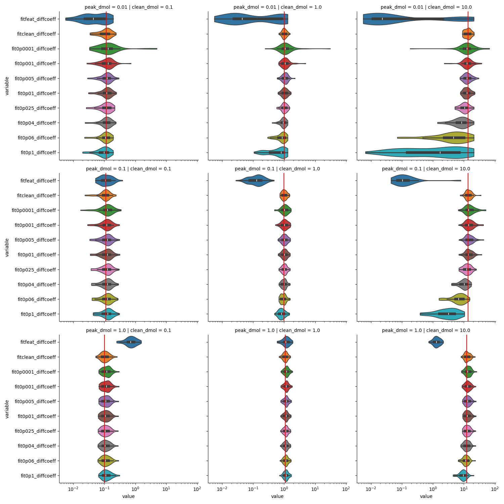

fit results: molecule number n
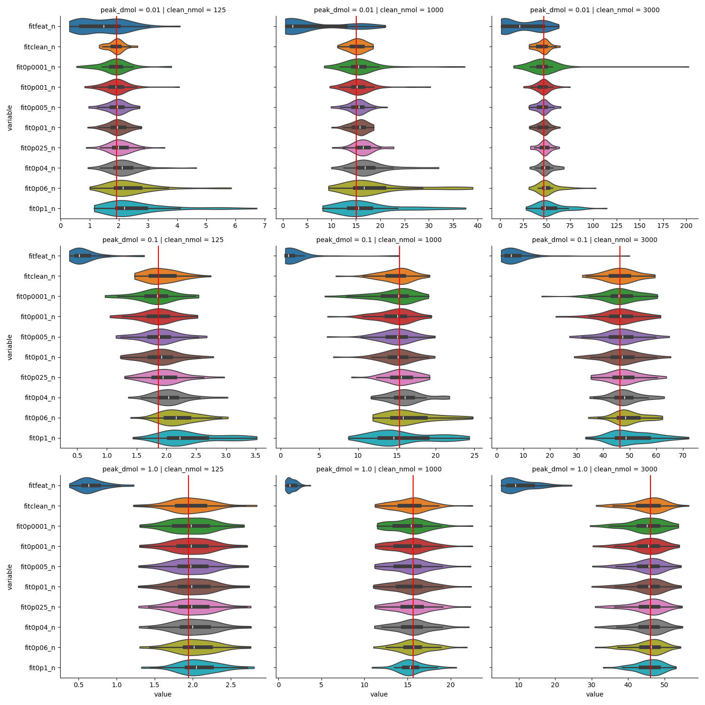

fit quality: NRMSE
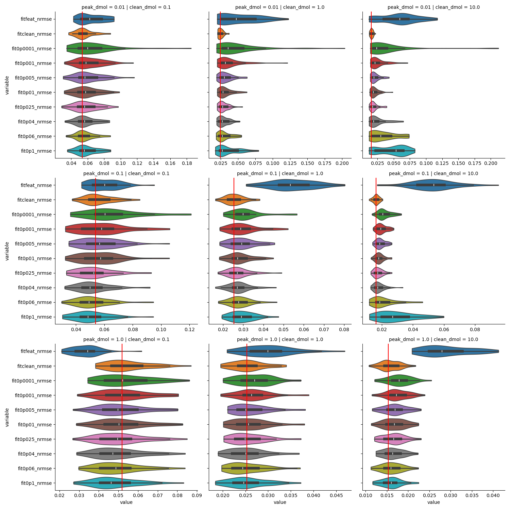

fit quality: adjusted R²
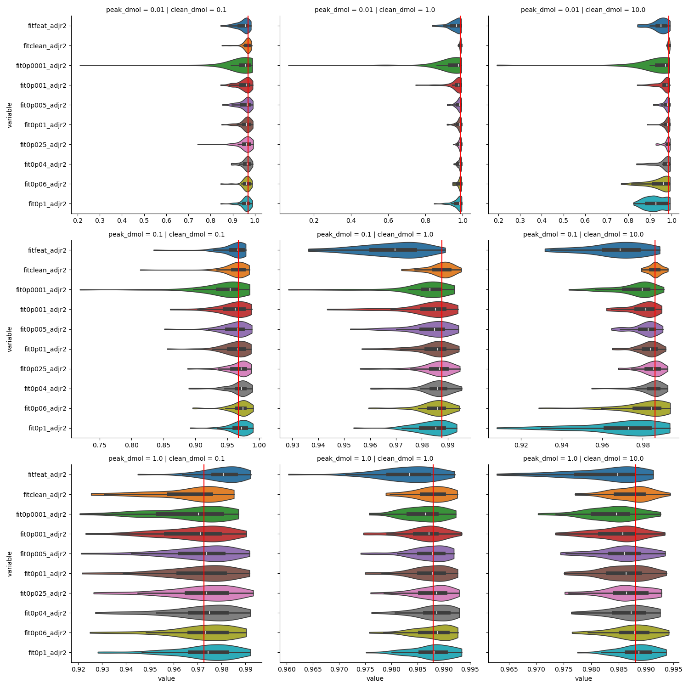

trace length after correction:
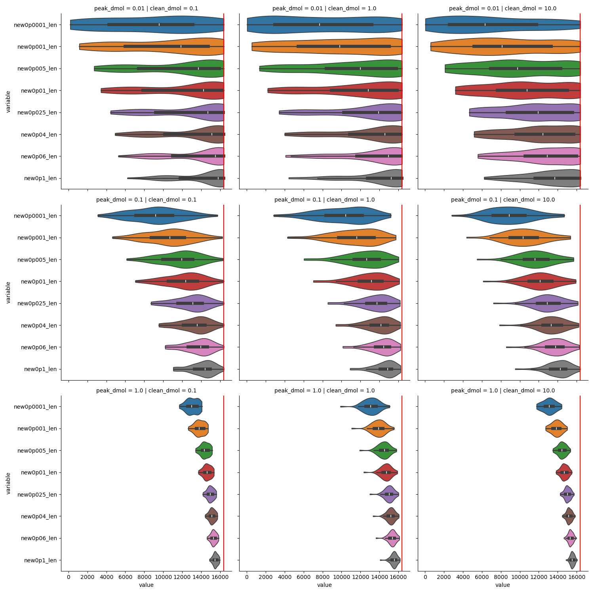

outcome: a segmentation threshold of 0.01 seems to be a good measure

Photobleaching

fit results: diffusion coefficients
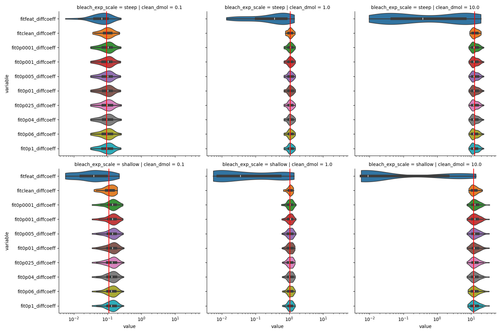

fit results: molecule number n
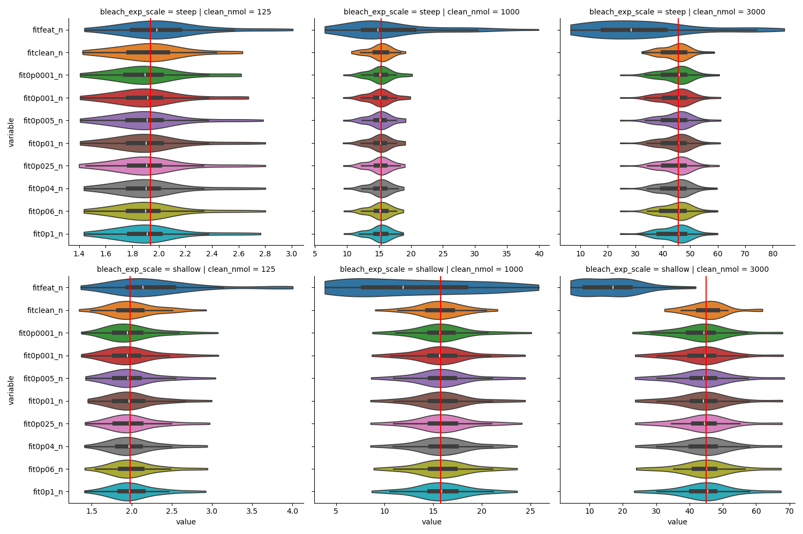

fit quality: NRMSE
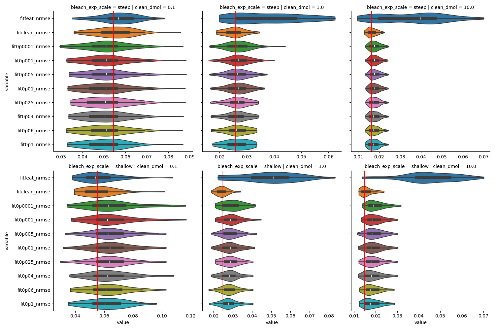

fit quality: adjusted R²
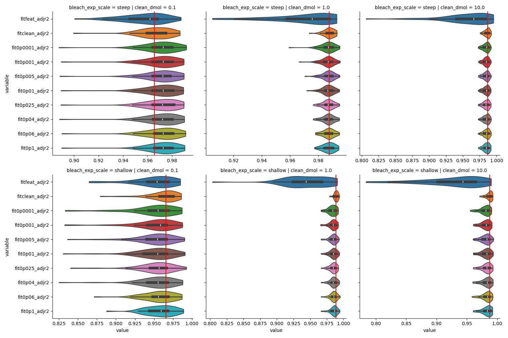

trace length after correction:
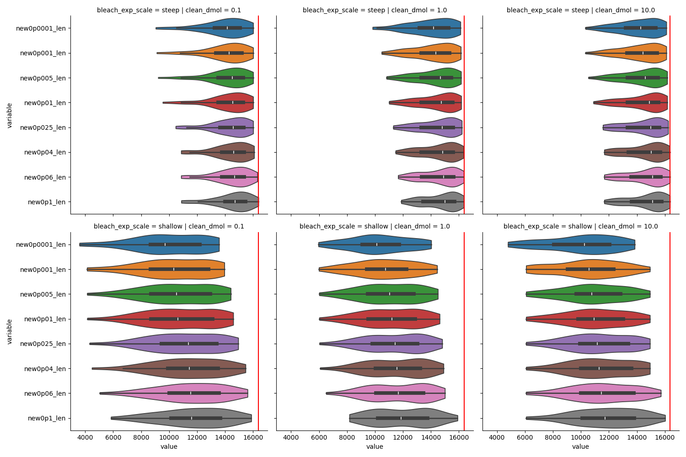

outcome: There is nearly no difference regarding different thresholds. The main
effect is the shorter trace length for shallow bleaching, which leads to a
higher variance in fit results of n in some groups. But even there the
difference is small. Decision: use the threshold 0.01, as this was the best
result for peak artifacts.

For detector dropout, we just use a label_segmentation < 0

#+transclude: [[./2025-12-19-simulations-segmentation/src-python/segmentation_ground_truth.py]]  :lines 398-431 :src jupyter-python

**** Plot example traces with =label_segmentation= and ground truth segmentation

#+begin_src emacs-lisp
(setq org-src-tab-acts-natively nil)
#+end_src

#+RESULTS:

but set it back to true if you edit source blocks in org-mode, otherwise you
have to manually indent everything...

#+begin_src emacs-lisp
(setq org-src-tab-acts-natively t)
#+end_src

#+RESULTS:
: t

#+transclude: [[./2025-12-19-simulations-segmentation/src-python/plot_ground_truth.py]]  :src jupyter-python

#+RESULTS:

These are the plots:

Detector dropout:
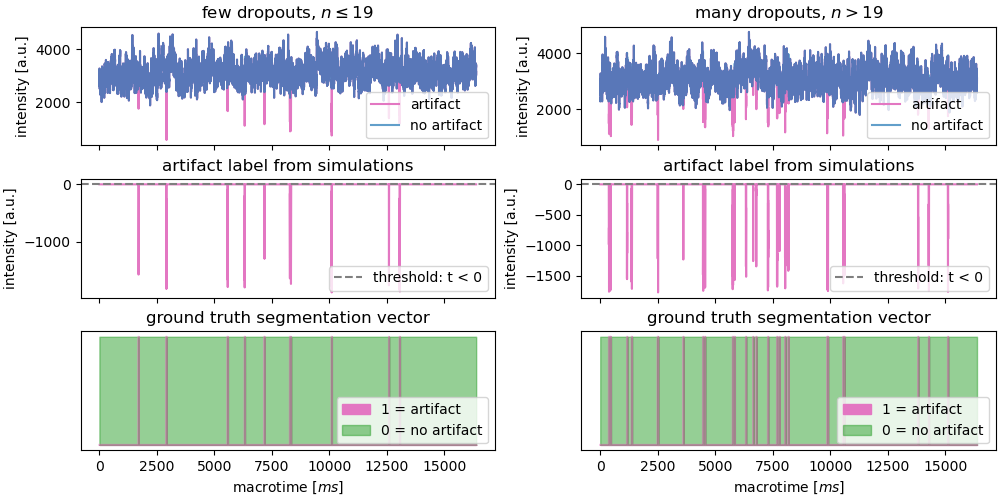

Photobleaching:
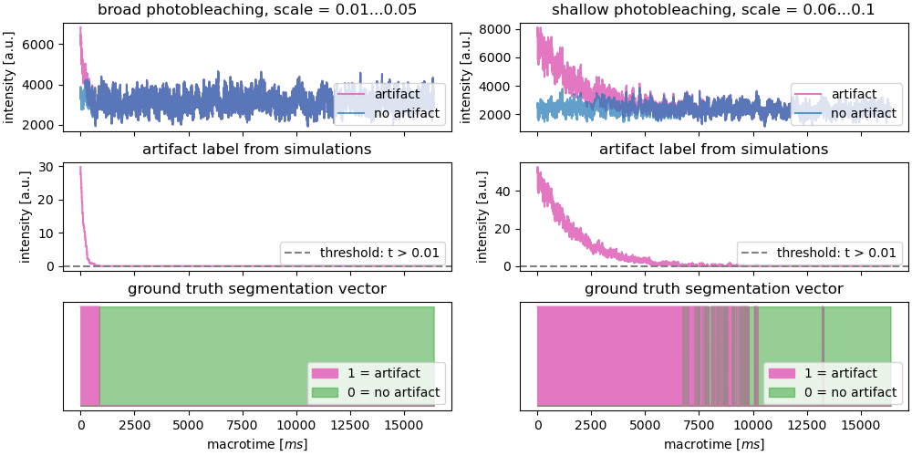

Peak artifacts:
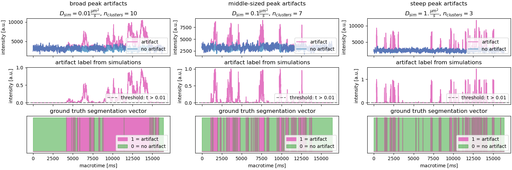

**** Perform classical segmentation methods
I chose 7 algorithms which automatically find an optimal threshold (1 floating
point number) per trace:
- isodata
- li
- mean
- otsu
- triangle
- yen

I chose 4 algorithms which automatically find a mask threshold
- local
- niblack
- bradley
- sauvola

I chose 3 classical image segmentation methods
- chan_vese
- random_walker
- watershed

#+transclude: [[./2025-12-19-simulations-segmentation/src-python/segmentation_classical.py]]  :src jupyter-python

#+RESULTS:
#+begin_example
Perform and evaluate classical segmentation for 2025-05-28-detector-dropout-testing.parquet ...
Dropping 28 traces without artifacts
t_isodata
t_li
t_mean
t_min
t_otsu
t_triangle
t_yen
tm_local
tm_niblack
tm_bradley
tm_sauvola
chan_vese
random_walker
/nix/store/pj8hzjzfy16mgn09iy1lg25hb3y95hab-python3.12-scikit-image-0.25.2/lib/python3.12/site-packages/skimage/_shared/utils.py:445: UserWarning: The probability range is outside [0, 1] given the tolerance `prob_tol`. Consider decreasing `beta` and/or decreasing `tol`.
  return func(*args, **kwargs)
watershed
Perform and evaluate classical segmentation for 2025-05-28-peak-artifacts-testing.parquet ...
Dropping 47 traces without artifacts
t_isodata
t_li
t_mean
t_min
t_otsu
t_triangle
t_yen
tm_local
tm_niblack
tm_bradley
tm_sauvola
chan_vese
random_walker
/nix/store/pj8hzjzfy16mgn09iy1lg25hb3y95hab-python3.12-scikit-image-0.25.2/lib/python3.12/site-packages/skimage/_shared/utils.py:445: UserWarning: The probability range is outside [0, 1] given the tolerance `prob_tol`. Consider decreasing `beta` and/or decreasing `tol`.
  return func(*args, **kwargs)
watershed
Perform and evaluate classical segmentation for 2025-05-28-photobleaching-testing.parquet ...
Dropping 1 traces without artifacts
t_isodata
t_li
t_mean
t_min
t_otsu
t_triangle
t_yen
tm_local
tm_niblack
tm_bradley
tm_sauvola
chan_vese
random_walker
/nix/store/pj8hzjzfy16mgn09iy1lg25hb3y95hab-python3.12-scikit-image-0.25.2/lib/python3.12/site-packages/skimage/_shared/utils.py:445: UserWarning: The probability range is outside [0, 1] given the tolerance `prob_tol`. Consider decreasing `beta` and/or decreasing `tol`.
  return func(*args, **kwargs)
watershed
#+end_example

#+begin_src jupyter-python
df["t_isodata_overlap"].describe()
#+end_src

#+RESULTS:
:RESULTS:
shape: (9, 2)
| statistic    | value    |
|--------------+----------|
| str          | f64      |
| "count"      | 1151.0   |
| "null_count" | 0.0      |
| "mean"       | 0.710291 |
| "std"        | 0.206396 |
| "min"        | 0.0      |
| "25%"        | 0.542203 |
| "50%"        | 0.664733 |
| "75%"        | 0.928962 |
| "max"        | 1.0      |
:END:

**** Plot classical segmentation methods

#+transclude: [[./2025-12-19-simulations-segmentation/src-python/plot_classical.py]]  :src jupyter-python

#+RESULTS:

#+begin_src jupyter-python
myfile = "2026-01-22-peak-artifacts-testing-classical.parquet"
df, out_file = get_data(myfile)
df = pivot_data(df, "peak_dmol")
display(df)

with pl.Config(tbl_width_chars=200, tbl_cols=20, tbl_rows=20, float_precision=2):
    print(pl.concat(
        [groupby_mean_std(df, "fbeta2"),
         groupby_mean_std(df, "meaniou"),
         groupby_mean_std(df, "biniou"),
         groupby_mean_std(df, "overlap"),
         (
             df
             .group_by(["method", "metric"], maintain_order=True)
             .agg(pl.col.value.drop_nans().mean().alias("score"))
             .filter(pl.col.metric.is_in(["fbeta2", "meaniou", "biniou"]))
             .group_by(["method"], maintain_order=True).mean()
             .sort("score", descending=True)
             .drop("metric")
         )
         ], how="align"
    ).sort("score", descending=True))
#+end_src

#+RESULTS:
:RESULTS:
shape: (92_820, 6)
| clean_dmol | clean_nmol | peak_dmol | method      | metric      | value    |
|------------+------------+-----------+-------------+-------------+----------|
| f64        | u32        | f64       | str         | str         | f64      |
| 5.0        | 100        | 0.01      | "t-isodata" | "precision" | 0.0      |
| 5.0        | 250        | 0.1       | "t-isodata" | "precision" | 1.0      |
| 1.0        | 250        | 0.01      | "t-isodata" | "precision" | 1.0      |
| 25.0       | 2000       | 1.0       | "t-isodata" | "precision" | 1.0      |
| 0.075      | 250        | 0.1       | "t-isodata" | "precision" | 1.0      |
| ...        | ...        | ...       | ...         | ...         | ...      |
| 0.075      | 250        | 1.0       | "watershed" | "overlap"   | 0.860666 |
| 0.075      | 100        | 1.0       | "watershed" | "overlap"   | 0.891793 |
| 0.075      | 250        | 1.0       | "watershed" | "overlap"   | 0.853494 |
| 3.0        | 2000       | 0.01      | "watershed" | "overlap"   | 0.30561  |
| 1.0        | 3500       | 0.1       | "watershed" | "overlap"   | 0.528929 |
#+begin_example
shape: (14, 10)
┌───────────────┬─────────────┬────────────┬──────────────┬─────────────┬─────────────┬────────────┬──────────────┬─────────────┬───────┐
│ method        ┆ mean fbeta2 ┆ std fbeta2 ┆ mean meaniou ┆ std meaniou ┆ mean biniou ┆ std biniou ┆ mean overlap ┆ std overlap ┆ score │
│ ---           ┆ ---         ┆ ---        ┆ ---          ┆ ---         ┆ ---         ┆ ---        ┆ ---          ┆ ---         ┆ ---   │
│ str           ┆ f64         ┆ f64        ┆ f64          ┆ f64         ┆ f64         ┆ f64        ┆ f64          ┆ f64         ┆ f64   │
╞═══════════════╪═════════════╪════════════╪══════════════╪═════════════╪═════════════╪════════════╪══════════════╪═════════════╪═══════╡
│ random-walker ┆ 0.60        ┆ 0.17       ┆ 0.56         ┆ 0.18        ┆ 0.41        ┆ 0.21       ┆ 0.92         ┆ 1.76        ┆ 0.53  │
│ t-triangle    ┆ 0.47        ┆ 0.15       ┆ 0.62         ┆ 0.11        ┆ 0.40        ┆ 0.14       ┆ 0.61         ┆ 2.12        ┆ 0.50  │
│ watershed     ┆ 0.53        ┆ 0.16       ┆ 0.57         ┆ 0.15        ┆ 0.38        ┆ 0.17       ┆ 0.70         ┆ 0.96        ┆ 0.50  │
│ t-mean        ┆ 0.56        ┆ 0.14       ┆ 0.52         ┆ 0.13        ┆ 0.35        ┆ 0.17       ┆ 0.87         ┆ 1.69        ┆ 0.48  │
│ t-li          ┆ 0.46        ┆ 0.11       ┆ 0.56         ┆ 0.13        ┆ 0.36        ┆ 0.13       ┆ 0.65         ┆ 1.83        ┆ 0.46  │
│ t-yen         ┆ 0.36        ┆ 0.14       ┆ 0.56         ┆ 0.12        ┆ 0.31        ┆ 0.13       ┆ 0.42         ┆ 1.23        ┆ 0.41  │
│ t-isodata     ┆ 0.34        ┆ 0.10       ┆ 0.53         ┆ 0.11        ┆ 0.28        ┆ 0.10       ┆ 0.48         ┆ 1.50        ┆ 0.38  │
│ t-otsu        ┆ 0.34        ┆ 0.10       ┆ 0.53         ┆ 0.11        ┆ 0.28        ┆ 0.10       ┆ 0.46         ┆ 1.48        ┆ 0.38  │
│ tm-bradley    ┆ 0.49        ┆ 0.22       ┆ 0.17         ┆ 0.12        ┆ 0.23        ┆ 0.19       ┆ 1.25         ┆ 3.93        ┆ 0.30  │
│ tm-niblack    ┆ 0.38        ┆ 0.13       ┆ 0.29         ┆ 0.03        ┆ 0.18        ┆ 0.12       ┆ 0.78         ┆ 2.30        ┆ 0.28  │
│ tm-local      ┆ 0.35        ┆ 0.11       ┆ 0.30         ┆ 0.02        ┆ 0.17        ┆ 0.10       ┆ 0.67         ┆ 1.94        ┆ 0.27  │
│ t-min         ┆ 0.13        ┆ 0.13       ┆ 0.44         ┆ 0.11        ┆ 0.11        ┆ 0.11       ┆ 0.21         ┆ 1.16        ┆ 0.22  │
│ tm-sauvola    ┆ 0.14        ┆ 0.10       ┆ 0.38         ┆ 0.11        ┆ 0.08        ┆ 0.06       ┆ 0.17         ┆ 0.15        ┆ 0.20  │
│ chan-vese     ┆ 0.06        ┆ 0.07       ┆ 0.30         ┆ 0.10        ┆ 0.03        ┆ 0.05       ┆ 0.16         ┆ 1.16        ┆ 0.13  │
└───────────────┴─────────────┴────────────┴──────────────┴─────────────┴─────────────┴────────────┴──────────────┴─────────────┴───────┘
#+end_example
:END:

#+begin_src jupyter-python
df
#+end_src

#+RESULTS:
:RESULTS:
shape: (92_820, 6)
| clean_dmol | clean_nmol | peak_dmol | method      | metric      | value    |
|------------+------------+-----------+-------------+-------------+----------|
| f64        | u32        | f64       | str         | str         | f64      |
| 5.0        | 100        | 0.01      | "t-isodata" | "precision" | 0.0      |
| 5.0        | 250        | 0.1       | "t-isodata" | "precision" | 1.0      |
| 1.0        | 250        | 0.01      | "t-isodata" | "precision" | 1.0      |
| 25.0       | 2000       | 1.0       | "t-isodata" | "precision" | 1.0      |
| 0.075      | 250        | 0.1       | "t-isodata" | "precision" | 1.0      |
| ...        | ...        | ...       | ...         | ...         | ...      |
| 0.075      | 250        | 1.0       | "watershed" | "overlap"   | 0.860666 |
| 0.075      | 100        | 1.0       | "watershed" | "overlap"   | 0.891793 |
| 0.075      | 250        | 1.0       | "watershed" | "overlap"   | 0.853494 |
| 3.0        | 2000       | 0.01      | "watershed" | "overlap"   | 0.30561  |
| 1.0        | 3500       | 0.1       | "watershed" | "overlap"   | 0.528929 |
:END:

#+begin_src jupyter-python
myfile = "2026-01-22-photobleaching-testing-classical.parquet"
df, out_file = get_data(myfile)
df = pivot_data(df, "bleach_exp_scale")
display(df)

with pl.Config(tbl_width_chars=200, tbl_cols=20, tbl_rows=20, float_precision=2):
    print(pl.concat(
        [groupby_mean_std(df, "fbeta2"),
         groupby_mean_std(df, "meaniou"),
         groupby_mean_std(df, "biniou"),
         groupby_mean_std(df, "overlap"),
         (
             df
             .group_by(["method", "metric"], maintain_order=True)
             .agg(pl.col.value.drop_nans().mean().alias("score"))
             .filter(pl.col.metric.is_in(["fbeta2", "meaniou", "biniou"]))
             .group_by(["method"], maintain_order=True).mean()
             .sort("score", descending=True)
             .drop("metric")
         )
         ], how="align"
    ).sort("score", descending=True))
#+end_src

#+begin_src jupyter-python
myfile = "2026-01-22-detector-dropout-testing-classical.parquet"
df, out_file = get_data(myfile)
df = pivot_data(df, "dropout_n")
display(df)

with pl.Config(tbl_width_chars=200, tbl_cols=20, tbl_rows=20, float_precision=2):
    print(pl.concat(
        [groupby_mean_std(df, "fbeta2"),
         groupby_mean_std(df, "meaniou"),
         groupby_mean_std(df, "biniou"),
         groupby_mean_std(df, "overlap"),
         (
             df
             .group_by(["method", "metric"], maintain_order=True)
             .agg(pl.col.value.drop_nans().mean().alias("score"))
             .filter(pl.col.metric.is_in(["fbeta2", "meaniou", "biniou"]))
             .group_by(["method"], maintain_order=True).mean()
             .sort("score", descending=True)
             .drop("metric")
         )
         ], how="align"
    ).sort("score", descending=True))
#+end_src

#+RESULTS:
:RESULTS:
shape: (46_032, 6)
| clean_dmol | clean_nmol | dropout_n | method      | metric      | value    |
|------------+------------+-----------+-------------+-------------+----------|
| f64        | u32        | str       | str         | str         | f64      |
| 5.0        | 2000       | "many"    | "t-isodata" | "precision" | 0.011053 |
| 5.0        | 3500       | "many"    | "t-isodata" | "precision" | 0.006032 |
| 3.0        | 2000       | "few"     | "t-isodata" | "precision" | 0.003351 |
| 1.0        | 3500       | "many"    | "t-isodata" | "precision" | 0.004968 |
| 3.0        | 3500       | "many"    | "t-isodata" | "precision" | 0.007052 |
| ...        | ...        | ...       | ...         | ...         | ...      |
| 5.0        | 2000       | "many"    | "watershed" | "overlap"   | 0.060345 |
| 25.0       | 3500       | "few"     | "watershed" | "overlap"   | 0.0      |
| 1.0        | 2000       | "many"    | "watershed" | "overlap"   | 0.022727 |
| 0.075      | 2000       | "few"     | "watershed" | "overlap"   | 0.127517 |
| 5.0        | 3500       | "few"     | "watershed" | "overlap"   | 0.021053 |
#+begin_example
shape: (14, 10)
┌───────────────┬─────────────┬────────────┬──────────────┬─────────────┬─────────────┬────────────┬──────────────┬─────────────┬───────┐
│ method        ┆ mean fbeta2 ┆ std fbeta2 ┆ mean meaniou ┆ std meaniou ┆ mean biniou ┆ std biniou ┆ mean overlap ┆ std overlap ┆ score │
│ ---           ┆ ---         ┆ ---        ┆ ---          ┆ ---         ┆ ---         ┆ ---        ┆ ---          ┆ ---         ┆ ---   │
│ str           ┆ f64         ┆ f64        ┆ f64          ┆ f64         ┆ f64         ┆ f64        ┆ f64          ┆ f64         ┆ f64   │
╞═══════════════╪═════════════╪════════════╪══════════════╪═════════════╪═════════════╪════════════╪══════════════╪═════════════╪═══════╡
│ tm-sauvola    ┆ 0.30        ┆ 0.14       ┆ 0.58         ┆ 0.09        ┆ 0.21        ┆ 0.15       ┆ 0.34         ┆ 0.08        ┆ 0.36  │
│ chan-vese     ┆ 0.28        ┆ 0.11       ┆ 0.59         ┆ 0.06        ┆ 0.20        ┆ 0.11       ┆ 0.29         ┆ 0.11        ┆ 0.36  │
│ watershed     ┆ 0.01        ┆ 0.01       ┆ 0.35         ┆ 0.03        ┆ 0.00        ┆ 0.00       ┆ 0.04         ┆ 0.07        ┆ 0.12  │
│ tm-local      ┆ 0.06        ┆ 0.03       ┆ 0.26         ┆ 0.00        ┆ 0.01        ┆ 0.01       ┆ 0.46         ┆ 0.04        ┆ 0.11  │
│ t-yen         ┆ 0.03        ┆ 0.03       ┆ 0.25         ┆ 0.20        ┆ 0.01        ┆ 0.01       ┆ 0.27         ┆ 0.30        ┆ 0.09  │
│ t-otsu        ┆ 0.02        ┆ 0.01       ┆ 0.25         ┆ 0.02        ┆ 0.00        ┆ 0.00       ┆ 0.13         ┆ 0.06        ┆ 0.09  │
│ tm-niblack    ┆ 0.05        ┆ 0.03       ┆ 0.21         ┆ 0.01        ┆ 0.01        ┆ 0.01       ┆ 0.43         ┆ 0.05        ┆ 0.09  │
│ t-mean        ┆ 0.02        ┆ 0.01       ┆ 0.25         ┆ 0.01        ┆ 0.00        ┆ 0.00       ┆ 0.13         ┆ 0.06        ┆ 0.09  │
│ t-isodata     ┆ 0.02        ┆ 0.01       ┆ 0.25         ┆ 0.02        ┆ 0.00        ┆ 0.00       ┆ 0.13         ┆ 0.06        ┆ 0.09  │
│ random-walker ┆ 0.01        ┆ 0.01       ┆ 0.26         ┆ 0.03        ┆ 0.00        ┆ 0.00       ┆ 0.07         ┆ 0.09        ┆ 0.09  │
│ t-li          ┆ 0.02        ┆ 0.01       ┆ 0.23         ┆ 0.02        ┆ 0.00        ┆ 0.00       ┆ 0.15         ┆ 0.07        ┆ 0.08  │
│ t-triangle    ┆ 0.03        ┆ 0.03       ┆ 0.17         ┆ 0.22        ┆ 0.01        ┆ 0.01       ┆ 0.37         ┆ 0.28        ┆ 0.07  │
│ t-min         ┆ 0.06        ┆ 0.04       ┆ 0.04         ┆ 0.11        ┆ 0.01        ┆ 0.01       ┆ 0.88         ┆ 0.26        ┆ 0.04  │
│ tm-bradley    ┆ 0.05        ┆ 0.03       ┆ 0.01         ┆ 0.01        ┆ 0.01        ┆ 0.01       ┆ 0.76         ┆ 0.09        ┆ 0.03  │
└───────────────┴─────────────┴────────────┴──────────────┴─────────────┴─────────────┴────────────┴──────────────┴─────────────┴───────┘
#+end_example
:END:

#+begin_src jupyter-python

with pl.Config(tbl_rows=40):
    print(pl.concat(
        [(
            df
            .group_by(["peak_dmol", "method", "metric"], maintain_order=True)
            .agg(
                pl.col.value.drop_nans().mean().alias("mean fbeta2"),
                pl.col.value.drop_nans().std().alias("std fbeta2")
            )
            .filter(pl.col.metric.is_in(["fbeta2"]))
            .drop("metric")
        ),
         (
             df
             .group_by(["peak_dmol", "method", "metric"], maintain_order=True)
             .agg(
                 pl.col.value.drop_nans().mean().alias("mean meaniou"),
                 pl.col.value.drop_nans().std().alias("std meaniou")
             )
             .filter(pl.col.metric.is_in(["meaniou"]))
             .drop("metric")
         ),
         (
             df
             .group_by(["peak_dmol", "method", "metric"], maintain_order=True)
             .agg(
                 pl.col.value.drop_nans().mean().alias("mean biniou"),
                 pl.col.value.drop_nans().std().alias("std biniou")
             )
             .filter(pl.col.metric.is_in(["biniou"]))
             .drop("metric")
         ),
         # (
         #     df
         #     .group_by(["peak_dmol", "method", "metric"], maintain_order=True)
         #     .agg(pl.col.value.drop_nans().mean().alias("score"))
         #     .filter(pl.col.metric.is_in(["fbeta2", "meaniou", "biniou"]))
         #     .group_by(["method"], maintain_order=True).mean()
         #     .sort("score", descending=True)
         #     .drop("metric")
         # )
         ], how="align"
    ))

#+end_src

#+RESULTS:
#+begin_example
shape: (42, 8)
┌───────────┬────────────┬────────────┬────────────┬───────────┬───────────┬───────────┬───────────┐
│ peak_dmol ┆ method     ┆ mean       ┆ std fbeta2 ┆ mean      ┆ std       ┆ mean      ┆ std       │
│ ---       ┆ ---        ┆ fbeta2     ┆ ---        ┆ meaniou   ┆ meaniou   ┆ biniou    ┆ biniou    │
│ f64       ┆ str        ┆ ---        ┆ f64        ┆ ---       ┆ ---       ┆ ---       ┆ ---       │
│           ┆            ┆ f64        ┆            ┆ f64       ┆ f64       ┆ f64       ┆ f64       │
╞═══════════╪════════════╪════════════╪════════════╪═══════════╪═══════════╪═══════════╪═══════════╡
│ 0.01      ┆ chan-vese  ┆ 0.096564   ┆ 0.105359   ┆ 0.25835   ┆ 0.119687  ┆ 0.061707  ┆ 0.078205  │
│ 0.01      ┆ random-wal ┆ 0.519322   ┆ 0.205762   ┆ 0.51805   ┆ 0.183669  ┆ *0.404097*  ┆ 0.221407  │
│           ┆ ker        ┆            ┆            ┆           ┆           ┆           ┆           │
│ 0.01      ┆ t-isodata  ┆ 0.364502   ┆ 0.153922   ┆ 0.443288  ┆ 0.135663  ┆ 0.273884  ┆ 0.147976  │
│ 0.01      ┆ t-li       ┆ 0.444476   ┆ 0.173087   ┆ 0.466212  ┆ 0.153648  ┆ 0.335443  ┆ 0.181718  │
│ 0.01      ┆ t-mean     ┆ 0.516436   ┆ 0.191074   ┆ 0.487127  ┆ 0.150939  ┆ 0.375974  ┆ 0.201069  │
│ 0.01      ┆ t-min      ┆ 0.168449   ┆ 0.178684   ┆ 0.386434  ┆ 0.152272  ┆ 0.139695  ┆ 0.157895  │
│ 0.01      ┆ t-otsu     ┆ 0.359213   ┆ 0.153027   ┆ 0.444139  ┆ 0.134955  ┆ 0.271587  ┆ 0.147379  │
│ 0.01      ┆ t-triangle ┆ 0.397078   ┆ 0.215811   ┆ *0.526864*  ┆ 0.14372   ┆ 0.342227  ┆ 0.209351  │
│ 0.01      ┆ t-yen      ┆ 0.295914   ┆ 0.185745   ┆ 0.466736  ┆ 0.149472  ┆ 0.247854  ┆ 0.177458  │
│ 0.01      ┆ tm-bradley ┆ *0.610919*   ┆ 0.277417   ┆ 0.232057  ┆ 0.145253  ┆ 0.355336  ┆ 0.258048  │
│ 0.01      ┆ tm-local   ┆ 0.385049   ┆ 0.149208   ┆ 0.307154  ┆ 0.025816  ┆ 0.229861  ┆ 0.13883   │
│ 0.01      ┆ tm-niblack ┆ 0.428169   ┆ 0.172565   ┆ 0.296788  ┆ 0.040302  ┆ 0.253218  ┆ 0.159718  │
│ 0.01      ┆ tm-sauvola ┆ 0.057751   ┆ 0.075555   ┆ 0.295324  ┆ 0.109769  ┆ 0.040337  ┆ 0.048151  │
│ 0.01      ┆ watershed  ┆ 0.426974   ┆ 0.198546   ┆ 0.490441  ┆ 0.16286   ┆ 0.325645  ┆ 0.185025  │
│ 0.1       ┆ chan-vese  ┆ 0.056359   ┆ 0.047057   ┆ 0.270589  ┆ 0.08854   ┆ 0.027752  ┆ 0.024079  │
│ 0.1       ┆ random-wal ┆ *0.676714*   ┆ 0.126528   ┆ *0.671827*  ┆ 0.13603   ┆ 0.535529  ┆ 0.17017   │
│           ┆ ker        ┆            ┆            ┆           ┆           ┆           ┆           │
│ 0.1       ┆ t-isodata  ┆ 0.341066   ┆ 0.076257   ┆ 0.540874  ┆ 0.067646  ┆ 0.283696  ┆ 0.077501  │
│ 0.1       ┆ t-li       ┆ 0.465441   ┆ 0.08637    ┆ 0.595058  ┆ 0.090305  ┆ 0.386144  ┆ 0.104472  │
│ 0.1       ┆ t-mean     ┆ 0.627184   ┆ 0.105264   ┆ 0.600778  ┆ 0.113615  ┆ 0.444197  ┆ 0.153971  │
│ 0.1       ┆ t-min      ┆ 0.118401   ┆ 0.104361   ┆ 0.439005  ┆ 0.076927  ┆ 0.099205  ┆ 0.090471  │
│ …         ┆ …          ┆ …          ┆ …          ┆ …         ┆ …         ┆ …         ┆ …         │
│ 0.1       ┆ t-yen      ┆ 0.370123   ┆ 0.119868   ┆ 0.572204  ┆ 0.076043  ┆ 0.321926  ┆ 0.112316  │
│ 0.1       ┆ tm-bradley ┆ 0.568423   ┆ 0.149082   ┆ 0.180164  ┆ 0.090056  ┆ 0.244914  ┆ 0.111463  │
│ 0.1       ┆ tm-local   ┆ 0.385523   ┆ 0.079129   ┆ 0.313605  ┆ 0.017759  ┆ 0.186714  ┆ 0.071423  │
│ 0.1       ┆ tm-niblack ┆ 0.425855   ┆ 0.092301   ┆ 0.295286  ┆ 0.028218  ┆ 0.200765  ┆ 0.080101  │
│ 0.1       ┆ tm-sauvola ┆ 0.108218   ┆ 0.077216   ┆ 0.360487  ┆ 0.061864  ┆ 0.061846  ┆ 0.040186  │
│ 0.1       ┆ watershed  ┆ 0.55171    ┆ 0.127772   ┆ 0.629217  ┆ 0.105266  ┆ 0.44503   ┆ 0.133452  │
│ 1.0       ┆ chan-vese  ┆ 0.023567   ┆ 0.018702   ┆ 0.356885  ┆ 0.062382  ┆ 0.009388  ┆ 0.006373  │
│ 1.0       ┆ random-wal ┆ 0.603502   ┆ 0.130923   ┆ 0.492437  ┆ 0.149326  ┆ 0.294787  ┆ 0.151475  │
│           ┆ ker        ┆            ┆            ┆           ┆           ┆           ┆           │
│ 1.0       ┆ t-isodata  ┆ 0.331184   ┆ 0.044489   ┆ 0.593372  ┆ 0.036825  ┆ 0.273971  ┆ 0.039502  │
│ 1.0       ┆ t-li       ┆ 0.462372   ┆ 0.055827   ┆ 0.616561  ┆ 0.090669  ┆ 0.351415  ┆ 0.089862  │
│ 1.0       ┆ t-mean     ┆ 0.542364   ┆ 0.082451   ┆ 0.469012  ┆ 0.066793  ┆ 0.238379  ┆ 0.078397  │
│ 1.0       ┆ t-min      ┆ 0.099107   ┆ 0.06515    ┆ 0.492201  ┆ 0.034357  ┆ 0.081615  ┆ 0.054747  │
│ 1.0       ┆ t-otsu     ┆ 0.326234   ┆ 0.039962   ┆ 0.595815  ┆ 0.029552  ┆ 0.274326  ┆ 0.036603  │
│ 1.0       ┆ t-triangle ┆ 0.49554    ┆ 0.063907   ┆ *0.680392*  ┆ 0.036958  ┆ 0.426655  ┆ 0.067134  │
│ 1.0       ┆ t-yen      ┆ 0.392475   ┆ 0.070322   ┆ 0.63471   ┆ 0.036992  ┆ 0.34117   ┆ 0.066256  │
│ 1.0       ┆ tm-bradley ┆ 0.319022   ┆ 0.05991    ┆ 0.109882  ┆ 0.078062  ┆ 0.094588  ┆ 0.025664  │
│ 1.0       ┆ tm-local   ┆ 0.282321   ┆ 0.039772   ┆ 0.29187   ┆ 0.009913  ┆ 0.095963  ┆ 0.02226   │
│ 1.0       ┆ tm-niblack ┆ 0.305022   ┆ 0.044896   ┆ 0.267057  ┆ 0.016409  ┆ 0.100783  ┆ 0.024039  │
│ 1.0       ┆ tm-sauvola ┆ 0.242056   ┆ 0.055405   ┆ 0.455562  ┆ 0.094022  ┆ 0.138033  ┆ 0.052007  │
│ 1.0       ┆ watershed  ┆ *0.610004*   ┆ 0.095361   ┆ 0.584211  ┆ 0.138624  ┆ 0.363609  ┆ 0.155047  │
└───────────┴────────────┴────────────┴────────────┴───────────┴───────────┴───────────┴───────────┘
#+end_example

#+begin_src jupyter-python
(df
 .select(pl.selectors.matches("t_|tm_"))
 )
#+end_src

#+RESULTS:
:RESULTS:
shape: (1_105, 90)
| dropout_n | dropout_maxdrop | t_isodata_seg             | t_isodata_cm                 | t_isodata_precision | t_isodata_recall | t_isodata_fbeta2 | t_isodata_biniou | t_isodata_meaniou | t_isodata_overlap | t_li_seg                  | t_li_cm                      | t_li_precision | t_li_recall | t_li_fbeta2 | t_li_biniou | t_li_meaniou | t_li_overlap | t_mean_seg                | t_mean_cm                    | t_mean_precision | t_mean_recall | t_mean_fbeta2 | t_mean_biniou | t_mean_meaniou | t_mean_overlap | t_min_seg                 | t_min_cm                  | t_min_precision | t_min_recall | t_min_fbeta2 | t_min_biniou | t_min_meaniou | t_min_overlap | t_otsu_seg                | t_otsu_cm                   | t_otsu_precision | ... | t_yen_recall | t_yen_fbeta2 | t_yen_biniou | t_yen_meaniou | t_yen_overlap | tm_local_seg             | tm_local_cm                  | tm_local_precision | tm_local_recall | tm_local_fbeta2 | tm_local_biniou | tm_local_meaniou | tm_local_overlap | tm_niblack_seg            | tm_niblack_cm                | tm_niblack_precision | tm_niblack_recall | tm_niblack_fbeta2 | tm_niblack_biniou | tm_niblack_meaniou | tm_niblack_overlap | tm_bradley_seg          | tm_bradley_cm               | tm_bradley_precision | tm_bradley_recall | tm_bradley_fbeta2 | tm_bradley_biniou | tm_bradley_meaniou | tm_bradley_overlap | tm_sauvola_seg            | tm_sauvola_cm               | tm_sauvola_precision | tm_sauvola_recall | tm_sauvola_fbeta2 | tm_sauvola_biniou | tm_sauvola_meaniou | tm_sauvola_overlap |
|-----------+-----------------+---------------------------+------------------------------+---------------------+------------------+------------------+------------------+-------------------+-------------------+---------------------------+------------------------------+----------------+-------------+-------------+-------------+--------------+--------------+---------------------------+------------------------------+------------------+---------------+---------------+---------------+----------------+----------------+---------------------------+---------------------------+-----------------+--------------+--------------+--------------+---------------+---------------+---------------------------+-----------------------------+------------------+-----+--------------+--------------+--------------+---------------+---------------+--------------------------+------------------------------+--------------------+-----------------+-----------------+-----------------+------------------+------------------+---------------------------+------------------------------+----------------------+-------------------+-------------------+-------------------+--------------------+--------------------+-------------------------+-----------------------------+----------------------+-------------------+-------------------+-------------------+--------------------+--------------------+---------------------------+-----------------------------+----------------------+-------------------+-------------------+-------------------+--------------------+--------------------|
| u32       | f32             | array[bool, 16384]        | array[i64, (2, 2)]           |                 f32 |              f32 |              f32 |              f32 |               f32 |               f64 | array[bool, 16384]        | array[i64, (2, 2)]           |            f32 |         f32 |         f32 |         f32 |          f32 |          f64 | array[bool, 16384]        | array[i64, (2, 2)]           |              f32 |           f32 |           f32 |           f32 |            f32 |            f64 | array[bool, 16384]        | array[i64, (2, 2)]        |             f32 |          f32 |          f32 |          f32 |           f32 |           f64 | array[bool, 16384]        | array[i64, (2, 2)]          |              f32 | ... |          f32 |          f32 |          f32 |           f32 |           f64 | array[bool, 16384]       | array[i64, (2, 2)]           |                f32 |             f32 |             f32 |             f32 |              f32 |              f64 | array[bool, 16384]        | array[i64, (2, 2)]           |                  f32 |               f32 |               f32 |               f32 |                f32 |                f64 | array[bool, 16384]      | array[i64, (2, 2)]          |                  f32 |               f32 |               f32 |               f32 |                f32 |                f64 | array[bool, 16384]        | array[i64, (2, 2)]          |                  f32 |               f32 |               f32 |               f32 |                f32 |                f64 |
| null      | null            | [false, false, ... false] | [[5463, 0], [8308, 2613]]    |                 1.0 |         0.239264 |           0.2822 |         0.239264 |          0.317984 |          0.478309 | [true, true, ... false]   | [[5463, 0], [7577, 3344]]    |            1.0 |    0.306199 |    0.355533 |    0.306199 |      0.36257 |     0.612118 | [true, true, ... false]   | [[5455, 8], [6518, 4403]]    |         0.998186 |      0.403168 |       0.45774 |      0.402873 |       0.429089 |       0.805967 | [false, false, ... false] | [[5463, 0], [8824, 2097]] |             1.0 |     0.192015 |     0.229025 |     0.192015 |      0.287195 |      0.383855 | [false, false, ... false] | [[5463, 0], [8308, 2613]]   |              1.0 | ... |     0.286146 |     0.333803 |     0.286146 |      0.349084 |       0.57203 | [true, false, ... true]  | [[2800, 2663], [5498, 5423]] |           0.670665 |        0.496566 |        0.523759 |         0.39922 |         0.327335 |         0.992678 | [true, true, ... true]    | [[2428, 3035], [4426, 6495]] |             0.681532 |          0.594726 |          0.610272 |          0.465391 |           0.355458 |           1.188907 | [true, true, ... true]  | [[211, 5252], [13, 10908]]  |                0.675 |           0.99881 |           0.91137 |          0.674457 |           0.356495 |           1.996705 | [false, false, ... false] | [[5048, 415], [10850, 71]]  |             0.146091 |          0.006501 |          0.008037 |          0.006263 |           0.157855 |           0.012997 |
| null      | null            | [false, false, ... false] | [[12605, 84], [1870, 1825]]  |            0.955998 |         0.493911 |         0.546767 |         0.482932 |           0.67436 |          0.493911 | [false, false, ... false] | [[11882, 807], [1269, 2426]] |       0.750387 |    0.656563 |    0.673403 |    0.538872 |      0.69507 |     0.656563 | [false, false, ... true]  | [[9954, 2735], [949, 2746]]  |         0.501003 |      0.743166 |      0.677657 |      0.427061 |       0.578467 |       0.743166 | [false, false, ... false] | [[12689, 0], [3655, 40]]  |             1.0 |     0.010825 |     0.013495 |     0.010825 |      0.393598 |      0.010825 | [false, false, ... false] | [[12605, 84], [1870, 1825]] |         0.955998 | ... |     0.508254 |     0.560463 |     0.495384 |      0.681754 |      0.508254 | [false, true, ... true]  | [[6489, 6200], [1852, 1843]] |           0.229143 |        0.498782 |        0.403759 |        0.186256 |         0.316256 |         0.498782 | [false, false, ... true]  | [[5438, 7251], [1564, 2131]] |             0.227137 |          0.576725 |          0.440982 |          0.194683 |           0.288108 |           0.576725 | [true, true, ... true]  | [[495, 12194], [3, 3692]]   |             0.232406 |          0.999188 |           0.60197 |          0.232362 |           0.135681 |           0.999188 | [false, false, ... false] | [[11797, 892], [3650, 45]]  |             0.048026 |          0.012179 |          0.014316 |           0.00981 |           0.365913 |           0.012179 |
| null      | null            | [false, false, ... false] | [[8856, 58], [4640, 2830]]   |            0.979917 |         0.378849 |         0.431824 |          0.37593 |          0.514658 |          0.378849 | [false, false, ... true]  | [[8612, 302], [3286, 4184]]  |       0.932679 |    0.560107 |    0.608741 |    0.538343 |     0.622122 |     0.560107 | [false, false, ... true]  | [[8349, 565], [2871, 4599]]  |         0.890589 |      0.615663 |      0.656175 |      0.572371 |       0.640407 |       0.615663 | [false, false, ... false] | [[8914, 0], [6411, 1059]] |             1.0 |     0.141767 |     0.171143 |     0.141767 |      0.361715 |      0.141767 | [false, false, ... false] | [[8857, 57], [4678, 2792]]  |         0.979993 | ... |     0.326908 |     0.377563 |     0.326165 |      0.482155 |      0.326908 | [false, true, ... false] | [[4497, 4417], [3741, 3729]] |           0.457771 |        0.499197 |        0.490322 |        0.313704 |         0.334529 |         0.499197 | [false, false, ... false] | [[3853, 5061], [3155, 4315]] |             0.460218 |          0.577644 |          0.549598 |          0.344346 |           0.331797 |           0.577644 | [true, true, ... true]  | [[499, 8415], [15, 7455]]   |             0.469754 |          0.997992 |          0.814754 |          0.469311 |           0.262598 |           0.997992 | [false, false, ... false] | [[8092, 822], [7403, 67]]   |             0.075366 |          0.008969 |          0.010888 |           0.00808 |           0.252002 |           0.008969 |
| null      | null            | [true, true, ... false]   | [[9243, 356], [4335, 2450]]  |            0.873129 |         0.361091 |          0.40907 |         0.343089 |          0.503215 |          0.361091 | [true, true, ... false]   | [[8407, 1192], [3387, 3398]] |       0.740305 |    0.500811 |    0.535455 |    0.425975 |     0.536682 |     0.500811 | [true, true, ... false]   | [[7815, 1784], [2866, 3919]] |         0.687182 |      0.577598 |      0.596626 |      0.457346 |       0.542151 |       0.577598 | [true, true, ... false]   | [[9599, 0], [6670, 115]]  |             1.0 |     0.016949 |     0.021097 |     0.016949 |      0.303483 |      0.016949 | [true, true, ... false]   | [[9272, 327], [4393, 2392]] |         0.879735 | ... |     0.047163 |     0.058267 |     0.047163 |      0.322355 |      0.047163 | [true, true, ... false]  | [[4863, 4736], [3452, 3333]] |           0.413062 |        0.491231 |        0.473316 |        0.289298 |         0.330956 |         0.491231 | [true, true, ... false]   | [[4104, 5495], [2868, 3917]] |             0.416171 |          0.577303 |          0.535812 |          0.318974 |           0.324082 |           0.577303 | [true, true, ... true]  | [[286, 9313], [13, 6772]]   |             0.421013 |          0.998084 |          0.783343 |          0.420673 |           0.225214 |           0.998084 | [false, false, ... false] | [[9045, 554], [6732, 53]]   |             0.087315 |          0.007811 |          0.009551 |          0.007222 |           0.280538 |           0.007811 |
| null      | null            | [false, false, ... false] | [[10197, 146], [4267, 1774]] |            0.923958 |          0.29366 |         0.340055 |          0.28673 |          0.492338 |           0.29366 | [false, false, ... false] | [[8190, 2153], [2431, 3610]] |        0.62641 |    0.597583 |    0.603134 |    0.440566 |     0.540856 |     0.597583 | [false, false, ... false] | [[7906, 2437], [2307, 3734]] |         0.605088 |       0.61811 |      0.615461 |      0.440434 |       0.532707 |        0.61811 | [false, false, ... false] | [[10343, 0], [5921, 120]] |             1.0 |     0.019864 |     0.024708 |     0.019864 |      0.327904 |      0.019864 | [false, false, ... false] | [[10248, 95], [4382, 1659]] |         0.945838 | ... |     0.182089 |     0.217701 |     0.182089 |      0.429405 |      0.182089 | [true, false, ... true]  | [[5245, 5098], [3010, 3031]] |           0.372863 |        0.501738 |        0.469297 |        0.272107 |         0.332451 |         0.501738 | [false, false, ... false] | [[4426, 5917], [2472, 3569]] |             0.376239 |          0.590796 |          0.530312 |          0.298461 |           0.321919 |           0.590796 | [true, false, ... true] | [[442, 9901], [10, 6031]]   |             0.378546 |          0.998345 |           0.75207 |          0.378309 |           0.210501 |           0.998345 | [false, true, ... false]  | [[9590, 753], [5980, 61]]   |             0.074939 |          0.010098 |          0.012211 |          0.008979 |           0.298247 |           0.010098 |
| ...       | ...             | ...                       | ...                          |                 ... |              ... |              ... |              ... |               ... |               ... | ...                       | ...                          |            ... |         ... |         ... |         ... |          ... |          ... | ...                       | ...                          |              ... |           ... |           ... |           ... |            ... |            ... | ...                       | ...                       |             ... |          ... |          ... |          ... |           ... |           ... | ...                       | ...                         |              ... | ... |          ... |          ... |          ... |           ... |           ... | ...                      | ...                          |                ... |             ... |             ... |             ... |              ... |              ... | ...                       | ...                          |                  ... |               ... |               ... |               ... |                ... |                ... | ...                     | ...                         |                  ... |               ... |               ... |               ... |                ... |                ... | ...                       | ...                         |                  ... |               ... |               ... |               ... |                ... |                ... |
| null      | null            | [false, false, ... false] | [[14455, 0], [1453, 476]]    |                 1.0 |          0.24676 |         0.290527 |          0.24676 |          0.577711 |           0.24676 | [false, false, ... false] | [[14454, 1], [1257, 672]]    |       0.998514 |    0.348367 |    0.400524 |    0.348187 |      0.63406 |     0.348367 | [false, false, ... false] | [[9938, 4517], [433, 1496]]  |         0.248794 |      0.775531 |      0.544832 |      0.232082 |         0.4498 |       0.775531 | [false, false, ... false] | [[14455, 0], [1754, 175]] |             1.0 |     0.090721 |     0.110886 |     0.090721 |      0.491255 |      0.090721 | [false, false, ... false] | [[14455, 0], [1453, 476]]   |              1.0 | ... |     0.251426 |     0.295696 |     0.251426 |      0.580301 |      0.251426 | [false, true, ... false] | [[7318, 7137], [942, 987]]   |           0.121492 |        0.511664 |        0.311553 |        0.108868 |         0.292078 |         0.511664 | [false, true, ... false]  | [[6397, 8058], [827, 1102]]  |             0.120306 |           0.57128 |          0.326499 |          0.110343 |            0.26447 |            0.57128 | [true, true, ... true]  | [[278, 14177], [159, 1770]] |             0.110993 |          0.917574 |          0.374002 |          0.109897 |            0.06446 |           0.917574 | [false, false, ... false] | [[13681, 774], [1604, 325]] |             0.295723 |          0.168481 |          0.184345 |          0.120237 |           0.486079 |           0.168481 |
| null      | null            | [false, false, ... false] | [[15025, 1], [928, 430]]     |             0.99768 |         0.316642 |         0.366706 |         0.316409 |           0.62909 |          0.316642 | [false, false, ... false] | [[15012, 14], [824, 534]]    |       0.974453 |    0.393225 |    0.446488 |    0.389213 |     0.668171 |     0.393225 | [true, true, ... false]   | [[9533, 5493], [248, 1110]]  |         0.168105 |      0.817379 |      0.461155 |       0.16202 |       0.393076 |       0.817378 | [false, false, ... false] | [[15026, 0], [1265, 93]]  |             1.0 |     0.068483 |     0.084163 |     0.068483 |      0.495416 |      0.068483 | [false, false, ... false] | [[15025, 1], [928, 430]]    |          0.99768 | ... |     0.360088 |     0.412519 |     0.358504 |      0.651728 |      0.360088 | [false, true, ... true]  | [[7617, 7409], [694, 664]]   |           0.082249 |        0.488954 |        0.245835 |        0.075739 |          0.28014 |         0.488954 | [true, true, ... false]   | [[6607, 8419], [593, 765]]   |             0.083297 |          0.563328 |          0.261699 |          0.078245 |           0.250628 |           0.563328 | [true, true, ... true]  | [[232, 14794], [112, 1246]] |             0.077681 |          0.917526 |          0.290145 |          0.077142 |           0.046234 |           0.917526 | [false, false, ... false] | [[14213, 813], [1134, 224]] |             0.216008 |          0.164948 |          0.173133 |          0.103178 |           0.491348 |           0.164948 |
| null      | null            | [false, false, ... false] | [[14912, 0], [1172, 300]]    |                 1.0 |         0.203804 |         0.242405 |         0.203804 |          0.565468 |          0.203804 | [false, false, ... false] | [[14912, 0], [1021, 451]]    |            1.0 |    0.306386 |    0.355734 |    0.306386 |     0.621153 |     0.306386 | [false, false, ... false] | [[10162, 4750], [252, 1220]] |         0.204355 |      0.828804 |      0.514421 |      0.196078 |       0.433109 |       0.828804 | [false, false, ... false] | [[14912, 0], [1371, 101]] |             1.0 |     0.068614 |     0.084321 |     0.068614 |      0.492208 |      0.068614 | [false, false, ... false] | [[14912, 0], [1172, 300]]   |              1.0 | ... |     0.201087 |     0.239327 |     0.201087 |      0.563995 |      0.201087 | [false, false, ... true] | [[7584, 7328], [747, 725]]   |           0.090029 |        0.492527 |        0.260024 |        0.082386 |         0.283354 |         0.492527 | [false, false, ... true]  | [[6659, 8253], [626, 846]]   |             0.092977 |          0.574728 |          0.282245 |          0.086992 |           0.257777 |           0.574728 | [true, true, ... true]  | [[279, 14633], [163, 1309]] |              0.08211 |          0.889266 |          0.299817 |          0.081279 |           0.049893 |           0.889266 | [false, false, ... false] | [[14117, 795], [1192, 280]] |             0.260465 |          0.190217 |          0.201063 |          0.123511 |           0.500063 |           0.190217 |
| null      | null            | [false, false, ... false] | [[13861, 2], [1835, 686]]    |            0.997093 |         0.272114 |         0.318418 |         0.271899 |          0.577439 |          0.272114 | [false, false, ... false] | [[13754, 109], [1525, 996]]  |       0.901357 |    0.395081 |     0.44508 |    0.378707 |      0.63626 |     0.395081 | [false, false, ... false] | [[9608, 4255], [581, 1940]]  |         0.313156 |      0.769536 |       0.59586 |      0.286305 |       0.475747 |       0.769536 | [false, false, ... false] | [[13863, 0], [2517, 4]]   |             1.0 |     0.001587 |     0.001983 |     0.001587 |      0.423962 |      0.001587 | [false, false, ... false] | [[13861, 2], [1835, 686]]   |         0.997093 | ... |     0.295121 |     0.343395 |     0.294537 |      0.590299 |      0.295121 | [true, false, ... false] | [[7086, 6777], [1287, 1234]] |           0.154038 |        0.489488 |        0.340978 |        0.132717 |          0.30022 |         0.489488 | [true, false, ... true]   | [[6149, 7714], [1053, 1468]] |             0.159878 |          0.582309 |          0.380982 |          0.143429 |           0.277836 |           0.582309 | [true, true, ... true]  | [[254, 13609], [183, 2338]] |             0.146611 |           0.92741 |           0.44908 |          0.144947 |           0.081515 |            0.92741 | [false, false, ... false] | [[13120, 743], [2180, 341]] |             0.314576 |          0.135264 |          0.152668 |          0.104473 |           0.461138 |           0.135264 |
| null      | null            | [false, false, ... false] | [[14458, 0], [1404, 522]]    |                 1.0 |         0.271028 |         0.317287 |         0.271028 |          0.591257 |          0.271028 | [false, false, ... false] | [[14456, 2], [1240, 686]]    |       0.997093 |    0.356179 |    0.408723 |    0.355809 |     0.638345 |     0.356179 | [false, false, ... false] | [[10204, 4254], [396, 1530]] |         0.264523 |      0.794393 |      0.567171 |      0.247573 |       0.467263 |       0.794393 | [false, false, ... false] | [[14458, 0], [1730, 196]] |             1.0 |     0.101765 |     0.124051 |     0.101765 |      0.497448 |      0.101765 | [false, false, ... false] | [[14458, 0], [1412, 514]]   |              1.0 | ... |      0.36812 |     0.421272 |     0.367739 |      0.644986 |       0.36812 | [false, true, ... false] | [[7286, 7172], [965, 961]]   |           0.118161 |        0.498962 |        0.303403 |        0.105628 |         0.289019 |         0.498962 | [false, true, ... false]  | [[6393, 8065], [818, 1108]]  |             0.120789 |          0.575286 |          0.328257 |            0.1109 |             0.2647 |           0.575286 | [true, true, ... true]  | [[268, 14190], [199, 1727]] |               0.1085 |          0.896677 |          0.365565 |          0.107161 |           0.062723 |           0.896677 | [false, false, ... false] | [[13635, 823], [1550, 376]] |             0.313595 |          0.195223 |          0.211165 |          0.136777 |           0.494269 |           0.195223 |
:END:

#+begin_src jupyter-python
df[""]
#+end_src

#+RESULTS:
: array(['t-isodata', 't-li', 't-mean', 't-min', 't-otsu', 't-triangle',
:        't-yen', 'tm-local', 'tm-niblack', 'tm-bradley', 'tm-sauvola',
:        'chan', 'random', 'watershed'], dtype=object)

#+begin_src jupyter-python
pddf
#+end_src

#+RESULTS:
:RESULTS:
|       | clean_dmol | clean_nmol | peak_dmol | method    | metric    | value    |
|-------+------------+------------+-----------+-----------+-----------+----------|
| 0     | 0.075      | 100        | 0.01      | t-isodata | precision | 1.000000 |
| 1     | 0.075      | 100        | 0.01      | t-isodata | precision | 0.955998 |
| 2     | 0.075      | 100        | 0.01      | t-isodata | precision | 0.979917 |
| 3     | 0.075      | 100        | 0.01      | t-isodata | precision | 0.873129 |
| 4     | 0.075      | 100        | 0.01      | t-isodata | precision | 0.923958 |
| ...   | ...        | ...        | ...       | ...       | ...       | ...      |
| 92815 | 25.000     | 3500       | 1.00      | watershed | overlap   | 0.623121 |
| 92816 | 25.000     | 3500       | 1.00      | watershed | overlap   | 0.788660 |
| 92817 | 25.000     | 3500       | 1.00      | watershed | overlap   | 0.739130 |
| 92818 | 25.000     | 3500       | 1.00      | watershed | overlap   | 0.617215 |
| 92819 | 25.000     | 3500       | 1.00      | watershed | overlap   | 0.641225 |

92820 rows × 6 columns
:END:

#+begin_src jupyter-python
df.select()
#+end_src

#+begin_src jupyter-python
g = sns.catplot(pddf, x="value", y="method", col="metric", col_wrap=3,
            height=3, kind="violin", cut=0, sharex=False)
g.axes[5].set_xlim([0, 1])
#+end_src

#+RESULTS:
:RESULTS:
| 0.0 | 1.0 |
[[file:./.ob-jupyter/99459e30790b009d3c2844164f9bd0f8c12bd2bb.png]]
:END:

#+begin_src jupyter-python

ex = df["feature"][2000].to_numpy()
ex = ex.reshape((ex.size, 1))
truth = df["label_segmentation"][2000]

for k, v in t_algos.items():
    print(k)
    pred = seg_classical(ex, k, v)
    print(ex)
    print(pred)
    # pred = np.greater(thresh, ex)
    # print(pred)
    plt.plot(ex[:])
    ax1 = plt.gca()
    ax2 = plt.twinx(ax1)
    ax2.plot(pred[:], alpha=0.5, color="orange")
    ax2.plot(truth[:], alpha=1, color="pink")
    plt.show()

# plt.plot(ex)
# ax1 = plt.gca()
# ax2 = plt.twinx(ax1)
# ax2.plot(pred, alpha=0.5, color="orange")
# ax2.plot(truth, alpha=1, color="pink")
# plt.show()
#+end_src

#+RESULTS:
:RESULTS:
# [goto error]
#+begin_example
---------------------------------------------------------------------------
ColumnNotFoundError                       Traceback (most recent call last)
/tmp/ipykernel_7095/3333093823.py in ?()
----> 1 ex = df["feature"][2000].to_numpy()
      2 ex = ex.reshape((ex.size, 1))
      3 truth = df["label_segmentation"][2000]
      4

/nix/store/7j14ck2j4zq8s0g3ms5yihi8b8xql2v8-python3.12-polars-1.31.0/lib/python3.12/site-packages/polars/dataframe/frame.py in ?(self, key)
   1391         │ 2   ┆ 5   ┆ 3   │
   1392         │ 3   ┆ 6   ┆ 2   │
   1393         └─────┴─────┴─────┘
   1394         """
-> 1395         return get_df_item_by_key(self, key)

/nix/store/7j14ck2j4zq8s0g3ms5yihi8b8xql2v8-python3.12-polars-1.31.0/lib/python3.12/site-packages/polars/_utils/getitem.py in ?(df, key)
    159     # Single string input, e.g. df["a"]
    160     if isinstance(key, str):
    161         # This case is required because empty strings are otherwise treated
    162         # as an empty Sequence in `_select_rows`
--> 163         return df.get_column(key)
    164
    165     # Single input - df[1] - or multiple inputs - df["a", "b", "c"]
    166     try:

/nix/store/7j14ck2j4zq8s0g3ms5yihi8b8xql2v8-python3.12-polars-1.31.0/lib/python3.12/site-packages/polars/dataframe/frame.py in ?(self, name, default)
   8693         try:
   8694             return wrap_s(self._df.get_column(name))
   8695         except ColumnNotFoundError:
   8696             if default is no_default:
-> 8697                 raise
   8698             return default

ColumnNotFoundError: "feature" not found
#+end_example
:END:
#+RESULTS:

**** Perform U-Net segmentation

#+BEGIN_SRC sh :session local
rm ~/.tmux-local-socket-remote-machine
#+END_SRC

#+RESULTS:

#+BEGIN_SRC sh :session local
REMOTE_SOCKET=$(ssh ara 'tmux ls -F "#{socket_path}"' | head -1)
#+END_SRC

#+BEGIN_SRC sh :session local
echo $REMOTE_SOCKET
#+END_SRC

#+RESULTS:
: /tmp/tmux-67339/default

#+BEGIN_SRC sh :session local
ssh ara -tfN \
    -L ~/.tmux-local-socket-remote-machine:$REMOTE_SOCKET
#+END_SRC

#+RESULTS:
| ** | WARNING: | connection | is  | not  | using      | a  | post-quantum | key  | exchange                    | algorithm. |          |
| ** | This     | session    | may | be   | vulnerable | to | "store       | now, | decrypt                     | later"     | attacks. |
| ** | The      | server     | may | need | to         | be | upgraded.    | See  | https://openssh.com/pq.html |            |          |

#+BEGIN_SRC tmux :socket ~/.tmux-local-socket-remote-machine :session hparams
cd /beegfs/ye53nis/2026-02-04-hparams
srun -p gpu_p100 --time=7-10:00:00 --ntasks-per-node=12 --mem-per-cpu=4000 --gres=gpu:1 --pty bash

#+END_SRC

#+RESULTS:
#+begin_example
/usr/libexec/grepconf.sh: line 5: grep: command not found
/usr/libexec/grepconf.sh: line 5: grep: command not found
/usr/libexec/grepconf.sh: line 5: grep: command not found
-bash: readlink: command not found
-bash: basename: command not found
[ye53nis@login1 ~]$ cd /beegfs/ye53nis/2026-02-04-hparams/src
[ye53nis@login1 src]$
[ye53nis@login1 src]$
#+end_example

#+BEGIN_SRC tmux :socket ~/.tmux-local-socket-remote-machine :session hparams
cd /beegfs/ye53nis/2026-02-04-hparams
#+END_SRC

#+BEGIN_SRC tmux :socket ~/.tmux-local-socket-remote-machine :session gpu
cd /
#+END_SRC

due to problems with tmux, I use screen now:

https://wiki.m3c.uni-tuebingen.de/en/Slurm/UsingSlurm#using-screen

#+transclude: [[./2025-12-19-simulations-segmentation/src-python/hparams_unet.py]]  :src jupyter-python

#+RESULTS:
: 2026-02-09 16:24:56,024 - hparams - Python version: 3.12.12 (main, Oct  9 2025, 11:07:00) [GCC 14.3.0]
: 2026-02-09 16:24:56,025 - hparams - Tensorflow version: 2.19.0
: 2026-02-09 16:24:56,026 - hparams - Keras version: 3.11.3
: 2026-02-09 16:24:56,026 - hparams - Cudnn version: None
: 2026-02-09 16:24:56,027 - hparams - Cuda version: None
: 2026-02-09 16:24:56,027 - hparams - GPUs: []. Trying to set memory growth to 'True'...
: 2026-02-09 16:24:56,027 - hparams - No GPU was found on this machine.

#+begin_src jupyter-python
print("Num GPUs Available: ", len(tf.config.list_physical_devices('GPU')))

#+end_src

#+RESULTS:
: Num GPUs Available:  0

#+begin_src jupyter-python
if tf.test.gpu_device_name()=='':
  print('You do not have GPU access.')
  print('Did you change your runtime ?')
  print('If the runtime settings are correct then Google did not allocate GPU to your session')
  print('Expect slow performance. To access GPU try reconnecting later')

else:
  print('You have GPU access')
  !nvidia-smi

from tensorflow.python.client import device_lib
device_lib.list_local_devices()
# print the tensorflow version
print('Tensorflow version is ' + str(tf.__version__))

#+end_src

#+begin_src jupyter-python

file_train_feature = (
    "~/Programs/drmed-git/data/exp-250327-masters/2025-05-28-simulations/"
    "parquet/2025-05-28-peak-artifacts-training.parquet"
)
file_train_label = (
    "~/Programs/drmed-git/data/exp-250327-masters/2025-12-19-simulations-segmen"
    "tation/parquet/2026-01-14-peak-artifacts-training-ground-truth.parquet"

)
file_val_feature = (
    "~/Programs/drmed-git/data/exp-250327-masters/2025-05-28-simulations/"
    "parquet/2025-05-28-peak-artifacts-validation.parquet"
)
file_val_label = (
    "~/Programs/drmed-git/data/exp-250327-masters/2025-12-19-simulations-segmen"
    "tation/parquet/2026-01-14-peak-artifacts-validation-ground-truth.parquet"
)

df_train = get_data(file_train_feature, file_train_label)
df_train = df_train.head()
ds_train, num_train_ex = tfds_from_pldf(
    df_train["feature"], df_train["label_ground_truth"]
)
df_val = get_data(file_val_feature, file_val_label)
df_val = df_val.head()
ds_val, num_val_ex = tfds_from_pldf(
    df_val["feature"], df_val["label_ground_truth"]
)
df_train
#+end_src

#+RESULTS:
:RESULTS:
: 2026-02-09 17:29:31,127 - hparams - number of examples: 5
: Dropping 147 traces without artifacts
: 2026-02-09 17:29:31,628 - hparams - number of examples: 5
: Dropping 59 traces without artifacts
shape: (5, 12)
| uuid                               | feature                                     | label_ground_truth        | artifact         | clean_dmol | clean_nmol | peak_dmol | peak_nmol | bleach_exp_scale | bleach_type | dropout_n | dropout_maxdrop |
|------------------------------------+---------------------------------------------+---------------------------+------------------+------------+------------+-----------+-----------+------------------+-------------+-----------+-----------------|
| str                                | array[f32, 16384]                           | array[bool, 16384]        | str              | f64        | u32        | f64       | u32       | f64              | str         | u32       | f32             |
| "00418944-589a-4133-be53-4a370f... | [32.053642, 55.504383, ... 0.548958]        | [false, false, ... false] | "peak_artifacts" | 50.0       | 100        | 1.0       | 3         | null             | "None"      | null      | null            |
| "0062ffcd-39a4-4282-b137-515a49... | [2.227297, 5.122533, ... 91.0569]           | [false, false, ... true]  | "peak_artifacts" | 0.1        | 50         | 0.1       | 7         | null             | "None"      | null      | null            |
| "007106f9-fc8a-40a7-9830-30b098... | [65.749702, 64.316383, ... 108.965302]      | [false, false, ... false] | "peak_artifacts" | 3.0        | 125        | 1.0       | 3         | null             | "None"      | null      | null            |
| "008a0044-d095-49cb-addc-9f1df9... | [3812.864502, 3618.391357, ... 3794.423584] | [false, false, ... true]  | "peak_artifacts" | 1.75       | 4000       | 0.1       | 7         | null             | "None"      | null      | null            |
| "0098c773-d491-473f-87f4-4a08f2... | [77.653801, 14.784485, ... 9.057747]        | [false, false, ... false] | "peak_artifacts" | 25.0       | 50         | 0.1       | 7         | null             | "None"      | null      | null            |
:END:

#+begin_src jupyter-python
        best_fbeta_val = float(tf.experimental.numpy.finfo(
            tf.experimental.numpy.float64
           ).min)
        print(best_fbeta_val)
#+end_src

#+RESULTS:
: -1.7976931348623157e+308

#+begin_src jupyter-python
runs[0].info.run_id
#+end_src

#+RESULTS:
: 84d9a8794d7a4da29723a4b8949d3aef

#+begin_src jupyter-python

client = mlflow.client.MlflowClient("file:data/mlruns")
experiment = client.get_experiment_by_name("hparams_unet_10")
print("experiment", experiment.experiment_id)
runs = client.search_runs(experiment.experiment_id)
run = runs[3]
print("run", run.info.run_id)
model = mlflow.keras.load.load_model(
    f"./data/mlruns/{experiment.experiment_id}/{run.info.run_id}/artifacts/model",
)

#+end_src

#+RESULTS:
: experiment 985722685589461237
: run 1db552c9a45f4bcca068eb9f4196f0e2

#+begin_src jupyter-python
params = {"input_size": 14000, "scaler": "robust", "batch_size": 4}
def tfds_prepare(
        ds: tf.data.Dataset, params: dict, num_examples: int
) -> tf.data.Dataset:
    return (
        ds
        .map(lambda feature, label: tfds_crop(
            feature, label, params["input_size"]
        ), num_parallel_calls=tf.data.AUTOTUNE)
        .map(lambda feature, label: tfds_scale(
            feature, label, params["scaler"]
        ), num_parallel_calls=tf.data.AUTOTUNE)
        .map(lambda feature, label: tfds_pad(feature, label),
             num_parallel_calls=tf.data.AUTOTUNE)
        .shuffle(buffer_size=num_examples)
        .repeat()
        .batch(params["batch_size"], drop_remainder=True)
        .prefetch(tf.data.AUTOTUNE)
    )
ds = tfds_prepare(ds_train, params, 2)
result = model.evaluate(x=ds, steps=10, return_dict=True)
#+end_src

#+RESULTS:
: 10/10 ━━━━━━━━━━━━━━━━━━━━ 5s 456ms/step - auc: 0.1419 - biniou0_0.1: 0.0000e+00 - biniou0_0.3: 0.0000e+00 - biniou0_0.5: 0.0000e+00 - biniou0_0.7: 0.0000e+00 - biniou0_0.9: 0.0000e+00 - biniou1_0.1: 0.1419 - biniou1_0.3: 0.1419 - biniou1_0.5: 0.1419 - biniou1_0.7: 0.1419 - biniou1_0.9: 0.1419 - fn_0.1: 0.0000e+00 - fn_0.3: 0.0000e+00 - fn_0.5: 0.0000e+00 - fn_0.7: 0.0000e+00 - fn_0.9: 0.0000e+00 - fp_0.1: 562336.0000 - fp_0.3: 562336.0000 - fp_0.5: 562336.0000 - fp_0.7: 562336.0000 - fp_0.9: 562336.0000 - loss: 2359315283329417216.0000 - meaniou: 0.0710 - metric: 0.4527 - metric_1: 1.0000 - metric_2: 0.4527 - metric_3: 1.0000 - metric_4: 0.4527 - metric_5: 1.0000 - metric_6: 0.4527 - metric_7: 1.0000 - metric_8: 0.4527 - metric_9: 1.0000 - precision_0.1: 0.1419 - precision_0.3: 0.1419 - precision_0.5: 0.1419 - precision_0.7: 0.1419 - precision_0.9: 0.1419 - recall_0.1: 1.0000 - recall_0.3: 1.0000 - recall_0.5: 1.0000 - recall_0.7: 1.0000 - recall_0.9: 1.0000 - tn_0.1: 0.0000e+00 - tn_0.3: 0.0000e+00 - tn_0.5: 0.0000e+00 - tn_0.7: 0.0000e+00 - tn_0.9: 0.0000e+00 - tp_0.1: 93024.0000 - tp_0.3: 93024.0000 - tp_0.5: 93024.0000 - tp_0.7: 93024.0000 - tp_0.9: 93024.0000

#+begin_src jupyter-python
from pprint import pprint
pprint(result)
#+end_src

#+RESULTS:
#+begin_example
{'auc': 0.14194336533546448,
 'biniou0_0.1': 0.0,
 'biniou0_0.3': 0.0,
 'biniou0_0.5': 0.0,
 'biniou0_0.7': 0.0,
 'biniou0_0.9': 0.0,
 'biniou1_0.1': 0.14194335043430328,
 'biniou1_0.3': 0.14194335043430328,
 'biniou1_0.5': 0.14194335043430328,
 'biniou1_0.7': 0.14194335043430328,
 'biniou1_0.9': 0.14194335043430328,
 'fn_0.1': 0.0,
 'fn_0.3': 0.0,
 'fn_0.5': 0.0,
 'fn_0.7': 0.0,
 'fn_0.9': 0.0,
 'fp_0.1': 562336.0,
 'fp_0.3': 562336.0,
 'fp_0.5': 562336.0,
 'fp_0.7': 562336.0,
 'fp_0.9': 562336.0,
 'loss': 2.359315283329417e+18,
 'meaniou': 0.07097168266773224,
 'metric': 0.4526909291744232,
 'metric_1': 1.0,
 'metric_2': 0.4526909291744232,
 'metric_3': 1.0,
 'metric_4': 0.4526909291744232,
 'metric_5': 1.0,
 'metric_6': 0.4526909291744232,
 'metric_7': 1.0,
 'metric_8': 0.4526909291744232,
 'metric_9': 1.0,
 'precision_0.1': 0.14194336533546448,
 'precision_0.3': 0.14194336533546448,
 'precision_0.5': 0.14194336533546448,
 'precision_0.7': 0.14194336533546448,
 'precision_0.9': 0.14194336533546448,
 'recall_0.1': 1.0,
 'recall_0.3': 1.0,
 'recall_0.5': 1.0,
 'recall_0.7': 1.0,
 'recall_0.9': 1.0,
 'tn_0.1': 0.0,
 'tn_0.3': 0.0,
 'tn_0.5': 0.0,
 'tn_0.7': 0.0,
 'tn_0.9': 0.0,
 'tp_0.1': 93024.0,
 'tp_0.3': 93024.0,
 'tp_0.5': 93024.0,
 'tp_0.7': 93024.0,
 'tp_0.9': 93024.0}
#+end_example

#+begin_src jupyter-python
best_auc_val = best_auc_train = tf.experimental.numpy.finfo(
    tf.experimental.numpy.float64).min
best_run = None
for r in runs:
    print(r.data.metrics.get("val_auc"))
    if (auc := r.data.metrics.get("val_auc", 0)) > best_auc_val:
        print("best: ", auc)
        best_run = r
        best_auc_train = r.data.metrics["auc"]
        best_auc_val = r.data.metrics["val_auc"]
#+end_src

#+RESULTS:
: experiment 755232937659801662
: 0.7938501238822937
: best:  0.7938501238822937
: 0.5087854266166687
: 0.163360595703125
: 0.163360595703125
: None

#+begin_src jupyter-python

#+end_src

dies ist some text

#+begin_src jupyter-python
hparams = {h: h.domain.sample_uniform(rng) for h in HPARAMS}
best_auc_val = tf.experimental.numpy.finfo(tf.experimental.numpy.float64).min
run_one(ds_train, ds_val, hp_logdir=LOG_DIR, session_id=0, hparams=hparams,
        num_train_examples=num_train_ex, num_val_examples=num_val_ex,
        best_auc_val=best_auc_val
        )
#+end_src

#+RESULTS:
:RESULTS:
#+begin_example
{HParam(name='hp_lr_start', domain=RealInterval(1e-06, 0.06), display_name=None, description=None): 0.04418853637862658,
 HParam(name='hp_first_filters', domain=IntInterval(1, 128), display_name=None, description=None): 63,
3/3 ━━━━━━━━━━━━━━━━━━━━ 17s 6s/step - biniou0_0.1: 0.7991 - biniou0_0.3: 0.8616 - biniou0_0.5: 0.8824 - biniou0_0.7: 0.8817 - biniou0_0.9: 0.8713 - biniou1_0.1: 0.3657 - biniou1_0.3: 0.3891 - biniou1_0.5: 0.3537 - biniou1_0.7: 0.2559 - biniou1_0.9: 0.1524 - fbeta2_0.1: 0.6271 - fbeta2_0.3: 0.5554 - fbeta2_0.5: 0.4504 - fbeta2_0.7: 0.3093 - fbeta2_0.9: 0.1851 - fn_0.1: 46345.0000 - fn_0.3: 70993.0000 - fn_0.5: 93187.0000 - fn_0.7: 116316.0000 - fn_0.9: 134128.0000 - fp_0.1: 148317.0000 - fp_0.3: 66534.0000 - fp_0.5: 26279.0000 - fp_0.7: 6583.0000 - fp_0.9: 1850.0000 - loss: 1.2346 - meaniou: 0.4288 - precision_0.1: 0.4308 - precision_0.3: 0.5683 - precision_0.5: 0.7133 - precision_0.7: 0.8652 - precision_0.9: 0.9297 - recall_0.1: 0.7077 - recall_0.3: 0.5523 - recall_0.5: 0.4124 - recall_0.7: 0.2665 - recall_0.9: 0.1542 - tn_0.1: 774449.0000 - tn_0.3: 856232.0000 - tn_0.5: 896487.0000 - tn_0.7: 916183.0000 - tn_0.9: 920916.0000 - tp_0.1: 112233.0000 - tp_0.3: 87585.0000 - tp_0.5: 65391.0000 - tp_0.7: 42262.0000 - tp_0.9: 24450.0000 - val_biniou0_0.1: 0.0000e+00 - val_biniou0_0.3: 0.0000e+00 - val_biniou0_0.5: 0.0000e+00 - val_biniou0_0.7: 0.0000e+00 - val_biniou0_0.9: 0.0000e+00 - val_biniou1_0.1: 0.1702 - val_biniou1_0.3: 0.1702 - val_biniou1_0.5: 0.1702 - val_biniou1_0.7: 0.1702 - val_biniou1_0.9: 0.1702 - val_fbeta2_0.1: 0.5063 - val_fbeta2_0.3: 0.5063 - val_fbeta2_0.5: 0.5063 - val_fbeta2_0.7: 0.5063 - val_fbeta2_0.9: 0.5063 - val_fn_0.1: 0.0000e+00 - val_fn_0.3: 0.0000e+00 - val_fn_0.5: 0.0000e+00 - val_fn_0.7: 0.0000e+00 - val_fn_0.9: 0.0000e+00 - val_fp_0.1: 598207.0000 - val_fp_0.3: 598207.0000 - val_fp_0.5: 598207.0000 - val_fp_0.7: 598207.0000 - val_fp_0.9: 598207.0000 - val_loss: 44175540.0000 - val_meaniou: 0.0851 - val_precision_0.1: 0.1702 - val_precision_0.3: 0.1702 - val_precision_0.5: 0.1702 - val_precision_0.7: 0.1702 - val_precision_0.9: 0.1702 - val_recall_0.1: 1.0000 - val_recall_0.3: 1.0000 - val_recall_0.5: 1.0000 - val_recall_0.7: 1.0000 - val_recall_0.9: 1.0000 - val_tn_0.1: 0.0000e+00 - val_tn_0.3: 0.0000e+00 - val_tn_0.5: 0.0000e+00 - val_tn_0.7: 0.0000e+00 - val_tn_0.9: 0.0000e+00 - val_tp_0.1: 122689.0000 - val_tp_0.3: 122689.0000 - val_tp_0.5: 122689.0000 - val_tp_0.7: 122689.0000 - val_tp_0.9: 122689.0000 - learning_rate: 0.0372
2026/02/02 17:25:12 WARNING mlflow.keras.save: You are saving a Keras model without specifying model signature.
2026/02/02 17:25:18 WARNING mlflow.utils.environment: Encountered an unexpected error while inferring pip requirements (model URI: /tmp/tmpqlyxmgcd/model, flavor: keras). Fall back to return ['keras==3.11.3']. Set logging level to DEBUG to see the full traceback.
3/3 ━━━━━━━━━━━━━━━━━━━━ 67s 23s/step - biniou0_0.1: 0.6058 - biniou0_0.3: 0.8764 - biniou0_0.5: 0.8818 - biniou0_0.7: 0.8782 - biniou0_0.9: 0.8760 - biniou1_0.1: 0.2543 - biniou1_0.3: 0.3612 - biniou1_0.5: 0.2308 - biniou1_0.7: 0.1756 - biniou1_0.9: 0.1492 - fbeta2_0.1: 0.5881 - fbeta2_0.3: 0.4882 - fbeta2_0.5: 0.2827 - fbeta2_0.7: 0.2134 - fbeta2_0.9: 0.1814 - fn_0.1: 32058.0000 - fn_0.3: 107842.0000 - fn_0.5: 152171.0000 - fn_0.7: 164947.0000 - fn_0.9: 170629.0000 - fp_0.1: 463253.0000 - fp_0.3: 56871.0000 - fp_0.5: 10489.0000 - fp_0.7: 4285.0000 - fp_0.9: 2395.0000 - loss: 1.2345 - meaniou: 0.4688 - precision_0.1: 0.2672 - precision_0.3: 0.6209 - precision_0.5: 0.8231 - precision_0.7: 0.8937 - precision_0.9: 0.9269 - recall_0.1: 0.8405 - recall_0.3: 0.4634 - recall_0.5: 0.2429 - recall_0.7: 0.1793 - recall_0.9: 0.1510 - tn_0.1: 761173.0000 - tn_0.3: 1167555.0000 - tn_0.5: 1213937.0000 - tn_0.7: 1220141.0000 - tn_0.9: 1222031.0000 - tp_0.1: 168924.0000 - tp_0.3: 93140.0000 - tp_0.5: 48811.0000 - tp_0.7: 36035.0000 - tp_0.9: 30353.0000 - val_biniou0_0.1: 0.0000e+00 - val_biniou0_0.3: 0.0000e+00 - val_biniou0_0.5: 0.0000e+00 - val_biniou0_0.7: 0.0000e+00 - val_biniou0_0.9: 0.0000e+00 - val_biniou1_0.1: 0.1710 - val_biniou1_0.3: 0.1710 - val_biniou1_0.5: 0.1710 - val_biniou1_0.7: 0.1710 - val_biniou1_0.9: 0.1710 - val_fbeta2_0.1: 0.5076 - val_fbeta2_0.3: 0.5076 - val_fbeta2_0.5: 0.5076 - val_fbeta2_0.7: 0.5076 - val_fbeta2_0.9: 0.5076 - val_fn_0.1: 0.0000e+00 - val_fn_0.3: 0.0000e+00 - val_fn_0.5: 0.0000e+00 - val_fn_0.7: 0.0000e+00 - val_fn_0.9: 0.0000e+00 - val_fp_0.1: 787814.0000 - val_fp_0.3: 787814.0000 - val_fp_0.5: 787814.0000 - val_fp_0.7: 787814.0000 - val_fp_0.9: 787814.0000 - val_loss: 23830336.0000 - val_meaniou: 0.0855 - val_precision_0.1: 0.1710 - val_precision_0.3: 0.1710 - val_precision_0.5: 0.1710 - val_precision_0.7: 0.1710 - val_precision_0.9: 0.1710 - val_recall_0.1: 1.0000 - val_recall_0.3: 1.0000 - val_recall_0.5: 1.0000 - val_recall_0.7: 1.0000 - val_recall_0.9: 1.0000 - val_tn_0.1: 0.0000e+00 - val_tn_0.3: 0.0000e+00 - val_tn_0.5: 0.0000e+00 - val_tn_0.7: 0.0000e+00 - val_tn_0.9: 0.0000e+00 - val_tp_0.1: 162458.0000 - val_tp_0.3: 162458.0000 - val_tp_0.5: 162458.0000 - val_tp_0.7: 162458.0000 - val_tp_0.9: 162458.0000 - learning_rate: 0.0181
#+end_example
[[file:./.ob-jupyter/82d004992a82bb81335350da9bdb4c9937bca9c0.png]]
[[file:./.ob-jupyter/632330855a23c4daffc6e144db08f16e08fa663a.png]]
[[file:./.ob-jupyter/996134110f1104125d9e1602811c1dd9cc3e89aa.png]]
[[file:./.ob-jupyter/b5dec8c11b0d94ce51173c175336fa502023c5bd.png]]
[[file:./.ob-jupyter/ed3c43766502b568011799a716a044d0dfeca945.png]]
[[file:./.ob-jupyter/62e139e24bc790d369fc9aa44abee971d24eecaf.png]]
[[file:./.ob-jupyter/603b265410875ff38bb64592185224c33bc995b0.png]]
[[file:./.ob-jupyter/ed3c43766502b568011799a716a044d0dfeca945.png]]
: Epoch 2/2
: 3/3 ━━━━━━━━━━━━━━━━━━━━ 0s 5s/step - biniou0_0.1: 0.8519 - biniou0_0.3: 0.8860 - biniou0_0.5: 0.8940 - biniou0_0.7: 0.8859 - biniou0_0.9: 0.8769 - biniou1_0.1: 0.3862 - biniou1_0.3: 0.3831 - biniou1_0.5: 0.3316 - biniou1_0.7: 0.2374 - biniou1_0.9: 0.1580 - fbeta2_0.1: 0.5792 - fbeta2_0.3: 0.4962 - fbeta2_0.5: 0.3982 - fbeta2_0.7: 0.2832 - fbeta2_0.9: 0.1906 - fn_0.1: 39959.6680 - fn_0.3: 53934.0000 - fn_0.5: 66362.3359 - fn_0.7: 78200.0000 - fn_0.9: 86699.0000 - fp_0.1: 62121.0000 - fp_0.3: 24708.6660 - fp_0.5: 6694.0000 - fp_0.7: 1680.0000 - fp_0.9: 508.3333 - loss: 1.2400 - meaniou: 0.4289 - precision_0.1: 0.5282 - precision_0.3: 0.6945 - precision_0.5: 0.8580 - precision_0.7: 0.9390 - precision_0.9: 0.9724 - recall_0.1: 0.5965 - recall_0.3: 0.4646 - recall_0.5: 0.3513 - recall_0.7: 0.2411 - recall_0.9: 0.1587 - tn_0.1: 555491.3125 - tn_0.3: 592903.6875 - tn_0.5: 610918.3125 - tn_0.7: 615932.3125 - tn_0.9: 617104.0000 - tp_0.1: 63324.0000 - tp_0.3: 49349.6680 - tp_0.5: 36921.3320 - tp_0.7: 25083.6660 - tp_0.9: 16584.6660
:END:

#+begin_src jupyter-python
for f, l in ds:
    print(l)

#+end_src

#+begin_src jupyter-python

pad_size, pad_median = _get_pad_size_and_value(df["feature"].to_numpy())
print(pad_size, pad_median)
feature = tf.reshape(df["feature"][0].to_numpy()[:14000], [-1, 1])
feature_size = keras.ops.size(feature)
if feature_size < 1024:
    input_size = 1024
else:
    # new size is the next biggest power of 2 → this is important for the
    # skip connections of the UNET
    input_size = 2**keras.ops.ceil(keras.ops.log2(feature_size))  # type: ignore
input_size = tf.cast(input_size, tf.int32)
pad_size = input_size - feature_size

# tf.reshape(feature, )
print(pad_size)
keras.ops.pad(feature, pad_width=[[0, pad_size], [0, 0]], mode="median")
#+end_src

#+RESULTS:
:RESULTS:
: tf.Tensor(49152, shape=(), dtype=int32) tf.Tensor(280.1401, shape=(), dtype=float32)
: tf.Tensor(2384, shape=(), dtype=int32)
# [goto error]
#+begin_example
---------------------------------------------------------------------------
ValueError                                Traceback (most recent call last)
Cell In[94], line 16
     14 # tf.reshape(feature, )
     15 print(pad_size)
---> 16 keras.ops.pad(feature, pad_width=[[0, pad_size], [0, 0]], mode="median")

File /nix/store/5sh2w21yli3if5p9dh2818x46vpgrhg4-python3.12-keras-3.11.3/lib/python3.12/site-packages/keras/src/ops/numpy.py:4914, in pad(x, pad_width, mode, constant_values)
   4881 @keras_export(["keras.ops.pad", "keras.ops.numpy.pad"])
   4882 def pad(x, pad_width, mode="constant", constant_values=None):
   4883     """Pad a tensor.
   4884
   4885     Args:
   (...)   4912         Padded tensor.
   4913     """
-> 4914     return Pad(pad_width, mode=mode)(x, constant_values=constant_values)

File /nix/store/5sh2w21yli3if5p9dh2818x46vpgrhg4-python3.12-keras-3.11.3/lib/python3.12/site-packages/keras/src/utils/traceback_utils.py:122, in filter_traceback.<locals>.error_handler(*args, **kwargs)
    119     filtered_tb = _process_traceback_frames(e.__traceback__)
    120     # To get the full stack trace, call:
    121     # `keras.config.disable_traceback_filtering()`
--> 122     raise e.with_traceback(filtered_tb) from None
    123 finally:
    124     del filtered_tb

File /nix/store/bbxdc1lpnxsw3f8fvcicd1h106xb1g5w-python3.12-tensorflow-2.19.0/lib/python3.12/site-packages/tensorflow/python/ops/array_ops.py:3332, in pad(tensor, paddings, mode, name, constant_values)
   3329   result = gen_array_ops.mirror_pad(
   3330       tensor, paddings, mode="SYMMETRIC", name=name)
   3331 else:
-> 3332   raise ValueError("Value of argument `mode` expected to be "
   3333                    """one of "CONSTANT", "REFLECT", or "SYMMETRIC". """
   3334                    f"Received `mode` = {mode}")
   3336 # Restore shape information where possible.
   3337 if not context.executing_eagerly():

ValueError: Exception encountered when calling Pad.call().

Value of argument `mode` expected to be one of "CONSTANT", "REFLECT", or "SYMMETRIC". Received `mode` = MEDIAN

Arguments received by Pad.call():
  • x=tf.Tensor(shape=(14000, 1), dtype=float32)
  • constant_values=None
#+end_example
:END:

#+begin_src jupyter-python
# keras.losses.binary_crossentropy(df["label_ground_truth"], np.asarray(df["label_ground_truth"].to_numpy(), float))
# binary_ce_dice_loss_coef(
#     df["label_ground_truth"], np.asarray(df["label_ground_truth"].to_numpy(), float),
#     -1, 1e-5

mlflow.keras.save.log_model
#+end_src

#+RESULTS:
#+begin_example
<tf.Tensor: shape=(5, 5), dtype=float64, numpy=
array([[1.00000005e-07, 1.00000005e-07, 1.00000005e-07, 1.00000005e-07,
        1.00000005e-07],
       [1.00000005e-07, 1.00000005e-07, 1.00000005e-07, 1.00000005e-07,
        1.00000005e-07],
       [1.00000005e-07, 1.00000005e-07, 1.00000005e-07, 1.00000005e-07,
        1.00000005e-07],
       [1.00000005e-07, 1.00000005e-07, 1.00000005e-07, 1.00000005e-07,
        1.00000005e-07],
       [1.00000005e-07, 1.00000005e-07, 1.00000005e-07, 1.00000005e-07,
        1.00000005e-07]])>
#+end_example

#+begin_src jupyter-python

SEED = 42
HP_EPOCHS = hp.HParam('hp_epochs', hp.Discrete([20], dtype=int))
HP_BATCH_SIZE = hp.HParam('hp_batch_size', hp.IntInterval(4, 30))
HP_SCALER = hp.HParam(
    'hp_scaler',
    hp.Discrete(
        ['robust', 'minmax', 'maxabs', 'quant_g', 'standard', 'l1', 'l2'],
        dtype=str))
HP_N_LEVELS = hp.HParam('hp_n_levels', hp.IntInterval(1, 9))
HP_FIRST_FILTERS = hp.HParam('hp_first_filters', hp.IntInterval(1, 128))
HP_POOL_SIZE = hp.HParam('hp_pool_size', hp.Discrete([2, 4, 8], dtype=int))
HP_INPUT_SIZE = hp.HParam('hp_input_size',
                          hp.Discrete([16384], dtype=int))
HP_LR_START = hp.HParam('hp_lr_start', hp.RealInterval(1e-6, 0.06))
HP_LR_POWER = hp.HParam('hp_lr_power', hp.IntInterval(1, 7))

HPARAMS = [
    HP_EPOCHS, HP_BATCH_SIZE, HP_SCALER, HP_N_LEVELS, HP_FIRST_FILTERS,
    HP_POOL_SIZE, HP_INPUT_SIZE, HP_LR_START, HP_LR_POWER
]

plt.Figure
#+end_src

#+RESULTS:

#+begin_src jupyter-python
#+end_src

#+RESULTS:
: 2026-02-01 13:25:23,967 - hparams - unet: input shape: (None, 16384, 1), output shape: (None, 16384, 1)

***** Run Peak artifacts
seed: 42

#+begin_example
(tf26_2) [ye53nis@node224 2026-02-04-hparams]$ python src/hparams_unet.py --file_train_feature parquet/2025-05-28-peak-artifacts-training.parquet --file_train_label parquet/2026-01-14-peak-artifacts-training-ground-truth.parquet --file_val_feature parquet/2025-05-28-peak-artifacts-validation.parquet --file_val_label parquet/2026-01-14-peak-artifacts-validation-ground-truth.parquet --num_session_groups 10 --mlflow_tracking_uri "file:./mlruns" --experiment_name peak_1 --is_remote True
2026-02-09 18:47:23.769776: I external/local_xla/xla/tsl/cuda/cudart_stub.cc:32] Could not find cuda drivers on your machine, GPU will not be used.
2026-02-09 18:47:23.773103: I external/local_xla/xla/tsl/cuda/cudart_stub.cc:32] Could not find cuda drivers on your machine, GPU will not be used.
2026-02-09 18:47:23.782922: E external/local_xla/xla/stream_executor/cuda/cuda_fft.cc:467] Unable to register cuFFT factory: Attempting to register factory for plugin cuFFT when one has already been registered
WARNING: All log messages before absl::InitializeLog() is called are written to STDERR
E0000 00:00:1770659243.799393 4175614 cuda_dnn.cc:8579] Unable to register cuDNN factory: Attempting to register factory for plugin cuDNN when one has already been registered
E0000 00:00:1770659243.804433 4175614 cuda_blas.cc:1407] Unable to register cuBLAS factory: Attempting to register factory for plugin cuBLAS when one has already been registered
W0000 00:00:1770659243.817249 4175614 computation_placer.cc:177] computation placer already registered. Please check linkage and avoid linking the same target more than once.
W0000 00:00:1770659243.817263 4175614 computation_placer.cc:177] computation placer already registered. Please check linkage and avoid linking the same target more than once.
W0000 00:00:1770659243.817265 4175614 computation_placer.cc:177] computation placer already registered. Please check linkage and avoid linking the same target more than once.
W0000 00:00:1770659243.817267 4175614 computation_placer.cc:177] computation placer already registered. Please check linkage and avoid linking the same target more than once.
2026-02-09 18:47:23.821051: I tensorflow/core/platform/cpu_feature_guard.cc:210] This TensorFlow binary is optimized to use available CPU instructions in performance-critical operations.
To enable the following instructions: AVX2 AVX512F FMA, in other operations, rebuild TensorFlow with the appropriate compiler flags.
2026-02-09 18:47:29,017 - hparams - Python version: 3.12.10 | packaged by conda-forge | (main, Apr 10 2025, 22:21:13) [GCC 13.3.0]
2026-02-09 18:47:29,017 - hparams - Tensorflow version: 2.19.1
2026-02-09 18:47:29,017 - hparams - Keras version: 3.13.2
2026-02-09 18:47:29,017 - hparams - Cudnn version: 9
2026-02-09 18:47:29,017 - hparams - Cuda version: 12.5.1
2026-02-09 18:47:29.018002: E external/local_xla/xla/stream_executor/cuda/cuda_platform.cc:51] failed call to cuInit: INTERNAL: CUDA error: Failed call to cuInit: UNKNOWN ERROR (303)
2026-02-09 18:47:29,018 - hparams - GPUs: []. Trying to set memory growth to 'True'...
2026-02-09 18:47:29,018 - hparams - No GPU was found on this machine.
2026/02/09 18:47:29 INFO mlflow.tracking.fluent: Experiment with name 'peak_1' does not exist. Creating a new experiment.
Dropping 147 traces without artifacts
2026-02-09 18:47:34,790 - hparams - number of examples: 3309
Dropping 59 traces without artifacts
2026-02-09 18:47:36,625 - hparams - number of examples: 1093
2026-02-09 18:47:36,722 - hparams - --- Running training session 1/20
2026-02-09 18:47:36,722 - hparams - {'hp_epochs': 20, 'hp_batch_size': 4, 'hp_scaler': 'robust', 'hp_n_levels': 5, 'hp_first_filters': 63, 'hp_pool_size': 2, 'hp_input_size': 14000, 'hp_lr_start': 0.04418853637862658, 'hp_lr_power': 6}
2026-02-09 18:47:36,723 - hparams - --- repeat #: 1
2026-02-09 18:47:37,556 - hparams - unet: input shape: (None, None, 1), output shape: (None, None, 1)
Epoch 1/20
435/827 ━━━━━━━━━━━━━━━━━━━━ 46:01 7s/step - auc: 0.6236 - biniou0_0.1: 0.3924 - biniou0_0.3: 0.7744 - biniou0_0.5: 0.8366 - biniou0_0.7: 0.8501 - biniou0_0.9: 0.8419 - biniou1_0.1: 0.2460 - biniou1_0.3: 0.3774 - biniou1_0.5: 0.3595 - biniou1_0.7: 0.3103 - biniou1_0.9: 0.2336 - fbeta2_0.1: 0.5801 - fbeta2_0.3: 0.5839 - fbeta2_0.5: 0.4597 - fbeta2_0.7: 0.3710 - fbeta2_0.9: 0.2778 - fn_0.1: 426971.5425 - fn_0.3: 1061307.1494 - fn_0.5: 1609329.7080 - fn_0.7: 1872761.9540 - fn_0.9: 2119598.8023 - fp_0.1: 6605718.4805 - fp_0.3: 1690380.7011 - fp_0.5: 420285.0000 - fp_0.7: 122244.8437 - fp_0.9: 29807.6391 - loss: 1.2726 - meaniou: 0.4349 - ovl_0.1: 0.8464 - ovl_0.3: 0.6122 - ovl_0.5: 0.4245 - ovl_0.7: 0.3243 - ovl_0.9: 0.2360 - precision_0.1: 0.2576 - precision_0.3: 0.4963 - precision_0.5: 0.7107 - precision_0.7: 0.8770 - precision_0.9: 0.9580 - recall_0.1: 0.8464 - recall_0.3: 0.6122 - recall_0.5: 0.4245 - recall_0.7: 0.3243 - recall_0.9: 0.2360 - tn_0.1: 4888007.7678 - tn_0.3: 9803345.3770 - tn_0.5: 11073441.2437 - tn_0.7: 11371481.4161 - tn_0.9: 11463915.3172 - tp_0.1: 2366150.2092 - tp_0.3: 1731814.6023 - tp_0.5: 1183792.0437 - tp_0.7: 920359.7977 - tp_0.9: 673522.9494

#+end_example

***** Run Photobleaching
seed: 43

#+begin_example
(tf26_2) [ye53nis@node253 2026-02-04-hparams]$ python src/hparams_unet.py --file_train_feature parquet/2025-05-28-photobleaching-training.parquet --file_train_label parquet/2026-01-14-photobleaching-training-ground-truth.parquet --file_val_feature parquet/2025-05-28-photobleaching-validation.parquet --file_val_label parquet/2026-01-14-photobleaching-validation-ground-truth.parquet --num_session_groups 10 --seed 43 --mlflow_tracking_uri "file:./mlruns" --experiment_name bleach_1 --is_remote True
2026-02-09 19:37:36.451839: I external/local_xla/xla/tsl/cuda/cudart_stub.cc:32] Could not find cuda drivers on your machine, GPU will not be used.
2026-02-09 19:37:36.454987: I external/local_xla/xla/tsl/cuda/cudart_stub.cc:32] Could not find cuda drivers on your machine, GPU will not be used.
2026-02-09 19:37:36.464714: E external/local_xla/xla/stream_executor/cuda/cuda_fft.cc:467] Unable to register cuFFT factory: Attempting to register factory for plugin cuFFT when one has already been registered
WARNING: All log messages before absl::InitializeLog() is called are written to STDERR
E0000 00:00:1770662256.481181 1337638 cuda_dnn.cc:8579] Unable to register cuDNN factory: Attempting to register factory for plugin cuDNN when one has already been registered
E0000 00:00:1770662256.486151 1337638 cuda_blas.cc:1407] Unable to register cuBLAS factory: Attempting to register factory for plugin cuBLAS when one has already been registered
W0000 00:00:1770662256.498712 1337638 computation_placer.cc:177] computation placer already registered. Please check linkage and avoid linking the same target more than once.
W0000 00:00:1770662256.498729 1337638 computation_placer.cc:177] computation placer already registered. Please check linkage and avoid linking the same target more than once.
W0000 00:00:1770662256.498732 1337638 computation_placer.cc:177] computation placer already registered. Please check linkage and avoid linking the same target more than once.
W0000 00:00:1770662256.498734 1337638 computation_placer.cc:177] computation placer already registered. Please check linkage and avoid linking the same target more than once.
2026-02-09 19:37:36.502526: I tensorflow/core/platform/cpu_feature_guard.cc:210] This TensorFlow binary is optimized to use available CPU instructions in performance-critical operations.
To enable the following instructions: AVX2 AVX512F FMA, in other operations, rebuild TensorFlow with the appropriate compiler flags.
2026-02-09 19:37:42,153 - hparams - Python version: 3.12.10 | packaged by conda-forge | (main, Apr 10 2025, 22:21:13) [GCC 13.3.0]
2026-02-09 19:37:42,153 - hparams - Tensorflow version: 2.19.1
2026-02-09 19:37:42,153 - hparams - Keras version: 3.13.2
2026-02-09 19:37:42,153 - hparams - Cudnn version: 9
2026-02-09 19:37:42,153 - hparams - Cuda version: 12.5.1
2026-02-09 19:37:42.153957: E external/local_xla/xla/stream_executor/cuda/cuda_platform.cc:51] failed call to cuInit: INTERNAL: CUDA error: Failed call to cuInit: UNKNOWN ERROR (303)
2026-02-09 19:37:42,154 - hparams - GPUs: []. Trying to set memory growth to 'True'...
2026-02-09 19:37:42,154 - hparams - No GPU was found on this machine.
2026/02/09 19:37:42 INFO mlflow.tracking.fluent: Experiment with name 'bleach_1' does not exist. Creating a new experiment.

#+end_example

***** Run Detector Dropout
seed: 44

**** Extra: comparison of =tensorflow.keras= and =sklearn= metrics implementations

first, import modules and choose a test file (execute twice because of
messageprotocol error for tensorflow)

#+begin_src jupyter-python
import os
os.environ["TF_ENABLE_ONEDNN_OPTS"] = "0"

import keras
import keras.metrics as km
import matplotlib.pyplot as plt
import numpy as np
import polars as pl
import sklearn.metrics as skm
import tensorflow as tf

from keras.src.metrics import metrics_utils

os.chdir("/home/alva/Programs/drmed-git")

class MyOverlap(keras.Metric):
    """Overlap coefficient. Currently only for target cla

    see https://en.wikipedia.org/wiki/Overlap_coefficient
    """
    def __init__(
        self, thresholds=None, top_k=None, class_id=None, name=None, dtype=None
    ):
        super().__init__(name=name, dtype=dtype)
        # Metric should be maximized during optimization.
        self._direction = "up"

        self.init_thresholds = thresholds
        self.top_k = top_k
        self.class_id = class_id

        default_threshold = 0.5 if top_k is None else metrics_utils.NEG_INF
        self.thresholds = metrics_utils.parse_init_thresholds(
            thresholds, default_threshold=default_threshold
        )
        self._thresholds_distributed_evenly = (
            metrics_utils.is_evenly_distributed_thresholds(self.thresholds)
        )
        self.true_positives = self.add_variable(
            shape=(len(self.thresholds),),
            initializer=keras.initializers.Zeros(),
            name="true_positives",
        )
        self.sum_true = self.add_variable(
            shape=(len(self.thresholds),),
            initializer=keras.initializers.Zeros(),
            name="sum_true",
        )
        self.sum_pred = self.add_variable(
            shape=(len(self.thresholds),),
            initializer=keras.initializers.Zeros(),
            name="sum_pred",
        )

    def reset_state(self):
        num_thresholds = len(self.thresholds)
        self.true_positives.assign(keras.ops.zeros((num_thresholds,)))
        self.sum_true.assign(keras.ops.zeros((num_thresholds,)))
        self.sum_pred.assign(keras.ops.zeros((num_thresholds,)))

    def update_state(self, y_true, y_pred, sample_weight=None):
        """Accumulates confusion matrix statistics.

        Args:
            y_true: The ground truth values.
            y_pred: The predicted values.
            sample_weight: Optional weighting of each example. Defaults to `1`.
                Can be a tensor whose rank is either 0, or the same rank as
                `y_true`, and must be broadcastable to `y_true`.
        """
        y_true = keras.ops.convert_to_tensor(y_true, dtype=self.dtype)
        y_pred = keras.ops.convert_to_tensor(y_pred, dtype=self.dtype)
        metrics_utils.update_confusion_matrix_variables(
            {
                metrics_utils.ConfusionMatrix.TRUE_POSITIVES: self.true_positives,  # noqa: E501
            },
            y_true,
            y_pred,
            thresholds=self.thresholds,
            thresholds_distributed_evenly=self._thresholds_distributed_evenly,
            top_k=self.top_k,
            class_id=self.class_id,
            sample_weight=sample_weight,
        )
        sum_true = keras.ops.add(self.sum_true, keras.ops.sum(y_true))
        sum_pred = keras.ops.add(self.sum_pred, keras.ops.sum(y_pred))
        self.sum_true.assign(sum_true)
        self.sum_pred.assign(sum_pred)

    def result(self):
        denominator = keras.ops.minimum(self.sum_true, self.sum_pred)
        result = keras.ops.divide_no_nan(self.true_positives, denominator)
        return result[0] if len(self.thresholds) == 1 else result

    def get_config(self):
        config = {
            "thresholds": self.init_thresholds,
            "top_k": self.top_k,
            "class_id": self.class_id,
        }
        base_config = keras.Metric().get_config()
        return {**base_config, **config}

#+end_src

#+RESULTS:

#+begin_src jupyter-python
df = pl.read_parquet(
    "data/exp-250327-masters/2025-12-19-simulations-segmentation/parquet/"
    "2026-01-22-peak-artifacts-testing-classical.parquet"
)

idx = 3
true = df["label_ground_truth"][idx]
pred = df["watershed_seg"][idx]
plt.plot(true)
plt.plot(pred, alpha=0.5)

#+end_src

#+RESULTS:
:RESULTS:
| <matplotlib.lines.Line2D | at | 0x7f30b4377c80> |
[[file:./.ob-jupyter/08cffd95857992fa4124d450bfc01da5eb30e399.png]]
:END:

getting tn, tp, fn, fp and/or a confusion matrix
- =tf= implemented them separately, in =skl= you have to extract them from a
  confusion matrix

#+begin_src jupyter-python
m = km.TrueNegatives()
m.update_state(true, pred)
print("TN", m.result())
print("TN", m.result().numpy())
cm = skm.confusion_matrix(true, pred)
print("(tn, fp, fn, tp)", cm)
disp = skm.ConfusionMatrixDisplay(cm, display_labels=["no artifact", "artifact"])
disp.plot()

#+end_src

#+RESULTS:
:RESULTS:
: TN tf.Tensor(3148.0, shape=(), dtype=float32)
: TN 3148.0
: (tn, fp, fn, tp) [[3148    0]
:  [8158 5078]]
: <sklearn.metrics._plot.confusion_matrix.ConfusionMatrixDisplay at 0x7f4a4d60c4a0>
[[file:./.ob-jupyter/192f6ad02d33ee81a0106fef841c4c9c5bb844da.png]]
:END:

accuracy → just to show that it is not meaningful
- =skm= has ~balanced_accuracy_score~ - maybe use that?

#+begin_src jupyter-python
print("balanced accuracy:", skm.balanced_accuracy_score(true, pred))
m = km.BinaryAccuracy()
m.update_state(true, pred)
print("accuracy", m.result())
print("accuracy", skm.accuracy_score(true, pred))
#+end_src

#+RESULTS:
: balanced accuracy: 0.6918253248715625
: accuracy tf.Tensor(0.5020752, shape=(), dtype=float32)
: accuracy 0.5020751953125

precision (how many true positives of all positives) and recall = sensitivity =
TPR (how many true positives of all TP and FN = that should have been identified
as positive)

#+begin_src jupyter-python
m = km.Precision()
m.update_state(true, pred)
print("precision", m.result())
print("precision", skm.precision_score(true, pred))
m = km.Recall()
m.update_state(true, pred)
print("recall", m.result())
print("recall", skm.recall_score(true, pred))
#+end_src

#+RESULTS:
: precision tf.Tensor(1.0, shape=(), dtype=float32)
: precision 1.0
: recall tf.Tensor(0.38365066, shape=(), dtype=float32)
: recall 0.3836506497431248

dice coefficient = F1 score (harmonic mean of precision and recall) →
potentially use fbeta with beta = 2, which makes recall twice as important as
precision
- =tf= needs 2D input here (why?^^)
#+begin_src jupyter-python
m = km.F1Score()
m.update_state(true.to_numpy().reshape(16384, 1), pred.to_numpy().reshape(16384, 1))
print("f1", m.result())
print("f1", skm.f1_score(true, pred))
m = km.FBetaScore(beta=2.)
m.update_state(true.to_numpy().reshape(16384, 1), pred.to_numpy().reshape(16384, 1))
print("fbeta2", m.result())
print("fbeta2", skm.fbeta_score(true, pred, beta=2))

#+end_src

#+RESULTS:
: f1 tf.Tensor([0.5545484], shape=(1,), dtype=float32)
: f1 0.5545484328928688
: fbeta2 tf.Tensor([0.43759263], shape=(1,), dtype=float32)
: fbeta2 0.43759263727551617

IoU = Jaccard Index → often used for image segmentation. MeanIoU is good for 2
classes. Instead of binary IoU, use overlap coefficient to get meaningful
overlap score if only few positives are in the dataset
(https://en.wikipedia.org/wiki/Overlap_coefficient)

#+begin_src jupyter-python
m = km.BinaryIoU()
m.update_state(true, pred)
print("IoU (TF mean)", m.result())
m = km.MeanIoU(num_classes=2)
m.update_state(true, pred)
print("MeanIoU", m.result())
print("IoU (SK macro)", skm.jaccard_score(true, pred, average="macro"))
print()
m = km.BinaryIoU(target_class_ids=[1])
m.update_state(true, pred)
print("IoU (TF binary)", m.result())
print("IoU (SK binary)", skm.jaccard_score(true, pred, average="binary"))
print()
print("IoU (SK micro)", skm.jaccard_score(true, pred, average="micro"))
print("IoU (SK weighted)", skm.jaccard_score(true, pred, average="weighted"))
m = MyOverlap(thresholds=0.5)
m.update_state(true, pred)
print("OVL", m.result())

cm = skm.confusion_matrix(true, pred, labels=[0, 1])
tp = cm[1, 1]
denominator = (np.min([sum(true), sum(pred)]))
print("OVL", tp / denominator)
#+end_src

#+RESULTS:
#+begin_example
IoU (TF mean) tf.Tensor(0.72517776, shape=(), dtype=float32)
MeanIoU tf.Tensor(0.72517776, shape=(), dtype=float32)
IoU (SK macro) 0.7251777350363936

IoU (TF binary) tf.Tensor(0.5199275, shape=(), dtype=float32)
IoU (SK binary) 0.519927536231884

IoU (SK micro) 0.8784682412290759
IoU (SK weighted) 0.8882854980023795
OVL tf.Tensor(0.68578255, shape=(), dtype=float32)
OVL 0.6857825567502986
#+end_example

*** test croissant

here is an example metadata from this dataset:
https://huggingface.co/datasets/Semih34/UnetDestructionCivilWar

#+begin_src jupyter-python
from pprint import pprint
pprint({"@context":{"@language":"en","@vocab":"https://schema.org/","citeAs":"cr:citeAs","column":"cr:column","conformsTo":"dct:conformsTo","cr":"http://mlcommons.org/croissant/","data":{"@id":"cr:data","@type":"@json"},"dataBiases":"cr:dataBiases","dataCollection":"cr:dataCollection","dataType":{"@id":"cr:dataType","@type":"@vocab"},"dct":"http://purl.org/dc/terms/","extract":"cr:extract","field":"cr:field","fileProperty":"cr:fileProperty","fileObject":"cr:fileObject","fileSet":"cr:fileSet","format":"cr:format","includes":"cr:includes","isLiveDataset":"cr:isLiveDataset","jsonPath":"cr:jsonPath","key":"cr:key","md5":"cr:md5","parentField":"cr:parentField","path":"cr:path","personalSensitiveInformation":"cr:personalSensitiveInformation","recordSet":"cr:recordSet","references":"cr:references","regex":"cr:regex","repeated":"cr:repeated","replace":"cr:replace","sc":"https://schema.org/","separator":"cr:separator","source":"cr:source","subField":"cr:subField","transform":"cr:transform"},"@type":"sc:Dataset","distribution":[{"@type":"cr:FileObject","@id":"repo","name":"repo","description":"The Hugging Face git repository.","contentUrl":"https://huggingface.co/datasets/Semih34/UnetDestructionCivilWar/tree/refs%2Fconvert%2Fparquet","encodingFormat":"git+https","sha256":"https://github.com/mlcommons/croissant/issues/80"},{"@type":"cr:FileSet","@id":"parquet-files-for-config-default","name":"parquet-files-for-config-default","description":"The underlying Parquet files as converted by Hugging Face (see: https://huggingface.co/docs/dataset-viewer/parquet).","containedIn":{"@id":"repo"},"encodingFormat":"application/x-parquet","includes":"default/*/*.parquet"}],"recordSet":[{"@type":"cr:RecordSet","dataType":"cr:Split","key":{"@id":"default_splits/split_name"},"@id":"default_splits","name":"default_splits","description":"Splits for the default config.","field":[{"@type":"cr:Field","@id":"default_splits/split_name","name":"split_name","description":"The name of the split.","dataType":"sc:Text"}],"data":[{"default_splits/split_name":"train"},{"default_splits/split_name":"validation"}]},{"@type":"cr:RecordSet","@id":"default","name":"default","description":"Semih34/UnetDestructionCivilWar - 'default' subset\n\nAdditional information:\n- 2 splits: train, validation","field":[{"@type":"cr:Field","@id":"default/split","name":"default/split","description":"Split to which the example belongs to.","dataType":"sc:Text","source":{"fileSet":{"@id":"parquet-files-for-config-default"},"extract":{"fileProperty":"fullpath"},"transform":{"regex":"default/(?:partial-)?(train|validation)/.+parquet$"}},"references":{"field":{"@id":"default_splits/split_name"}}},{"@type":"cr:Field","@id":"default/image","name":"default/image","description":"Image column 'image' from the Hugging Face parquet file.","dataType":"sc:ImageObject","source":{"fileSet":{"@id":"parquet-files-for-config-default"},"extract":{"column":"image"},"transform":{"jsonPath":"bytes"}}},{"@type":"cr:Field","@id":"default/segmentation_mask","name":"default/segmentation_mask","description":"Image column 'segmentation_mask' from the Hugging Face parquet file.","dataType":"sc:ImageObject","source":{"fileSet":{"@id":"parquet-files-for-config-default"},"extract":{"column":"segmentation_mask"},"transform":{"jsonPath":"bytes"}}}]}],"conformsTo":"http://mlcommons.org/croissant/1.0","name":"UnetDestructionCivilWar","description":"\n\t\n\t\t\n\t\tDataset Card for \"UnetDestructionCivilWar\"\n\t\n\nMore Information needed\n","alternateName":["Semih34/UnetDestructionCivilWar"],"creator":{"@type":"Person","name":"Semih ERKEN","url":"https://huggingface.co/Semih34"},"keywords":["< 1K","parquet","Image","Datasets","pandas","Croissant","Polars","🇺🇸 Region: US"],"url":"https://huggingface.co/datasets/Semih34/UnetDestructionCivilWar"})
#+end_src

#+begin_src jupyter-python
import mlcroissant as mlc
from pprint import pprint
#+end_src

#+RESULTS:

#+begin_src jupyter-python
ds = mlc.Dataset(jsonld="https://huggingface.co/api/datasets/Semih34/UnetDestructionCivilWar/croissant")
records = ds.records("default")
#+end_src

#+RESULTS:
: WARNING:absl:WARNING: The JSON-LD `@context` is not standard. Refer to the official @context (e.g., from the example datasets in https://github.com/mlcommons/croissant/tree/main/datasets/1.0). The different keys are: {'examples', 'rai'}
: WARNING:absl:Found the following 4 warning(s) during the validation:
:   -  [Metadata(UnetDestructionCivilWar)] Property "http://mlcommons.org/croissant/citeAs" is recommended, but does not exist.
:   -  [Metadata(UnetDestructionCivilWar)] Property "https://schema.org/datePublished" is recommended, but does not exist.
:   -  [Metadata(UnetDestructionCivilWar)] Property "https://schema.org/license" is recommended, but does not exist.
:   -  [Metadata(UnetDestructionCivilWar)] Property "https://schema.org/version" is recommended, but does not exist.

#+begin_src jupyter-python
for i, record in enumerate(ds.records(record_set="default")):
    print(record)
    if i > 10:
        break
#+end_src

#+RESULTS:
:RESULTS:
# [goto error]
#+begin_example
---------------------------------------------------------------------------
GitCommandError                           Traceback (most recent call last)
File ~/Programs/miniconda3/envs/tf/lib/python3.12/site-packages/mlcroissant/_src/core/git.py:38, in download_git_lfs_file(file)
     37 try:
---> 38     repo.execute(["git", "lfs", "pull", "--include", fullpath])
     39 except deps.git.exc.GitCommandError as ex:

File ~/Programs/miniconda3/envs/tf/lib/python3.12/site-packages/git/cmd.py:1389, in Git.execute(self, command, istream, with_extended_output, with_exceptions, as_process, output_stream, stdout_as_string, kill_after_timeout, with_stdout, universal_newlines, shell, env, max_chunk_size, strip_newline_in_stdout, **subprocess_kwargs)
   1388 if with_exceptions and status != 0:
-> 1389     raise GitCommandError(redacted_command, status, stderr_value, stdout_value)
   1391 if isinstance(stdout_value, bytes) and stdout_as_string:  # Could also be output_stream.

GitCommandError: Cmd('git') failed due to: exit code(1)
  cmdline: git lfs pull --include default/train/0000.parquet
  stderr: 'git: 'lfs' is not a git command. See 'git --help'.

The most similar command is
	refs'

The above exception was the direct cause of the following exception:

RuntimeError                              Traceback (most recent call last)
File ~/Programs/miniconda3/envs/tf/lib/python3.12/site-packages/mlcroissant/_src/operation_graph/execute.py:70, in execute_operations_sequentially(record_set, operations)
     69     else:
---> 70         operation(set_output_in_memory=True)
     71 except Exception as e:

File ~/Programs/miniconda3/envs/tf/lib/python3.12/site-packages/mlcroissant/_src/operation_graph/base_operation.py:121, in Operation.__call__(self, set_output_in_memory)
    120 inputs = self.inputs
--> 121 output = self.call() if inputs is None else self.call(*inputs)
    122 if isinstance(output, types.GeneratorType) and set_output_in_memory:

File ~/Programs/miniconda3/envs/tf/lib/python3.12/site-packages/mlcroissant/_src/operation_graph/operations/read.py:202, in Read.call(self, files)
    201 assert self.node.encoding_formats, "Encoding format is not specified."
--> 202 file_content = self._read_file_content(self.node.encoding_formats, file)
    203 if _should_append_line_numbers(self.fields):

File ~/Programs/miniconda3/envs/tf/lib/python3.12/site-packages/mlcroissant/_src/operation_graph/operations/read.py:114, in Read._read_file_content(self, encoding_formats, file)
    113 if is_git_lfs_file(filepath):
--> 114     download_git_lfs_file(file)
    115 reading_method = _reading_method(self.node, self.fields)

File ~/Programs/miniconda3/envs/tf/lib/python3.12/site-packages/mlcroissant/_src/core/git.py:40, in download_git_lfs_file(file)
     39 except deps.git.exc.GitCommandError as ex:
---> 40     raise RuntimeError(
     41         "Problem when launching `git lfs`. "
     42         "Possible problems: Have you installed git lfs "
     43         f"locally? Is '{fullpath}' a valid `git lfs` "
     44         "repository?"
     45     ) from ex

RuntimeError: Problem when launching `git lfs`. Possible problems: Have you installed git lfs locally? Is 'default/train/0000.parquet' a valid `git lfs` repository?

The above exception was the direct cause of the following exception:

GenerationError                           Traceback (most recent call last)
Cell In[22], line 1
----> 1 for i, record in enumerate(ds.records(record_set="default")):
      2     print(record)
      3     if i > 10:

File ~/Programs/miniconda3/envs/tf/lib/python3.12/site-packages/mlcroissant/_src/datasets.py:171, in Records.__iter__(self)
    166     yield from execute_operations_in_streaming(
    167         record_set=self.record_set,
    168         operations=operations,
    169     )
    170 else:
--> 171     yield from execute_operations_sequentially(
    172         record_set=self.record_set, operations=operations
    173     )

File ~/Programs/miniconda3/envs/tf/lib/python3.12/site-packages/mlcroissant/_src/operation_graph/execute.py:72, in execute_operations_sequentially(record_set, operations)
     70         operation(set_output_in_memory=True)
     71 except Exception as e:
---> 72     raise GenerationError(
     73         "An error occured during the sequential generation of the dataset, more"
     74         f" specifically during the operation {operation}"
     75     ) from e

GenerationError: An error occured during the sequential generation of the dataset, more specifically during the operation Read(parquet-files-for-config-default)
#+end_example
:END:

#+begin_src jupyter-python
import pandas as pd

splits = {'validation': 'validation-00000-of-00001-1e6afe3f9b61a726.parquet'}
df = pd.read_parquet("~/Downloads/" + splits["validation"])

#+end_src

#+RESULTS:

#+begin_src jupyter-python
df
#+end_src

#+RESULTS:

#+begin_src jupyter-python
df.loc[0]
#+end_src

#+RESULTS:

#+begin_src jupyter-python
import matplotlib.pyplot as plt
import matplotlib.image as mpimg
import io
df.head()
#+end_src
shape: (576, 1)
| ts_params                                                                   |
|-----------------------------------------------------------------------------|
| struct[8]                                                                   |
| {1.0,1,2025-05-29,"detector_dropout",16384,1571.959229,57.667694,27.260588} |
| {1.0,1,2025-05-29,"detector_dropout",16384,1630.178833,36.429173,44.752003} |
| {1.0,1,2025-05-29,"detector_dropout",16384,1578.872437,46.706078,33.806496} |
| {1.0,1,2025-05-29,"detector_dropout",16384,1606.046997,51.055786,31.45863}  |
| {1.0,1,2025-05-29,"detector_dropout",16384,1665.149292,44.947208,37.049042} |
| ...                                                                         |
| {1.0,1,2025-05-29,"detector_dropout",16384,2745.165039,52.246071,52.546204} |
| {1.0,1,2025-05-29,"detector_dropout",16384,2743.108154,52.304886,52.447788} |
| {1.0,1,2025-05-29,"detector_dropout",16384,2739.699707,54.137253,50.609642} |
| {1.0,1,2025-05-29,"detector_dropout",16384,2740.506348,53.352455,51.369213} |
| {1.0,1,2025-05-29,"detector_dropout",16384,2752.250488,47.748619,57.64394}  |
shape: (576, 1)
| ts_params                                                                   |
|-----------------------------------------------------------------------------|
| struct[8]                                                                   |
| {1.0,1,2025-05-29,"detector_dropout",16384,1571.959229,57.667694,27.260588} |
| {1.0,1,2025-05-29,"detector_dropout",16384,1630.178833,36.429173,44.752003} |
| {1.0,1,2025-05-29,"detector_dropout",16384,1578.872437,46.706078,33.806496} |
| {1.0,1,2025-05-29,"detector_dropout",16384,1606.046997,51.055786,31.45863}  |
| {1.0,1,2025-05-29,"detector_dropout",16384,1665.149292,44.947208,37.049042} |
| ...                                                                         |
| {1.0,1,2025-05-29,"detector_dropout",16384,2745.165039,52.246071,52.546204} |
| {1.0,1,2025-05-29,"detector_dropout",16384,2743.108154,52.304886,52.447788} |
| {1.0,1,2025-05-29,"detector_dropout",16384,2739.699707,54.137253,50.609642} |
| {1.0,1,2025-05-29,"detector_dropout",16384,2740.506348,53.352455,51.369213} |
| {1.0,1,2025-05-29,"detector_dropout",16384,2752.250488,47.748619,57.64394}  |
shape: (576, 1)
| ts_params                                                                   |
|-----------------------------------------------------------------------------|
| struct[8]                                                                   |
| {1.0,1,2025-05-29,"detector_dropout",16384,1571.959229,57.667694,27.260588} |
| {1.0,1,2025-05-29,"detector_dropout",16384,1630.178833,36.429173,44.752003} |
| {1.0,1,2025-05-29,"detector_dropout",16384,1578.872437,46.706078,33.806496} |
| {1.0,1,2025-05-29,"detector_dropout",16384,1606.046997,51.055786,31.45863}  |
| {1.0,1,2025-05-29,"detector_dropout",16384,1665.149292,44.947208,37.049042} |
| ...                                                                         |
| {1.0,1,2025-05-29,"detector_dropout",16384,2745.165039,52.246071,52.546204} |
| {1.0,1,2025-05-29,"detector_dropout",16384,2743.108154,52.304886,52.447788} |
| {1.0,1,2025-05-29,"detector_dropout",16384,2739.699707,54.137253,50.609642} |
| {1.0,1,2025-05-29,"detector_dropout",16384,2740.506348,53.352455,51.369213} |
| {1.0,1,2025-05-29,"detector_dropout",16384,2752.250488,47.748619,57.64394}  |
shape: (576, 1)
| ts_params                                                                   |
|-----------------------------------------------------------------------------|
| struct[8]                                                                   |
| {1.0,1,2025-05-29,"detector_dropout",16384,1571.959229,57.667694,27.260588} |
| {1.0,1,2025-05-29,"detector_dropout",16384,1630.178833,36.429173,44.752003} |
| {1.0,1,2025-05-29,"detector_dropout",16384,1578.872437,46.706078,33.806496} |
| {1.0,1,2025-05-29,"detector_dropout",16384,1606.046997,51.055786,31.45863}  |
| {1.0,1,2025-05-29,"detector_dropout",16384,1665.149292,44.947208,37.049042} |
| ...                                                                         |
| {1.0,1,2025-05-29,"detector_dropout",16384,2745.165039,52.246071,52.546204} |
| {1.0,1,2025-05-29,"detector_dropout",16384,2743.108154,52.304886,52.447788} |
| {1.0,1,2025-05-29,"detector_dropout",16384,2739.699707,54.137253,50.609642} |
| {1.0,1,2025-05-29,"detector_dropout",16384,2740.506348,53.352455,51.369213} |
| {1.0,1,2025-05-29,"detector_dropout",16384,2752.250488,47.748619,57.64394}  |
shape: (576, 1)
| ts_params                                                                   |
|-----------------------------------------------------------------------------|
| struct[8]                                                                   |
| {1.0,1,2025-05-29,"detector_dropout",16384,1571.959229,57.667694,27.260588} |
| {1.0,1,2025-05-29,"detector_dropout",16384,1630.178833,36.429173,44.752003} |
| {1.0,1,2025-05-29,"detector_dropout",16384,1578.872437,46.706078,33.806496} |
| {1.0,1,2025-05-29,"detector_dropout",16384,1606.046997,51.055786,31.45863}  |
| {1.0,1,2025-05-29,"detector_dropout",16384,1665.149292,44.947208,37.049042} |
| ...                                                                         |
| {1.0,1,2025-05-29,"detector_dropout",16384,2745.165039,52.246071,52.546204} |
| {1.0,1,2025-05-29,"detector_dropout",16384,2743.108154,52.304886,52.447788} |
| {1.0,1,2025-05-29,"detector_dropout",16384,2739.699707,54.137253,50.609642} |
| {1.0,1,2025-05-29,"detector_dropout",16384,2740.506348,53.352455,51.369213} |
| {1.0,1,2025-05-29,"detector_dropout",16384,2752.250488,47.748619,57.64394}  |

*** package versions
#+begin_src jupyter-python
from importlib.metadata import version
import platform
print(
    f"python {platform.python_version()}\n"
    f"click {version('click')}\n"
    f"cython {version('cython')}\n"
    f"ipykernel {version('ipykernel')}\n"
    f"ipywidgets {version('ipywidgets')}\n"
    f"jupyterlab {version('jupyterlab')}\n"
    f"keras {version('keras')}\n"
    f"lmfit {version('lmfit')}\n"
    f"matplotlib {version('matplotlib')}\n"
    f"mlcroissant {version('mlcroissant')}\n"
    f"mlflow {version('mlflow')}\n"
    f"multipletau {version('multipletau')}\n"
    f"numpy {version('numpy')}\n"
    f"pandas {version('pandas')}\n"
    f"polars {version('polars')}\n"
    f"scikit-image {version('scikit-image')}\n"
    f"scikit-learn {version('scikit-learn')}\n"
    f"scipy {version('scipy')}\n"
    f"seaborn {version('seaborn')}\n"
    f"tensorflow {version('tensorflow')}\n"
    f"tqdm {version('tqdm')}\n"

)
#+end_src

#+RESULTS:
#+begin_example
python 3.12.12
click 8.1.8
cython 3.0.12
ipykernel 6.29.5
ipywidgets 8.1.5
jupyterlab 4.4.1
keras 3.11.3
lmfit 1.3.3
matplotlib 3.10.1
mlcroissant 1.0.17
mlflow 2.20.3
multipletau 0.4.1
numpy 2.2.5
pandas 2.2.3
polars 1.31.0
scikit-image 0.25.2
scikit-learn 1.6.1
scipy 1.15.3
seaborn 0.13.2
tensorflow 2.19.0
tqdm 4.67.1
#+end_example
